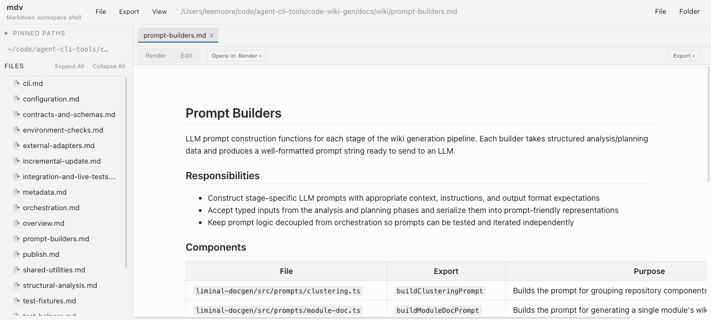
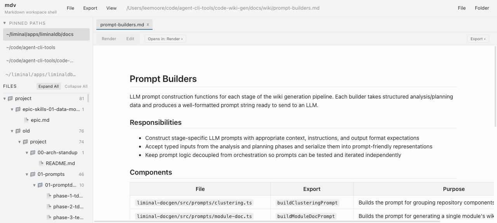
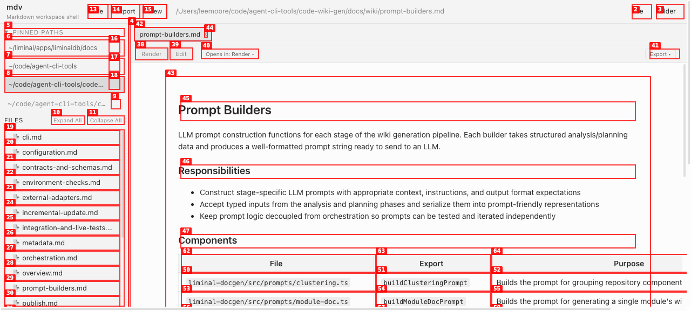

# Dogfood Report: MD Viewer

| Field | Value |
|-------|-------|
| **Date** | 2026-03-23 |
| **App URL** | http://localhost:50249 |
| **Session** | mdviewer |
| **Scope** | Full app — v1 features (Epics 1–6) |

## Summary

| Severity | Count |
|----------|-------|
| Critical | 0 |
| High | 2 |
| Medium | 6 |
| Low | 5 |
| **Total** | **13** |

## Issues

### ISSUE-001: Root line missing pin, copy, and refresh actions

| Field | Value |
|-------|-------|
| **Severity** | medium |
| **Category** | functional |
| **URL** | http://localhost:50249 |
| **Repro Video** | N/A |

**Description**

The PRD specifies the root line should have: `[📁 browse] path [📌 pin] [⎘ copy] [↻ refresh]`. Only the browse (📁) button is present. The pin-as-workspace, copy-path, and refresh actions are missing from the root line area. These actions are specified in both the PRD (Feature 1) and the UX Design Constraints section.

**Evidence**

The interactive snapshot shows only one button in the root line area:
- `button "Browse folder"` with "📁" text

No pin, copy, or refresh buttons are found in the accessibility tree near the root path.



---

### ISSUE-002: File tree accessibility — all items report level=1

| Field | Value |
|-------|-------|
| **Severity** | medium |
| **Category** | accessibility |
| **URL** | http://localhost:50249 |
| **Repro Video** | N/A |

**Description**

When the file tree is expanded (Expand All), all tree items report `[level=1]` in the accessibility tree regardless of actual nesting depth. For example, a file 3 directories deep shows the same `level=1` as a top-level directory. This means screen readers cannot communicate the tree hierarchy to users.

**Expected:** Nested items should have incrementing levels (level=1 for top-level, level=2 for first nesting, etc.) using `aria-level` attributes.

**Evidence**

Snapshot excerpt from expanded tree:
```
treeitem "▼ 📁 project 81" [level=1]
treeitem "▼ 📁 epic-skills-01-data-model 1" [level=1]  ← should be level=2
treeitem "📄 epic.md" [level=1]  ← should be level=3
```



---

### ISSUE-003: Relative markdown links don't open in tabs

| Field | Value |
|-------|-------|
| **Severity** | high |
| **Category** | functional |
| **URL** | http://localhost:50249 |
| **Repro Video** | N/A |

**Description**

Clicking a relative markdown link (e.g., `[configuration.md](configuration.md)`) within a rendered document does not open the linked file in a new tab. The PRD specifies: "Relative markdown links: clicking a link to a local `.md` file opens it in a new tab."

Tested by clicking the "configuration.md" link in the Module Index table on overview.md. The tab strip did not change and the content remained on overview.md. No console errors.

**Expected:** Clicking `configuration.md` link should open configuration.md in a new tab (or switch to it if already open).

**Evidence**

Before click: 4 tabs (prompt-builders.md, overview.md, contracts-and-schemas.md, orchestration.md)
After click: Same 4 tabs, still on overview.md

Note: This may be an agent-browser automation limitation rather than a true app bug. Should be verified manually.

---

### ISSUE-004: Expanded tree visual indentation too flat for deep hierarchies

| Field | Value |
|-------|-------|
| **Severity** | medium |
| **Category** | visual |
| **URL** | http://localhost:50249 |
| **Repro Video** | N/A |

**Description**

When "Expand All" is used on a workspace with deeply nested directories, the visual indentation between nesting levels is too subtle. It's difficult to distinguish which files belong to which directory. With 4-5 levels of nesting, the visual hierarchy becomes confusing.

**Expected:** Clear visual indentation (ideally 16-20px per level) with optional tree guide lines for deep hierarchies, making parent-child relationships immediately apparent.


---

### ISSUE-005: Pinned workspace remove buttons always visible

| Field | Value |
|-------|-------|
| **Severity** | low |
| **Category** | ux |
| **URL** | http://localhost:50249 |
| **Repro Video** | N/A |

**Description**

The "Remove" (x) buttons on pinned workspace entries appear to be always visible rather than showing only on hover. The PRD specifies "x-to-remove on hover" for workspace entries. Always-visible remove buttons increase the risk of accidental removal, especially since there's no undo. During testing, a workspace was accidentally removed when a click intended for a menu item landed on a nearby remove button.

**Expected:** Remove buttons should appear only when hovering over the workspace entry, consistent with the PRD spec.



---
