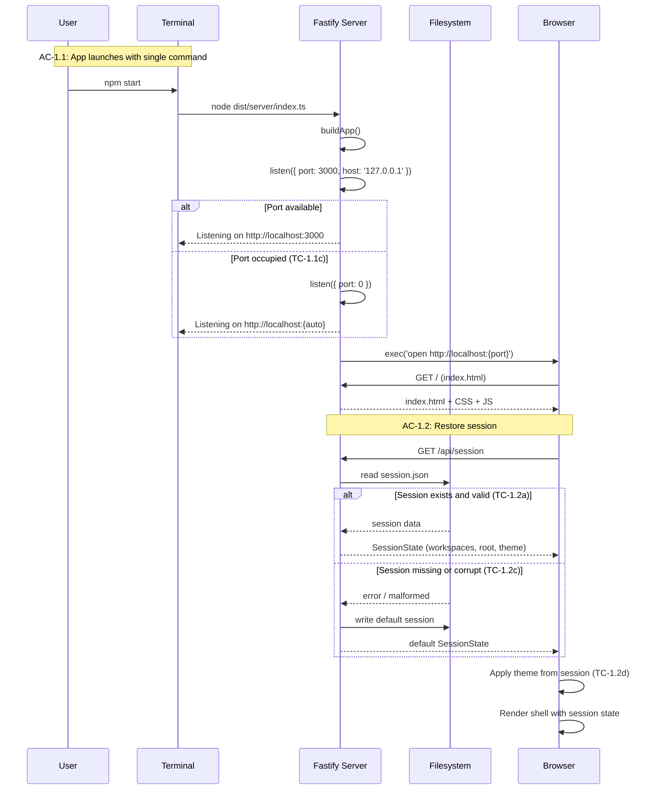
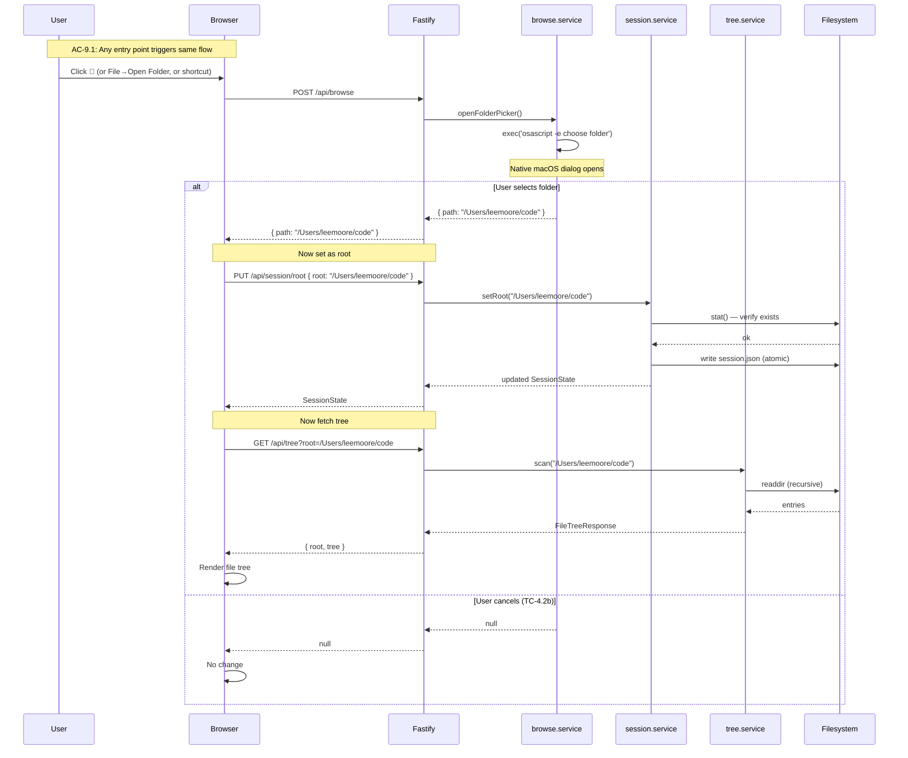
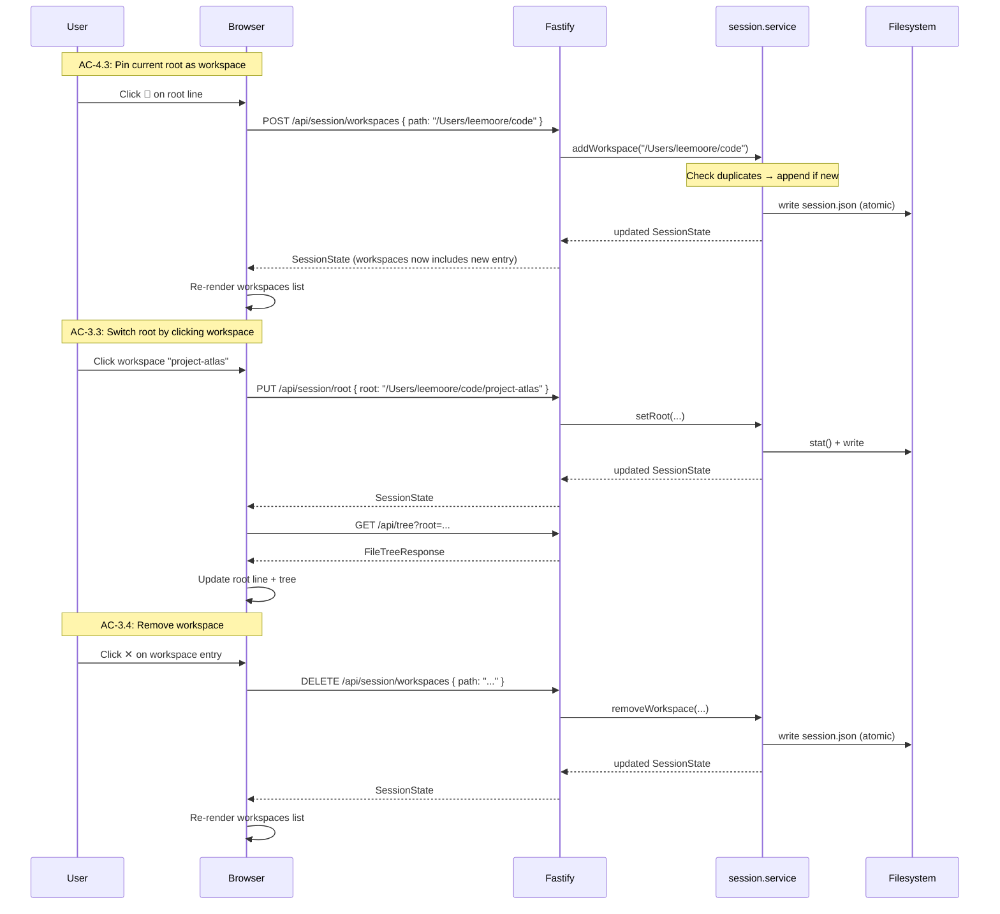

# Technical Design: Epic 1 — API (Server)

**Parent:** [epic-1-tech-design.md](epic-1-tech-design.md)
**Companion:** [epic-1-tech-design-ui.md](epic-1-tech-design-ui.md) · [epic-1-test-plan.md](epic-1-test-plan.md)

This document covers the server-side architecture: Fastify application structure, route handlers, services, Zod schemas, session persistence, directory tree scanning, folder picker, and clipboard operations.

---

## Server Bootstrap

### Entry Point: `server/index.ts`

The entry point builds the Fastify app, binds to a port, and opens the browser. This is the composition root — it wires everything together but contains no business logic.

```
Start → buildApp() → listen(port) → open browser → ready
```

Port selection follows the epic's TC-1.1c: try the default port (3000), fall back to the next available if occupied. Fastify's `listen()` with `port: 0` lets the OS assign a free port, but we prefer a predictable port for bookmarking. Strategy: try 3000, catch `EADDRINUSE`, retry with port 0.

After binding, the server opens the browser using macOS `open` command:

```typescript
import { exec } from 'node:child_process';
exec(`open http://localhost:${port}`);
```

The server logs the URL to stdout regardless, so the user can navigate manually if the browser doesn't open.

**AC Coverage:** AC-1.1 (app launches), TC-1.1a (first launch), TC-1.1b (localhost only), TC-1.1c (port conflict).

### App Factory: `server/app.ts`

The `buildApp()` function creates a Fastify instance, registers plugins, sets up Zod validation, and registers route plugins. This factory pattern is critical for testing — tests call `buildApp()` to get a fresh app instance with `inject()` support.

```typescript
import Fastify from 'fastify';
import { serializerCompiler, validatorCompiler, type ZodTypeProvider } from 'fastify-type-provider-zod';

export async function buildApp(opts?: { sessionDir?: string }) {
  const app = Fastify({ logger: true });

  app.setValidatorCompiler(validatorCompiler);
  app.setSerializerCompiler(serializerCompiler);

  // Register plugins
  await app.register(staticPlugin);
  await app.register(sessionRoutes, { sessionDir: opts?.sessionDir });
  await app.register(treeRoutes);
  await app.register(browseRoutes);
  await app.register(clipboardRoutes);

  return app;
}
```

The `sessionDir` option allows tests to inject a temp directory instead of the real config path. This is the only test seam in the app factory — services receive their dependencies through the route plugin options, not through module-level singletons.

---

## Schemas: `server/schemas/index.ts`

All request and response validation uses Zod schemas. These are the single source of truth for API contracts — TypeScript types are inferred from them, not duplicated.

```typescript
import { z } from 'zod';

// --- Primitives ---

export const AbsolutePathSchema = z.string().refine(
  (p) => p.startsWith('/'),
  { message: 'Path must be absolute' }
);

// ThemeId is a string, not an enum. Validation happens against the theme registry
// at runtime, not at the schema level. This supports AC-7.4 (extensibility) —
// adding a theme doesn't require changing this schema.
export const ThemeIdSchema = z.string();

// --- Domain Objects ---

export const WorkspaceSchema = z.object({
  path: AbsolutePathSchema,
  label: z.string(),
  addedAt: z.string().datetime(),
});

export const RecentFileSchema = z.object({
  path: AbsolutePathSchema,
  openedAt: z.string().datetime(),
});

export const SidebarStateSchema = z.object({
  workspacesCollapsed: z.boolean(),
});

export const SessionStateSchema = z.object({
  workspaces: z.array(WorkspaceSchema),
  lastRoot: AbsolutePathSchema.nullable(),
  recentFiles: z.array(RecentFileSchema),
  theme: ThemeIdSchema,
  sidebarState: SidebarStateSchema,
});

// --- Tree ---

export const TreeNodeSchema: z.ZodType<TreeNode> = z.lazy(() =>
  z.object({
    name: z.string(),
    path: AbsolutePathSchema,
    type: z.enum(['file', 'directory']),
    children: z.array(TreeNodeSchema).optional(),
    mdCount: z.number().int().nonneg().optional(),
  })
);

export const FileTreeResponseSchema = z.object({
  root: AbsolutePathSchema,
  tree: z.array(TreeNodeSchema),
});

// --- Request Bodies ---

export const SetRootRequestSchema = z.object({
  root: AbsolutePathSchema,
});

export const AddWorkspaceRequestSchema = z.object({
  path: AbsolutePathSchema,
});

export const RemoveWorkspaceRequestSchema = z.object({
  path: AbsolutePathSchema,
});

export const SetThemeRequestSchema = z.object({
  theme: z.string(), // Validated against theme registry at route level, not schema level
});

export const UpdateSidebarRequestSchema = z.object({
  workspacesCollapsed: z.boolean(),
});

export const ClipboardRequestSchema = z.object({
  text: z.string().max(100_000), // reasonable upper bound
});

// --- Recent Files Request ---

export const TouchRecentFileRequestSchema = z.object({
  path: AbsolutePathSchema,
});

export const RemoveRecentFileRequestSchema = z.object({
  path: AbsolutePathSchema,
});

// --- Theme Info ---

export const ThemeInfoSchema = z.object({
  id: ThemeIdSchema,
  label: z.string(),        // e.g., "Light Default"
  variant: z.enum(['light', 'dark']),
});

// --- Bootstrap Response ---
// GET /api/session returns this, not raw SessionState.
// Includes session + app-level data the client needs on startup.

export const AppBootstrapResponseSchema = z.object({
  session: SessionStateSchema,
  availableThemes: z.array(ThemeInfoSchema),
});

// --- Error Response ---

export const ErrorResponseSchema = z.object({
  error: z.object({
    code: z.string(),
    message: z.string(),
  }),
});

// --- Inferred Types ---

export type SessionState = z.infer<typeof SessionStateSchema>;
export type Workspace = z.infer<typeof WorkspaceSchema>;
export type RecentFile = z.infer<typeof RecentFileSchema>;
export type TreeNode = z.infer<typeof TreeNodeSchema>;
export type ThemeId = z.infer<typeof ThemeIdSchema>;
export type ThemeInfo = z.infer<typeof ThemeInfoSchema>;
export type FileTreeResponse = z.infer<typeof FileTreeResponseSchema>;
export type AppBootstrapResponse = z.infer<typeof AppBootstrapResponseSchema>;
```

The `shared/types.ts` file re-exports these types for client consumption:

```typescript
// shared/types.ts — TYPE-ONLY re-exports
// IMPORTANT: Use 'export type' to ensure Zod is NOT bundled into the client.
// esbuild will tree-shake type-only imports, keeping Zod server-side only.
export type {
  SessionState, Workspace, RecentFile,
  TreeNode, ThemeId, ThemeInfo, FileTreeResponse,
  AppBootstrapResponse,
} from '../server/schemas/index.js';
```

The `export type` keyword is critical — it ensures the client bundle never includes Zod as a runtime dependency. The client imports types for compile-time checking only; the actual validation happens server-side.

---

## Session Service: `server/services/session.service.ts`

The session service manages reading, writing, and mutating the session JSON file. It is the single point of persistence for all user state that survives restarts.

### Storage Location

`~/Library/Application Support/md-viewer/session.json`

The service receives the directory path as a constructor argument (injectable for tests). On first access, it creates the directory if it doesn't exist (`mkdir -p` equivalent via `fs.mkdir({ recursive: true })`).

### Default Session

When no session file exists, or the file is corrupted (fails Zod parse), the service returns a default session:

```typescript
const DEFAULT_SESSION: SessionState = {
  workspaces: [],
  lastRoot: null,
  recentFiles: [],
  theme: 'light-default',
  sidebarState: {
    workspacesCollapsed: false,
  },
};
```

**AC Coverage:** TC-1.2c (corrupted session → clean reset).

### Atomic Writes

To prevent corruption on crash (AC: "atomic writes to prevent corruption"), the service writes to a temp file, then renames:

```typescript
async function writeSession(dir: string, state: SessionState): Promise<void> {
  const target = path.join(dir, 'session.json');
  const temp = path.join(dir, `session.${Date.now()}.tmp`);
  await fs.writeFile(temp, JSON.stringify(state, null, 2), 'utf-8');
  await fs.rename(temp, target);
}
```

`fs.rename` is atomic on POSIX filesystems when source and destination are on the same filesystem (which they are — same directory).

### Mutation Pattern

Every mutation method follows the same pattern:

1. Read current state (or use cached in-memory copy)
2. Apply mutation
3. Validate with Zod (belt-and-suspenders)
4. Write atomically
5. Update in-memory cache
6. Return full updated state

```typescript
export class SessionService {
  private cache: SessionState | null = null;

  constructor(private readonly dir: string) {}

  async load(): Promise<SessionState> { /* ... */ }
  async setRoot(root: string): Promise<SessionState> { /* ... */ }
  async addWorkspace(absPath: string): Promise<SessionState> { /* ... */ }
  async removeWorkspace(absPath: string): Promise<SessionState> { /* ... */ }
  async setTheme(theme: ThemeId): Promise<SessionState> { /* ... */ }
  async updateSidebar(state: Partial<SidebarState>): Promise<SessionState> { /* ... */ }
}
```

**Workspace operations:**

- `addWorkspace`: Checks for duplicates by path. If already present, returns current state (no-op). Otherwise appends with label derived from `path.basename()` and `addedAt` set to current ISO timestamp. Preserves insertion order (TC-8.1a).
- `removeWorkspace`: Filters by path. Removing the active workspace does not clear the root (TC-3.4c).

**Recent files:**

- The session service maintains the `recentFiles` array structure. Epic 1 doesn't add entries — Epic 2 will call a `touchRecentFile(path)` method. The array is capped at 20 entries; oldest by `openedAt` is dropped on overflow.

**Root validation:**

- `setRoot` verifies the path exists on disk via `fs.stat()`. If the path doesn't exist, it returns a 404 error. If permission is denied, it returns a 403 error.

### Root Healing on Load

When `load()` reads a session with a non-null `lastRoot`, it validates the path still exists via `fs.stat()`. If the path is gone (ENOENT) or unreadable (EACCES), the service clears `lastRoot` to null, rewrites the session file, and returns the healed session. The user sees the empty state — not a broken tree.

This satisfies TC-8.2b: "App starts with no root set, shows empty state, no crash."

```typescript
async load(): Promise<SessionState> {
  const raw = await this.readFromDisk();
  const session = this.parseOrDefault(raw);

  // Heal stale root
  if (session.lastRoot) {
    try {
      await fs.stat(session.lastRoot);
    } catch {
      session.lastRoot = null;
      await this.writeToDisk(session);
    }
  }

  this.cache = session;
  return session;
}
```

### In-Memory Caching

The service caches the last-read session in memory. `load()` reads from disk on first call, then returns the cache. Mutation methods update both disk and cache. This avoids repeated disk reads during a session — the server is the only writer, so the cache never goes stale within a process lifetime.

---

## Tree Service: `server/services/tree.service.ts`

The tree service scans a directory recursively and returns a filtered, sorted tree of markdown files and their ancestor directories.

### Scan Algorithm

```
scanTree(rootPath):
  1. readdir(rootPath) with { withFileTypes: true }
  2. For each entry:
     a. Skip hidden files (name starts with '.')
     b. Skip non-regular files and non-directories (sockets, devices, etc.)
     c. If directory: recurse, get children. If children is empty, skip (no markdown descendants).
     d. If file: check extension against markdown patterns. Include if match.
  3. Sort: directories first, then files, both alphabetical case-insensitive
  4. For directories: compute mdCount (recursive count of markdown descendants)
  5. Return sorted tree
```

### Markdown Extension Matching

Per AC-5.1: `.md` and `.markdown`, case-insensitive. `.mdx` excluded. Hidden files excluded.

```typescript
const MD_EXTENSIONS = new Set(['.md', '.markdown']);

function isMarkdownFile(name: string): boolean {
  if (name.startsWith('.')) return false;
  const ext = path.extname(name).toLowerCase();
  return MD_EXTENSIONS.has(ext);
}
```

### Symlink Handling

Per TC-5.1h and the symlink contract resolution: symlinks are followed (`fs.stat` resolves them), but the `TreeNode.path` uses the symlink's path inside the root, not the resolved target. This preserves root confinement — the API never exposes paths outside the root.

Symlink loops are detected by maintaining a `Set<string>` of visited real paths (via `fs.realpath`). If a directory's real path is already in the set, it's skipped (TC-10.3a).

```typescript
async function scanDir(
  dirPath: string,
  visited: Set<string>
): Promise<TreeNode[]> {
  const realPath = await fs.realpath(dirPath);
  if (visited.has(realPath)) return []; // symlink loop
  visited.add(realPath);

  const entries = await fs.readdir(dirPath, { withFileTypes: true });
  // ... process entries
}
```

### Sorting

Per AC-5.4: directories first, then files, both alphabetical case-insensitive.

```typescript
function sortNodes(nodes: TreeNode[]): TreeNode[] {
  return nodes.sort((a, b) => {
    if (a.type !== b.type) return a.type === 'directory' ? -1 : 1;
    return a.name.localeCompare(b.name, undefined, { sensitivity: 'base' });
  });
}
```

### mdCount Computation

Per AC-5.5: each directory node carries `mdCount`, the total number of markdown files in all descendants.

```typescript
function computeMdCount(node: TreeNode): number {
  if (node.type === 'file') return 1;
  const count = (node.children ?? []).reduce(
    (sum, child) => sum + computeMdCount(child),
    0
  );
  node.mdCount = count;
  return count;
}
```

### Error Handling

The scan handles several filesystem edge cases:

| Error | Handling | AC |
|-------|----------|-----|
| Permission denied on root | Return 403 with PERMISSION_DENIED | AC-10.1 |
| Root doesn't exist | Return 404 with PATH_NOT_FOUND | AC-10.2 |
| Permission denied on subdirectory | Skip that subtree, continue scan | AC-10.3 |
| Symlink loop | Detect via visited set, skip | AC-10.3a |
| Special files (sockets, devices) | Skip, continue | AC-10.3b |
| readdir failure on subdirectory | Log warning, skip, continue | AC-10.3 |

The principle: errors at the root level fail the request. Errors within subdirectories are swallowed with logging — the tree shows what it can, and the rest is silently skipped. This follows TC-10.3a and TC-10.3b: "rest of tree renders normally."

### Performance

For the NFR target (500 markdown files in <2s), the scan is I/O-bound. Node's `fs.readdir` with `withFileTypes: true` is a single syscall per directory, and the recursive descent is naturally parallel at the I/O level (Node's event loop processes multiple readdir callbacks concurrently).

For very large directories (2000+ files), the scan will take longer. The endpoint does not currently stream results — it buffers the full tree and returns it. If this becomes a bottleneck, the response could be switched to NDJSON streaming, but that adds client-side complexity. Deferred.

---

## Browse Service: `server/services/browse.service.ts`

The browse service opens a native macOS folder picker dialog via `osascript` and returns the selected path.

### Implementation

```typescript
import { exec } from 'node:child_process';

export async function openFolderPicker(): Promise<string | null> {
  return new Promise((resolve, reject) => {
    exec(
      `osascript -e 'POSIX path of (choose folder with prompt "Select Folder")'`,
      { timeout: 60_000 },
      (error, stdout) => {
        if (error) {
          // User cancelled — osascript exits with code 1
          if (error.code === 1) return resolve(null);
          return reject(error);
        }
        const selected = stdout.trim();
        // osascript returns path with trailing slash — normalize
        resolve(selected.endsWith('/') ? selected.slice(0, -1) : selected);
      }
    );
  });
}
```

The `osascript` command opens a native Cocoa NSOpenPanel. It blocks until the user selects a folder or cancels. The 60-second timeout prevents orphaned processes if the dialog is somehow abandoned.

**AC Coverage:** AC-4.2 (browse action), AC-9.1 (all entry points produce same result — they all call this endpoint).

### Security Note

The browse service runs user-initiated `osascript` with a fixed command string — no user input is interpolated into the command. The returned path is validated by downstream consumers (session service validates it exists on disk before setting as root).

---

## Route Handlers

### Session Routes: `server/routes/session.ts`

Session-mutating endpoints (PUT, POST, DELETE) follow the pattern: validate input → call service → return full `SessionState`. The GET endpoint is an exception — it returns `AppBootstrapResponse` (session + app-level data like available themes).

#### GET /api/session

Loads the current session and app bootstrap data. Called once on app startup. Returns `AppBootstrapResponse` — the session plus app-level data the client needs (available themes).

```typescript
app.get('/api/session', {
  schema: {
    response: { 200: AppBootstrapResponseSchema },
  },
}, async () => {
  const session = await sessionService.load();
  return {
    session,
    availableThemes: themeRegistry.getAll(),
  };
});
```

**AC Coverage:** AC-1.2 (restore session), AC-7.1 (available themes), AC-8.1–8.5 (all persistence).

#### PUT /api/session/root

Sets the current root directory. Validates the path exists and is readable.

```typescript
app.put('/api/session/root', {
  schema: {
    body: SetRootRequestSchema,
    response: {
      200: SessionStateSchema,
      400: ErrorResponseSchema,
      403: ErrorResponseSchema,
      404: ErrorResponseSchema,
    },
  },
}, async (request, reply) => {
  const { root } = request.body;
  try {
    return await sessionService.setRoot(root);
  } catch (err) {
    if (isPermissionError(err)) {
      return reply.code(403).send({ error: { code: 'PERMISSION_DENIED', message: `Cannot read ${root}` } });
    }
    if (isNotFoundError(err)) {
      return reply.code(404).send({ error: { code: 'PATH_NOT_FOUND', message: `Directory not found: ${root}` } });
    }
    throw err;
  }
});
```

**AC Coverage:** AC-3.3 (switch root via workspace), AC-4.2 (browse sets root), AC-6.2b (Make Root), AC-10.1 (permission error), AC-10.2 (missing directory).

#### POST /api/session/workspaces

Adds a workspace. Returns current state if already present (no duplicate).

```typescript
app.post('/api/session/workspaces', {
  schema: {
    body: AddWorkspaceRequestSchema,
    response: { 200: SessionStateSchema, 400: ErrorResponseSchema },
  },
}, async (request) => {
  return sessionService.addWorkspace(request.body.path);
});
```

**AC Coverage:** AC-4.3 (pin as workspace), AC-6.2c (Save as Workspace from context menu).

#### DELETE /api/session/workspaces

Removes a workspace by path.

```typescript
app.delete('/api/session/workspaces', {
  schema: {
    body: RemoveWorkspaceRequestSchema,
    response: { 200: SessionStateSchema },
  },
}, async (request) => {
  return sessionService.removeWorkspace(request.body.path);
});
```

**AC Coverage:** AC-3.4 (remove workspace).

#### PUT /api/session/theme

Sets the theme. Validates the theme ID against the theme registry at runtime (not at the schema level) to support extensibility (AC-7.4).

```typescript
app.put('/api/session/theme', {
  schema: {
    body: SetThemeRequestSchema,
    response: { 200: SessionStateSchema, 400: ErrorResponseSchema },
  },
}, async (request, reply) => {
  if (!themeRegistry.isValid(request.body.theme)) {
    return reply.code(400).send(toApiError('INVALID_THEME', `Unknown theme: ${request.body.theme}`));
  }
  return sessionService.setTheme(request.body.theme);
});
```

**AC Coverage:** AC-7.2 (apply theme), AC-7.3 (persist theme), AC-7.4 (extensible — validation is runtime, not schema).

#### PUT /api/session/sidebar

Updates sidebar collapse state.

```typescript
app.put('/api/session/sidebar', {
  schema: {
    body: UpdateSidebarRequestSchema,
    response: { 200: SessionStateSchema },
  },
}, async (request) => {
  return sessionService.updateSidebar(request.body);
});
```

**AC Coverage:** AC-3.1c (collapse persists), AC-8.5 (sidebar state persists).

### Tree Route: `server/routes/tree.ts`

#### GET /api/tree

Scans the directory and returns the filtered tree.

```typescript
app.get('/api/tree', {
  schema: {
    querystring: z.object({ root: AbsolutePathSchema }),
    response: {
      200: FileTreeResponseSchema,
      400: ErrorResponseSchema,
      403: ErrorResponseSchema,
      404: ErrorResponseSchema,
      500: ErrorResponseSchema,
    },
  },
}, async (request, reply) => {
  const { root } = request.query;
  try {
    const tree = await treeService.scan(root);
    return { root, tree };
  } catch (err) {
    // Error classification similar to session/root endpoint
  }
});
```

**AC Coverage:** AC-5.1–5.7 (all file tree ACs), AC-9.2 (performance).

### Browse Route: `server/routes/browse.ts`

#### POST /api/browse

Opens the native folder picker. Returns the selected path or null.

```typescript
app.post('/api/browse', {
  schema: {
    response: {
      200: z.object({ path: AbsolutePathSchema }).nullable(),
    },
  },
}, async () => {
  const selected = await browseService.openFolderPicker();
  return selected ? { path: selected } : null;
});
```

**AC Coverage:** AC-4.2 (browse action), AC-9.1 (folder selection entry points).

### Clipboard Route: `server/routes/clipboard.ts`

#### POST /api/clipboard

Copies text to system clipboard via `pbcopy`. This is the fallback path — the client tries `navigator.clipboard.writeText()` first.

```typescript
app.post('/api/clipboard', {
  schema: {
    body: ClipboardRequestSchema,
    response: { 200: z.object({ ok: z.literal(true) }) },
  },
}, async (request) => {
  await new Promise<void>((resolve, reject) => {
    const proc = exec('pbcopy');
    proc.stdin?.write(request.body.text);
    proc.stdin?.end();
    proc.on('close', (code) => code === 0 ? resolve() : reject(new Error(`pbcopy exited ${code}`)));
  });
  return { ok: true as const };
});
```

**AC Coverage:** AC-4.4 (copy root path), AC-6.1b (copy path from context menu).

#### POST /api/session/recent-files

Adds or touches a file in the recent files list. If the file is already present, updates `openedAt`. If the list exceeds 20 entries, the oldest is dropped. Designed in Epic 1; activated by Epic 2 when file opening ships.

```typescript
app.post('/api/session/recent-files', {
  schema: {
    body: TouchRecentFileRequestSchema,
    response: { 200: SessionStateSchema },
  },
}, async (request) => {
  return sessionService.touchRecentFile(request.body.path);
});
```

**AC Coverage:** AC-8.3 (recent files persistence — structure ready, Epic 2 calls this).

#### DELETE /api/session/recent-files

Removes a file from the recent files list (e.g., if the user wants to clear an entry).

```typescript
app.delete('/api/session/recent-files', {
  schema: {
    body: RemoveRecentFileRequestSchema,
    response: { 200: SessionStateSchema },
  },
}, async (request) => {
  return sessionService.removeRecentFile(request.body.path);
});
```

---

## Theme Registry: `server/services/theme-registry.ts`

The theme registry is a static data source — a single file that defines both the theme metadata and serves as the co-located source of truth for what themes exist. Adding a theme means adding an entry here and a corresponding CSS `[data-theme]` block. No Zod enum changes, no client code changes.

```typescript
import type { ThemeInfo } from '../schemas/index.js';

const THEMES: ThemeInfo[] = [
  { id: 'light-default', label: 'Light Default', variant: 'light' },
  { id: 'light-warm', label: 'Light Warm', variant: 'light' },
  { id: 'dark-default', label: 'Dark Default', variant: 'dark' },
  { id: 'dark-cool', label: 'Dark Cool', variant: 'dark' },
];

export const themeRegistry = {
  getAll(): ThemeInfo[] {
    return THEMES;
  },
  isValid(id: string): boolean {
    return THEMES.some(t => t.id === id);
  },
};
```

`ThemeIdSchema` is `z.string()`, not `z.enum()`. Validation happens against the registry at runtime, not at the schema level:

```typescript
// In session routes — validate theme against registry, not schema
app.put('/api/session/theme', {
  schema: {
    body: z.object({ theme: z.string() }),
    response: { 200: SessionStateSchema, 400: ErrorResponseSchema },
  },
}, async (request, reply) => {
  if (!themeRegistry.isValid(request.body.theme)) {
    return reply.code(400).send(toApiError('INVALID_THEME', `Unknown theme: ${request.body.theme}`));
  }
  return sessionService.setTheme(request.body.theme);
});
```

This satisfies AC-7.4: adding a fifth theme requires only:
1. Add an entry to `THEMES` array in `theme-registry.ts`
2. Add a `[data-theme="new-id"]` CSS block in `themes.css`

Both are theme definition data, co-located in their respective files. No rendering logic, component code, or schema changes.

---

## Static File Serving: `server/plugins/static.ts`

The `@fastify/static` plugin serves the built client assets from `dist/client/`:

```typescript
import fastifyStatic from '@fastify/static';
import path from 'node:path';

export async function staticPlugin(app: FastifyInstance) {
  await app.register(fastifyStatic, {
    root: path.join(import.meta.dirname, '../../dist/client'),
    prefix: '/',
  });
}
```

The plugin serves `index.html` for the root path. All `/api/*` routes take precedence over static files (Fastify route matching runs before static file lookup). This means the client can make fetch calls to `/api/session` without path conflicts.

---

## Sequence Diagrams

### Flow: App Launch (AC-1.1, AC-1.2)



### Flow: Set Root via Folder Picker (AC-4.2, AC-9.1)



### Flow: Workspace CRUD (AC-3.3, AC-3.4, AC-4.3)



---

## Error Classification Utility

Multiple routes need to classify filesystem errors. A shared utility avoids duplication:

```typescript
// server/utils/errors.ts
export function isPermissionError(err: unknown): boolean {
  return (err as NodeJS.ErrnoException)?.code === 'EACCES';
}

export function isNotFoundError(err: unknown): boolean {
  return (err as NodeJS.ErrnoException)?.code === 'ENOENT';
}

export interface ApiError {
  code: string;
  message: string;
}

export function toApiError(code: string, message: string): { error: ApiError } {
  return { error: { code, message } };
}
```

These are used by session routes, tree routes, and any future routes that touch the filesystem.

---

## Self-Review Checklist (API)

- [x] All 11 API endpoints designed with Zod schemas
- [x] Session service covers all persistence ACs (8.1–8.5)
- [x] Tree service handles all filtering rules (AC-5.1) including extensions, hidden files, symlinks
- [x] Sort order specified (AC-5.4)
- [x] mdCount computation specified (AC-5.5)
- [x] Error handling covers permission denied, missing paths, symlink loops, special files
- [x] Atomic write strategy specified for session persistence
- [x] Folder picker mechanism specified with cancel handling
- [x] Clipboard fallback path specified
- [x] All external boundaries identified (fs, child_process) for mocking
- [x] App factory supports test injection (sessionDir option)
- [x] Sequence diagrams cover launch, folder selection, workspace CRUD
