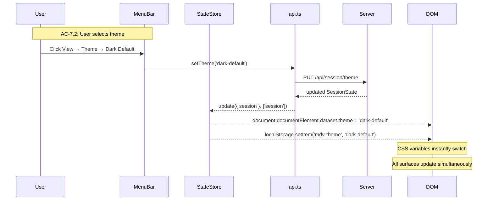
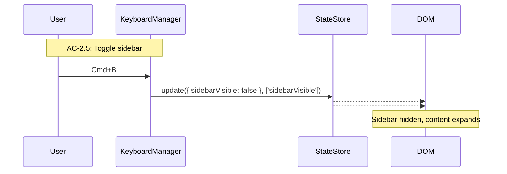
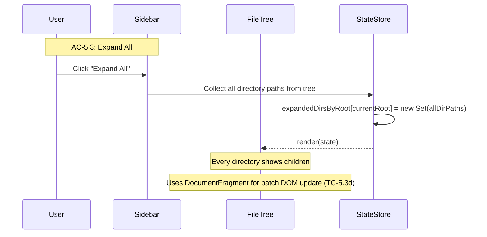

# Technical Design: Epic 1 — UI (Client)

**Parent:** [epic-1-tech-design.md](epic-1-tech-design.md)
**Companion:** [epic-1-tech-design-api.md](epic-1-tech-design-api.md) · [epic-1-test-plan.md](epic-1-test-plan.md)

This document covers the client-side architecture: HTML shell, DOM component structure, client state management, CSS/theme system, keyboard shortcuts, and the sidebar (workspaces, root line, file tree, context menus).

---

## HTML Shell: `client/index.html`

The HTML file is a static shell — structure with no content. JavaScript builds the DOM after bootstrap.

```html
<!DOCTYPE html>
<html lang="en" data-theme="light-default">
<head>
  <meta charset="utf-8">
  <meta name="viewport" content="width=device-width, initial-scale=1">
  <title>MD Viewer</title>

  <!-- Theme must be set before first paint to prevent flash (TC-1.2d, TC-7.2b) -->
  <script>
    try {
      const stored = localStorage.getItem('mdv-theme');
      if (stored) document.documentElement.dataset.theme = stored;
    } catch {}
  </script>

  <link rel="stylesheet" href="/styles/themes.css">
  <link rel="stylesheet" href="/styles/base.css">
  <link rel="stylesheet" href="/styles/menu-bar.css">
  <link rel="stylesheet" href="/styles/sidebar.css">
  <link rel="stylesheet" href="/styles/tab-strip.css">
  <link rel="stylesheet" href="/styles/content-area.css">
  <link rel="stylesheet" href="/styles/context-menu.css">
</head>
<body>
  <div id="app">
    <header id="menu-bar"></header>
    <div id="main">
      <aside id="sidebar"></aside>
      <div id="workspace">
        <div id="tab-strip"></div>
        <div id="content-area"></div>
      </div>
    </div>
  </div>
  <script type="module" src="/app.js"></script>
</body>
</html>
```

Key decisions:

- **Theme blocking script in `<head>`**: reads the stored theme from `localStorage` and sets `data-theme` before CSS loads. This prevents flash-of-default-theme. `localStorage` is used as a fast synchronous cache alongside the server's session persistence — the server is the source of truth, but `localStorage` enables instant theme application before the first API call completes.
- **Known limitation — port-conflict theme flash:** `localStorage` is origin-specific. If the app falls back to a different port (TC-1.1c), `localhost:3001` has empty `localStorage` and the user sees one flash of default theme before the bootstrap API response restores the correct theme. This is an explicit spec deviation from TC-1.2d and TC-7.2b on the port-conflict path only. The primary path (default port) has no flash. Accepted as a product tradeoff — the port-conflict case is rare and the flash is momentary.
- **Module script**: `type="module"` enables ESM imports in the bundled JS. esbuild bundles everything into a single file, but the `type="module"` ensures modern parsing.
- **No framework mounting**: the `<div id="app">` contains semantic landmarks (`header`, `aside`, `div`) that the JS populates. There's no React root or virtual DOM — components directly manipulate their mount points.

---

## Client Bootstrap: `client/app.ts`

The app entry point orchestrates startup: fetch session, initialize state, render shell, set up keyboard shortcuts.

```
1. Import all modules
2. Fetch bootstrap from server (GET /api/session → AppBootstrapResponse)
3. Initialize client state from bootstrap (session + availableThemes)
4. Render all shell components into their mount points
5. If session has a root, fetch and render the file tree
6. Register global keyboard shortcuts
7. App is ready
```

**AC Coverage:** AC-1.1 (app shell renders), AC-1.2 (session restored), AC-1.3 (empty state content).

The bootstrap is sequential — step 5 depends on step 3. There's no complex loading state; the API calls to localhost complete in <5ms total (as established in our stack discussion). The DOM renders synchronously after data arrives.

If the session load fails (server error), the app renders with default state and logs a console error. The user sees the empty workspace state, which is functional — they can browse and set a root. The failure is non-blocking.

---

## Client State: `client/state.ts`

Client state holds the current application state and notifies observers when it changes. No reactivity framework — just a plain object with a pub/sub notification layer.

### State Shape

```typescript
export interface ClientState {
  // From server bootstrap (source of truth)
  session: SessionState;
  availableThemes: ThemeInfo[];     // From AppBootstrapResponse

  // Client-only UI state (not persisted)
  tree: TreeNode[] | null;          // Current file tree (null = not loaded)
  treeLoading: boolean;             // Tree scan in progress
  activeMenuId: string | null;      // Which dropdown is open
  contextMenu: ContextMenuState | null; // Active context menu
  sidebarVisible: boolean;          // Sidebar toggle state
  expandedDirsByRoot: Map<string, Set<string>>; // Expanded dirs keyed by root path (client-only, resets on restart per AC-5.7)
  error: AppError | null;           // Current error notification (null = no error)
}

export interface AppError {
  code: string;       // Machine-readable code from server (e.g., 'PERMISSION_DENIED')
  message: string;    // Human-readable message
  dismissable: boolean; // Whether the user can dismiss it
}

export interface ContextMenuState {
  x: number;
  y: number;
  target: TreeNode;
  items: ContextMenuItem[];
}

export interface ContextMenuItem {
  label: string;
  action: () => void;
  shortcut?: string;
}
```

### State Store

The state store is a minimal observable pattern:

```typescript
type Listener = (state: ClientState, changed: string[]) => void;

export class StateStore {
  private state: ClientState;
  private listeners: Listener[] = [];

  constructor(initial: ClientState) {
    this.state = initial;
  }

  get(): ClientState {
    return this.state;
  }

  update(partial: Partial<ClientState>, changed: string[]): void {
    this.state = { ...this.state, ...partial };
    for (const listener of this.listeners) {
      listener(this.state, changed);
    }
  }

  subscribe(listener: Listener): () => void {
    this.listeners.push(listener);
    return () => {
      this.listeners = this.listeners.filter(l => l !== listener);
    };
  }
}
```

The `changed` array lets listeners skip irrelevant updates. When the tree changes, the menu bar doesn't need to re-render. When the theme changes, only the theme attribute needs updating — no DOM rebuild.

### Session Sync Pattern

When the client receives an updated `SessionState` from the server (after any mutation endpoint), it replaces the entire `session` field in client state:

```typescript
async function setRoot(path: string): Promise<void> {
  try {
    const session = await api.setRoot(path);
    store.update({ session, error: null }, ['session', 'error']);
    // Then fetch tree for the new root
    store.update({ treeLoading: true }, ['treeLoading']);
    const { tree } = await api.getTree(path);
    // Restore previous expand state for this root, or start fresh
    const expandedDirsByRoot = new Map(store.get().expandedDirsByRoot);
    if (!expandedDirsByRoot.has(path)) {
      expandedDirsByRoot.set(path, new Set());
    }
    store.update({ tree, treeLoading: false, expandedDirsByRoot }, ['tree', 'treeLoading', 'expandedDirsByRoot']);
  } catch (err) {
    if (err instanceof ApiError) {
      store.update({
        error: { code: err.code, message: err.message, dismissable: true },
      }, ['error']);
    }
  }
}
```

**Error handling (AC-10.1, AC-10.2):** When `setRoot()` fails (403 PERMISSION_DENIED, 404 PATH_NOT_FOUND), the error is set in client state, the `ErrorNotification` component renders visible feedback, and the root/tree do not change. The user sees a clear message about what went wrong.

**Expand state preservation (TC-5.2c):** `expandedDirsByRoot` is keyed by root path. Switching roots restores the previous expand state for that root. Switching back to a previously-visited root shows the same expanded directories. On restart, the entire map resets (AC-5.7).

This pattern ensures the client always reflects the server's persisted state. The client never speculatively mutates session state before the server confirms.

---

## Router: `client/router.ts`

The router connects state changes to DOM updates. It subscribes to the state store and calls the appropriate component render functions.

```typescript
export function setupRouter(store: StateStore): void {
  const menuBar = new MenuBar(document.getElementById('menu-bar')!);
  const sidebar = new Sidebar(document.getElementById('sidebar')!);
  const tabStrip = new TabStrip(document.getElementById('tab-strip')!);
  const contentArea = new ContentArea(document.getElementById('content-area')!);
  const contextMenu = new ContextMenu(document.getElementById('app')!);
  const errorNotification = new ErrorNotification(document.getElementById('app')!);

  // Initial render
  const state = store.get();
  menuBar.render(state);
  sidebar.render(state);
  tabStrip.render(state);
  contentArea.render(state);

  // Subscribe to changes
  store.subscribe((state, changed) => {
    if (changed.some(c => ['session', 'activeMenuId', 'availableThemes'].includes(c))) {
      menuBar.render(state);
    }
    if (changed.some(c => ['session', 'tree', 'treeLoading', 'expandedDirsByRoot', 'sidebarVisible'].includes(c))) {
      sidebar.render(state);
    }
    if (changed.includes('contextMenu')) {
      contextMenu.render(state);
    }
    if (changed.includes('error')) {
      errorNotification.render(state);
    }
    // Tab strip and content area are static in Epic 1 (empty state)
    // They'll become dynamic in Epic 2
  });
}
```

This is intentionally simple. No virtual DOM, no diffing algorithm. Each component's `render()` method receives the full state and updates its DOM subtree. For Epic 1, the DOM is small enough that full re-renders are instant. If this becomes a bottleneck in later epics (large file trees, many tabs), we can add targeted DOM patching — but we don't pre-optimize.

---

## API Client: `client/api.ts`

The API client is the mock boundary for client tests. It's a thin typed wrapper around `fetch()`.

```typescript
import type { SessionState, FileTreeResponse, ThemeId, AppBootstrapResponse } from '../shared/types.js';

const BASE = '';  // Same origin

async function request<T>(method: string, path: string, body?: unknown): Promise<T> {
  const res = await fetch(`${BASE}${path}`, {
    method,
    headers: body ? { 'Content-Type': 'application/json' } : undefined,
    body: body ? JSON.stringify(body) : undefined,
  });
  if (!res.ok) {
    const err = await res.json().catch(() => ({ error: { code: 'UNKNOWN', message: res.statusText } }));
    throw new ApiError(res.status, err.error.code, err.error.message);
  }
  return res.json();
}

export class ApiError extends Error {
  constructor(
    public readonly status: number,
    public readonly code: string,
    message: string,
  ) {
    super(message);
  }
}

export const api = {
  bootstrap: () => request<AppBootstrapResponse>('GET', '/api/session'),
  setRoot: (root: string) => request<SessionState>('PUT', '/api/session/root', { root }),
  addWorkspace: (path: string) => request<SessionState>('POST', '/api/session/workspaces', { path }),
  removeWorkspace: (path: string) => request<SessionState>('DELETE', '/api/session/workspaces', { path }),
  setTheme: (theme: ThemeId) => request<SessionState>('PUT', '/api/session/theme', { theme }),
  updateSidebar: (state: { workspacesCollapsed: boolean }) => request<SessionState>('PUT', '/api/session/sidebar', state),
  getTree: (root: string) => request<FileTreeResponse>('GET', `/api/tree?root=${encodeURIComponent(root)}`),
  browse: () => request<{ path: string } | null>('POST', '/api/browse'),
  copyToClipboard: (text: string) => request<{ ok: true }>('POST', '/api/clipboard', { text }),
};
```

The `api` object is what tests mock. All server interaction flows through this object — no direct `fetch()` calls elsewhere in the client.

---

## Component Architecture

Each component follows the same pattern:

```typescript
export class ComponentName {
  private el: HTMLElement;

  constructor(mountPoint: HTMLElement) {
    this.el = mountPoint;
  }

  render(state: ClientState): void {
    // Update DOM based on state
  }

  destroy(): void {
    // Clean up event listeners
  }
}
```

Components own their DOM subtree. They read state but don't mutate it directly — they call action functions (imported from an actions module or passed as callbacks) that go through the state store.

### Menu Bar: `client/components/menu-bar.ts`

The menu bar renders three dropdown menus (File, Export, View), quick-action icons, and a status area.

**Structure:**
```
#menu-bar
├── .menu-bar__menus
│   ├── .menu-item[data-menu="file"]
│   │   ├── .menu-item__trigger  "File"
│   │   └── .menu-item__dropdown
│   │       ├── .menu-action  "Open File    Cmd+O"
│   │       ├── .menu-action  "Open Folder  Cmd+Shift+O"
│   │       └── ...
│   ├── .menu-item[data-menu="export"]
│   │   └── (disabled items)
│   └── .menu-item[data-menu="view"]
│       ├── .menu-action  "Toggle Sidebar  Cmd+B"
│       └── .menu-submenu  "Theme ▸"
│           ├── .menu-action  "✓ Light Default"
│           ├── .menu-action  "  Light Warm"
│           ├── .menu-action  "  Dark Default"
│           └── .menu-action  "  Dark Cool"
├── .menu-bar__icons
│   ├── button[title="Open File (Cmd+O)"]
│   └── button[title="Open Folder (Cmd+Shift+O)"]
└── .menu-bar__status
    └── (file path shown here in Epic 2)
```

**Dropdown behavior (AC-2.1):**
- Click a menu heading → dropdown opens
- Click outside → dropdown closes (TC-2.1d)
- Click another heading → first closes, second opens (TC-2.1e)
- Escape → closes open dropdown
- Arrow keys navigate within dropdown (TC-2.4a)

**Implementation approach:** Event delegation on `#menu-bar`. Click handler checks target, toggles `activeMenuId` in state. The render function shows/hides dropdowns based on state. Keyboard navigation uses `tabindex` and `focus()` management within the active dropdown.

**Export menu disabled state (TC-2.1b):** Export items have `aria-disabled="true"` and `.menu-action--disabled` class. Click handlers are no-ops when disabled. This visual state is removed when Epic 4 ships export.

**AC Coverage:** AC-2.1 (menus), AC-2.2 (icons with tooltips), AC-2.3 (shortcuts), AC-2.4a (keyboard nav), AC-2.5 (sidebar toggle in View menu).

### Sidebar: `client/components/sidebar.ts`

The sidebar container manages layout and the toggle interaction.

**Structure:**
```
#sidebar
├── .sidebar__workspaces  (Workspaces component mounts here)
├── .sidebar__root-line   (RootLine component mounts here)
├── .sidebar__files-header
│   ├── "FILES"
│   ├── button "Expand All"
│   └── button "Collapse All"
└── .sidebar__tree        (FileTree component mounts here, scrolls independently)
```

**Toggle (AC-2.5):** When `sidebarVisible` is false, `#sidebar` gets `display: none` and `#workspace` expands to full width. The toggle preserves the sidebar's previous width (stored in CSS variable or state).

**Scroll isolation (AC-5.6):** The `.sidebar__tree` element has `overflow-y: auto` while the workspaces and root line remain fixed. CSS handles this with a flex column layout:

```css
#sidebar {
  display: flex;
  flex-direction: column;
  width: var(--sidebar-width, 260px);
  min-width: 200px;
}
.sidebar__workspaces,
.sidebar__root-line,
.sidebar__files-header {
  flex-shrink: 0;
}
.sidebar__tree {
  flex: 1;
  overflow-y: auto;
  overflow-x: hidden;
}
```

### Workspaces Section: `client/components/workspaces.ts`

The Workspaces section is a collapsible list of saved root paths.

**Structure:**
```
.sidebar__workspaces
├── .section-header (clickable for collapse)
│   ├── .disclosure-triangle  ▶ / ▼
│   └── "WORKSPACES"
└── .section-content (hidden when collapsed)
    ├── .workspace-entry[data-path="/Users/leemoore"]
    │   ├── .workspace-entry__label  "leemoore"
    │   └── .workspace-entry__remove  ✕ (visible on hover)
    ├── .workspace-entry[data-path="/Users/leemoore/code"]
    │   ├── ...
    └── ...
```

**Collapse (AC-3.1):** Click on the section header toggles `workspacesCollapsed` in the session via `api.updateSidebar()`. The server persists it, returns updated session, client re-renders. The disclosure triangle rotates via CSS transform.

**Entry behavior:**
- **Click entry** → calls `setRoot(entry.path)` → server validates, persists, returns session → client fetches tree (AC-3.3)
- **Click ✕** → calls `api.removeWorkspace(entry.path)` → server removes, returns session → client re-renders (AC-3.4)
- **Hover** → shows ✕ button and full path tooltip (AC-3.2b, AC-3.4b)
- **Active highlight** → entry whose path matches `session.lastRoot` gets `.workspace-entry--active` class (TC-3.3b)

**Deleted workspace handling (TC-3.3c):** When the user clicks a workspace whose path no longer exists, the `PUT /api/session/root` call returns 404. The client shows an error toast/message. The workspace entry remains in the list — the user can remove it manually.

**AC Coverage:** AC-3.1–3.4 (all workspace ACs).

### Root Line: `client/components/root-line.ts`

Single non-collapsible row showing the current root.

**Structure:**
```
.sidebar__root-line
├── button.root-line__browse  📁 (always visible)
├── .root-line__path  "~/code/project-atlas"
├── button.root-line__pin    📌 (visible on hover)
├── button.root-line__copy   ⎘  (visible on hover)
└── button.root-line__refresh ↻  (visible on hover)
```

**Path display (AC-4.1):** The full absolute path is in the `title` attribute (tooltip). The visible text is shortened: `/Users/leemoore/code/project-atlas` → `~/code/project-atlas`. If still too long, CSS `text-overflow: ellipsis` truncates.

**No root state (TC-4.1b):** When `session.lastRoot` is null, the path shows "No root selected" and only the browse icon is visible (other actions are hidden since there's nothing to pin/copy/refresh).

**Action buttons (AC-4.6):** Pin, copy, refresh are visible on hover via CSS `.root-line:hover .root-line__pin`. Browse is always visible (TC-4.2c).

**Browse (AC-4.2):** Calls `api.browse()`. If a path is returned, calls `setRoot(path)` which updates session and fetches tree.

**Pin (AC-4.3):** Calls `api.addWorkspace(currentRoot)`. Server handles dedup (TC-4.3b).

**Copy (AC-4.4):** Calls the clipboard utility which tries `navigator.clipboard.writeText()` then falls back to `api.copyToClipboard()`.

**Refresh (AC-4.5):** Calls `api.getTree(currentRoot)`. On success, the tree re-renders. Expand state is preserved because `expandedDirsByRoot.get(currentRoot)` is not cleared on refresh (TC-4.5b).

**Refresh when root was deleted (AC-10.2):** If `api.getTree(currentRoot)` returns 404 (PATH_NOT_FOUND) because the root directory was deleted externally, the client:
1. Clears the tree (sets `tree` to empty array)
2. Sets `error` state with the PATH_NOT_FOUND message
3. The root line enters an **invalid state**: the path text gets `.root-line__path--invalid` class (muted/red text color, strikethrough or warning icon prefix ⚠), and a tooltip says "Directory not found." Pin and refresh actions are hidden (nothing useful to pin or refresh). Browse and copy remain visible (browse to pick a new root, copy to reference the old path).
4. The ErrorNotification component also renders visible feedback ("Directory not found: /path/to/deleted/root")
5. The user selects a new root via browse, workspaces, or File menu. Setting a new valid root clears the invalid state.

The root line does NOT auto-clear — the user explicitly changes it. The invalid visual state on the root line itself (not just the banner) satisfies the epic's requirement that "root line indicates the path is no longer valid."

**AC Coverage:** AC-4.1–4.6 (all root line ACs), AC-10.2 (deleted root on refresh).

### File Tree: `client/components/file-tree.ts`

Recursive DOM tree of markdown files and directories.

**Structure (per node):**
```
.tree-node.tree-node--directory
├── .tree-node__row (clickable)
│   ├── .disclosure-triangle  ▶ / ▼
│   ├── .tree-node__icon  📁
│   ├── .tree-node__name  "docs"
│   └── .tree-node__badge  "14"
└── .tree-node__children (hidden when collapsed)
    ├── .tree-node.tree-node--directory  (nested)
    └── .tree-node.tree-node--file
        └── .tree-node__row
            ├── .tree-node__icon  📄
            └── .tree-node__name  "readme.md"
```

**Rendering:** The file tree receives the `TreeNode[]` array from state and recursively builds DOM nodes. The current root's expanded set is retrieved via `expandedDirsByRoot.get(currentRoot)`. Each directory node checks `expandedSet.has(node.path)` to determine if children are visible.

**Expand/collapse (AC-5.2):** Click on a directory row toggles its path in the current root's expanded set within `expandedDirsByRoot`. This is client-only state — no server call. The set is preserved within a session (TC-5.2c: switching workspaces and back preserves expand state because each root has its own set) but reset on restart (AC-5.7: the entire `expandedDirsByRoot` map resets).

**Expand All (AC-5.3):** Iterates the tree and adds every directory path to the current root's expanded set in `expandedDirsByRoot`. Since the tree only contains directories with markdown descendants (the server already filtered), every directory in the tree is worth expanding. Collapse All clears the current root's set.

**Expand All performance (TC-5.3d):** For 200+ directories, the set manipulation is trivial. The DOM update is the bottleneck. The render uses `DocumentFragment` to batch DOM writes, then swaps the fragment in one operation. This avoids layout thrashing.

**mdCount badge (AC-5.5):** Each directory row shows the `mdCount` value from the `TreeNode`. Styled as a small pill/badge.

**Keyboard navigation (TC-2.4b):** When the tree has focus:
- Up/Down moves between visible nodes (expanded children are visible, collapsed children are skipped)
- Right on a collapsed directory expands it
- Left on an expanded directory collapses it
- Enter on a file node will open it (Epic 2 — for now it's a no-op)

Implementation uses `tabindex="-1"` on each `.tree-node__row` and manages focus with a `focusedIndex` tracking which node in the flattened visible list has focus.

**Right-click:** Handled by the ContextMenu component (see below). The tree fires a custom event with the target `TreeNode`, and the context menu component picks it up.

**AC Coverage:** AC-5.1–5.7 (all file tree ACs).

### Content Area: `client/components/content-area.ts`

The content area shows the empty launch state in Epic 1. It will be replaced with rendered markdown in Epic 2.

**Structure:**
```
#content-area
└── .empty-state
    ├── .empty-state__icon  (MD Viewer logo/icon)
    ├── .empty-state__title  "MD Viewer"
    ├── .empty-state__description  "Open a markdown file or folder to get started"
    ├── .empty-state__actions
    │   ├── button "Open File" (disabled — Epic 2)
    │   └── button "Open Folder" (functional — triggers browse)
    └── .empty-state__recent
        ├── "Recent Files"
        └── ul.recent-files-list
            ├── li  (or "No recent files")
            └── ...
```

**Open File button (TC-1.3a):** Visible but disabled (`aria-disabled="true"`, `.button--disabled`). Same pattern as Export menu items. Becomes functional in Epic 2.

**Open Folder button:** Functional — calls the same browse → setRoot flow as the root line browse icon and File menu Open Folder.

**Recent files (AC-1.3, TC-1.3b, TC-1.3c):** Renders from `session.recentFiles`. If empty, shows "No recent files" text. Each entry shows filename and truncated path. Clicking an entry will open the file (Epic 2 — for now, entries are non-clickable or have a note that opening is coming).

**AC Coverage:** AC-1.3 (empty state content), AC-1.4 (tab strip placeholder is in tab-strip.ts).

### Tab Strip: `client/components/tab-strip.ts`

Minimal for Epic 1 — just the empty state.

```
#tab-strip
└── .tab-strip__empty  "No documents open"
```

Epic 2 will replace this with active tab rendering, close buttons, and scroll behavior.

**AC Coverage:** AC-1.4 (empty tab strip shows placeholder).

### Error Notification: `client/components/error-notification.ts`

Renders a visible error message when `state.error` is non-null. Positioned as a banner at the top of the content area or as a toast overlay.

**Structure:**
```
.error-notification (hidden when state.error is null)
├── .error-notification__icon  ⚠
├── .error-notification__message  "Cannot read /path — permission denied"
└── .error-notification__dismiss  ✕ (if dismissable)
```

**Behavior:**
- When `state.error` is set, the notification renders immediately with the error message
- Dismissable errors show an ✕ button; clicking it sets `error: null` in state
- Non-dismissable errors persist until the underlying condition changes
- The notification does not overlap interactive elements — it pushes content down or floats above with a z-index

**AC Coverage:** AC-10.1 (permission denied feedback), AC-10.2 (deleted root feedback), TC-3.3c (deleted workspace path error).

### Context Menu: `client/components/context-menu.ts`

A floating menu that appears on right-click in the file tree.

**Structure:**
```
.context-menu (positioned absolutely at click coordinates)
├── .context-menu__item  "Copy Path"         (files + directories)
├── .context-menu__separator                  (directories only)
├── .context-menu__item  "Make Root"          (directories only)
└── .context-menu__item  "Save as Workspace"  (directories only)
```

**Trigger:** The file tree listens for `contextmenu` events on `.tree-node__row`. When fired, it determines the target `TreeNode` (file or directory), builds the appropriate menu items, and sets `contextMenu` in state with position and items.

**Menu items:**
- **Copy Path** (files + directories): Copies `node.path` via clipboard utility (AC-6.1, AC-6.2)
- **Make Root** (directories only): Calls `setRoot(node.path)` (AC-6.2b)
- **Save as Workspace** (directories only): Calls `api.addWorkspace(node.path)` (AC-6.2c)

**Close behavior (AC-6.3):**
- Click an action → action fires, menu closes (TC-6.3a)
- Click outside → menu closes, no action (TC-6.3b)
- Escape → menu closes (TC-6.3c)
- Another right-click → old menu closes, new menu opens at new position

**Keyboard navigation (TC-2.4c):** Arrow keys move between items, Enter activates, Escape closes. Uses the same focus management pattern as dropdown menus.

**Positioning:** The menu positions at the click coordinates, with viewport boundary detection to flip if the menu would overflow. Standard pattern.

**AC Coverage:** AC-6.1–6.3 (all context menu ACs).

---

## Keyboard Shortcuts: `client/utils/keyboard.ts`

A global shortcut registry that maps key combinations to actions.

### Registry Design

```typescript
interface Shortcut {
  key: string;           // e.g., 'o', 'b', 'Escape'
  meta?: boolean;        // Cmd on macOS
  shift?: boolean;
  alt?: boolean;
  action: () => void;
  description: string;   // For menu display
}

export class KeyboardManager {
  private shortcuts: Shortcut[] = [];

  register(shortcut: Shortcut): void {
    this.shortcuts.push(shortcut);
  }

  private handler = (e: KeyboardEvent): void => {
    for (const s of this.shortcuts) {
      if (
        e.key.toLowerCase() === s.key.toLowerCase() &&
        !!e.metaKey === !!s.meta &&
        !!e.shiftKey === !!s.shift &&
        !!e.altKey === !!s.alt
      ) {
        e.preventDefault();
        s.action();
        return;
      }
    }
  };

  attach(): void {
    document.addEventListener('keydown', this.handler);
  }

  detach(): void {
    document.removeEventListener('keydown', this.handler);
  }
}
```

### Registered Shortcuts (Epic 1)

| Key | Action | AC |
|-----|--------|-----|
| Cmd+Shift+O | Open Folder (browse) | AC-2.3, AC-9.1d |
| Cmd+B | Toggle Sidebar | AC-2.5 |
| Escape | Close active dropdown/context menu | AC-2.1d, AC-6.3c |

Cmd+O is **not registered** in Epic 1. Registering it would call `preventDefault()`, silently eating the browser's native Cmd+O behavior with no replacement. Epic 2 registers Cmd+O when file opening ships. Additional shortcuts (Cmd+W close tab, Cmd+Tab next tab, etc.) are also registered by later epics.

**TC-2.3b: Shortcut works regardless of focus.** The handler is on `document`, not on a specific element. It fires regardless of where focus is. The `e.preventDefault()` prevents browser default behavior for registered shortcuts.

**AC Coverage:** AC-2.3 (keyboard shortcuts), AC-2.5 (sidebar toggle).

---

## Clipboard Utility: `client/utils/clipboard.ts`

Wraps clipboard write with a server fallback.

```typescript
import { api } from '../api.js';

export async function copyToClipboard(text: string): Promise<void> {
  try {
    await navigator.clipboard.writeText(text);
  } catch {
    // Fallback: server-side pbcopy
    await api.copyToClipboard(text);
  }
}
```

`navigator.clipboard.writeText()` requires a secure context. `localhost` counts as secure in modern browsers, so this should work. The fallback exists for edge cases (some browser configurations, future Electron preload sandboxing).

**AC Coverage:** AC-4.4 (copy root path), AC-6.1b (copy path from context menu).

---

## Theme System

### Architecture

Four themes defined in a single `themes.css` file using CSS custom properties scoped by `data-theme` attribute:

```css
/* Default theme (light-default) applied to :root */
:root,
[data-theme="light-default"] {
  --color-bg-primary: #ffffff;
  --color-bg-secondary: #f8f9fa;
  --color-bg-tertiary: #e9ecef;
  --color-bg-hover: #f1f3f5;
  --color-bg-active: #e2e6ea;
  --color-text-primary: #212529;
  --color-text-secondary: #6c757d;
  --color-text-muted: #adb5bd;
  --color-border: #dee2e6;
  --color-border-light: #e9ecef;
  --color-accent: #0d6efd;
  --color-accent-hover: #0b5ed7;
  --color-error: #dc3545;
  --color-warning: #ffc107;
  --color-success: #198754;
  --color-badge-bg: #e9ecef;
  --color-badge-text: #495057;
  --color-menu-bg: #ffffff;
  --color-menu-border: #dee2e6;
  --color-menu-hover: #f8f9fa;
  --color-scrollbar-thumb: #ced4da;
  --color-scrollbar-track: transparent;
  --shadow-dropdown: 0 4px 12px rgba(0,0,0,0.1);
  --shadow-context-menu: 0 2px 8px rgba(0,0,0,0.15);
}

[data-theme="light-warm"] {
  --color-bg-primary: #fefcf9;
  --color-bg-secondary: #f9f5f0;
  /* ... warm-tinted variants of all variables ... */
}

[data-theme="dark-default"] {
  --color-bg-primary: #1e1e1e;
  --color-bg-secondary: #252526;
  --color-bg-tertiary: #2d2d2d;
  --color-bg-hover: #2a2d2e;
  --color-bg-active: #37373d;
  --color-text-primary: #cccccc;
  --color-text-secondary: #858585;
  --color-text-muted: #5a5a5a;
  --color-border: #3c3c3c;
  --color-border-light: #333333;
  --color-accent: #569cd6;
  --color-accent-hover: #4a8cc7;
  /* ... etc ... */
  --shadow-dropdown: 0 4px 12px rgba(0,0,0,0.4);
}

[data-theme="dark-cool"] {
  --color-bg-primary: #1a1b2e;
  /* ... cool-blue-tinted dark variants ... */
}
```

### Theme Switching Flow

```
User selects theme from View → Theme submenu
  → client calls api.setTheme(themeId)
  → server persists to session.json, returns SessionState
  → client updates state
  → router calls: document.documentElement.dataset.theme = themeId
  → also: localStorage.setItem('mdv-theme', themeId)  (fast cache for next launch)
  → CSS immediately applies new variable values
  → no page reload, no flash (TC-7.2a, TC-7.2b)
```

### Extensibility (AC-7.4)

Adding a 5th theme means:
1. Add a new `[data-theme="new-name"]` CSS block to `themes.css` with the same variable names
2. Add an entry to the `THEMES` array in `server/services/theme-registry.ts`

The View → Theme menu populates dynamically from `state.availableThemes` (received in `AppBootstrapResponse` on startup). No component code changes. No rendering logic changes. No Zod schema changes. The theme registry and CSS file are the only two touchpoints, and both are pure data definitions.

The client never stores `availableThemes` from mutation responses — only from the initial bootstrap call. Theme mutations (`PUT /api/session/theme`) return `SessionState`, not the bootstrap payload. The client keeps `availableThemes` as-is from startup since themes don't change during a session.

**AC Coverage:** AC-7.1–7.4 (all theme ACs).

---

## Sequence Diagrams (Client Flows)

### Flow: Theme Switch (AC-7.2)



### Flow: Sidebar Toggle (AC-2.5)



### Flow: File Tree Expand All (AC-5.3)



---

## Self-Review Checklist (UI)

- [x] HTML shell includes theme blocking script for flash prevention
- [x] Client state shape covers session + UI-only state
- [x] State store has pub/sub with granular change tracking
- [x] API client is the single mock boundary for client tests
- [x] All component structures documented with DOM hierarchy
- [x] Menu bar covers dropdowns, icons, shortcuts, disabled states
- [x] Workspaces covers collapse, switch, remove, active highlight, tooltip
- [x] Root line covers path display, browse, pin, copy, refresh, hover visibility
- [x] File tree covers recursive render, expand/collapse, expand all, sort, mdCount, scroll isolation
- [x] Context menu covers file/directory items, close behavior, keyboard nav
- [x] Keyboard shortcut registry documented with Epic 1 shortcuts
- [x] Clipboard utility documented with fallback path
- [x] Theme system documented: CSS variables, switching flow, extensibility
- [x] Sequence diagrams for key UI flows
- [x] No framework dependencies — vanilla TS + DOM throughout
