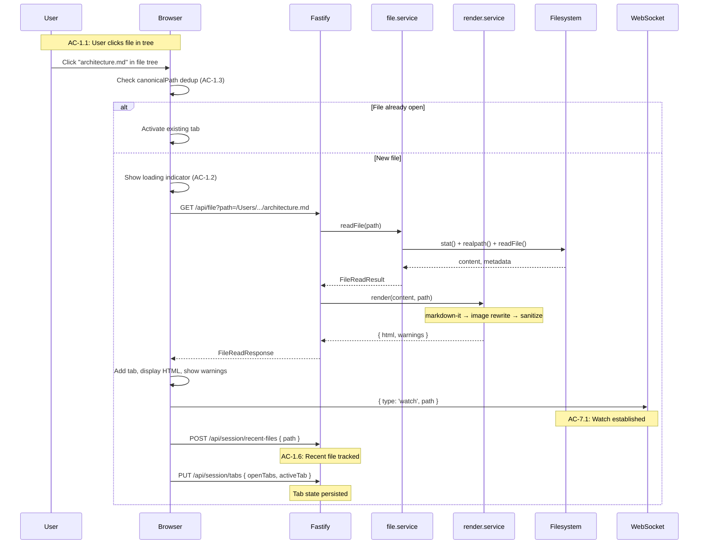
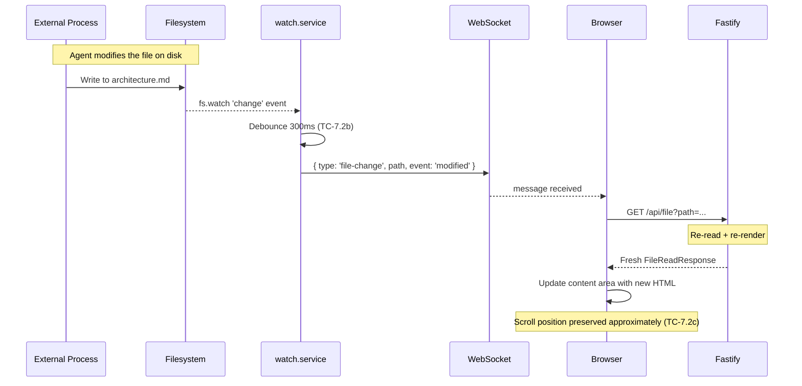
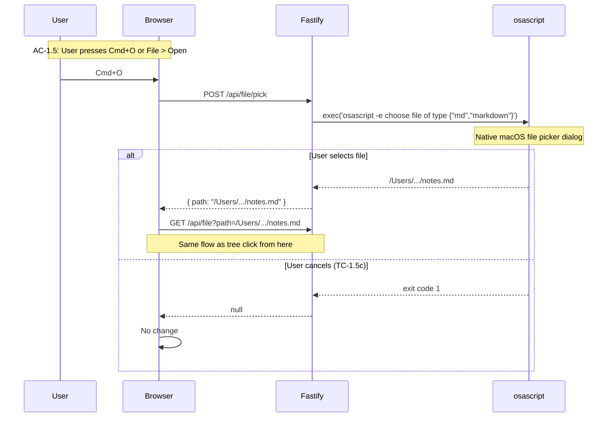

# Technical Design: Epic 2 — API (Server)

**Parent:** [tech-design.md](tech-design.md)
**Companion:** [tech-design-ui.md](tech-design-ui.md) · [test-plan.md](test-plan.md)

This document covers the server-side additions for Epic 2: file read endpoint, rendering pipeline (markdown-it + sanitization + image rewriting), image proxy, file picker, WebSocket file watching, external file opening, and session state extensions.

---

## Schemas: New and Extended

### New Schemas

```typescript
// --- File Read ---

export const FileReadRequestSchema = z.object({
  path: AbsolutePathSchema,
});

export const RenderWarningSchema = z.object({
  type: z.enum(['missing-image', 'remote-image-blocked', 'unsupported-format']),
  source: z.string(),       // image path or URL from the markdown
  line: z.number().optional(),
  message: z.string(),
});

export const FileReadResponseSchema = z.object({
  path: AbsolutePathSchema,            // the requested path (display path)
  canonicalPath: AbsolutePathSchema,    // resolved real path (for dedup only)
  filename: z.string(),                 // basename
  content: z.string(),                  // raw markdown text
  html: z.string(),                     // rendered + sanitized HTML
  warnings: z.array(RenderWarningSchema),
  modifiedAt: z.string().datetime(),    // filesystem mtime
  size: z.number().int().nonneg(),      // raw content size in bytes
});

// --- File Picker ---

export const FilePickerResponseSchema = z.object({
  path: AbsolutePathSchema,
}).nullable();

// --- Image ---

export const ImageRequestSchema = z.object({
  path: AbsolutePathSchema,
});

// --- External Open ---

export const OpenExternalRequestSchema = z.object({
  path: AbsolutePathSchema,
});

// --- WebSocket Messages ---

export const ClientWsMessageSchema = z.discriminatedUnion('type', [
  z.object({ type: z.literal('watch'), path: AbsolutePathSchema }),
  z.object({ type: z.literal('unwatch'), path: AbsolutePathSchema }),
]);

export const ServerWsMessageSchema = z.discriminatedUnion('type', [
  z.object({
    type: z.literal('file-change'),
    path: AbsolutePathSchema,
    event: z.enum(['modified', 'deleted', 'created']),
  }),
  z.object({
    type: z.literal('error'),
    message: z.string(),
  }),
]);

// --- Inferred Types ---

export type RenderWarning = z.infer<typeof RenderWarningSchema>;
export type FileReadResponse = z.infer<typeof FileReadResponseSchema>;
export type ClientWsMessage = z.infer<typeof ClientWsMessageSchema>;
export type ServerWsMessage = z.infer<typeof ServerWsMessageSchema>;
```

### Session Schema Extensions

```typescript
// Added to SessionStateSchema:
export const SessionStateSchema = z.object({
  // ... all Epic 1 fields ...
  defaultOpenMode: z.enum(['render', 'edit']),
  openTabs: z.array(AbsolutePathSchema),
  activeTab: AbsolutePathSchema.nullable(),
});

// New request schemas:
export const SetDefaultModeRequestSchema = z.object({
  mode: z.enum(['render']),  // Only "render" accepted in Epic 2. Epic 5 adds "edit".
});

export const UpdateTabsRequestSchema = z.object({
  openTabs: z.array(AbsolutePathSchema),
  activeTab: AbsolutePathSchema.nullable(),
});
```

The `shared/types.ts` file adds `export type` re-exports for all new types, following Epic 1's pattern of keeping Zod server-side only.

---

## File Service: `server/services/file.service.ts`

The file service reads markdown files from disk with validation and metadata. It does NOT render — that's the render service's job. Separation of concerns: file service handles I/O, render service handles transformation.

### File Read

```typescript
export interface FileReadResult {
  path: string;           // the requested path (as provided by caller)
  canonicalPath: string;  // fs.realpath() resolved path
  filename: string;       // path.basename()
  content: string;        // raw markdown text (utf-8)
  modifiedAt: Date;       // fs.stat().mtime
  size: number;           // content byte length
}

export class FileService {
  async readFile(requestedPath: string): Promise<FileReadResult> {
    // 1. Validate path is absolute
    if (!path.isAbsolute(requestedPath)) {
      throw new InvalidPathError(requestedPath);
    }

    // 2. Validate markdown extension
    const ext = path.extname(requestedPath).toLowerCase();
    if (!MARKDOWN_EXTENSIONS.has(ext)) {
      throw new NotMarkdownError(requestedPath, ext);
    }

    // 3. Stat file (existence + size + mtime)
    const stat = await fs.stat(requestedPath);
    if (!stat.isFile()) {
      throw new NotFileError(requestedPath);
    }

    // 4. Size check
    if (stat.size > MAX_FILE_SIZE) {
      throw new FileTooLargeError(requestedPath, stat.size, MAX_FILE_SIZE);
    }

    // 5. Resolve canonical path (for duplicate tab detection)
    const canonicalPath = await fs.realpath(requestedPath);

    // 6. Read content
    const content = await fs.readFile(requestedPath, 'utf-8');

    return {
      path: requestedPath,
      canonicalPath,
      filename: path.basename(requestedPath),
      content,
      modifiedAt: stat.mtime,
      size: stat.size,
    };
  }
}

const MARKDOWN_EXTENSIONS = new Set(['.md', '.markdown']);
const MAX_FILE_SIZE = 5 * 1024 * 1024;  // 5MB
const WARN_FILE_SIZE = 1 * 1024 * 1024;  // 1MB
```

**Validation chain:** absolute path → markdown extension → file exists → is regular file → size limit → canonical path → read content. Each step has a specific error type that maps to an HTTP status code.

**Canonical path (TC-1.3b):** `fs.realpath()` resolves symlinks to the actual file. Two paths pointing to the same file produce the same `canonicalPath`, enabling duplicate tab detection. The `path` field (what the user clicked) is preserved for display — the user sees the path they opened, not the resolved target. This is consistent with Epic 1's symlink contract.

**AC Coverage:** AC-1.3 (duplicate detection via canonicalPath), AC-1.4 (no root restriction — any absolute path), AC-9.1a (permission denied → EACCES), AC-9.1b (file disappeared → ENOENT), AC-9.2c (binary file → reading as utf-8 produces garbled content, renderer handles gracefully).

---

## Render Service: `server/services/render.service.ts`

The render service takes raw markdown and produces sanitized HTML with rewritten image URLs and a warnings array. This is the core transformation pipeline for Epic 2.

### Pipeline Architecture

```
Raw Markdown
    │
    ▼
markdown-it.render(content)
    │  Plugins: anchor + slugger, task-lists
    │  Config: html: true, linkify: true, typographer: false
    │
    ▼
Image Post-Processing
    │  Walk  tags in rendered HTML
    │  Resolve src against document directory
    │  Classify: local-exists → rewrite to /api/image
    │            local-missing → replace with placeholder, add warning
    │            remote (http/https) → replace with placeholder, add warning
    │            unsupported format → replace with placeholder, add warning
    │
    ▼
DOMPurify.sanitize(html)
    │  Strips: script, iframe, style, event handlers
    │  Preserves: details, summary, kbd, sup, sub, img, etc.
    │
    ▼
{ html, warnings }
```

### markdown-it Configuration

```typescript
import MarkdownIt from 'markdown-it';
import markdownItAnchor from 'markdown-it-anchor';
import markdownItTaskLists from 'markdown-it-task-lists';
import GithubSlugger from 'github-slugger';

function createRenderer(): MarkdownIt {
  const md = new MarkdownIt({
    html: true,         // Enable raw HTML (AC-2.9) — sanitized by DOMPurify after
    linkify: true,      // Auto-detect URLs and make them clickable
    typographer: false,  // Don't convert quotes/dashes — preserve original content
  });

  md.use(markdownItTaskLists, {
    enabled: false,     // Read-only checkboxes (AC-2.8: "read-only until Epic 5")
    label: true,        // Wrap in <label> for accessibility
  });

  // Anchor plugin with GFM slugger — reset per render to scope IDs per document
  md.use(markdownItAnchor, {
    slugify: (s: string) => slugger.slug(s),
    permalink: false,   // No permalink icons — just IDs on headings
  });

  return md;
}
```

The `MarkdownIt` instance is created once and reused across renders. The `GithubSlugger` instance is reset at the start of each render call to ensure heading IDs are scoped per document (not cumulative across documents).

### Image Post-Processing

After markdown-it renders HTML, the service walks `` tags and classifies each image source. This uses a regex-based approach on the HTML string (not a DOM parser — the server has no DOM). The image `src` attributes from markdown-it are unmodified at this point.

```typescript
const IMG_TAG_RE = /]*?)src="([^"]*)"([^>]*?)>/gi;

const SUPPORTED_IMAGE_EXTENSIONS = new Set([
  '.png', '.jpg', '.jpeg', '.gif', '.svg', '.webp', '.bmp', '.ico',
]);

interface ImageProcessResult {
  html: string;
  warnings: RenderWarning[];
}

function processImages(
  html: string,
  documentDir: string,
): ImageProcessResult {
  const warnings: RenderWarning[] = [];

  const processed = html.replace(IMG_TAG_RE, (match, pre, src, post) => {
    // Remote image — block it
    if (src.startsWith('http://') || src.startsWith('https://')) {
      warnings.push({
        type: 'remote-image-blocked',
        source: src,
        message: `Remote image blocked: ${src}`,
      });
      return renderImagePlaceholder('remote-blocked', src);
    }

    // Resolve relative path against document directory
    const resolved = path.isAbsolute(src)
      ? src
      : path.resolve(documentDir, src);

    // Check extension
    const ext = path.extname(resolved).toLowerCase();
    if (!SUPPORTED_IMAGE_EXTENSIONS.has(ext)) {
      warnings.push({
        type: 'unsupported-format',
        source: src,
        message: `Unsupported image format: ${ext}`,
      });
      return renderImagePlaceholder('unsupported', src);
    }

    // Check existence (synchronous for simplicity in HTML walk)
    if (!existsSync(resolved)) {
      warnings.push({
        type: 'missing-image',
        source: src,
        message: `Missing image: ${src}`,
      });
      return renderImagePlaceholder('missing', src);
    }

    // Rewrite to proxy endpoint
    const proxyUrl = `/api/image?path=${encodeURIComponent(resolved)}`;
    return ``;
  });

  return { html: processed, warnings };
}

function renderImagePlaceholder(type: string, source: string): string {
  const icons: Record<string, string> = {
    'missing': '⚠',
    'remote-blocked': '🔒',
    'unsupported': '⚠',
  };
  const labels: Record<string, string> = {
    'missing': 'Missing image',
    'remote-blocked': 'Remote image blocked',
    'unsupported': 'Unsupported format',
  };
  return `<div class="image-placeholder" data-type="${type}">` +
    `<span class="image-placeholder__icon">${icons[type]}</span>` +
    `<span class="image-placeholder__text">${labels[type]}: ${escapeHtml(source)}</span>` +
    `</div>`;
}
```

**Note on `existsSync`:** Used during the HTML walk because the image check is per-tag and the walk is synchronous (regex replace). For typical documents (0–50 images), this is fast. For documents with hundreds of images, the synchronous stat calls add milliseconds — acceptable for a local tool. The NFR target is "50 images within 2 seconds" which this meets comfortably.

### Sanitization

```typescript
import DOMPurify from 'isomorphic-dompurify';

function sanitize(html: string): string {
  return DOMPurify.sanitize(html);
  // Default config preserves: details, summary, kbd, sup, sub, br, img,
  // table elements, all standard block/inline elements.
  // Strips: script, iframe, style, object, embed, form, event handlers,
  // javascript: URLs.
}
```

No custom configuration needed — DOMPurify's defaults match our requirements exactly. The `` tags with `/api/image?path=...` URLs survive sanitization because DOMPurify allows `` by default and the proxy URLs are relative (same-origin).

### Mermaid Placeholder (AC-2.11)

markdown-it renders fenced code blocks with language hints as `<pre><code class="language-mermaid">`. The render service post-processes these to add a placeholder indicator:

```typescript
const MERMAID_RE = /<pre><code class="language-mermaid">([\s\S]*?)<\/code><\/pre>/gi;

function processMermaidBlocks(html: string): string {
  return html.replace(MERMAID_RE, (match, content) => {
    return `<div class="mermaid-placeholder">` +
      `<div class="mermaid-placeholder__label">Mermaid diagram (rendering available in a future update)</div>` +
      `<pre><code class="language-mermaid">${content}</code></pre>` +
      `</div>`;
  });
}
```

The code block content is preserved inside the placeholder wrapper so it's still readable as source. Epic 3 replaces this wrapper with rendered diagrams.

### Full Render Function

```typescript
export class RenderService {
  private md: MarkdownIt;
  private slugger: GithubSlugger;

  constructor() {
    this.slugger = new GithubSlugger();
    this.md = createRenderer(this.slugger);
  }

  render(content: string, documentPath: string): RenderResult {
    // Reset slugger for per-document ID scoping
    this.slugger.reset();

    // Step 1: markdown-it render
    let html = this.md.render(content);

    // Step 2: Mermaid placeholder
    html = processMermaidBlocks(html);

    // Step 3: Image post-processing
    const documentDir = path.dirname(documentPath);
    const imageResult = processImages(html, documentDir);
    html = imageResult.html;

    // Step 4: Sanitize
    html = sanitize(html);

    return {
      html,
      warnings: imageResult.warnings,
    };
  }
}

export interface RenderResult {
  html: string;
  warnings: RenderWarning[];
}
```

**AC Coverage:** AC-2.1–2.11 (all rendering ACs), AC-3.1–3.3 (all image ACs), AC-9.2 (malformed markdown — markdown-it handles gracefully by design).

---

## Image Service: `server/services/image.service.ts`

The image service validates image paths and resolves MIME types for the proxy endpoint. It does not read file content — Fastify's `reply.sendFile()` or streaming handles that.

```typescript
const MIME_TYPES: Record<string, string> = {
  '.png': 'image/png',
  '.jpg': 'image/jpeg',
  '.jpeg': 'image/jpeg',
  '.gif': 'image/gif',
  '.svg': 'image/svg+xml',
  '.webp': 'image/webp',
  '.bmp': 'image/bmp',
  '.ico': 'image/x-icon',
};

export class ImageService {
  async validate(imagePath: string): Promise<{ contentType: string }> {
    if (!path.isAbsolute(imagePath)) {
      throw new InvalidPathError(imagePath);
    }

    const stat = await fs.stat(imagePath);
    if (!stat.isFile()) {
      throw new NotFileError(imagePath);
    }

    const ext = path.extname(imagePath).toLowerCase();
    const contentType = MIME_TYPES[ext];
    if (!contentType) {
      throw new UnsupportedFormatError(imagePath, ext);
    }

    return { contentType };
  }
}
```

**AC Coverage:** AC-3.1a–d (local image rendering). The render service resolves relative paths to absolute before rewriting to the proxy URL. The image service validates the absolute path when the browser fetches it.

---

## Watch Service: `server/services/watch.service.ts`

The watch service manages per-file `fs.watch()` instances and emits change events. It handles the key edge cases identified during research: atomic saves (rename event), debouncing, and watcher lifecycle.

### Architecture

```
WatchService
├── watchers: Map<string, FSWatcher>       // path → active watcher
├── subscribers: Map<string, Set<ws>>      // path → WebSocket connections watching it
├── debounceTimers: Map<string, Timer>     // path → pending debounce timer
│
│  watch(path, ws)     → add subscriber, create watcher if first
│  unwatch(path, ws)   → remove subscriber, close watcher if last
│  handleEvent(path, eventType)  → debounce → notify subscribers
│  handleRename(path)  → re-establish watcher (atomic save pattern)
```

### Per-File Watching

```typescript
import { watch, type FSWatcher } from 'node:fs';

export class WatchService {
  private watchers = new Map<string, FSWatcher>();
  private subscribers = new Map<string, Set<WebSocket>>();
  private debounceTimers = new Map<string, NodeJS.Timeout>();

  watch(filePath: string, ws: WebSocket): void {
    // Add subscriber
    if (!this.subscribers.has(filePath)) {
      this.subscribers.set(filePath, new Set());
    }
    this.subscribers.get(filePath)!.add(ws);

    // Create watcher if first subscriber
    if (!this.watchers.has(filePath)) {
      this.createWatcher(filePath);
    }
  }

  unwatch(filePath: string, ws: WebSocket): void {
    const subs = this.subscribers.get(filePath);
    if (!subs) return;
    subs.delete(ws);

    // Close watcher if no subscribers remain
    if (subs.size === 0) {
      this.subscribers.delete(filePath);
      this.destroyWatcher(filePath);
    }
  }

  private createWatcher(filePath: string): void {
    const watcher = watch(filePath, (eventType) => {
      if (eventType === 'rename') {
        this.handleRename(filePath);
      } else {
        this.handleChange(filePath);
      }
    });

    watcher.on('error', (err) => {
      this.notifySubscribers(filePath, {
        type: 'error',
        message: `Watch error on ${filePath}: ${err.message}`,
      });
    });

    this.watchers.set(filePath, watcher);
  }

  private destroyWatcher(filePath: string): void {
    const watcher = this.watchers.get(filePath);
    if (watcher) {
      watcher.close();
      this.watchers.delete(filePath);
    }
    const timer = this.debounceTimers.get(filePath);
    if (timer) {
      clearTimeout(timer);
      this.debounceTimers.delete(filePath);
    }
  }
}
```

### Debouncing (TC-7.2b)

File changes are debounced at 300ms. Multiple events within the window collapse to a single notification. This handles editors that trigger multiple write events per save and agents that write incrementally.

```typescript
private handleChange(filePath: string): void {
  // Clear existing timer
  const existing = this.debounceTimers.get(filePath);
  if (existing) clearTimeout(existing);

  // Set new timer
  const timer = setTimeout(() => {
    this.debounceTimers.delete(filePath);
    this.notifySubscribers(filePath, {
      type: 'file-change',
      path: filePath,
      event: 'modified',
    });
  }, 100);

  this.debounceTimers.set(filePath, timer);
}
```

### Atomic Save Handling (rename event)

Editors like VS Code and Vim use atomic saves: write to temp file, then rename over the original. On macOS with kqueue, `fs.watch()` receives a `rename` event and the watcher breaks — it was watching the old inode which no longer exists.

The solution: on `rename`, close the old watcher, check if the file was recreated (atomic save) or truly deleted, and act accordingly.

```typescript
private async handleRename(filePath: string): Promise<void> {
  this.destroyWatcher(filePath);

  // Wait briefly for the rename to complete (atomic save has a small gap)
  await new Promise(r => setTimeout(r, 50));

  try {
    await fs.stat(filePath);
    // File exists — this was an atomic save. Re-establish watcher.
    this.createWatcher(filePath);
    this.handleChange(filePath); // Notify subscribers of the change
  } catch {
    // File is gone — this was a deletion.
    this.notifySubscribers(filePath, {
      type: 'file-change',
      path: filePath,
      event: 'deleted',
    });
  }
}
```

### File Restoration (TC-7.3b)

When a deleted file is recreated at the same path, the watcher is gone (destroyed on deletion). The client shows "file not found" state. To detect recreation, the client periodically attempts to re-watch:

After receiving a `deleted` event, the client sets a 2-second interval that sends `{ type: 'watch', path }`. The watch service attempts `fs.stat()` — if the file exists, it creates a watcher and notifies `{ type: 'file-change', event: 'created' }`. If not, it responds with an error. The client stops polling after 5 attempts (10 seconds) or on success.

This polling is limited and intentional — file restoration is an edge case, and maintaining a directory watcher for every deleted file's parent is more complex than occasional stat calls.

### Connection Cleanup

When a WebSocket connection closes (browser refresh, tab close, server restart), all watchers subscribed by that connection are cleaned up:

```typescript
unwatchAll(ws: WebSocket): void {
  for (const [filePath, subs] of this.subscribers) {
    subs.delete(ws);
    if (subs.size === 0) {
      this.subscribers.delete(filePath);
      this.destroyWatcher(filePath);
    }
  }
}
```

**AC Coverage:** AC-7.1 (watch lifecycle), AC-7.2 (auto-reload with debounce), AC-7.3 (deletion and restoration), AC-7.4 (performance — 20 kqueue watchers is trivial on macOS).

---

## Route Handlers

### File Routes: `server/routes/file.ts`

#### GET /api/file

Reads a markdown file and returns rendered HTML with metadata.

```typescript
app.get('/api/file', {
  schema: {
    querystring: z.object({ path: AbsolutePathSchema }),
    response: {
      200: FileReadResponseSchema,
      400: ErrorResponseSchema,
      403: ErrorResponseSchema,
      404: ErrorResponseSchema,
      413: ErrorResponseSchema,
      415: ErrorResponseSchema,
    },
  },
}, async (request, reply) => {
  const { path: filePath } = request.query;

  try {
    // Read file
    const fileResult = await fileService.readFile(filePath);

    // Check if size warrants a warning (1MB+)
    // The client handles the confirmation UX. The server returns a
    // header so the client can check before reading the full body.

    // Render markdown
    const renderResult = renderService.render(fileResult.content, filePath);

    return {
      path: fileResult.path,
      canonicalPath: fileResult.canonicalPath,
      filename: fileResult.filename,
      content: fileResult.content,
      html: renderResult.html,
      warnings: renderResult.warnings,
      modifiedAt: fileResult.modifiedAt.toISOString(),
      size: fileResult.size,
    };
  } catch (err) {
    if (err instanceof InvalidPathError) {
      return reply.code(400).send(toApiError('INVALID_PATH', err.message));
    }
    if (err instanceof NotMarkdownError) {
      return reply.code(415).send(toApiError('NOT_MARKDOWN', err.message));
    }
    if (err instanceof FileTooLargeError) {
      return reply.code(413).send(toApiError('FILE_TOO_LARGE', err.message));
    }
    if (isPermissionError(err)) {
      return reply.code(403).send(toApiError('PERMISSION_DENIED', `Cannot read ${filePath}`));
    }
    if (isNotFoundError(err)) {
      return reply.code(404).send(toApiError('FILE_NOT_FOUND', `File not found: ${filePath}`));
    }
    throw err;
  }
});
```

For the 1–5MB warning range: the server includes `size` in the response. The client can make a lightweight HEAD-like request or check the `size` field. In practice, the simplest approach is: the server always returns the full response (including rendered HTML), and the client checks `size` on receipt. If ≥1MB, the client shows the confirmation dialog before displaying the content. The HTML is already rendered — if the user confirms, it displays immediately. If they cancel, the tab is closed. This avoids a two-request dance for a rare case.

**AC Coverage:** AC-1.1 (file open), AC-1.2 (loading — client-side), AC-1.3 (canonicalPath for dedup), AC-1.4 (any absolute path), AC-9.1 (errors), AC-9.2 (malformed markdown rendered gracefully), AC-9.3 (server errors).

#### POST /api/file/pick

Opens a native file picker filtered to markdown files.

```typescript
app.post('/api/file/pick', {
  schema: {
    response: {
      200: FilePickerResponseSchema,
    },
  },
}, async () => {
  const selected = await openFilePicker();
  return selected ? { path: selected } : null;
});
```

The `openFilePicker()` function follows the same pattern as Epic 1's folder picker:

```typescript
export async function openFilePicker(): Promise<string | null> {
  return new Promise((resolve, reject) => {
    exec(
      `osascript -e 'POSIX path of (choose file of type {"md", "markdown"} with prompt "Open Markdown File")'`,
      { timeout: 60_000 },
      (error, stdout) => {
        if (error) {
          if (error.code === 1) return resolve(null); // User cancelled
          return reject(error);
        }
        resolve(stdout.trim());
      }
    );
  });
}
```

**AC Coverage:** AC-1.5 (File > Open triggers file picker).

### Image Route: `server/routes/image.ts`

#### GET /api/image

Serves a local image file with correct Content-Type.

```typescript
import { createReadStream } from 'node:fs';

app.get('/api/image', {
  schema: {
    querystring: z.object({ path: AbsolutePathSchema }),
  },
}, async (request, reply) => {
  const { path: imagePath } = request.query;

  try {
    const { contentType } = await imageService.validate(imagePath);

    // Stream the image to avoid loading large images into memory
    const stream = createReadStream(imagePath);
    return reply
      .type(contentType)
      .send(stream);
  } catch (err) {
    if (err instanceof InvalidPathError || err instanceof UnsupportedFormatError) {
      return reply.code(400).send(toApiError('INVALID_PATH', err.message));
    }
    if (isNotFoundError(err)) {
      return reply.code(404).send(toApiError('FILE_NOT_FOUND', `Image not found: ${imagePath}`));
    }
    throw err;
  }
});
```

Images are streamed via `createReadStream` rather than buffered with `readFile`. This handles large images (diagrams, screenshots) without loading them entirely into server memory.

**Cache headers:** The response sets `Cache-Control: private, max-age=60`. Images rarely change during a session, and the 60-second cache avoids redundant reads on tab switches. If the file changes, the tab re-renders (via file watcher) and the browser fetches the image anew (the URL includes the absolute path, so the cache naturally invalidates when the document is re-rendered with a modified image).

**AC Coverage:** AC-3.1 (local images render inline).

### WebSocket Route: `server/routes/ws.ts`

#### WS /ws

The WebSocket connection handler. One connection per browser tab (client), multiplexed messages.

```typescript
import websocket from '@fastify/websocket';

// Register plugin BEFORE routes
await app.register(websocket);

app.get('/ws', { websocket: true }, (socket, request) => {
  // Handle incoming messages (watch/unwatch)
  socket.on('message', (raw) => {
    try {
      const msg = JSON.parse(raw.toString());
      const parsed = ClientWsMessageSchema.parse(msg);

      switch (parsed.type) {
        case 'watch':
          watchService.watch(parsed.path, socket);
          break;
        case 'unwatch':
          watchService.unwatch(parsed.path, socket);
          break;
      }
    } catch (err) {
      socket.send(JSON.stringify({
        type: 'error',
        message: 'Invalid message format',
      }));
    }
  });

  // Cleanup on disconnect
  socket.on('close', () => {
    watchService.unwatchAll(socket);
  });
});
```

**Critical note (from research):** Attach `message` listeners synchronously in the connection callback. If you do async work first, messages arriving during the gap are silently dropped. The handler above is fully synchronous — no await before the listener registration.

**AC Coverage:** AC-7.1 (watch established/released), AC-7.2 (change events pushed), AC-7.3 (deletion events pushed).

### External Opening Route: `server/routes/open-external.ts`

#### POST /api/open-external

Opens a file with the system's default handler.

```typescript
app.post('/api/open-external', {
  schema: {
    body: OpenExternalRequestSchema,
    response: {
      200: z.object({ ok: z.literal(true) }),
      400: ErrorResponseSchema,
      404: ErrorResponseSchema,
    },
  },
}, async (request, reply) => {
  const { path: filePath } = request.body;

  // Validate file exists
  try {
    await fs.stat(filePath);
  } catch (err) {
    if (isNotFoundError(err)) {
      return reply.code(404).send(toApiError('FILE_NOT_FOUND', `File not found: ${filePath}`));
    }
    throw err;
  }

  // Open with system handler
  exec(`open ${JSON.stringify(filePath)}`);
  return { ok: true as const };
});
```

The path is passed to `open` via `JSON.stringify()` which wraps it in quotes, handling spaces and special characters. No root restriction — any local file (decided with product owner, documented in index).

**AC Coverage:** AC-5.3 (non-markdown links open externally).

### Session Extensions: `server/routes/session.ts`

#### PUT /api/session/default-mode

Sets the default open mode. Only "render" accepted in Epic 2.

```typescript
app.put('/api/session/default-mode', {
  schema: {
    body: SetDefaultModeRequestSchema,
    response: { 200: SessionStateSchema, 400: ErrorResponseSchema },
  },
}, async (request) => {
  return sessionService.setDefaultMode(request.body.mode);
});
```

#### PUT /api/session/tabs

Updates the persisted open tabs list and active tab.

```typescript
app.put('/api/session/tabs', {
  schema: {
    body: UpdateTabsRequestSchema,
    response: { 200: SessionStateSchema },
  },
}, async (request) => {
    return sessionService.updateTabs(request.body.openTabs, request.body.activeTab);
});
```

Called whenever tabs change (open, close, switch, reorder). The client batches changes — a single call per user action, not per intermediate state.

**AC Coverage:** AC-6.3c (default mode persists), tab persistence (A5 amendment).

---

## Sequence Diagrams

### Flow: Open File from Tree (AC-1.1)



### Flow: File Watch Auto-Reload (AC-7.2)



### Flow: File Picker Open (AC-1.5)



---

## Error Classes

New error classes for Epic 2, extending the pattern from Epic 1:

```typescript
// server/utils/errors.ts (additions)

export class NotMarkdownError extends Error {
  constructor(path: string, ext: string) {
    super(`Not a markdown file (${ext}): ${path}`);
  }
}

export class FileTooLargeError extends Error {
  constructor(path: string, size: number, limit: number) {
    super(`File too large (${(size / 1024 / 1024).toFixed(1)}MB, limit ${(limit / 1024 / 1024).toFixed(0)}MB): ${path}`);
    this.size = size;
    this.limit = limit;
  }
  readonly size: number;
  readonly limit: number;
}

export class NotFileError extends Error {
  constructor(path: string) {
    super(`Not a regular file: ${path}`);
  }
}

export class UnsupportedFormatError extends Error {
  constructor(path: string, ext: string) {
    super(`Unsupported image format (${ext}): ${path}`);
  }
}
```

---

## Self-Review Checklist (API)

- [x] File read endpoint covers validation chain: path → extension → exists → size → read → render
- [x] Render pipeline: markdown-it → mermaid placeholder → image post-processing → DOMPurify
- [x] Image proxy streams files with correct Content-Type
- [x] WebSocket handler registers message listener synchronously (research finding)
- [x] Watch service handles atomic saves via rename detection + re-establishment
- [x] Watch service handles file deletion with subscriber notification
- [x] Debounce at 300ms for rapid file changes
- [x] File picker uses researched osascript syntax with type filter
- [x] External opening uses `open` with path quoting, no root restriction
- [x] Session extensions: defaultOpenMode, openTabs, activeTab
- [x] All new error classes map to HTTP status codes
- [x] Sequence diagrams cover file open, file watch, and file picker flows
- [x] All external boundaries identified for mocking: fs, fs.watch, child_process
- [x] In-process dependencies (markdown-it, DOMPurify) are NOT mocked in tests
