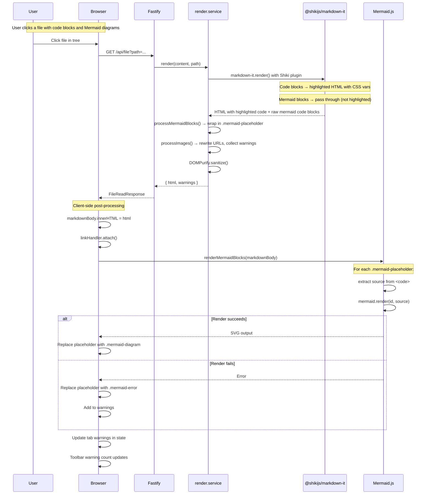
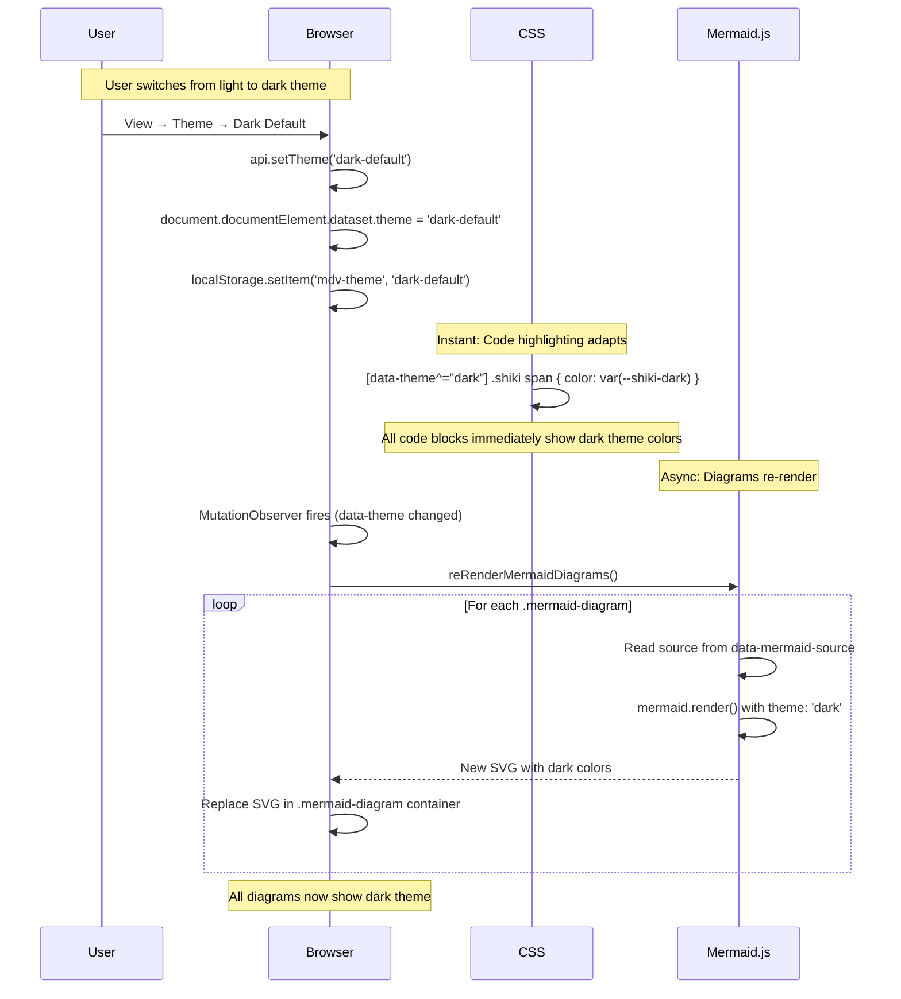

# Technical Design: Epic 3 — UI (Client)

**Parent:** [tech-design.md](tech-design.md)
**Companion:** [tech-design-api.md](tech-design-api.md)

This document covers the client-side additions for Epic 3: Mermaid.js diagram rendering, theme adaptation, error handling, the content post-processing pipeline, and CSS for Shiki dual-theme code highlighting.

---

## Mermaid Renderer: `client/utils/mermaid-renderer.ts`

This is the core new module for Epic 3. It finds mermaid placeholders in the rendered DOM, renders each using Mermaid.js, and handles errors and theme adaptation.

### Initialization

Mermaid.js is loaded via dynamic import on first use — not at app startup, not eagerly bundled. This leverages esbuild code splitting (configured in Chunk 0): the initial page load is unaffected, and Mermaid's 26 KB ESM entry + diagram-specific chunks load on demand only when a document with mermaid blocks is opened.

```typescript
// Dynamic import — triggers code splitting. Mermaid loads on first call.
let mermaidModule: typeof import('mermaid') | null = null;

async function getMermaid() {
  if (!mermaidModule) {
    mermaidModule = await import('mermaid');
  }
  return mermaidModule.default;
}
```

`mermaid.initialize()` is called before each render. Initialization is cheap (stores config, no heavy work) and must happen before each render because the theme may have changed since the last render.

Key config values applied on each render:
- `startOnLoad: false` — Mermaid.js by default scans the DOM on page load looking for `.mermaid` elements. We don't want that. We control exactly when and what to render.
- `securityLevel: 'strict'` — AC-1.6: no click handlers, no interactive tooltips, static SVG output only.
- `theme` — mapped from the current app theme (Q3).

### Theme Detection

The renderer reads the current app theme from the `data-theme` attribute and maps it to a Mermaid theme:

```typescript
function getMermaidTheme(): 'default' | 'dark' {
  const appTheme = document.documentElement.dataset.theme ?? 'light-default';
  return appTheme.startsWith('dark') ? 'dark' : 'default';
}
```

This mapping corresponds to the decision in Q3: light app themes → Mermaid `'default'`, dark app themes → Mermaid `'dark'`.

### Rendering Pipeline

The main entry point renders all mermaid placeholders in a container element:

```typescript
export interface MermaidRenderResult {
  warnings: RenderWarning[];
}

export async function renderMermaidBlocks(
  container: HTMLElement,
): Promise<MermaidRenderResult> {
  const placeholders = container.querySelectorAll('.mermaid-placeholder');
  if (placeholders.length === 0) return { warnings: [] };

  const theme = getMermaidTheme();
  const warnings: RenderWarning[] = [];
  let renderIndex = 0;

  for (const placeholder of placeholders) {
    const codeEl = placeholder.querySelector('code.language-mermaid');
    const source = codeEl?.textContent?.trim() ?? '';

    if (!source) {
      // Empty mermaid block (TC-2.1d)
      replacePlaceholderWithError(placeholder, source, 'Diagram definition is empty');
      warnings.push(createMermaidWarning(source, 'Diagram definition is empty'));
      continue;
    }

    try {
      const result = await renderWithTimeout(source, `mermaid-${renderIndex++}`, theme);
      replacePlaceholderWithSvg(placeholder, result.svg, source);
    } catch (err) {
      const message = err instanceof Error ? err.message : 'Unknown rendering error';
      replacePlaceholderWithError(placeholder, source, message);
      warnings.push(createMermaidWarning(source, message));
    }
  }

  return { warnings };
}
```

The loop is sequential — each diagram renders one at a time. This is intentional:
1. Mermaid.js manipulates a shared DOM state (it creates a hidden `<div>` for measurement). Parallel rendering would cause race conditions.
2. Sequential rendering with `await` yields to the event loop between diagrams. This is what provides the "UI must not freeze" guarantee for multi-diagram documents — the browser can process user input and paint between diagram renders.
3. For typical documents (1-5 diagrams), the total rendering time is 1-3 seconds. For 10+ diagrams, it may take 5-10 seconds but the UI remains interactive between renders.

**Important caveat:** The between-diagram yielding keeps the UI responsive across diagrams. Within a single diagram render, if `mermaid.render()` does expensive synchronous DOM layout, the main thread blocks until it finishes. The per-diagram timeout (see below) catches genuinely stuck promises but cannot interrupt synchronous work. See Q4 in the index doc for the full analysis.

### Rendering with Timeout (Q4)

Each diagram render is wrapped in a `Promise.race` against a 5-second timeout:

```typescript
const RENDER_TIMEOUT_MS = 5_000;

async function renderWithTimeout(
  source: string,
  id: string,
  theme: 'default' | 'dark',
): Promise<{ svg: string }> {
  const mermaid = await getMermaid();

  // Re-initialize with current theme (Mermaid requires re-init to change theme)
  mermaid.initialize({
    startOnLoad: false,
    securityLevel: 'strict',
    theme,
    suppressErrors: true,
    logLevel: 'fatal',
  });

  const renderPromise = mermaid.render(id, source);

  const timeoutPromise = new Promise<never>((_, reject) => {
    setTimeout(
      () => reject(new Error('Diagram rendering timed out after 5 seconds')),
      RENDER_TIMEOUT_MS,
    );
  });

  return Promise.race([renderPromise, timeoutPromise]);
}
```

Note: `mermaid.initialize()` is called before each render to ensure the theme is current. Mermaid.js doesn't support changing the theme without re-initializing. This is a known quirk — the re-initialization is cheap (it just stores config, no heavy work).

The timeout catches genuinely stuck promises (e.g., Mermaid internal deadlock, infinite loop in async code). It does NOT interrupt synchronous main-thread blocking within `mermaid.render()` — see Q4 in the index doc for the limitation analysis.

### Placeholder Replacement: Success

When a diagram renders successfully, the placeholder is replaced with the SVG output:

```typescript
function replacePlaceholderWithSvg(placeholder: Element, svg: string, source: string): void {
  const container = document.createElement('div');
  container.className = 'mermaid-diagram';
  container.dataset.mermaidSource = source;  // Preserve for re-render on theme switch

  container.innerHTML = svg;

  // Apply sizing constraints (AC-1.2)
  const svgEl = container.querySelector('svg');
  if (svgEl) {
    svgEl.style.maxWidth = '100%';
    svgEl.style.height = 'auto';
    svgEl.removeAttribute('width');   // Remove fixed width — let CSS control
    svgEl.removeAttribute('height');  // Remove fixed height — aspect ratio via viewBox
  }

  placeholder.replaceWith(container);
}
```

The SVG's fixed `width` and `height` attributes are removed so CSS can control sizing. The `viewBox` attribute (which Mermaid always sets) ensures the aspect ratio is maintained. `max-width: 100%` scales wide diagrams down; small diagrams render at natural size because `max-width` doesn't upscale.

### Placeholder Replacement: Error

When a diagram fails, the placeholder is replaced with an error fallback that shows the raw source:

```typescript
function replacePlaceholderWithError(
  placeholder: Element,
  source: string,
  errorMessage: string,
): void {
  const container = document.createElement('div');
  container.className = 'mermaid-error';

  // Error banner
  const banner = document.createElement('div');
  banner.className = 'mermaid-error__banner';
  banner.textContent = `⚠ Mermaid error: ${errorMessage}`;
  container.appendChild(banner);

  // Raw source (selectable for debugging — TC-2.1b)
  const pre = document.createElement('pre');
  pre.className = 'mermaid-error__source';
  const code = document.createElement('code');
  code.textContent = source;
  pre.appendChild(code);
  container.appendChild(pre);

  placeholder.replaceWith(container);
}
```

The raw source is in a `<pre><code>` block — fully selectable and copyable so the user can paste it into Mermaid's live editor or another tool for debugging.

### Warning Collection

Mermaid warnings follow the same `RenderWarning` shape as image warnings from Epic 2:

```typescript
function createMermaidWarning(source: string, message: string): RenderWarning {
  // Truncate source at 200 characters (per data contract)
  const truncatedSource = source.length > 200
    ? source.slice(0, 200) + '...'
    : source;

  return {
    type: 'mermaid-error',
    source: truncatedSource,
    message,
    // line is not available from client-side rendering
    // (the mermaid block's position in the markdown is lost after server rendering)
  };
}
```

The warnings are merged into the tab's existing warnings after rendering. This ensures the warning count in the content toolbar reflects all warnings (image + mermaid), and the warning panel lists all of them.

### Integration with Content Area

After the content area injects the server-rendered HTML, it calls the mermaid renderer:

```typescript
// In content-area.ts render() — after innerHTML injection
const markdownBody = this.el.querySelector('.markdown-body');
if (markdownBody) {
  markdownBody.innerHTML = activeTab.html;

  // Capture the tab ID before the async gap — used to guard against stale writes
  const renderingTabId = activeTab.id;

  // Epic 2: attach link click handler
  linkHandler.attach(markdownBody, state);

  // Epic 3: render mermaid diagrams
  const mermaidResult = await renderMermaidBlocks(markdownBody);

  // Guard: if the user switched tabs during the async render, discard the result.
  // Writing warnings to a tab that is no longer active would corrupt state.
  const currentState = store.get();
  if (currentState.activeTabId !== renderingTabId) return;

  // Replace (not append) mermaid warnings. Server warnings (image-related) are
  // preserved; previous mermaid warnings are discarded. This prevents duplication
  // on tab switch or re-render.
  const serverWarnings = activeTab.warnings.filter(w => w.type !== 'mermaid-error');
  const allWarnings = [...serverWarnings, ...mermaidResult.warnings];
  store.update({
    tabs: currentState.tabs.map(t =>
      t.id === renderingTabId ? { ...t, warnings: allWarnings } : t
    ),
  }, ['tabs']);
}
```

**Two critical safeguards:**

1. **Replace, not append.** Mermaid warnings replace any previous mermaid warnings on the tab, rather than appending. Server-originated warnings (`missing-image`, `remote-image-blocked`, `unsupported-format`) are preserved by filtering on `type !== 'mermaid-error'`. This prevents warning duplication when the same tab re-renders (tab switch back, file watch reload, theme change).

2. **Stale-write guard.** The `renderingTabId` is captured before the `await` gap. After rendering completes, the guard checks whether the active tab has changed. If the user switched tabs during the async Mermaid render, the result is discarded — writing warnings to a no-longer-active tab would corrupt state. The DOM changes (placeholder→SVG) are harmless because the content area will be overwritten when the new tab renders.

### Re-rendering on File Watch Reload

When a watched file changes and the tab re-renders, the entire content area is replaced — `innerHTML` is set to the new server HTML, and `renderMermaidBlocks()` runs again on the fresh placeholders. Old SVGs and error fallbacks are naturally garbage-collected when `innerHTML` replaces them.

The warning replace-not-append logic handles this correctly: the fresh server response has fresh image warnings, and the fresh mermaid render produces fresh mermaid warnings. No stale warnings persist.

---

## Theme Adaptation

### Shiki (CSS-only — No JS)

Shiki's dual-theme output is activated by CSS rules in `markdown-body.css` (see the CSS section below for the definitive rules). The mechanism: Shiki with `defaultColor: false` sets CSS variables (`--shiki-light`, `--shiki-dark`) on each token span but does NOT set an actual `color` property. The CSS rules resolve those variables into `color` values based on the active `data-theme` attribute. When the user switches themes, the CSS rules immediately apply the other variable set — no JavaScript, no re-rendering, instant.

**AC Coverage:** AC-3.4a (light theme), AC-3.4b (dark theme), AC-3.4c (theme switch).

### Mermaid (Re-render Required)

Mermaid SVGs embed inline styles — fill colors, stroke colors, text colors are baked into the SVG. CSS custom properties cannot override them because SVG inline styles have the highest specificity. Theme adaptation requires re-rendering each diagram with the new theme config.

The client sets up a MutationObserver on the `data-theme` attribute:

```typescript
// In app.ts bootstrap (Epic 3 addition)
const themeObserver = new MutationObserver((mutations) => {
  for (const mutation of mutations) {
    if (mutation.attributeName === 'data-theme') {
      // Re-render all mermaid diagrams in the active tab
      reRenderMermaidDiagrams();
    }
  }
});

themeObserver.observe(document.documentElement, {
  attributes: true,
  attributeFilter: ['data-theme'],
});
```

The `reRenderMermaidDiagrams()` function finds all `.mermaid-diagram` containers (successfully rendered diagrams) in the active tab's content area and re-renders them with the new theme. Previously-failed diagrams (`.mermaid-error` containers) are NOT re-attempted — a diagram that failed due to a parse error will fail identically with a different theme. Failed diagrams remain in their error state until the file is reloaded (which triggers a full re-render from fresh placeholders).

```typescript
async function reRenderMermaidDiagrams(): Promise<void> {
  const markdownBody = document.querySelector('.content-area__body .markdown-body');
  if (!markdownBody) return;

  const diagrams = markdownBody.querySelectorAll('.mermaid-diagram');
  if (diagrams.length === 0) return;

  const theme = getMermaidTheme();
  let renderIndex = 0;

  for (const diagram of diagrams) {
    // The source is NOT stored in the rendered SVG — we need it from elsewhere.
    // Store the source as a data attribute when first rendering.
    const source = diagram.dataset.mermaidSource;
    if (!source) continue;

    try {
      const result = await renderWithTimeout(source, `mermaid-re-${renderIndex++}`, theme);
      diagram.innerHTML = result.svg;

      // Apply sizing constraints
      const svgEl = diagram.querySelector('svg');
      if (svgEl) {
        svgEl.style.maxWidth = '100%';
        svgEl.style.height = 'auto';
        svgEl.removeAttribute('width');
        svgEl.removeAttribute('height');
      }
    } catch {
      // Re-render failed — leave the old SVG in place (it's readable, just wrong theme)
      // This is a rare edge case — the diagram rendered successfully once
    }
  }
}
```

**Critical detail:** The raw mermaid source must be preserved for re-rendering. The original source is in the server's placeholder HTML, but after the first render, the placeholder is replaced by `.mermaid-diagram`. The `replacePlaceholderWithSvg()` function (defined in the Rendering Pipeline section above) stores the source as a `data-mermaid-source` attribute on the container. The `reRenderMermaidDiagrams()` function reads it back from `diagram.dataset.mermaidSource`.

**AC Coverage:** AC-1.3a (light theme colors), AC-1.3b (dark theme colors), AC-1.3c (theme switch).

---

## CSS: `client/styles/mermaid.css`

Dedicated styles for mermaid diagram containers and error fallbacks:

```css
/* Mermaid diagram containers */
.mermaid-diagram {
  margin: 1em 0;
  text-align: center;        /* Center diagrams horizontally */
}

.mermaid-diagram svg {
  max-width: 100%;           /* AC-1.2a: scale down wide diagrams */
  height: auto;              /* Maintain aspect ratio */
  /* AC-1.2b: small diagrams at natural size — max-width doesn't upscale */
  /* AC-1.2c: tall diagrams scroll — no max-height constraint */
}

/* Mermaid error fallback */
.mermaid-error {
  margin: 1em 0;
  border: 1px solid var(--color-error);
  border-radius: 6px;
  overflow: hidden;
}

.mermaid-error__banner {
  padding: 0.5em 1em;
  background: var(--color-error);
  color: white;
  font-size: 0.9em;
  font-weight: 500;
}

.mermaid-error__source {
  margin: 0;
  padding: 1em;
  background: var(--color-bg-tertiary);
  font-family: "SF Mono", "Fira Code", monospace;
  font-size: 0.85em;
  overflow-x: auto;
  /* Source is fully selectable — user can copy for debugging (TC-2.1b) */
  user-select: text;
}

.mermaid-error__source code {
  background: none;
  padding: 0;
}
```

The error fallback uses `var(--color-error)` for the banner background, ensuring it adapts to all four themes. The source code block uses `var(--color-bg-tertiary)` for consistency with regular code blocks.

---

## CSS: `client/styles/markdown-body.css` (modifications)

### Shiki Code Block Styles

Added to the existing `markdown-body.css`:

```css
/* Shiki highlighted code blocks */
.markdown-body .shiki {
  padding: 1em;
  border-radius: 6px;
  overflow-x: auto;
  font-family: "SF Mono", "Fira Code", monospace;
  font-size: 0.9em;
  line-height: 1.5;
  tab-size: 2;
}

/* Shiki theme switching — light themes */
:root .shiki,
:root .shiki span,
[data-theme^="light"] .shiki,
[data-theme^="light"] .shiki span {
  color: var(--shiki-light) !important;
  background-color: var(--shiki-light-bg) !important;
}

/* Shiki theme switching — dark themes */
[data-theme^="dark"] .shiki,
[data-theme^="dark"] .shiki span {
  color: var(--shiki-dark) !important;
  background-color: var(--shiki-dark-bg) !important;
}

/* Override the existing pre/code styles for Shiki blocks */
.markdown-body pre.shiki {
  /* Shiki manages its own background via CSS vars — don't apply the generic bg */
  background: none;
}
.markdown-body pre.shiki code {
  background: none;
  padding: 0;
}

/* Non-highlighted code blocks (no language tag, unknown language, indented) */
/* These keep the existing Epic 2 styles — no changes needed */
```

The key nuance: Epic 2's `markdown-body.css` already has styles for `pre` and `code`. Shiki's output uses `<pre class="shiki">`, so the `.markdown-body pre.shiki` selector overrides the generic `pre` styles. Non-Shiki code blocks (bare `<pre><code>` without `.shiki` class) keep the existing styles unchanged.

---

## Content Post-Processing Pipeline

The full post-processing sequence after HTML injection:

```
content-area.ts: markdownBody.innerHTML = activeTab.html
    │
    ├── 1. linkHandler.attach(markdownBody, state)     ← Epic 2 (unchanged)
    │       Click handler for links in rendered content
    │
    └── 2. renderMermaidBlocks(markdownBody)            ← Epic 3 (NEW)
            Find .mermaid-placeholder elements
            Render each via Mermaid.js
            Replace with SVG or error fallback
            Return { warnings }
```

The order doesn't strictly matter — link handler and mermaid renderer operate on different elements. But the convention is: non-destructive operations first (link handler attaches click listeners), then destructive operations (mermaid renderer replaces DOM nodes).

### When Post-Processing Runs

Post-processing runs in three scenarios:

1. **Tab open / tab switch:** When a tab becomes active and its HTML is injected.
2. **File watch reload:** When a watched file changes and the tab re-renders with fresh HTML.
3. **Theme switch:** Only mermaid re-renders (code highlighting adapts via CSS).

Scenario 3 is distinct — it doesn't re-inject the HTML. The mermaid renderer finds existing `.mermaid-diagram` containers and re-renders them in place. The link handler doesn't need to re-attach (its event delegation on the `.markdown-body` container is persistent).

---

## Keyboard Shortcuts

No new keyboard shortcuts in Epic 3. The existing shortcut set from Epics 1-2 is unchanged.

---

## Sequence Diagrams

### Flow: Open Document with Mermaid + Highlighted Code



### Flow: Theme Switch with Rich Content



---

## Self-Review Checklist (UI)

- [x] Mermaid.js initialized once with `startOnLoad: false` and `securityLevel: 'strict'`
- [x] Theme detection maps app themes to Mermaid themes (light → default, dark → dark)
- [x] Rendering pipeline is sequential (avoids Mermaid DOM race conditions)
- [x] Each render has 5-second timeout via Promise.race
- [x] Success: placeholder replaced with `.mermaid-diagram` container + SVG
- [x] Error: placeholder replaced with `.mermaid-error` container + raw source + error banner
- [x] Mermaid source preserved as `data-mermaid-source` attribute for theme re-rendering
- [x] Warnings collected and merged into TabState.warnings
- [x] Warning source truncated at 200 characters
- [x] Theme switch: MutationObserver on `data-theme` triggers mermaid re-render
- [x] Theme switch: Shiki code blocks adapt via CSS only (no JS re-render)
- [x] CSS: mermaid-diagram sizing (max-width: 100%, height: auto, no upscale)
- [x] CSS: mermaid-error styling with themed colors
- [x] CSS: Shiki dual-theme switching via [data-theme^="light/dark"] selectors
- [x] Post-processing pipeline documented (link handler + mermaid renderer)
- [x] Three re-render scenarios covered: tab open, file watch, theme switch
