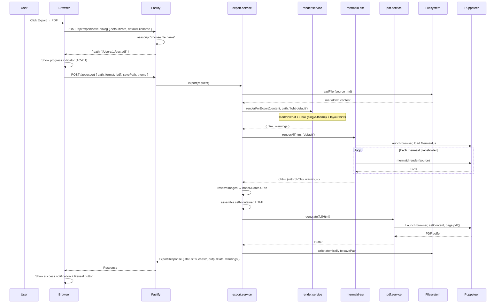

# Technical Design: Epic 4 — API (Server)

**Parent:** [tech-design.md](tech-design.md)
**Companion:** [tech-design-ui.md](tech-design-ui.md) · [test-plan.md](test-plan.md)

This document covers the server-side additions for Epic 4: export pipeline orchestrator, Mermaid SSR via Puppeteer, PDF/DOCX/HTML generation services, asset resolution, save dialog, render service extensions (single-theme mode, layout hints), and session extensions.

---

## Schemas: New and Extended

### New Schemas

```typescript
// --- Export ---

export const ExportFormatSchema = z.enum(['pdf', 'docx', 'html']);

export const ExportRequestSchema = z.object({
  path: AbsolutePathSchema,          // source markdown file
  format: ExportFormatSchema,
  savePath: AbsolutePathSchema,      // output file destination
  theme: ThemeIdSchema,              // active viewer theme (used for HTML export)
});

export const ExportWarningSchema = z.object({
  type: z.enum([
    'missing-image',
    'remote-image-blocked',
    'unsupported-format',
    'mermaid-error',
    'format-degradation',            // NEW: export-only warning type
  ]),
  source: z.string(),
  line: z.number().optional(),
  message: z.string(),
});

// In v1, POST /api/export returns HTTP 200 only for successful exports.
// Failures use HTTP error responses (400, 403, 404, 409, 413, 415, 500, 507).
// The epic's ExportResponse included status: 'success' | 'error', but the
// design tightens this: errors are expressed via HTTP status codes, not in-band.
// See Spec Validation table in tech-design.md for this deviation.
export const ExportResponseSchema = z.object({
  status: z.literal('success'),
  outputPath: AbsolutePathSchema,
  warnings: z.array(ExportWarningSchema),
});

// --- Save Dialog ---

export const SaveDialogRequestSchema = z.object({
  defaultPath: AbsolutePathSchema,
  defaultFilename: z.string(),
});

export const SaveDialogResponseSchema = z.object({
  path: AbsolutePathSchema,
}).nullable();

// --- Reveal ---

export const RevealRequestSchema = z.object({
  path: AbsolutePathSchema,
});

// --- Session Extension ---

export const SetLastExportDirSchema = z.object({
  path: AbsolutePathSchema,
});

// --- Inferred Types ---

export type ExportFormat = z.infer<typeof ExportFormatSchema>;
export type ExportRequest = z.infer<typeof ExportRequestSchema>;
export type ExportWarning = z.infer<typeof ExportWarningSchema>;
export type ExportResponse = z.infer<typeof ExportResponseSchema>;

// Note: The epic defined ExportResponse with status: 'success' | 'error'.
// This design tightens the contract: HTTP 200 always means success.
// Failures are HTTP error responses with the standard ErrorResponse shape.
// If async export is added in a future epic, a new endpoint/response shape
// should be introduced intentionally, not shoehorned into this contract.
```

### Session Schema Extension

```typescript
export const SessionStateSchema = z.object({
  // ... all Epic 1–3 fields ...
  lastExportDir: AbsolutePathSchema.nullable(),  // NEW: last-used export directory
});
```

The `shared/types.ts` file adds `export type` re-exports for all new types.

---

## Render Service Extensions: `server/services/render.service.ts`

### Single-Theme Export Mode

The render service gains a method for export rendering that produces inline color styles instead of CSS variables.

```typescript
export class RenderService {
  private viewingMd: MarkdownIt;     // Existing: dual-theme Shiki (defaultColor: false)
  private highlighter;                // Shared Shiki highlighter instance
  private slugger: GithubSlugger;

  // NEW: create a single-theme MarkdownIt instance for export
  private async createExportMd(themeId: string): Promise<MarkdownIt> {
    const shikiTheme = themeId.startsWith('dark') ? 'github-dark' : 'github-light';

    const md = new MarkdownIt({ html: true, linkify: true, typographer: false });

    md.use(await markdownItShiki({
      highlighter: this.highlighter,  // reuse the same highlighter instance
      theme: shikiTheme,              // single theme — produces inline color styles
    }));

    md.use(markdownItTaskLists, { enabled: false, label: true });
    md.use(markdownItAnchor, { slugify: (s: string) => this.slugger.slug(s) });

    return md;
  }

  // NEW: render for export with single-theme + layout hints
  async renderForExport(
    content: string,
    documentPath: string,
    themeId: string,
  ): Promise<RenderResult> {
    this.slugger.reset();
    const exportMd = await this.createExportMd(themeId);

    // Step 1: markdown-it render with single-theme Shiki
    let html = exportMd.render(content);

    // Step 2: Mermaid placeholder wrapping (unchanged)
    html = processMermaidBlocks(html);

    // Step 3: Image post-processing (unchanged — warnings collected)
    const documentDir = path.dirname(documentPath);
    const imageResult = processImages(html, documentDir);
    html = imageResult.html;

    // Step 4: Layout hints for PDF page breaks (NEW)
    html = addLayoutHints(html);

    // Step 5: DOMPurify sanitize (unchanged)
    html = sanitize(html);

    return { html, warnings: imageResult.warnings };
  }
}
```

The `createExportMd()` method is called per-export to create a fresh MarkdownIt instance with the target theme. This is fast (~10ms) because the Shiki highlighter (with loaded grammars) is shared — only the plugin configuration differs.

**Note on `@shikijs/markdown-it` single-theme API:** The plugin supports both `themes: { light, dark }` (dual-theme, used in viewing) and `theme: 'github-light'` (single-theme, used here for export). This is standard Shiki API. However, if the plugin wrapper doesn't support the `theme` (singular) config directly, the fallback approach is to use `themes: { light: shikiTheme, dark: shikiTheme }` with `defaultColor: 'light'` — functionally identical, produces inline colors from the specified theme. This should be verified during implementation.

### Layout Hints for PDF Page Breaks

Layout hints are `data-mdv-layout` attributes added during export rendering to control PDF pagination. **Data attributes are used instead of CSS classes** to avoid clobbering existing class attributes (e.g., Shiki's `class="shiki"` on `<pre>` elements). Adopted from the POC's battle-tested approach, refined to be structure-preserving.

```typescript
function addLayoutHints(html: string): string {
  // Headings: keep with following content (no orphaned headings at page bottom)
  html = html.replace(
    /<(h[1-6])(\s)/gi,
    '<$1 data-mdv-layout="keep-with-next"$2'
  );
  // Handle self-closing-style headings with no attributes
  html = html.replace(
    /<(h[1-6])>/gi,
    '<$1 data-mdv-layout="keep-with-next">'
  );

  // Code blocks: short (under ~15 lines) keep together, long allow split
  html = html.replace(
    /<pre(\s[^>]*)?>([\s\S]*?)<\/pre>/gi,
    (match, attrs, content) => {
      const lineCount = (content.match(/\n/g) || []).length;
      const hint = lineCount < 15 ? 'keep-together' : 'allow-split';
      // Insert data attribute without disturbing existing attributes
      const attrStr = attrs || '';
      return `<pre${attrStr} data-mdv-layout="${hint}">${content}</pre>`;
    }
  );

  // Images: keep together (don't split across pages)
  html = html.replace(
    /`. A naive regex that adds `class="mdv-keep-together"` would create a duplicate `class` attribute — invalid HTML that silently drops one set of classes. Data attributes (`data-mdv-layout`) never conflict with existing attributes because they use a namespaced key that no library generates.

For elements whose classes we control (`.image-placeholder`, `.mermaid-diagram`, `.mermaid-error`), we use class-based CSS selectors directly in the `@media print` block — no attribute injection needed since we control these class names.

**AC Coverage:** AC-3.2 (page break intelligence).

---

## Export Service: `server/services/export.service.ts`

The export service orchestrates the full pipeline. It coordinates all other services and enforces the concurrent export guard.

### Error Contract

The service follows the same pattern as Epic 1–3 services: **throw on failure, let the route classify the error into HTTP status codes.** The service does NOT catch errors and return `{ status: 'error' }` — that would bypass the route's HTTP error classification and return failures as HTTP 200, breaking the documented API contract.

Failures are expressed as HTTP error codes with the `ErrorResponse` shape — not as in-band `status: 'error'`. The response type is `status: z.literal('success')` — HTTP 200 always means success.

```typescript
export class ExportService {
  private exporting = false;  // concurrent export guard (TC-7.1c)
  private browser: Browser | null = null;  // shared Puppeteer instance

  constructor(
    private fileService: FileService,
    private renderService: RenderService,
    private mermaidSsr: MermaidSsrService,
    private pdfService: PdfService,
    private docxService: DocxService,
    private htmlExportService: HtmlExportService,
    private assetService: AssetService,
  ) {}

  async export(request: ExportRequest): Promise<ExportResponse> {
    if (this.exporting) {
      throw new ExportInProgressError();
    }
    this.exporting = true;

    const tempPath = `${request.savePath}.tmp`;
    try {
      // 1. Read source file from disk (A5: source-of-truth is disk)
      // Throws: InvalidPathError (400), NotMarkdownError (415),
      //         ENOENT (404), EACCES (403), FileTooLargeError (413)
      const file = await this.fileService.readFile(request.path);

      // 2. Launch shared Puppeteer browser for Mermaid SSR + PDF
      this.browser = await puppeteer.launch({ headless: true });

      // 3. Determine export theme
      const exportTheme = request.format === 'html'
        ? request.theme        // HTML preserves active viewer theme
        : 'light-default';     // PDF/DOCX always light (AC-6.2)

      // 4. Render markdown with single-theme Shiki + layout hints
      const renderResult = await this.renderService.renderForExport(
        file.content, request.path, exportTheme,
      );
      let html = renderResult.html;
      const warnings: ExportWarning[] = [...renderResult.warnings];

      // 5. Render Mermaid diagrams server-side (using shared browser)
      const mermaidTheme = exportTheme.startsWith('dark') ? 'dark' : 'default';
      const mermaidResult = await this.mermaidSsr.renderAll(
        html, mermaidTheme, this.browser,
      );
      html = mermaidResult.html;
      warnings.push(...mermaidResult.warnings);

      // 6. Resolve images → base64 data URIs
      const assetResult = await this.assetService.resolveImages(html, file.path);
      html = assetResult.html;
      warnings.push(...assetResult.warnings);

      // 7. Assemble self-contained HTML
      const fullHtml = this.htmlExportService.assemble(html, exportTheme);

      // 8. Generate format-specific output
      let outputBuffer: Buffer | string;

      switch (request.format) {
        case 'pdf':
          outputBuffer = await this.pdfService.generate(fullHtml, this.browser);
          break;
        case 'docx':
          outputBuffer = await this.docxService.generate(html, warnings);
          break;
        case 'html':
          outputBuffer = fullHtml;  // already self-contained
          break;
      }

      // 9. Write atomically
      // Throws: EACCES (403), ENOSPC (507) — propagated to route
      if (typeof outputBuffer === 'string') {
        await fs.writeFile(tempPath, outputBuffer, 'utf-8');
      } else {
        await fs.writeFile(tempPath, outputBuffer);
      }
      await fs.rename(tempPath, request.savePath);

      return {
        status: 'success' as const,
        outputPath: request.savePath,
        warnings: warnings.map(w => ({
          ...w,
          source: w.source.length > 200 ? w.source.slice(0, 200) + '...' : w.source,
        })),
      };

      // All errors throw — the route handler maps them to HTTP status codes.
      // No { status: 'error' } is returned from this method.
    } finally {
      // Cleanup temp file if it exists (TC-7.1b: no partial files)
      try { await fs.unlink(tempPath); } catch { /* ignore if doesn't exist */ }

      // Close shared browser
      if (this.browser) {
        await this.browser.close().catch(() => {});
        this.browser = null;
      }

      this.exporting = false;
    }
  }
}
```

**Key design decisions:**

- **Throws on all errors.** File read errors, Puppeteer failures, write errors — all propagate as exceptions. The route handler classifies them into HTTP status codes (400, 403, 404, 500, 507). This is consistent with Epic 1–3's service→route error pattern.
- **Shared Puppeteer browser.** One browser launch per export, passed to both `mermaidSsr.renderAll()` and `pdfService.generate()`. Saves ~2-3s of Chrome startup overhead per export. Closed in the `finally` block regardless of success or failure.
- **`finally` block handles all cleanup.** Temp file deletion AND browser closure happen even if the export throws. No partial files, no orphaned Chrome processes.

**AC Coverage:** AC-2.1–2.4 (progress/results), AC-6.1 (viewer/export consistency), AC-6.2 (theme rules), AC-7.1 (no crash, no partial files, concurrent prevention).

---

## Mermaid SSR Service: `server/services/mermaid-ssr.service.ts`

Renders Mermaid diagrams server-side using a Puppeteer page context. Same approach as `@mermaid-js/mermaid-cli`.

```typescript
import puppeteer, { type Browser, type Page } from 'puppeteer';

export class MermaidSsrService {
  async renderAll(
    html: string,
    mermaidTheme: 'default' | 'dark',
    browser: Browser,  // shared browser from export service
  ): Promise<{ html: string; warnings: ExportWarning[] }> {
    // Extract mermaid source blocks from placeholders
    const placeholders = extractMermaidPlaceholders(html);
    if (placeholders.length === 0) return { html, warnings: [] };

    const warnings: ExportWarning[] = [];
    const page = await browser.newPage();

      // Load a minimal page and inject Mermaid.js from node_modules (offline-safe)
      await page.setContent('<!DOCTYPE html><html><head></head><body><div id="container"></div></body></html>');

      import { createRequire } from 'node:module';
      const require = createRequire(import.meta.url);
      const mermaidPath = require.resolve('mermaid/dist/mermaid.min.js');
      const mermaidSource = await fs.readFile(mermaidPath, 'utf-8');
      await page.addScriptTag({ content: mermaidSource });
      await page.waitForFunction('typeof mermaid !== "undefined"');

      // Initialize Mermaid
      await page.evaluate((theme: string) => {
        (window as any).mermaid.initialize({
          startOnLoad: false,
          securityLevel: 'strict',
          theme,
        });
      }, mermaidTheme);

      // Render each diagram
      for (let i = 0; i < placeholders.length; i++) {
        const { source, placeholder } = placeholders[i];

        if (!source.trim()) {
          // Empty mermaid block
          warnings.push({
            type: 'mermaid-error',
            source: '',
            message: 'Diagram definition is empty',
          });
          html = html.replace(placeholder, renderMermaidErrorHtml('', 'Diagram definition is empty'));
          continue;
        }

        try {
          const svg = await page.evaluate(async (src: string, id: string) => {
            const { svg } = await (window as any).mermaid.render(id, src);
            return svg;
          }, source, `mermaid-export-${i}`);

          html = html.replace(placeholder, wrapMermaidSvg(svg));
        } catch (err) {
          const message = err instanceof Error ? err.message : 'Rendering failed';
          warnings.push({
            type: 'mermaid-error',
            source: source.length > 200 ? source.slice(0, 200) + '...' : source,
            message,
          });
          html = html.replace(placeholder, renderMermaidErrorHtml(source, message));
        }
      }

      return { html, warnings };
    } finally {
      await page.close();  // close the page, not the browser (shared)
    }
  }
}

### Helper Functions

The Mermaid SSR service uses three helper functions:

```typescript
interface MermaidPlaceholder {
  source: string;       // raw mermaid source text extracted from <code>
  placeholder: string;  // full placeholder HTML string (for string replacement)
}

/** Extracts mermaid source blocks from .mermaid-placeholder elements in HTML */
function extractMermaidPlaceholders(html: string): MermaidPlaceholder[] {
  const PLACEHOLDER_RE = /<div class="mermaid-placeholder">[\s\S]*?<code class="language-mermaid">([\s\S]*?)<\/code>[\s\S]*?<\/div>/gi;
  const results: MermaidPlaceholder[] = [];
  let match;
  while ((match = PLACEHOLDER_RE.exec(html)) !== null) {
    results.push({
      source: decodeHtmlEntities(match[1]),  // decode &lt; &gt; etc.
      placeholder: match[0],
    });
  }
  return results;
}

/** Wraps rendered SVG in a container div matching Epic 3's .mermaid-diagram structure */
function wrapMermaidSvg(svg: string): string {
  return `<div class="mermaid-diagram">${svg}</div>`;
}

/** Renders error fallback HTML matching Epic 3's .mermaid-error structure */
function renderMermaidErrorHtml(source: string, errorMessage: string): string {
  return `<div class="mermaid-error">` +
    `<div class="mermaid-error__banner">⚠ Mermaid error: ${escapeHtml(errorMessage)}</div>` +
    `<pre class="mermaid-error__source"><code>${escapeHtml(source)}</code></pre>` +
    `</div>`;
}
```

These match the DOM structures from Epic 3's client-side Mermaid renderer — the exported output uses identical class names and structure for consistency.

### Image Processing Pipeline Note

The export pipeline has two distinct image processing steps:

1. **`processImages()` (render step 3):** During markdown rendering, walks `` tags, classifies each (local-exists/missing/remote/unsupported), rewrites local images to `/api/image?path=...` URLs, replaces missing/remote/unsupported with placeholder HTML, collects `RenderWarning`s. After this step, only confirmed-existing local images have `` tags with `/api/image` URLs — missing images are already placeholder divs.

2. **`assetService.resolveImages()` (export step 6):** Reads the actual image files from disk and converts `/api/image?path=...` URLs to base64 data URIs. Since processImages already filtered out missing images, the asset service only encounters images that were confirmed to exist at render time. A race condition (image deleted between render and asset resolution) would produce an asset-service-level `missing-image` warning, but this is rare.

These steps don't produce duplicate warnings because they operate on disjoint sets: processImages handles missing/remote/unsupported, and the asset service handles confirmed-existing images.
```

**Note on Mermaid.js loading:** The code above shows a CDN URL for brevity, but the **production implementation must use the offline-safe approach below** — loading Mermaid from `node_modules` on disk. The app's security constraints prohibit remote network calls during normal operation (Epic 1 NFR). The CDN approach should not be used.

**Primary (offline-safe) approach:** Read `node_modules/mermaid/dist/mermaid.min.js` from disk, inject via `page.addScriptTag({ content: mermaidSource })`. No network dependency during export — consistent with the app's no-remote-services constraint.

```typescript
// Offline-safe approach (primary — no network dependency)
import { createRequire } from 'node:module';
const require = createRequire(import.meta.url);
const mermaidPath = require.resolve('mermaid/dist/mermaid.min.js');
const mermaidSource = await fs.readFile(mermaidPath, 'utf-8');
await page.addScriptTag({ content: mermaidSource });
```

**AC Coverage:** AC-3.3 (Mermaid in PDF), AC-4.4b (Mermaid in DOCX), AC-5.2b (Mermaid in HTML).

---

## PDF Service: `server/services/pdf.service.ts`

Generates PDF from self-contained HTML using Puppeteer's `page.pdf()`.

```typescript
export class PdfService {
  async generate(html: string, browser: Browser): Promise<Buffer> {
    const page = await browser.newPage();

    try {
      // Load the self-contained HTML
      await page.setContent(html, { waitUntil: 'networkidle0' });

      // Switch to print media for CSS @page and @media print rules
      await page.emulateMediaType('print');

      // Generate PDF
      const pdfBuffer = await page.pdf({
        format: 'letter',                // Q7: US Letter default
        margin: {
          top: '1in',
          right: '1in',
          bottom: '1in',
          left: '1in',
        },
        printBackground: true,           // Include backgrounds (code block bg, etc.)
        waitForFonts: true,              // Wait for font loading
        tagged: true,                    // Accessible PDF
        timeout: 60_000,                 // 60s timeout per document
      });

      return Buffer.from(pdfBuffer);
    } finally {
      await page.close();  // close page, not browser (shared)
    }
  }
}
```

**Print CSS in the export HTML handles:**
- Page size and margins via `@page` rule
- Layout hints: `mdv-keep-with-next`, `mdv-keep-together`, `mdv-allow-split`
- Table header repeat: `display: table-header-group`
- Table row integrity: `break-inside: avoid-page`
- `-webkit-print-color-adjust: exact` for color fidelity

**Browser instance sharing:** The export service launches one Puppeteer browser and passes it to both `MermaidSsrService.renderAll()` and `PdfService.generate()`. Each service creates its own page within the shared browser, then closes the page when done. The export service closes the browser in its `finally` block. This saves ~2-3s of Chrome startup overhead per export — significant against the 30s NFR budget.

**AC Coverage:** AC-3.1 (typography/margins), AC-3.2 (page breaks), AC-3.4 (highlighted code), AC-3.5 (images), AC-3.6 (links/blockquotes/rules).

---

## DOCX Service: `server/services/docx.service.ts`

Generates DOCX from HTML using `@turbodocx/html-to-docx` with SVG→PNG conversion via `@resvg/resvg-js`.

```typescript
import htmlToDocx from '@turbodocx/html-to-docx';
import { Resvg } from '@resvg/resvg-js';

export class DocxService {
  async generate(
    contentHtml: string,
    warnings: ExportWarning[],
  ): Promise<Buffer> {
    // 1. Convert Mermaid SVGs to PNGs for DOCX embedding
    //    (DOCX doesn't support inline SVG — this is a known format degradation)
    const svgResult = this.convertSvgsToPng(contentHtml);
    let processedHtml = svgResult.html;
    warnings.push(...svgResult.warnings);

    // 2. Wrap in a DOCX-optimized HTML document
    //    IMPORTANT: DOCX does NOT consume the assembled export HTML from step 5 of the
    //    shared pipeline. It receives `contentHtml` (the rendered content) and wraps it
    //    in a separate, simplified HTML document optimized for @turbodocx conversion.
    //    The full export template (used by PDF/HTML) includes print CSS, theme variables,
    //    and layout hints that @turbodocx doesn't understand and would degrade output.
    //    See tech-design.md §DOCX Quality Targets for what DOCX does and doesn't promise.
    const docxHtml = this.wrapForDocx(processedHtml);

    // 3. Convert to DOCX
    const docxBuffer = await htmlToDocx(docxHtml, null, {
      margins: {
        top: 1440,     // 1 inch = 1440 TWIPS
        right: 1440,
        bottom: 1440,
        left: 1440,
      },
      title: '',
    });

    return Buffer.from(docxBuffer);
  }

  private convertSvgsToPng(html: string): { html: string; warnings: ExportWarning[] } {
    const warnings: ExportWarning[] = [];
    const SVG_RE = /<svg[\s\S]*?<\/svg>/gi;

    const processed = html.replace(SVG_RE, (svgContent) => {
      try {
        const resvg = new Resvg(svgContent, {
          fitTo: { mode: 'width', value: 1400 },  // Match POC: 1400px width
        });
        const pngData = resvg.render();
        const pngBuffer = pngData.asPng();
        const base64 = pngBuffer.toString('base64');
        const { width, height } = pngData;

        return ``;
      } catch {
        // SVG conversion failed — keep original SVG and warn
        warnings.push({
          type: 'format-degradation',
          source: svgContent.slice(0, 200),
          message: 'Mermaid SVG could not be converted to PNG for DOCX. Diagram may not display correctly in Word.',
        });
        return svgContent;
      }
    });

    return { html: processed, warnings };
  }

  private wrapForDocx(contentHtml: string): string {
    return `<!DOCTYPE html>
<html><head>
<style>
  body { font-family: Calibri, sans-serif; font-size: 11pt; line-height: 1.5; color: #1a1a1a; }
  h1 { font-size: 20pt; }
  h2 { font-size: 16pt; }
  h3 { font-size: 14pt; }
  h4 { font-size: 12pt; font-weight: bold; }
  code { font-family: Consolas, monospace; font-size: 10pt; background: #f0f0f0; padding: 1px 4px; }
  pre { background: #f5f5f5; padding: 10px; font-family: Consolas, monospace; font-size: 9pt; }
  blockquote { border-left: 3px solid #ccc; padding-left: 10px; color: #555; }
  table { border-collapse: collapse; width: 100%; }
  th, td { border: 1px solid #ccc; padding: 6px 10px; }
  th { background: #f0f0f0; font-weight: bold; }
  img { max-width: 100%; }
  .image-placeholder { background: #f5f5f5; border: 1px dashed #ccc; padding: 10px; color: #888; }
  .mermaid-error__banner { background: #dc3545; color: white; padding: 5px 10px; }
  .mermaid-error__source { background: #f5f5f5; padding: 10px; font-family: Consolas, monospace; }
</style>
</head><body>${contentHtml}</body></html>`;
  }
}
```

**AC Coverage:** AC-4.1 (headings/text), AC-4.2 (tables), AC-4.3 (code blocks), AC-4.4 (images/Mermaid), AC-4.5 (links/blockquotes/rules), AC-4.6 (deep heading levels).

---

## HTML Export Service: `server/services/html-export.service.ts`

Assembles a self-contained HTML file with all assets inlined.

```typescript
export class HtmlExportService {
  assemble(contentHtml: string, themeId: string): string {
    const themesCss = this.loadCss('themes.css');
    const baseCss = this.loadCss('base.css');
    const markdownBodyCss = this.loadCss('markdown-body.css');
    const mermaidCss = this.loadCss('mermaid.css');

    const printCss = `
      @media print {
        .mdv-keep-with-next { break-after: avoid-page; }
        .mdv-keep-together  { break-inside: avoid-page; }
        .mdv-allow-split    { break-inside: auto; }
        table thead { display: table-header-group; }
        table tr    { break-inside: avoid-page; }
        @page { size: letter; margin: 1in; }
      }
      body { -webkit-print-color-adjust: exact; }
    `;

    return `<!DOCTYPE html>
<html lang="en" data-theme="${themeId}">
<head>
  <meta charset="utf-8">
  <meta name="viewport" content="width=device-width, initial-scale=1">
  <meta name="generator" content="MD Viewer Export">
  <title>Exported Document</title>
  <style>${themesCss}</style>
  <style>${baseCss}</style>
  <style>${markdownBodyCss}</style>
  <style>${mermaidCss}</style>
  <style>${printCss}</style>
</head>
<body>
  <div class="markdown-body">
${contentHtml}
  </div>
</body>
</html>`;
  }

  private loadCss(filename: string): string {
    const cssPath = path.join(import.meta.dirname, '../../client/styles', filename);
    return readFileSync(cssPath, 'utf-8');
  }
}
```

The exported HTML includes all CSS from the viewer's stylesheets, ensuring visual parity. The `data-theme` attribute controls which theme is active — Shiki dual-theme CSS variables resolve correctly if the HTML export uses dual-theme rendering (though for v1, all exports use single-theme with inline colors).

**AC Coverage:** AC-5.1 (self-contained), AC-5.2 (visual parity), AC-5.3 (links preserved), AC-5.4 (degraded content).

---

## Asset Service: `server/services/asset.service.ts`

Resolves images in the rendered HTML to base64 data URIs. Detects missing, remote, and unsupported images.

```typescript
export class AssetService {
  async resolveImages(
    html: string,
    documentPath: string,
  ): Promise<{ html: string; warnings: ExportWarning[] }> {
    const warnings: ExportWarning[] = [];
    const IMG_SRC_RE = /]*?)src="\/api\/image\?path=([^"]*)"([^>]*?)>/gi;

    // Replace /api/image?path=... URLs with base64 data URIs
    const promises: Promise<void>[] = [];
    const replacements = new Map<string, string>();

    let match;
    while ((match = IMG_SRC_RE.exec(html)) !== null) {
      const [fullMatch, pre, encodedPath, post] = match;
      const imagePath = decodeURIComponent(encodedPath);

      promises.push(
        this.resolveImage(imagePath).then(({ dataUri, warning }) => {
          if (dataUri) {
            replacements.set(fullMatch, ``);
          }
          if (warning) warnings.push(warning);
        })
      );
    }

    await Promise.all(promises);

    for (const [original, replacement] of replacements) {
      html = html.replace(original, replacement);
    }

    return { html, warnings };
  }

  private async resolveImage(imagePath: string): Promise<{
    dataUri?: string;
    warning?: ExportWarning;
  }> {
    try {
      const buffer = await fs.readFile(imagePath);
      const ext = path.extname(imagePath).toLowerCase();
      const mimeType = MIME_TYPES[ext] || 'application/octet-stream';
      const base64 = buffer.toString('base64');
      return { dataUri: `data:${mimeType};base64,${base64}` };
    } catch {
      return {
        warning: {
          type: 'missing-image',
          source: imagePath,
          message: `Image not found during export: ${imagePath}`,
        },
      };
    }
  }
}

const MIME_TYPES: Record<string, string> = {
  '.png': 'image/png',
  '.jpg': 'image/jpeg',
  '.jpeg': 'image/jpeg',
  '.gif': 'image/gif',
  '.svg': 'image/svg+xml',
  '.webp': 'image/webp',
  '.bmp': 'image/bmp',
  '.ico': 'image/x-icon',
};
```

Images are resolved in parallel for performance. The existing `/api/image?path=...` URLs from the render pipeline are replaced with base64 data URIs, making the export HTML self-contained.

**AC Coverage:** AC-3.5 (PDF images), AC-4.4a (DOCX images), AC-5.1c (HTML images), AC-6.1 (consistent degraded content).

---

## Route Handlers

### Export Routes: `server/routes/export.ts`

#### POST /api/export

Triggers the export pipeline. Blocks until complete.

```typescript
app.post('/api/export', {
  schema: {
    body: ExportRequestSchema,
    response: {
      200: ExportResponseSchema,
      400: ErrorResponseSchema,
      403: ErrorResponseSchema,
      404: ErrorResponseSchema,
      409: ErrorResponseSchema,
      413: ErrorResponseSchema,
      415: ErrorResponseSchema,
      500: ErrorResponseSchema,
      507: ErrorResponseSchema,
    },
  },
  config: { timeout: 120_000 },  // 120s — large exports can take 30s+
}, async (request, reply) => {
  try {
    // Service throws on all failures — route classifies into HTTP status codes.
    // On success, returns ExportResponse with status: 'success'.
    return await exportService.export(request.body);
  } catch (err) {
    if (err instanceof ExportInProgressError) {
      return reply.code(409).send(toApiError('EXPORT_IN_PROGRESS', 'Another export is already running'));
    }
    if (err instanceof InvalidPathError) {
      return reply.code(400).send(toApiError('INVALID_PATH', err.message));
    }
    if (err instanceof NotMarkdownError) {
      return reply.code(415).send(toApiError('NOT_MARKDOWN', err.message));
    }
    if (err instanceof FileTooLargeError) {
      return reply.code(413).send(toApiError('FILE_TOO_LARGE', err.message));
    }
    if (isNotFoundError(err)) {
      return reply.code(404).send(toApiError('FILE_NOT_FOUND', err.message));
    }
    if (isPermissionError(err)) {
      return reply.code(403).send(toApiError('PERMISSION_DENIED', err.message));
    }
    if (isInsufficientStorageError(err)) {
      return reply.code(507).send(toApiError('INSUFFICIENT_STORAGE', err.message));
    }
    // Unexpected errors → 500 EXPORT_ERROR
    return reply.code(500).send(toApiError('EXPORT_ERROR',
      err instanceof Error ? err.message : 'Export failed'));
  }
});
```

The error classification follows Epic 1–3's service→route pattern: the service throws, the route catches and maps to HTTP status codes. The `ExportResponse` with `status: 'success'` is only returned on HTTP 200 when the export completed (possibly with warnings). HTTP error codes express failures — not `{ status: 'error' }` in the response body.

#### POST /api/export/save-dialog

Opens a native save dialog via osascript `choose file name`.

```typescript
app.post('/api/export/save-dialog', {
  schema: {
    body: SaveDialogRequestSchema,
    response: { 200: SaveDialogResponseSchema },
  },
}, async (request) => {
  const { defaultPath, defaultFilename } = request.body;
  const selected = await openSaveDialog(defaultPath, defaultFilename);
  return selected ? { path: selected } : null;
});
```

The `openSaveDialog` function:

```typescript
async function openSaveDialog(defaultDir: string, defaultName: string): Promise<string | null> {
  return new Promise((resolve, reject) => {
    const script = `POSIX path of (choose file name ` +
      `with prompt "Export document" ` +
      `default name ${JSON.stringify(defaultName)} ` +
      `default location POSIX file ${JSON.stringify(defaultDir)})`;

    exec(`osascript -e '${script}'`, { timeout: 60_000 }, (error, stdout) => {
      if (error) {
        if (error.code === 1) return resolve(null);  // User cancelled
        return reject(error);
      }
      resolve(stdout.trim());
    });
  });
}
```

**AC Coverage:** AC-1.2 (save dialog defaults), AC-1.3 (cancel).

#### POST /api/export/reveal

Reveals a file in Finder using `open -R`.

```typescript
app.post('/api/export/reveal', {
  schema: {
    body: RevealRequestSchema,
    response: { 200: z.object({ ok: z.literal(true) }) },
  },
}, async (request) => {
  exec(`open -R ${JSON.stringify(request.body.path)}`);
  return { ok: true as const };
});
```

**AC Coverage:** AC-2.2b (Reveal in Finder).

#### PUT /api/session/last-export-dir

Updates the last-used export directory in session state.

```typescript
app.put('/api/session/last-export-dir', {
  schema: {
    body: SetLastExportDirSchema,
    response: { 200: SessionStateSchema },
  },
}, async (request) => {
  return sessionService.setLastExportDir(request.body.path);
});
```

**AC Coverage:** AC-1.4 (directory persistence).

---

## Session Service Extension

```typescript
// Added to SessionService
async setLastExportDir(dir: string): Promise<SessionState> {
  const session = await this.load();
  session.lastExportDir = dir;
  await this.writeToDisk(session);
  this.cache = session;
  return session;
}
```

Default session gains `lastExportDir: null`.

---

## Error Classes

```typescript
export class ExportInProgressError extends Error {
  constructor() {
    super('Another export is already in progress');
  }
}

export function isInsufficientStorageError(err: unknown): boolean {
  return (err as NodeJS.ErrnoException)?.code === 'ENOSPC';
}
```

---

## Sequence Diagrams

### Flow: Export to PDF (AC-1.1, AC-2.1, AC-3.x)



---

## Self-Review Checklist (API)

- [x] Export service orchestrates full pipeline with concurrent guard
- [x] Render service extended with single-theme export mode + layout hints
- [x] Mermaid SSR via Puppeteer page context — same approach as mermaid-cli
- [x] PDF via page.pdf() with margins, format, printBackground, tagged
- [x] DOCX via @turbodocx with SVG→PNG conversion via resvg-js
- [x] HTML self-contained with inlined CSS and base64 images
- [x] Asset resolution parallelizes image reads
- [x] Save dialog via osascript choose file name
- [x] Reveal in Finder via open -R
- [x] Session extended with lastExportDir
- [x] Atomic writes with temp file + rename + cleanup on failure
- [x] All new error classes map to HTTP status codes
- [x] Layout hints CSS adopted from POC (keep-with-next, keep-together, allow-split)
- [x] Export theme rules: PDF/DOCX light, HTML active theme
