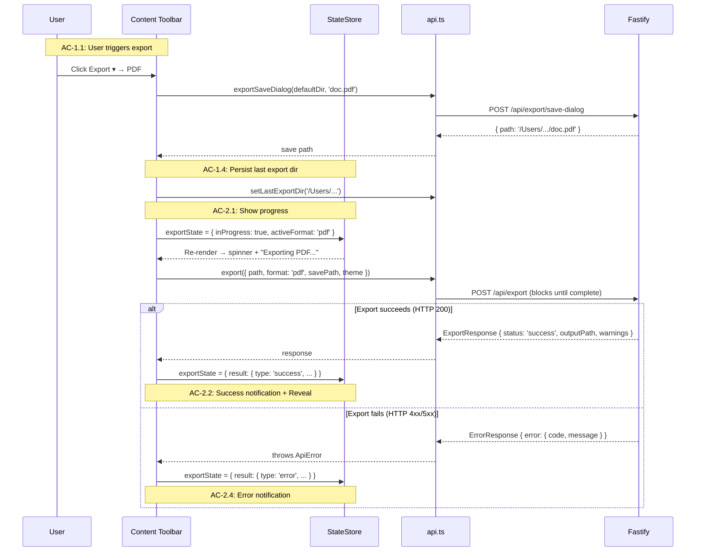

# Technical Design: Epic 4 — UI (Client)

**Parent:** [tech-design.md](tech-design.md)
**Companion:** [tech-design-api.md](tech-design-api.md) · [test-plan.md](test-plan.md)

This document covers the client-side additions for Epic 4: export dropdown activation (content toolbar + menu bar), progress indicator, success/warning/error notification with Reveal in Finder, keyboard shortcut, and client state extensions.

---

## Client State Extensions: `client/state.ts`

Epic 4 extends `ClientState` with export state tracking.

### Extended State Shape

```typescript
export interface ClientState {
  // All Epic 1–3 fields (unchanged)
  // ...

  // Epic 4 additions
  exportState: ExportState;
}

export interface ExportState {
  /** True when an export request is in flight */
  inProgress: boolean;

  /** The format being exported (while in progress) */
  activeFormat: 'pdf' | 'docx' | 'html' | null;

  /** Result of the last export (null until first export completes) */
  result: ExportResult | null;
}

export interface ExportResult {
  /** 'success' from server (HTTP 200), 'error' from client catch (HTTP error) */
  type: 'success' | 'error';
  outputPath?: string;
  warnings: ExportWarning[];
  error?: string;
  /** Timestamp for auto-dismiss logic */
  completedAt: string;
}
```

### Initial State

```typescript
exportState: {
  inProgress: false,
  activeFormat: null,
  result: null,
}
```

### Export State Lifecycle

```
User clicks Export → format selected → save dialog
    ↓
Save dialog confirmed:
  exportState = { inProgress: true, activeFormat: 'pdf', result: null }
    ↓
API response received:
  exportState = { inProgress: false, activeFormat: null, result: { ... } }
    ↓
User dismisses notification (or auto-dismiss after 10s for success):
  exportState = { inProgress: false, activeFormat: null, result: null }
```

---

## Export Dropdown Activation

### Content Toolbar: `client/components/content-toolbar.ts` (modification)

The Export dropdown transitions from Epic 2's disabled state to fully functional.

**Epic 2 state (before):**
```
.export-dropdown
└── button  "Export ▾"
    └── .dropdown
        ├── .dropdown__item.dropdown__item--disabled  "PDF (coming soon)"
        ├── .dropdown__item.dropdown__item--disabled  "DOCX (coming soon)"
        └── .dropdown__item.dropdown__item--disabled  "HTML (coming soon)"
```

**Epic 4 state (after):**
```
.export-dropdown
└── button  "Export ▾"
    └── .dropdown
        ├── .dropdown__item  "PDF"
        ├── .dropdown__item  "DOCX"
        └── .dropdown__item  "HTML"
```

**Activation logic:**

```typescript
function renderExportDropdown(state: ClientState): void {
  const activeTab = state.tabs.find(t => t.id === state.activeTabId);
  const canExport = activeTab && activeTab.status === 'ok' && !state.exportState.inProgress;

  // Enable/disable items based on state
  for (const item of dropdownItems) {
    if (canExport) {
      item.classList.remove('dropdown__item--disabled');
      item.removeAttribute('aria-disabled');
    } else {
      item.classList.add('dropdown__item--disabled');
      item.setAttribute('aria-disabled', 'true');
    }
  }
}
```

**Disabled conditions (TC-1.1c, TC-1.1d):**
- No document open → disabled (empty state)
- Active tab has `status: 'deleted'` → disabled (file doesn't exist on disk, A5)
- Export already in progress → disabled (concurrent prevention, TC-7.1c)

**Enabled conditions (TC-1.1a, TC-1.1f):**
- Document is open with `status: 'ok'` → enabled
- File opened outside root → enabled (export operates on the file, not the root)

**Click handler:**

```typescript
async function handleExportClick(format: ExportFormat): Promise<void> {
  const { tabs, activeTabId, session } = store.get();
  const activeTab = tabs.find(t => t.id === activeTabId);
  if (!activeTab || activeTab.status !== 'ok') return;

  // Determine default directory (browser-safe — no Node path module)
  const lastSlash = activeTab.path.lastIndexOf('/');
  const sourceDir = activeTab.path.slice(0, lastSlash);
  const defaultDir = session.lastExportDir || sourceDir;

  // Determine default filename
  const sourceFilename = activeTab.path.slice(lastSlash + 1);
  const dotIndex = sourceFilename.lastIndexOf('.');
  const baseName = dotIndex > 0 ? sourceFilename.slice(0, dotIndex) : sourceFilename;
  const defaultFilename = `${baseName}.${format}`;

  // Open save dialog
  const result = await api.exportSaveDialog(defaultDir, defaultFilename);
  if (!result) return;  // User cancelled (TC-1.3a)

  // Update last-used export directory (browser-safe)
  const saveDir = result.path.slice(0, result.path.lastIndexOf('/'));
  await api.setLastExportDir(saveDir);

  // Start export
  store.update({
    exportState: { inProgress: true, activeFormat: format, result: null },
  }, ['exportState']);

  try {
    // HTTP 200 = success (possibly with warnings)
    const response = await api.export({
      path: activeTab.path,
      format,
      savePath: result.path,
      theme: store.get().session.theme,
    });

    store.update({
      exportState: {
        inProgress: false,
        activeFormat: null,
        result: {
          type: 'success',
          outputPath: response.outputPath,
          warnings: response.warnings,
          completedAt: new Date().toISOString(),
        },
      },
    }, ['exportState']);
  } catch (err) {
    // HTTP 4xx/5xx = failure (ApiError from api.ts)
    store.update({
      exportState: {
        inProgress: false,
        activeFormat: null,
        result: {
          type: 'error',
          warnings: [],
          error: err instanceof ApiError ? err.message : 'Export failed',
          completedAt: new Date().toISOString(),
        },
      },
    }, ['exportState']);
  }
}
```

**AC Coverage:** AC-1.1 (dropdown activation), AC-1.2 (save dialog defaults), AC-1.3 (cancel), AC-1.4 (directory persistence).

### Menu Bar Export Menu: `client/components/menu-bar.ts` (modification)

The Export menu in the menu bar follows the same activation pattern. Items transition from disabled (Epics 1–2) to enabled when a document is open.

The menu items call the same `handleExportClick()` function as the content toolbar dropdown.

**AC Coverage:** AC-1.1b (menu bar Export menu).

---

## Export Progress Indicator: `client/components/export-progress.ts`

Visible during export, replacing the Export button area in the content toolbar.

### Structure

```
.export-progress (visible when exportState.inProgress)
├── .export-progress__spinner
└── .export-progress__label  "Exporting PDF..."
```

### Behavior

When `exportState.inProgress` is true, the Export dropdown button is replaced by the progress indicator. The spinner uses the same CSS animation as the tab loading spinner from Epic 2.

The label shows the active format: "Exporting PDF...", "Exporting DOCX...", or "Exporting HTML...".

**UI remains responsive (TC-2.1b):** The export runs on the server. The client's HTTP request blocks, but the browser's event loop is not blocked — the user can switch tabs, scroll, toggle the sidebar. The progress indicator is rendered before the `fetch()` call starts and removed when it resolves.

**AC Coverage:** AC-2.1 (progress indicator).

---

## Export Result Notification: `client/components/export-result.ts`

Appears after export completes — success, degraded, or error.

### Structure: Success

```
.export-result.export-result--success
├── .export-result__icon  ✓
├── .export-result__message  "Exported to architecture.pdf"
├── .export-result__path  "/Users/.../architecture.pdf" (truncated, full on hover)
├── button.export-result__reveal  "Reveal in Finder"
└── button.export-result__dismiss  ✕
```

### Structure: Degraded (success with warnings)

```
.export-result.export-result--degraded
├── .export-result__icon  ⚠
├── .export-result__message  "Exported with 3 warnings"
├── .export-result__path  "/Users/.../architecture.pdf"
├── .export-result__warnings (expandable)
│   ├── .export-result__warning  "Missing image: ./images/diagram.png — placeholder included"
│   ├── .export-result__warning  "Mermaid error: Syntax error on line 3"
│   └── .export-result__warning  "Format degradation: <details> expanded in PDF"
├── button.export-result__reveal  "Reveal in Finder"
└── button.export-result__dismiss  ✕
```

### Structure: Error

```
.export-result.export-result--error
├── .export-result__icon  ✕
├── .export-result__message  "Export failed"
├── .export-result__error  "Cannot write to /path — permission denied"
└── button.export-result__dismiss  ✕
```

### Behavior

**Positioning:** The notification appears as a banner at the top of the content area, pushing content down. Same pattern as Epic 1's error notification.

**Auto-dismiss:** Success notifications (no warnings) auto-dismiss after 10 seconds. Degraded and error notifications persist until manually dismissed.

**Reveal in Finder (TC-2.2b):** Calls `api.reveal(outputPath)`, which triggers `open -R` on the server.

**Dismiss (TC-2.2c):** Clicking ✕ sets `exportState.result = null`.

**Warning expansion (TC-2.3b):** The warnings section is collapsed by default. Clicking "3 warnings" expands the list.

**AC Coverage:** AC-2.2 (success notification), AC-2.3 (degraded warnings), AC-2.4 (error feedback).

---

## Sequence Diagram: Export User Flow



## Menu Bar Export Activation: `client/components/menu-bar.ts`

The Export menu in the menu bar transitions from Epic 1's disabled state to functional. The activation logic mirrors the content toolbar dropdown — same `canExport` check, same `handleExportClick()` handler.

**Epic 1 state (before):**
```
.menu-item[data-menu="export"]
└── .menu-item__dropdown
    ├── .menu-action.menu-action--disabled  "PDF"
    ├── .menu-action.menu-action--disabled  "DOCX"
    └── .menu-action.menu-action--disabled  "HTML"
```

**Epic 4 state (after):**
```
.menu-item[data-menu="export"]
└── .menu-item__dropdown
    ├── .menu-action  "PDF"     → handleExportClick('pdf')
    ├── .menu-action  "DOCX"   → handleExportClick('docx')
    └── .menu-action  "HTML"   → handleExportClick('html')
```

When `canExport` is false (no document, deleted file, export in progress), items revert to the disabled pattern with `aria-disabled="true"`.

**AC Coverage:** AC-1.1b (menu bar Export menu).

## Bootstrap Extension: `client/app.ts`

No new bootstrap steps for Epic 4. The export components (`ExportProgress`, `ExportResult`) are instantiated by the router during setup. The `exportState` initial value is set when `ClientState` is initialized. The `lastExportDir` is loaded from the session bootstrap response (which already includes all session fields).

The keyboard shortcut (Cmd+Shift+E) is registered alongside Epic 1-3 shortcuts during the existing keyboard setup step.

---

## Keyboard Shortcut: `client/utils/keyboard.ts` (extension)

### New Shortcut (Epic 4)

| Key | Action | AC |
|-----|--------|-----|
| Cmd+Shift+E | Open Export dropdown | AC-1.5 |

When pressed, the Export dropdown opens in the content toolbar (same as clicking "Export ▾"). If no document is open, the shortcut is a no-op.

```typescript
keyboard.register({
  key: 'e',
  meta: true,
  shift: true,
  description: 'Export',
  action: () => {
    const { tabs, activeTabId } = store.get();
    const activeTab = tabs.find(t => t.id === activeTabId);
    if (activeTab && activeTab.status === 'ok') {
      toggleExportDropdown();
    }
  },
});
```

**AC Coverage:** AC-1.5 (export keyboard shortcut).

---

## API Client Extensions: `client/api.ts`

New methods added to the `api` object:

```typescript
export const api = {
  // ... all Epic 1–3 methods ...

  export: (request: ExportRequest) =>
    request<ExportResponse>('POST', '/api/export', request),

  exportSaveDialog: (defaultPath: string, defaultFilename: string) =>
    request<{ path: string } | null>('POST', '/api/export/save-dialog', { defaultPath, defaultFilename }),

  reveal: (filePath: string) =>
    request<{ ok: true }>('POST', '/api/export/reveal', { path: filePath }),

  setLastExportDir: (dir: string) =>
    request<SessionState>('PUT', '/api/session/last-export-dir', { path: dir }),
};
```

The `export` method has an extended timeout (120s) since exports can take up to 30s:

```typescript
export: (req: ExportRequest) =>
  request<ExportResponse>('POST', '/api/export', req, { timeout: 120_000 }),
```

---

## State Subscription Wiring: `client/app.ts`

Export components subscribe to state changes during app bootstrap, alongside Epic 1–3 subscriptions:

```typescript
const exportProgress = new ExportProgress(/* mount point */);
const exportResult = new ExportResult(/* mount point */);

store.subscribe((state, changed) => {
  // ... all Epic 1–3 subscriptions unchanged ...

  if (changed.includes('exportState')) {
    contentToolbar.render(state);   // Update Export button enabled/disabled + progress
    exportProgress.render(state);
    exportResult.render(state);
  }
});
```

---

## CSS: `client/styles/export.css`

```css
/* Export progress indicator */
.export-progress {
  display: flex;
  align-items: center;
  gap: 8px;
  color: var(--color-text-secondary);
  font-size: 0.85em;
}

.export-progress__spinner {
  width: 14px;
  height: 14px;
  border: 2px solid var(--color-text-muted);
  border-top-color: transparent;
  border-radius: 50%;
  animation: spin 0.6s linear infinite;
}

/* Export result notification */
.export-result {
  padding: 10px 16px;
  border-bottom: 1px solid var(--color-border);
  display: flex;
  align-items: flex-start;
  gap: 10px;
  font-size: 0.9em;
}

.export-result--success {
  background: var(--color-bg-secondary);
  border-left: 3px solid var(--color-success);
}

.export-result--degraded {
  background: var(--color-bg-secondary);
  border-left: 3px solid var(--color-warning);
}

.export-result--error {
  background: var(--color-bg-secondary);
  border-left: 3px solid var(--color-error);
}

.export-result__path {
  color: var(--color-text-secondary);
  font-size: 0.85em;
  direction: rtl;
  text-overflow: ellipsis;
  overflow: hidden;
  white-space: nowrap;
  text-align: left;
  unicode-bidi: plaintext;
  max-width: 400px;
}

.export-result__reveal {
  color: var(--color-accent);
  cursor: pointer;
  border: none;
  background: none;
  font-size: 0.85em;
  padding: 0;
}

.export-result__reveal:hover {
  text-decoration: underline;
}

.export-result__dismiss {
  margin-left: auto;
  cursor: pointer;
  color: var(--color-text-muted);
  border: none;
  background: none;
}

.export-result__warnings {
  margin-top: 6px;
  font-size: 0.85em;
  color: var(--color-text-secondary);
}

.export-result__warning {
  padding: 2px 0;
}
```

All styles reference `var(--color-*)` for theme compatibility. The path display uses the same RTL-truncation technique as the menu bar file path from Epic 2.

---

## Self-Review Checklist (UI)

- [x] Client state extends cleanly from Epics 1–3 — no breaking changes
- [x] Export dropdown activates from disabled (Epics 1–2) to enabled (Epic 4)
- [x] Disabled conditions: no document, deleted file, export in progress
- [x] Save dialog defaults: source dir or last-used export dir, filename with target extension
- [x] Last-used export directory persisted via session API
- [x] Progress indicator replaces Export button during export
- [x] UI remains responsive during export (server-side processing)
- [x] Success notification shows path + Reveal in Finder
- [x] Degraded notification shows warning count with expandable detail
- [x] Error notification shows error message
- [x] Auto-dismiss for clean success (10s), persist for degraded/error
- [x] Cmd+Shift+E keyboard shortcut registered
- [x] All CSS references var(--color-*) for theme compatibility
- [x] API client extended with export methods + 120s timeout
