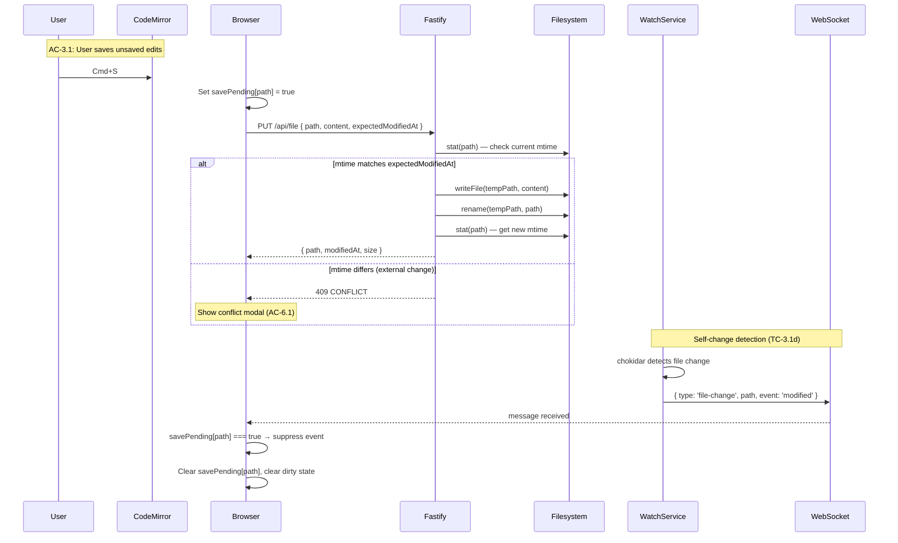
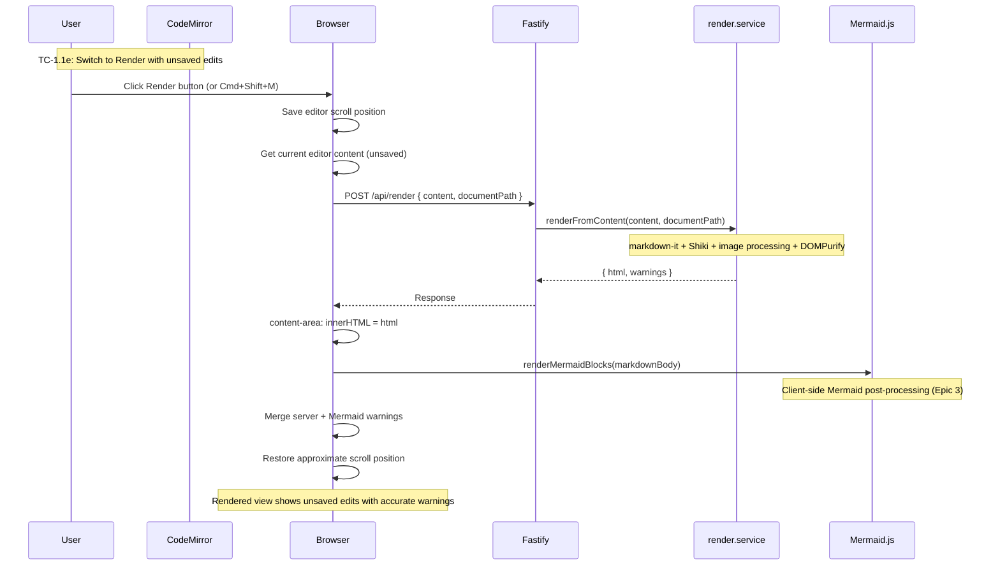
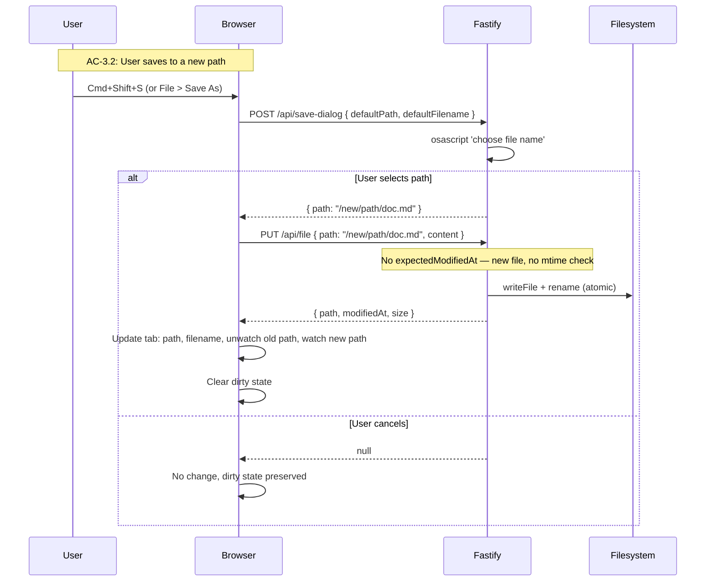
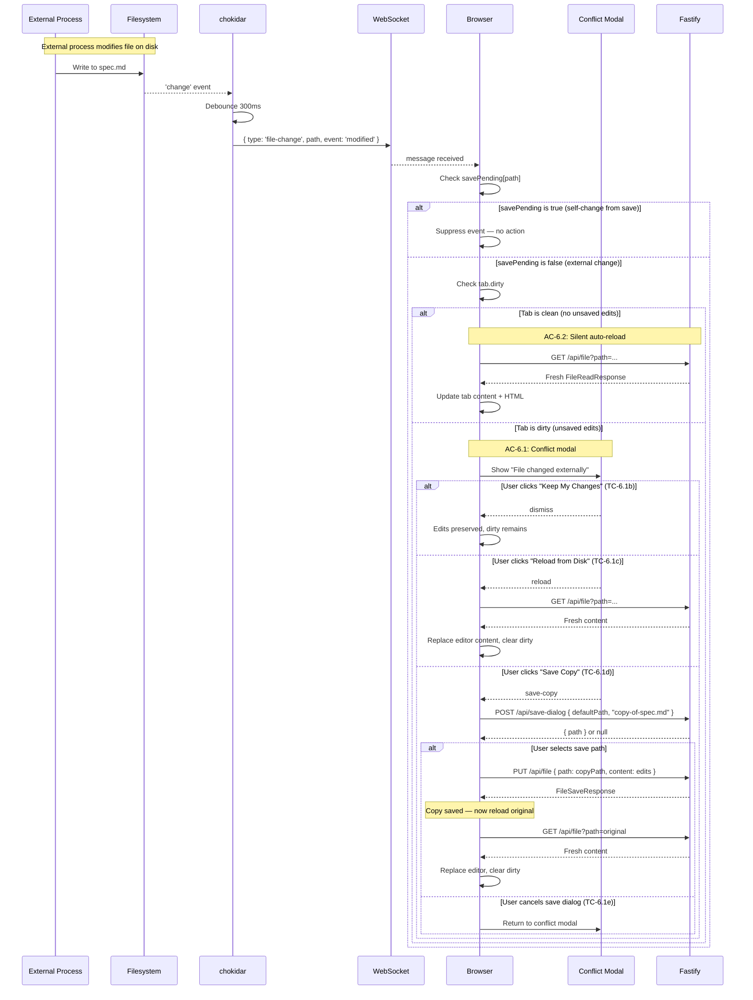

# Technical Design: Epic 5 — API (Server)

**Parent:** [tech-design.md](tech-design.md)
**Companion:** [tech-design-ui.md](tech-design-ui.md) · [test-plan.md](test-plan.md)

This document covers the server-side additions for Epic 5: file save endpoint (atomic write with optimistic concurrency), render-from-content endpoint, consolidated save dialog, and file service extensions.

---

## Schemas: New and Extended

### New Schemas

```typescript
// --- File Save ---

export const FileSaveRequestSchema = z.object({
  path: AbsolutePathSchema,
  content: z.string(),
  expectedModifiedAt: z.string().datetime().nullable().optional(),
  // null or omitted for Save As to a new path (no existing file to check).
  // ISO 8601 UTC string for save to an existing file (optimistic concurrency).
});

export const FileSaveResponseSchema = z.object({
  path: AbsolutePathSchema,
  modifiedAt: z.string().datetime(),
  size: z.number().int().nonneg(),
});

// --- Render from Content ---

export const RenderFromContentRequestSchema = z.object({
  content: z.string(),
  documentPath: AbsolutePathSchema,
  // documentPath is needed for:
  // 1. Resolving relative image paths during rendering
  // 2. Setting the correct dirname for processImages()
  // The file at this path is NOT read — only its directory is used.
});

export const RenderFromContentResponseSchema = z.object({
  html: z.string(),
  warnings: z.array(RenderWarningSchema),
});

// --- Consolidated Save Dialog ---
// Replaces Epic 4's /api/export/save-dialog and Epic 5's /api/file/save-dialog

export const SaveDialogRequestSchema = z.object({
  defaultPath: AbsolutePathSchema,
  defaultFilename: z.string(),
  prompt: z.string().optional(),  // defaults to "Save"
});

export const SaveDialogResponseSchema = z.object({
  path: AbsolutePathSchema,
}).nullable();

// --- Inferred Types ---

export type FileSaveRequest = z.infer<typeof FileSaveRequestSchema>;
export type FileSaveResponse = z.infer<typeof FileSaveResponseSchema>;
```

The `shared/types.ts` file adds `export type` re-exports for all new types, following the established pattern.

---

## File Service Extensions: `server/services/file.service.ts`

### writeFile — Atomic Write with Optimistic Concurrency

The file service gains a `writeFile` method that performs an atomic write with optional mtime validation. This is the server-side implementation of the `PUT /api/file` endpoint.

```typescript
export class FileService {
  // Existing: readFile (from Epic 2)

  async writeFile(request: {
    path: string;
    content: string;
    expectedModifiedAt?: string | null;
  }): Promise<FileSaveResponse> {
    const { path: filePath, content, expectedModifiedAt } = request;

    // 1. Validate path is absolute
    if (!path.isAbsolute(filePath)) {
      throw new InvalidPathError(filePath);
    }

    // 2. Validate markdown extension
    const ext = path.extname(filePath).toLowerCase();
    if (!MARKDOWN_EXTENSIONS.has(ext)) {
      throw new NotMarkdownError(filePath, ext);
    }

    // 3. Validate parent directory exists
    const dir = path.dirname(filePath);
    try {
      const dirStat = await fs.stat(dir);
      if (!dirStat.isDirectory()) {
        throw new PathNotFoundError(dir);
      }
    } catch (err) {
      if (isNotFoundError(err)) throw new PathNotFoundError(dir);
      throw err;
    }

    // 4. Optimistic concurrency check (if expectedModifiedAt provided)
    if (expectedModifiedAt) {
      try {
        const currentStat = await fs.stat(filePath);
        const currentMtime = currentStat.mtime.toISOString();
        if (currentMtime !== expectedModifiedAt) {
          throw new ConflictError(filePath, expectedModifiedAt, currentMtime);
        }
      } catch (err) {
        if (err instanceof ConflictError) throw err;
        // File doesn't exist — that's also a conflict if the client expected it to exist
        if (isNotFoundError(err) && expectedModifiedAt) {
          throw new ConflictError(filePath, expectedModifiedAt, 'file deleted');
        }
        throw err;
      }
    }

    // 5. Atomic write: temp file + rename
    const tempPath = path.join(dir, `.${path.basename(filePath)}.${Date.now()}.tmp`);
    try {
      await fs.writeFile(tempPath, content, 'utf-8');
      await fs.rename(tempPath, filePath);
    } catch (err) {
      // Cleanup temp file on failure
      try { await fs.unlink(tempPath); } catch { /* ignore */ }
      throw err;
    }

    // 6. Stat the written file for response
    const stat = await fs.stat(filePath);

    return {
      path: filePath,
      modifiedAt: stat.mtime.toISOString(),
      size: stat.size,
    };
  }
}
```

**Validation chain:** absolute path → markdown extension → parent directory exists → mtime check (if provided) → atomic write → return metadata.

**Atomic write pattern:** Same as Epic 1's session persistence — write to a temp file in the same directory, then rename. `fs.rename` is atomic on POSIX when source and destination are on the same filesystem. The temp file uses a dotfile prefix (hidden on macOS/Linux) and a timestamp suffix to avoid collisions.

**Optimistic concurrency (TC-3.1e):** The `expectedModifiedAt` field enables compare-and-swap semantics. When the client loads a file, it receives `modifiedAt` in the `FileReadResponse`. When saving, the client sends this value back. The server compares it against the file's current mtime. If they differ, the file was modified externally between load and save — the server returns 409 CONFLICT instead of overwriting.

For Save As to a new path, `expectedModifiedAt` is null/omitted — there's no existing file to check. If the file happens to already exist (overwrite case), the OS save dialog already prompted for confirmation. The server does not double-check — the user confirmed the overwrite in the dialog.

**AC Coverage:** AC-3.1 (save to disk), AC-3.2 (Save As), AC-3.3 (save errors), TC-3.1e (stale write detection).

---

## Render Endpoint Note

### No New Render Service Method Needed

The existing `renderService.render(content, documentPath)` method already accepts content as its first parameter — the file service reads from disk and passes content to the render method, not the other way around. The render service itself never reads from disk.

The `POST /api/render` route handler simply calls `renderService.render(body.content, body.documentPath)` — the same method that `GET /api/file` uses after reading from disk. No new service method, no code duplication.

The `viewingMd` MarkdownIt instance (established in Epic 4's render service extensions for dual-theme viewing mode) produces the same dual-theme HTML as the normal viewing path.

**Image resolution (TC-1.1e):** The `documentPath` parameter is required for resolving relative image paths. When the user edits `./images/diagram.png` in the source, the render service uses `path.dirname(documentPath)` to resolve the reference. The document path is the original file path — even though the content is unsaved, images are still relative to the file's location.

**AC Coverage:** AC-1.1e (render unsaved content when switching to Render mode).

---

## Route Handlers

### File Save Route: `server/routes/file.ts` (modification)

#### PUT /api/file

Saves content to a markdown file with atomic write and optimistic concurrency.

```typescript
app.put('/api/file', {
  schema: {
    body: FileSaveRequestSchema,
    response: {
      200: FileSaveResponseSchema,
      400: ErrorResponseSchema,
      403: ErrorResponseSchema,
      404: ErrorResponseSchema,
      409: ErrorResponseSchema,
      415: ErrorResponseSchema,
      500: ErrorResponseSchema,
      507: ErrorResponseSchema,
    },
  },
}, async (request, reply) => {
  try {
    return await fileService.writeFile(request.body);
  } catch (err) {
    if (err instanceof InvalidPathError) {
      return reply.code(400).send(toApiError('INVALID_PATH', err.message));
    }
    if (err instanceof NotMarkdownError) {
      return reply.code(415).send(toApiError('NOT_MARKDOWN', err.message));
    }
    if (err instanceof PathNotFoundError) {
      return reply.code(404).send(toApiError('PATH_NOT_FOUND', err.message));
    }
    if (err instanceof ConflictError) {
      return reply.code(409).send(toApiError('CONFLICT', err.message));
    }
    if (isPermissionError(err)) {
      return reply.code(403).send(toApiError('PERMISSION_DENIED', err.message));
    }
    if (isInsufficientStorageError(err)) {
      return reply.code(507).send(toApiError('INSUFFICIENT_STORAGE', err.message));
    }
    return reply.code(500).send(toApiError('WRITE_ERROR',
      err instanceof Error ? err.message : 'Failed to save file'));
  }
});
```

**Error classification follows the established service→route pattern:** The service throws typed errors, the route catches and maps them to HTTP status codes. The `ConflictError` is new for Epic 5 — it maps to 409.

**AC Coverage:** AC-3.1 (save), AC-3.2 (save as — same endpoint, different path), AC-3.3 (save errors).

### Render from Content Route: `server/routes/render.ts`

#### POST /api/render

Renders provided markdown content and returns HTML + warnings. Used when switching from Edit to Render mode with unsaved edits.

```typescript
app.post('/api/render', {
  schema: {
    body: RenderFromContentRequestSchema,
    response: {
      200: RenderFromContentResponseSchema,
    },
  },
}, async (request) => {
  const { content, documentPath } = request.body;
  // Calls the EXISTING render() method — same pipeline as GET /api/file,
  // but content comes from the request body instead of from disk.
  const result = renderService.render(content, documentPath);
  return { html: result.html, warnings: result.warnings };
});
```

This is a lightweight endpoint — no disk I/O, no file validation, no mtime checks. The render service processes the content in-memory and returns the result. For localhost, this completes in <50ms for typical documents.

**Security note:** The `documentPath` is used only for resolving relative image paths (via `path.dirname()`). No file at that path is read. The path is validated as absolute by the Zod schema.

**AC Coverage:** AC-1.1e (render unsaved edits in Render mode).

### Consolidated Save Dialog Route: `server/routes/save-dialog.ts`

#### POST /api/save-dialog

Consolidates Epic 4's `/api/export/save-dialog` and Epic 5's file save dialog into a single endpoint.

```typescript
app.post('/api/save-dialog', {
  schema: {
    body: SaveDialogRequestSchema,
    response: { 200: SaveDialogResponseSchema },
  },
}, async (request) => {
  const { defaultPath, defaultFilename, prompt } = request.body;
  const selected = await openSaveDialog(defaultPath, defaultFilename, prompt ?? 'Save');
  return selected ? { path: selected } : null;
});
```

The `openSaveDialog` function is extracted from Epic 4's implementation:

```typescript
async function openSaveDialog(
  defaultDir: string,
  defaultName: string,
  prompt: string,
): Promise<string | null> {
  return new Promise((resolve, reject) => {
    const script = `POSIX path of (choose file name ` +
      `with prompt ${JSON.stringify(prompt)} ` +
      `default name ${JSON.stringify(defaultName)} ` +
      `default location POSIX file ${JSON.stringify(defaultDir)})`;

    execFile('osascript', ['-e', script], { timeout: 60_000 }, (error, stdout) => {
      if (error) {
        if ((error as { code?: number }).code === 1) return resolve(null);
        return reject(error);
      }
      resolve(stdout.trim());
    });
  });
}
```

**Migration note:** Epic 4's `/api/export/save-dialog` should be updated to call this consolidated endpoint (or aliased). Since Epic 4 is not yet shipped, the update is non-breaking — modify the export route to use the shared `openSaveDialog` function.

**AC Coverage:** AC-3.2a (Save As dialog).

---

## Error Classes

New error classes for Epic 5:

```typescript
// server/utils/errors.ts (additions)

export class ConflictError extends Error {
  constructor(path: string, expected: string, actual: string) {
    super(
      `File has been modified externally. Expected mtime: ${expected}, actual: ${actual}. Path: ${path}`
    );
    this.expected = expected;
    this.actual = actual;
  }
  readonly expected: string;
  readonly actual: string;
}

export class PathNotFoundError extends Error {
  constructor(path: string) {
    super(`Parent directory does not exist: ${path}`);
  }
}
```

`PathNotFoundError` is distinct from the existing `isNotFoundError` (ENOENT) because it specifically indicates the parent directory is missing, which maps to 404 PATH_NOT_FOUND in the save context (the file itself doesn't need to exist for Save As, but its parent directory does).

---

## Sequence Diagrams

### Flow: Save (AC-3.1)



### Flow: Render Unsaved Content (TC-1.1e)



### Flow: Save As (AC-3.2)



---

## Session Extension: defaultOpenMode Validation

Epic 2's `SetDefaultModeRequestSchema` restricts the mode to `"render"` only:

```typescript
// Epic 2 (before):
export const SetDefaultModeRequestSchema = z.object({
  mode: z.enum(['render']),
});

// Epic 5 (after):
export const SetDefaultModeRequestSchema = z.object({
  mode: z.enum(['render', 'edit']),
});
```

This is a one-line schema change in `server/schemas/index.ts`. The `PUT /api/session/default-mode` route handler and `sessionService.setDefaultMode()` require no other changes — they already store whatever validated value is received.

**AC Coverage:** AC-7.1a (Edit option enabled in "Opens in" picker).

---

## Sequence Diagram: External Change Conflict Resolution (AC-6.1)



---

## Self-Review Checklist (API)

- [x] File save endpoint with full validation chain: path → extension → parent dir → mtime check → atomic write
- [x] Optimistic concurrency via expectedModifiedAt with 409 CONFLICT
- [x] Render-from-content endpoint for unsaved edit preview (no disk read)
- [x] Save dialog consolidated from Epic 4 (shared osascript function)
- [x] Atomic write uses temp file + rename pattern (same as Epic 1 session)
- [x] All new error classes map to HTTP status codes
- [x] Sequence diagrams cover save, render-unsaved, and save-as flows
- [x] Self-change detection is client-side (savePending flag), not server-side
- [x] Security: documentPath in render endpoint used only for dirname, no file read
- [x] POST /api/render calls existing renderService.render() — no new service method
- [x] defaultOpenMode validation updated from ['render'] to ['render', 'edit']
- [x] Conflict resolution sequence diagram covers all three user choices + edge cases
