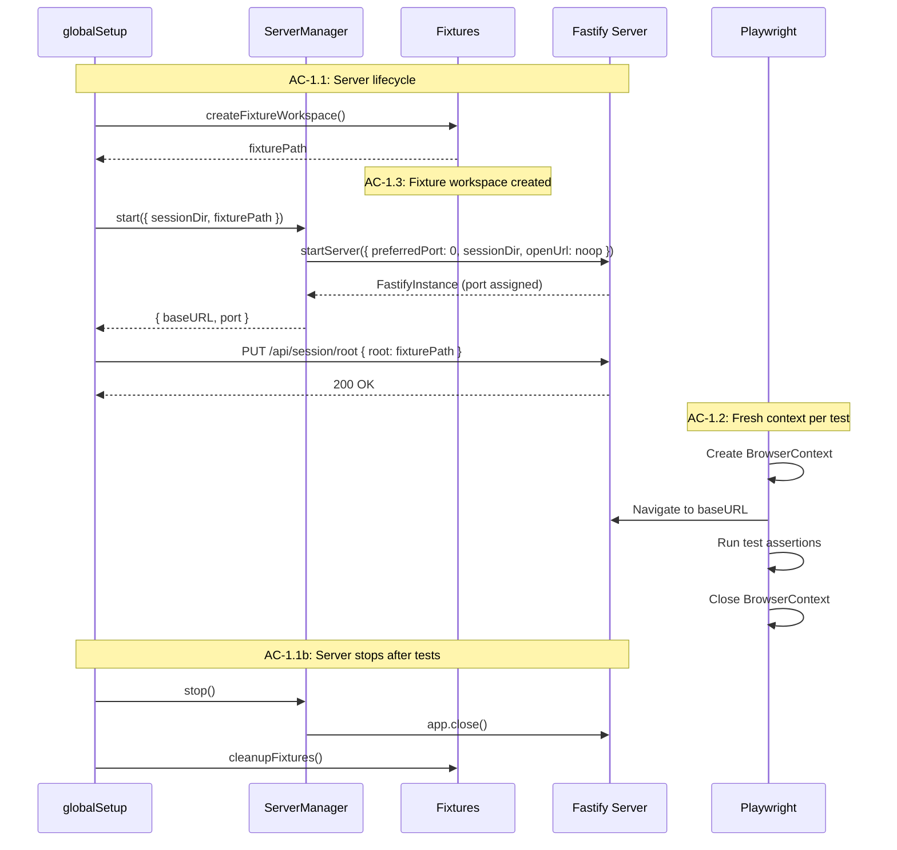
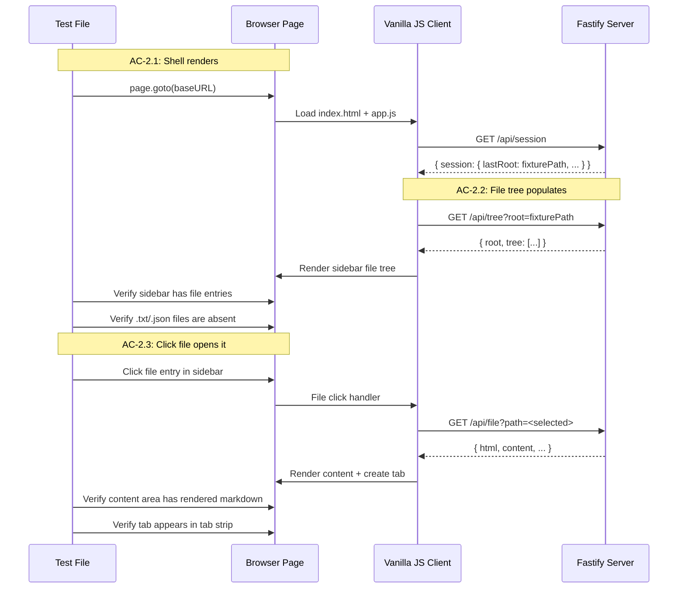
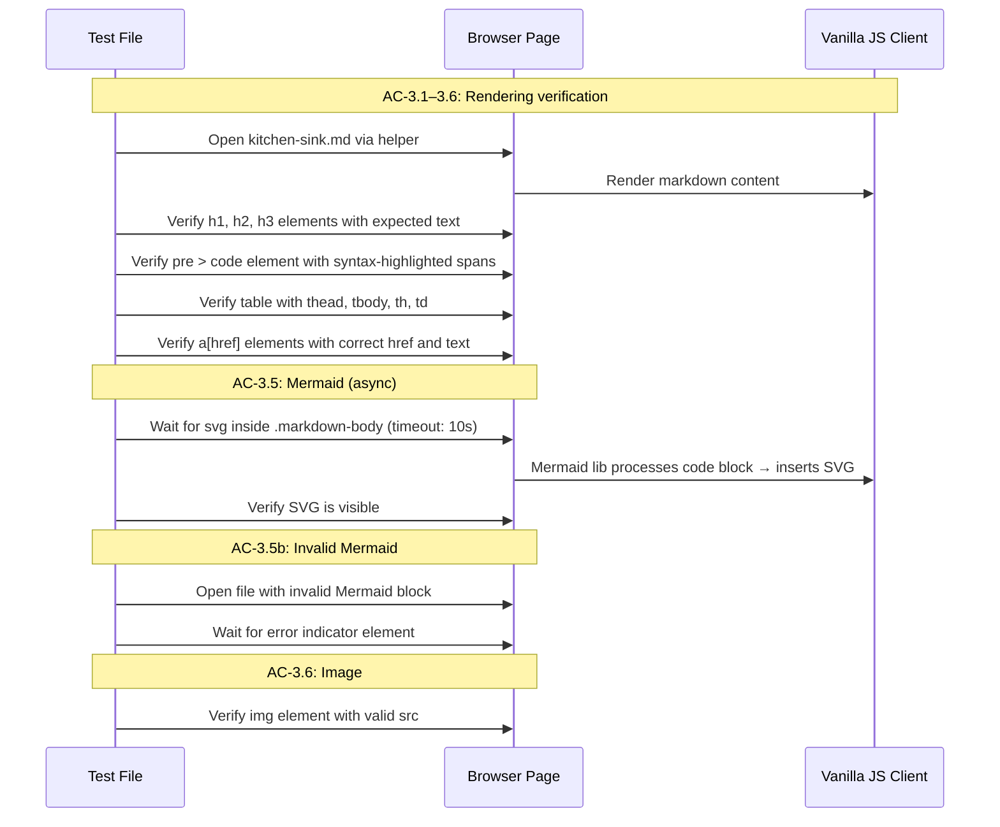
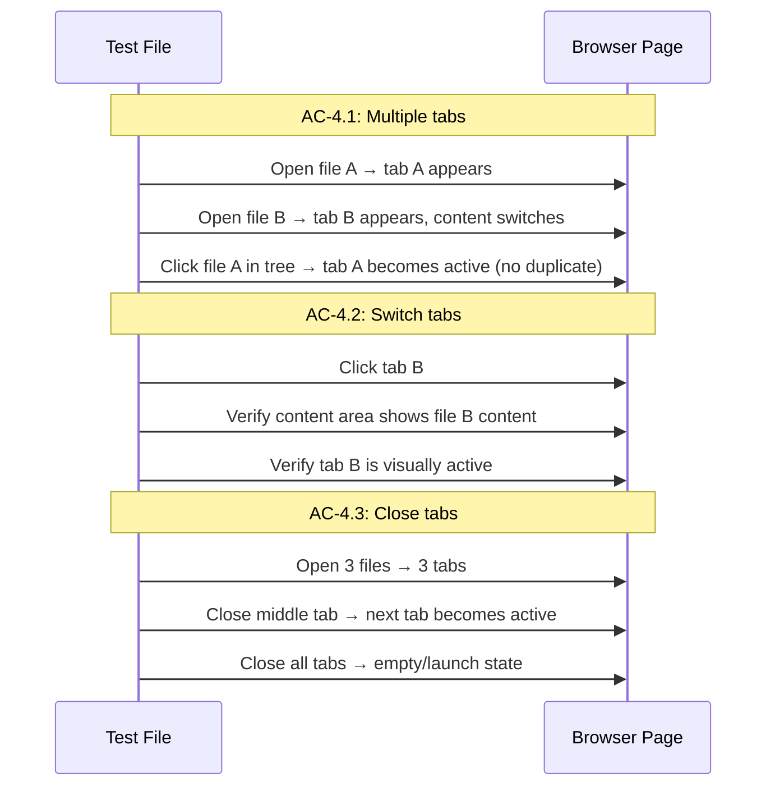
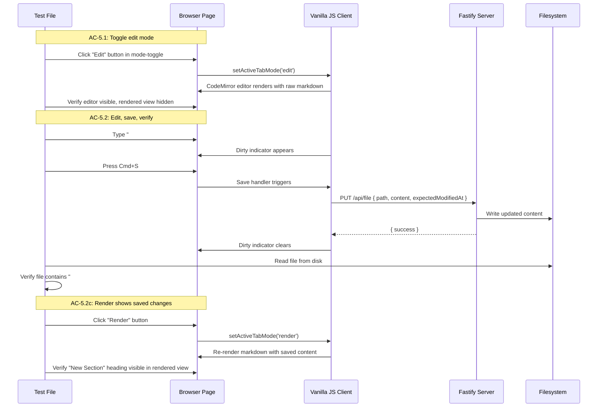
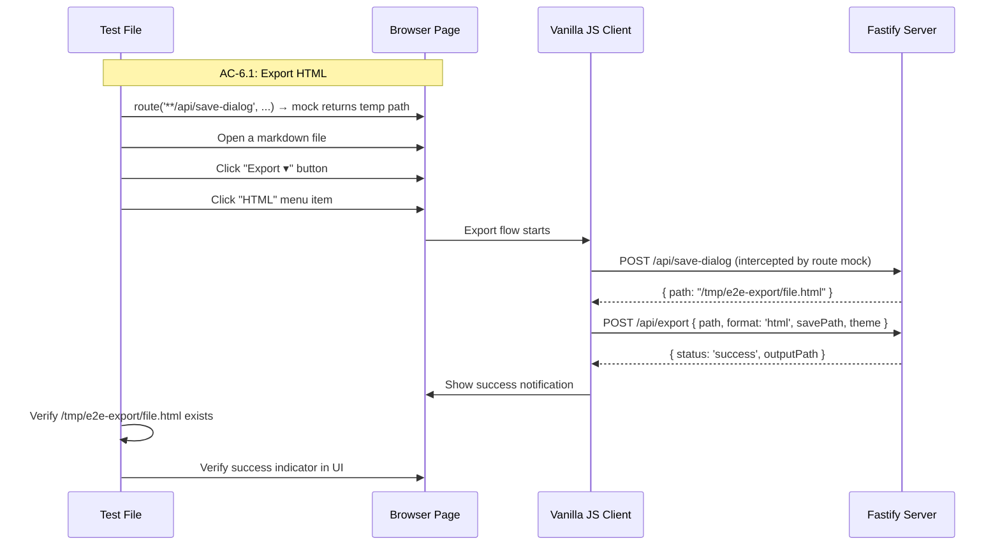
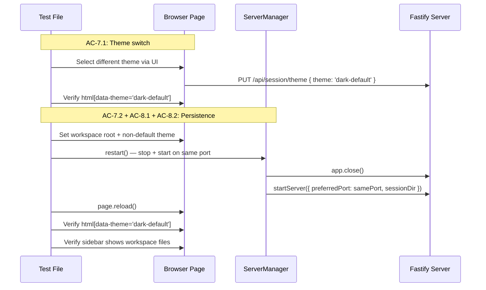
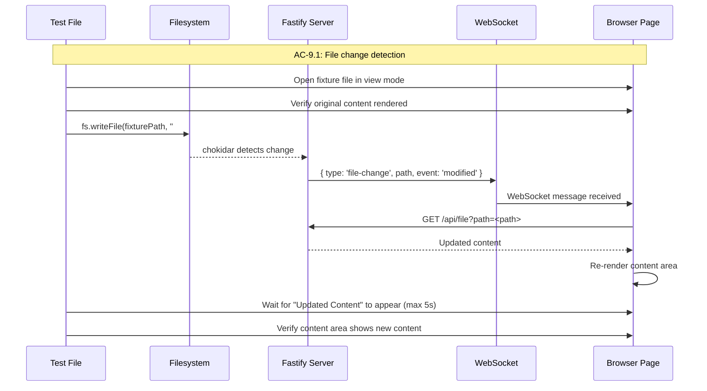

# Technical Design: E2E Testing Framework

## Purpose

This document translates the Epic 7 requirements into implementable architecture for the E2E testing framework. It serves three audiences:

| Audience | Value |
|----------|-------|
| Reviewers | Validate design before code is written |
| Developers | Clear blueprint for implementation |
| Story Tech Sections | Source of implementation targets, interfaces, and test mappings |

**Prerequisite:** Epic 7 is complete with 27 ACs and full TC coverage.

---

## Spec Validation

The Epic 7 spec was validated before design. All ACs map to implementation work, scope boundaries are clear, and the story breakdown covers all ACs.

**Validation Checklist:**
- [x] Every AC maps to clear implementation work
- [x] Data contracts noted as not applicable (tests exercise existing v1 API surface)
- [x] Edge cases have TCs, not just happy path
- [x] No technical constraints the BA missed
- [x] Flows make sense from implementation perspective

**Issues Found:**

| Issue | Spec Location | Recommendation | Status |
|-------|---------------|----------------|--------|
| Export save dialog is native (osascript) — untestable by Playwright | AC-6.1, TC-6.1a | Intercept download or use API-level trigger. Epic already scopes to "at least one format" (HTML). | Resolved in design |
| Workspace root selection uses native folder picker | AC-2.2, TC-2.2a | Use `PUT /api/session/root` API directly — bypasses osascript dialog. Spec says "set as the root" — doesn't mandate UI interaction. | Resolved in design |
| TC-1.4c specifies `npm run verify` includes E2E, but E2E tests are the deliverable for this epic — not validation of separate code | TC-1.4c | E2E tests added to `verify-all`, not `verify`. During Epic 7 implementation, the standard `verify` gate validates the test infrastructure code being written; `verify-all` includes the E2E tests themselves. Post-Epic 7, `verify-all` becomes the comprehensive gate that future epics run. | Deliberate deviation |

No blocking issues. The epic is clean and designable.

### Tech Design Questions — Answer Locations

The epic raised 11 questions for the Tech Lead. Each is answered in the design section where the decision naturally arises:

| Question | Answer Location |
|----------|----------------|
| Q1: Server start method | System Context, paragraphs 2–3 (programmatic `startServer()`) |
| Q2: Workspace root selection | Context, paragraph 6; Flow 2 prose |
| Q3: Playwright configuration | Low Altitude: `playwright.config.ts` |
| Q4: Single server vs fresh per file | System Context, paragraph 3 |
| Q5: Export file save dialog | Flow 6: Export (route mock strategy) |
| Q6: Mermaid rendering waits | Context, paragraph 6; Flow 3 prose |
| Q7: Project structure | Module Architecture (file tree + responsibility matrix) |
| Q8: Server restart for persistence | System Context, paragraph 4; Flow 7–8 |
| Q9: Serial vs parallel | System Context, paragraph 3; `playwright.config.ts` |
| Q10: Debug script | Testing Strategy: Debug Workflow |
| Q11: Browser console monitoring | Testing Strategy: Browser Console Monitoring |

---

## Context

MD Viewer is a local-first markdown workspace that grew through 6 epics to deliver workspace browsing, file tree navigation, rendering (markdown, Mermaid, syntax highlighting), tab management, editing, export (PDF, DOCX, HTML), theme switching, and session persistence. The app is a single Fastify process serving a vanilla HTML/CSS/JS frontend — no React, no Vue, no build-time framework. The vanilla JS stack means there are no component-testing shortcuts (no React Testing Library, no Svelte test utilities) — E2E tests interact with real DOM elements in a real browser.

v2 is about to add significant new capabilities: markdown packages, a streaming chat interface, and agent orchestration. Before adding that complexity, the v1 surface needs E2E test coverage. Manual regression testing is unsustainable — each new epic touches the same UI surface and could break existing functionality. This epic is Milestone 0 (M0: Test Foundation) in the v2 roadmap — the first thing built before any new features.

This epic establishes the E2E testing framework and covers the critical v1 user paths. The framework, patterns, and conventions established here will be extended by every subsequent epic (8–14). Getting the infrastructure right matters: poor patterns in Epic 7 create friction in every downstream epic. The design makes deliberate choices about server lifecycle, fixture management, and helper abstractions that future epics inherit without modification.

The testing stack is `@playwright/test@^1.58.0` (v1.58.2, the latest stable as of March 2026) on top of the existing Vitest ^4.0.0 suite. Playwright drives a real Chromium browser against the running Fastify server, exercising the full stack end-to-end. The existing ~70 Vitest tests (unit + integration) continue unchanged — Vitest config includes only `tests/**/*.test.ts`, Playwright uses `*.spec.ts`, and the two suites run via separate npm scripts (`npm run test` for Vitest, `npm run test:e2e` for Playwright). There are no dependency conflicts: Playwright's browser binaries store in `~/.cache/ms-playwright/`, completely separate from Puppeteer's `~/.cache/puppeteer/` (Puppeteer ^24.40.0 is used for PDF export and remains untouched).

Playwright was selected after evaluating the full 2026 E2E landscape (documented in `.research/outputs/e2e-testing-landscape-2026.md`). The key differentiator: native WebSocket testing support (`page.routeWebSocket()`, stable since v1.48) directly supports this project's file-watching tests now and streaming chat tests in future epics. Cypress, the nearest competitor, has no native WebSocket support. Playwright also provides built-in API testing via `APIRequestContext`, parallel execution without a paid tier, and an HTML report with trace viewer for debugging CI failures. The project installs Chromium only (~281MB) — Firefox and WebKit can be added later if cross-browser issues arise.

Two aspects of the v1 surface constrain the E2E design. First, several interactions involve native macOS dialogs spawned via osascript: the folder picker (`POST /api/browse`), the file picker (`POST /api/file/pick`), and the save dialog (`POST /api/save-dialog`). Playwright cannot interact with system-level dialogs, so E2E tests bypass them — workspace root is set via `PUT /api/session/root`, and the export save dialog is mocked via `page.route()`. Second, Mermaid diagram rendering is asynchronous (the library initializes, parses, and inserts SVG), so rendering tests need explicit wait strategies using Playwright's auto-waiting locators rather than fixed timeouts.

---

## High Altitude: System View

### System Context

The E2E test framework sits outside the application, driving it through the same interfaces a real user would: HTTP requests and browser interactions. The test process manages the server lifecycle and provides fixture data.

```
┌─────────────────────────────────────────────────┐
│ Playwright Test Process                         │
│                                                 │
│  ┌───────────────────────────────────────────┐  │
│  │ Global Setup                              │  │
│  │  - Create temp dirs (session, fixtures)   │  │
│  │  - Write fixture markdown files           │  │
│  │  - Start Fastify server (port 0)          │  │
│  │  - Set workspace root via API             │  │
│  │  - Export baseURL for tests               │  │
│  └───────────────────────────────────────────┘  │
│                                                 │
│  ┌───────────────────────────────────────────┐  │
│  │ Test Files (*.spec.ts)                    │  │
│  │  - Fresh browser context per test         │  │
│  │  - Navigate to baseURL                    │  │
│  │  - Interact via Playwright API            │  │
│  │  - Assert on DOM state                    │  │
│  └───────────────────────────────────────────┘  │
│                                                 │
│  ┌───────────────────────────────────────────┐  │
│  │ Global Teardown                           │  │
│  │  - Stop Fastify server                    │  │
│  │  - Remove temp directories                │  │
│  └───────────────────────────────────────────┘  │
└──────────────────┬──────────────────────────────┘
                   │
                   │ HTTP + WebSocket (localhost:random)
                   │
┌──────────────────┴──────────────────────────────┐
│ Fastify Server (real instance)                  │
│                                                 │
│  REST API    WebSocket    Static Files          │
│  /api/*      /ws          /index.html, /app.js  │
│                                                 │
│  Session: temp dir    Workspace: fixture dir    │
└─────────────────────────────────────────────────┘
```

The server starts programmatically via the existing `startServer()` function from `src/server/index.ts`, not via Playwright's `webServer` command-line config. `startServer()` already accepts `preferredPort` (set to `0` for a random available port), `sessionDir` (pointed at a temp directory for isolation), and `openUrl` (set to a no-op to suppress browser launch). This approach tests the real server startup path — `buildApp()` + `listen()` — while giving the test harness direct control over lifecycle, port discovery, and most importantly mid-test server restart for session persistence tests (AC-8.1, AC-8.2). Playwright's `webServer` config launches a shell command and polls for readiness, which would lose this programmatic control.

All tests share a single server instance, started once in `globalSetup` and stopped in `globalTeardown`. Tests run serially (single Playwright worker) to avoid request interleaving against the shared server. The suite targets ~34 tests across 4 spec files — serial execution with I/O-bound tests comfortably fits within the 2-minute target. Browser context isolation (AC-1.2) is handled by Playwright's built-in mechanism: each test gets a fresh `BrowserContext` with clean cookies, localStorage, and navigation state. This isolates client-side state without needing separate server instances.

The persistence tests (Chunk 4) are the exception to the "single server for the whole suite" pattern. They programmatically stop and restart the server mid-test — maintaining the Playwright browser session while the server cycles — to verify that session state (workspace root, theme) survives a restart. The `ServerManager` class encapsulates this: `restart()` stops the Fastify instance, waits for the port to release, then starts a new instance on the same port with the same session directory. The browser simply reloads after the restart.

### External Contracts

The E2E tests interact with the app through its existing interfaces. No new APIs are created.

**Test Process → Server (HTTP):**

| Endpoint | Method | Purpose in E2E |
|----------|--------|----------------|
| `PUT /api/session/root` | PUT | Set workspace root to fixture directory |
| `PUT /api/session/theme` | PUT | Set theme for persistence tests |
| `GET /api/session` | GET | Verify session state after restart |
| `GET /api/tree?root=<path>` | GET | Verify tree population (implicit via UI) |
| `GET /api/file?path=<path>` | GET | Verify file content (implicit via UI) |
| `POST /api/export` | POST | Export triggered via UI flow |
| `POST /api/save-dialog` | POST | Intercepted/mocked in export tests |
| `PUT /api/file` | PUT | Save triggered via Cmd+S in editor |

**Test Process → Server (WebSocket):**

| Route | Messages | Purpose in E2E |
|-------|----------|----------------|
| `/ws` | `watch`/`unwatch`, `file-change` | File watching tests: write to disk, observe UI update |

**Browser → App (DOM Selectors):**

These are the primary selectors E2E tests use to interact with the app. They're stable because they're based on the app's structural IDs and semantic element roles, not implementation-specific class names.

| Selector | Element | Used For |
|----------|---------|----------|
| `#sidebar` | Aside | File tree container |
| `#tab-strip` | Div | Tab bar |
| `#content-area` | Div | Document content |
| `#menu-bar` | Header | Menu bar |
| `.tree-node__row[data-path]` | Div | File tree entry (click to open file); `data-path` holds absolute path |
| `.tree-node--file` | Div | File entry in tree (vs directory) |
| `.tree-node--directory` | Div | Directory entry in tree (click to expand) |
| `.tab[data-tab-id]` | Div | Individual tab; `.tab--active` for active tab |
| `.tab__label` | Span | Tab filename text |
| `.tab__close` | Button | Tab close button |
| `.tab__dirty-dot` | Span | Dirty indicator dot on tab |
| `.mode-toggle button` | Buttons | "Render" / "Edit" toggle |
| `.dirty-indicator` | Span | Unsaved changes indicator in content toolbar |
| `[data-export-trigger]` | Button | Export dropdown trigger |
| `.dropdown [role="menuitem"]` | Buttons | Export format options (text: `PDF`, `DOCX`, `HTML`) |
| `.menu-bar__item` | Buttons | Menu bar items including theme entries (text: `Theme: <name>`) |
| `[data-theme]` on `<html>` | Attribute | Current theme |
| `.markdown-body` | Div | Rendered markdown container |
| `h1`, `h2`, `h3` | Elements | Heading elements in rendered content |
| `pre code` | Elements | Code blocks in rendered content |
| `table` | Element | Tables in rendered content |
| `a[href]` | Elements | Links in rendered content |
| `svg` inside `.markdown-body` | Element | Mermaid diagram SVG |
| `img` | Element | Images in rendered content |

**Runtime Prerequisites:**

| Prerequisite | Where Needed | How to Verify |
|---|---|---|
| Node.js v25.x (or >=18) | Local + CI | `node --version` |
| `npm run build` (client + server built) | Before E2E | `ls app/dist/client/index.html` |
| Playwright Chromium browser | Local + CI | `npx playwright install chromium` |

---

## Medium Altitude: Module Architecture

The E2E testing infrastructure consists of configuration, lifecycle management, fixtures, helpers, and the test files themselves.

```
app/
├── playwright.config.ts              # NEW: Playwright configuration
├── vitest.config.ts                  # EXISTING: unchanged
├── package.json                      # MODIFIED: new scripts
├── .gitignore                        # MODIFIED: Playwright artifacts
└── tests/
    ├── e2e/                          # NEW: E2E test directory
    │   ├── global-setup.ts           # Server lifecycle + fixture setup
    │   ├── global-teardown.ts        # Server shutdown + cleanup
    │   ├── navigation.spec.ts        # Stories 0-1: shell, workspace, file tree
    │   ├── rendering.spec.ts         # Story 2: markdown rendering, Mermaid
    │   ├── interaction.spec.ts       # Story 3: tabs, editing, export
    │   └── persistence.spec.ts       # Story 4: theme, session, file watching
    ├── utils/
    │   ├── server.ts                 # EXISTING: createTestApp() — unchanged
    │   ├── dom.ts                    # EXISTING: jsdom helpers — unchanged
    │   └── e2e/                      # NEW: E2E-specific utilities
    │       ├── state.ts              # Shared state file (globalSetup ↔ test files)
    │       ├── server-manager.ts     # Server lifecycle management
    │       ├── fixtures.ts           # Fixture directory creation/cleanup
    │       └── helpers.ts            # Page interaction helpers
    └── fixtures/                     # EXISTING: Vitest fixtures — unchanged
```

### Module Responsibility Matrix

| Module | Type | Responsibility | ACs Covered |
|--------|------|----------------|-------------|
| `playwright.config.ts` | Config | Browser, timeout, reporter, globalSetup/Teardown config | AC-1.4 (script), AC-1.5 (failure output) |
| `global-setup.ts` | Lifecycle | Start server, create fixtures, set workspace root | AC-1.1 (server), AC-1.3 (fixtures) |
| `global-teardown.ts` | Lifecycle | Stop server, cleanup temp dirs | AC-1.1b, AC-1.3b |
| `server-manager.ts` | Utility | Server start/stop/restart, port management | AC-1.1, AC-8.1 (restart) |
| `fixtures.ts` | Utility | Create temp fixture workspace with markdown files | AC-1.3 |
| `helpers.ts` | Utility | Page helpers: open workspace, open file, wait for render | AC-10.1 |
| `navigation.spec.ts` | Test | Shell rendering, workspace browsing, file tree, file opening | AC-2.1, AC-2.2, AC-2.3 |
| `rendering.spec.ts` | Test | Headings, code blocks, tables, links, Mermaid, images | AC-3.1–AC-3.6 |
| `interaction.spec.ts` | Test | Tabs, edit mode, save, export | AC-4.1–AC-4.3, AC-5.1–AC-5.2, AC-6.1 |
| `persistence.spec.ts` | Test | Theme switching, session persistence, file watching | AC-7.1–AC-7.2, AC-8.1–AC-8.2, AC-9.1 |

### Module Interaction

```
playwright.config.ts
    │
    ├── globalSetup → global-setup.ts
    │                    ├── server-manager.ts → startServer()
    │                    ├── fixtures.ts → createFixtureWorkspace()
    │                    └── PUT /api/session/root (set workspace)
    │
    ├── Test Files (*.spec.ts)
    │       ├── import helpers from utils/e2e/helpers.ts
    │       ├── Fresh browser context per test (Playwright built-in)
    │       └── Interact with app via Playwright API
    │
    └── globalTeardown → global-teardown.ts
                           ├── server-manager.ts → stopServer()
                           └── fixtures.ts → cleanupFixtures()
```

---

## Medium Altitude: Flow-by-Flow Design

### Flow 1: Test Infrastructure and Server Lifecycle

**Covers:** AC-1.1, AC-1.2, AC-1.3, AC-1.4, AC-1.5

The test infrastructure manages the full lifecycle: create temporary directories, start the server, run tests with isolated browser contexts, stop the server, clean up. This is the foundation that all other flows depend on.

The server starts in `globalSetup` — a function that runs once before any test file. It creates a temporary session directory (so tests don't touch the developer's real session at `~/Library/Application Support/md-viewer/`), creates a fixture workspace with known markdown content, starts the Fastify server on a random port, and sets the workspace root via the session API. The base URL and server reference are stored in a shared state file that test files read.

Browser context isolation (AC-1.2) is handled by Playwright natively — each test gets a fresh `BrowserContext` with clean cookies, localStorage, and navigation state. This is configured in `playwright.config.ts` via the default fixture behavior.



**TC Mapping for Flow 1:**

| TC | Test Location | Setup | Assert |
|----|--------------|-------|--------|
| TC-1.1a | `navigation.spec.ts` (smoke) | globalSetup starts server | Page loads — server is reachable |
| TC-1.1b | Implicit in globalTeardown | globalTeardown stops server | Port released (verified by no EADDRINUSE on next run) |
| TC-1.1c | `global-setup.ts` | Create temp session dir | Server uses temp dir, not `~/Library/Application Support/md-viewer/` |
| TC-1.1d | `global-setup.ts` | Verified by `startServer()` with `preferredPort: 0` | `startServer()` already handles port conflict — tries preferred port, falls back to port 0. Test verifies this behavior: call `startServer({ preferredPort: occupiedPort })` and confirm it either selects an alternate port or throws a descriptive error |
| TC-1.2a | Playwright built-in | Two tests in sequence | Second test has no state from first |
| TC-1.2b | Playwright built-in | Test completes | Context closed (Playwright default) |
| TC-1.3a | `navigation.spec.ts` (fixture check) | globalSetup creates fixtures | Fixture files exist with expected content |
| TC-1.3b | Implicit in globalTeardown | globalTeardown cleans up | Temp directory removed |
| TC-1.3c | `fixtures.ts` implementation | Hardcoded fixture content | Same content every run (no random/time data) |
| TC-1.4a | npm script definition | Run `npm run test:e2e` | Only Playwright tests execute |
| TC-1.4b | npm script definition | Run `npm run test` | Only Vitest tests execute |
| TC-1.4c | npm script definition | Run `npm run verify-all` | Both suites execute |
| TC-1.5a | Playwright built-in (reporter) | Intentionally failing assertion | Output includes test name, expected/actual, file/line |

### Flow 2: Workspace Browsing and File Tree Navigation

**Covers:** AC-2.1, AC-2.2, AC-2.3

The user opens the app and sees the shell — menu bar, sidebar, tab strip, content area. With the workspace root already set (via globalSetup), the file tree populates automatically. The user browses directories and opens files.

The test sets the workspace root via API before navigating to the page. The client fetches `GET /api/session` on boot, discovers `lastRoot`, and fetches `GET /api/tree?root=<path>` to populate the sidebar. The test waits for tree entries to appear, then clicks files to open them.

TC-2.1b (empty state without workspace) presents a precondition conflict: globalSetup sets the workspace root before any tests run, so by the time the navigation tests execute, `lastRoot` is already populated. The test resolves this by intercepting the session API response via `page.route('**/api/session', ...)` to return a session with `lastRoot: null`. This isolates the client's empty-state rendering behavior from the server's actual session state — the test verifies what the client does when it receives a no-workspace session, which is the functional requirement.



**TC Mapping for Flow 2:**

| TC | Test Location | Setup | Assert |
|----|--------------|-------|--------|
| TC-2.1a | `navigation.spec.ts` | Navigate to baseURL | `#menu-bar`, `#sidebar`, `#tab-strip`, `#content-area` are visible |
| TC-2.1b | `navigation.spec.ts` | Intercept `GET /api/session` via `page.route()` to return `lastRoot: null` | Content area shows launch state (app name, action prompts) |
| TC-2.2a | `navigation.spec.ts` | Workspace root set to fixture dir | Sidebar shows .md files from fixture |
| TC-2.2b | `navigation.spec.ts` | Fixture contains .txt and .json files | Only .md files visible in sidebar |
| TC-2.2c | `navigation.spec.ts` | Fixture has subdirectory with .md files | Directory is expandable, reveals nested .md files |
| TC-2.3a | `navigation.spec.ts` | File tree populated | Click file → content area shows rendered HTML |
| TC-2.3b | `navigation.spec.ts` | No files open | Click file → tab appears in `#tab-strip` |

### Flow 3: Document Rendering Verification

**Covers:** AC-3.1 through AC-3.6

The rendering tests verify that the full markdown pipeline works end-to-end through a real browser. The fixture workspace contains a "kitchen sink" markdown file with headings, code blocks, tables, links, images, valid Mermaid, and invalid Mermaid. Tests open this file and assert on the rendered DOM elements.

Mermaid rendering is asynchronous — the library initializes, parses the diagram, and inserts an SVG. The test uses Playwright's auto-waiting locator with a 10-second timeout to handle the async rendering.



**TC Mapping for Flow 3:**

| TC | Test Location | Setup | Assert |
|----|--------------|-------|--------|
| TC-3.1a | `rendering.spec.ts` | Open kitchen-sink.md | DOM contains `h1`, `h2`, `h3` with correct text |
| TC-3.2a | `rendering.spec.ts` | Open kitchen-sink.md | `pre` element contains syntax-highlighted `span` elements |
| TC-3.3a | `rendering.spec.ts` | Open kitchen-sink.md | `table` with `thead`, `tbody`, `tr`, `th`, `td`; cell text matches source |
| TC-3.4a | `rendering.spec.ts` | Open kitchen-sink.md | `a` elements with correct `href` attributes and link text |
| TC-3.5a | `rendering.spec.ts` | Open kitchen-sink.md (has Mermaid block) | SVG element visible inside `.markdown-body` |
| TC-3.5b | `rendering.spec.ts` | Open file with invalid Mermaid | Error indicator visible (no SVG) |
| TC-3.6a | `rendering.spec.ts` | Open kitchen-sink.md (has image reference) | `img` element with valid `src`, image loads |

### Flow 4: Tab Management

**Covers:** AC-4.1 through AC-4.3

Tab management tests open multiple files and verify tab creation, switching, and closing behavior. The tab strip (`#tab-strip`) shows tabs with file names. The active tab has a distinct visual state.



**TC Mapping for Flow 4:**

| TC | Test Location | Setup | Assert |
|----|--------------|-------|--------|
| TC-4.1a | `interaction.spec.ts` | One file open | Click second file → second tab appears, content changes |
| TC-4.1b | `interaction.spec.ts` | Two files open | Click first file in tree → first tab active, no duplicate |
| TC-4.2a | `interaction.spec.ts` | Two files open, A active | Click tab B → B content shown, B tab active, A tab inactive |
| TC-4.3a | `interaction.spec.ts` | Three tabs, middle active | Close middle → adjacent tab becomes active |
| TC-4.3b | `interaction.spec.ts` | One tab open | Close it → tab strip empty, content shows launch state |

### Flow 5: Edit Mode

**Covers:** AC-5.1, AC-5.2

Edit mode tests toggle between render and edit views, make changes, save, and verify the round-trip. The content toolbar has "Render" and "Edit" buttons (`.mode-toggle button`). In edit mode, a CodeMirror editor replaces the rendered view. The dirty indicator (`.dirty-indicator`) appears when unsaved changes exist. Save is triggered via Cmd+S (keyboard shortcut), which calls `PUT /api/file` to persist.



**TC Mapping for Flow 5:**

| TC | Test Location | Setup | Assert |
|----|--------------|-------|--------|
| TC-5.1a | `interaction.spec.ts` | File open in render mode | Click Edit → editor visible with raw markdown |
| TC-5.1b | `interaction.spec.ts` | File in edit mode, saved | Click Render → rendered view shows content |
| TC-5.2a | `interaction.spec.ts` | File in edit mode | Type text, Cmd+S → dirty clears, file on disk has new content |
| TC-5.2b | `interaction.spec.ts` | File in edit mode, no changes | Type text → dirty indicator visible |
| TC-5.2c | `interaction.spec.ts` | Saved changes in edit mode | Switch to render → saved changes visible in rendered content |

### Flow 6: Export

**Covers:** AC-6.1

The export test triggers an HTML export via the UI, intercepting the save dialog to provide a predetermined path. The test clicks the Export dropdown, selects HTML, and the client flow calls the save dialog API (mocked), then the export API (real). The test verifies the exported file exists.



**TC Mapping for Flow 6:**

| TC | Test Location | Setup | Assert |
|----|--------------|-------|--------|
| TC-6.1a | `interaction.spec.ts` | File open, save-dialog route mocked | Export HTML → file exists at mocked path, success shown |
| TC-6.1b | `interaction.spec.ts` | No file open | Export button disabled or not visible |

### Flow 7: Theme Switching and Persistence

**Covers:** AC-7.1, AC-7.2, AC-8.1, AC-8.2

Theme and session persistence tests verify that state survives server restarts. The test sets a theme, restarts the server, reloads the page, and verifies the theme is restored. Theme selection is a submenu under the menu bar (`#menu-bar`): clicking the menu bar reveals theme items rendered as buttons with text like `Theme: Dark Default` and `Theme: Light Warm`. Clicking a theme item calls `PUT /api/session/theme` and updates `localStorage` and the DOM. The `data-theme` attribute on `<html>` is the observable assertion target for verifying the active theme.

Session persistence tests combine workspace root and theme: set both, restart, reload, verify both restored. The server restart is programmatic — stop the Fastify instance, start a new one on the same port with the same session directory.



**TC Mapping for Flows 7-8:**

| TC | Test Location | Setup | Assert |
|----|--------------|-------|--------|
| TC-7.1a | `persistence.spec.ts` | Default theme active | Select different theme → `data-theme` attribute changes |
| TC-7.1b | `persistence.spec.ts` | Theme selection open | At least 2 theme options available |
| TC-7.2a | `persistence.spec.ts` | Non-default theme selected | Restart server + reload → `data-theme` still non-default |
| TC-8.1a | `persistence.spec.ts` | Workspace root set, tree populated | Restart server + reload → tree shows same files |
| TC-8.2a | `persistence.spec.ts` | Theme + workspace both set | Restart + reload → both restored |

### Flow 9: WebSocket File Watching

**Covers:** AC-9.1

The file watching test opens a markdown file, then writes new content to that file on disk from the test process. The app's WebSocket file-watching infrastructure detects the change (via chokidar) and sends a `file-change` message to the client, which re-fetches and re-renders the content. The test asserts that the new content appears in the content area without any manual refresh.



**TC Mapping for Flow 9:**

| TC | Test Location | Setup | Assert |
|----|--------------|-------|--------|
| TC-9.1a | `persistence.spec.ts` | File open in view mode | Write new content to disk → content area updates automatically |
| TC-9.1b | `persistence.spec.ts` | File open | Modify file → content updates within 5 seconds |

### Flow 10: Reusable Test Patterns

**Covers:** AC-10.1, AC-10.2

The reusable patterns are embodied in the helper functions and directory structure. The helpers abstract common multi-step interactions into single function calls. New epic tests import these helpers and follow the `*.spec.ts` naming convention.

**TC Mapping for Flow 10:**

| TC | Test Location | Setup | Assert |
|----|--------------|-------|--------|
| TC-10.1a | Verified by usage in `navigation.spec.ts` | Import helpers | `setWorkspace(page, path)` populates tree |
| TC-10.1b | Verified by usage in `rendering.spec.ts` | Import helpers, workspace set | `openFile(page, filename)` opens file with tab + content |
| TC-10.1c | Verified by usage in `rendering.spec.ts` | Import helpers | `waitForMermaid(page)` resolves after SVG appears |
| TC-10.2a | Directory structure | E2E directory | Files follow `[feature].spec.ts` pattern in `tests/e2e/` |

---

## Low Altitude: Interface Definitions

### Configuration: `playwright.config.ts`

```typescript
import { defineConfig } from '@playwright/test';

export default defineConfig({
  testDir: './tests/e2e',
  fullyParallel: false,
  workers: 1,
  retries: 0,
  reporter: [['html', { open: 'never' }], ['list']],

  globalSetup: './tests/e2e/global-setup.ts',
  globalTeardown: './tests/e2e/global-teardown.ts',

  use: {
    baseURL: 'http://localhost:3000', // Overridden by globalSetup
    trace: 'retain-on-failure',
    screenshot: 'only-on-failure',
    actionTimeout: 10_000,
  },

  projects: [
    {
      name: 'chromium',
      use: { browserName: 'chromium' },
    },
  ],
});
```

The `baseURL` default is overridden at runtime by globalSetup, which writes the actual port to a shared state file that test files read on startup.

### Shared State: `tests/utils/e2e/state.ts`

globalSetup needs to communicate the server's assigned port and fixture paths to test files. Playwright's `globalSetup` runs in a separate worker process — there's no shared memory. The standard Playwright pattern is a JSON state file written by globalSetup and read by test files.

```typescript
import { readFileSync, writeFileSync, unlinkSync } from 'node:fs';
import { join } from 'node:path';
import { tmpdir } from 'node:os';

/**
 * Shape of the shared state file written by globalSetup
 * and read by test files.
 */
export interface E2EState {
  /** Full base URL including port, e.g. "http://localhost:54321" */
  baseURL: string;
  /** Assigned port number */
  port: number;
  /** Absolute path to the temp fixture workspace directory */
  fixtureDir: string;
  /** Absolute path to the temp session directory */
  sessionDir: string;
  /** Absolute path to the temp export output directory */
  exportDir: string;
  /** Known fixture file paths within fixtureDir */
  files: {
    kitchenSink: string;
    invalidMermaid: string;
    simple: string;
    nested: string;
  };
}

/** Deterministic path — one state file per machine, no collisions with parallel runs (serial execution). */
const STATE_PATH = join(tmpdir(), '.md-viewer-e2e-state.json');

/** Write state from globalSetup. */
export function writeE2EState(state: E2EState): void {
  writeFileSync(STATE_PATH, JSON.stringify(state, null, 2));
}

/** Read state from test files. Throws if globalSetup hasn't run. */
export function readE2EState(): E2EState {
  return JSON.parse(readFileSync(STATE_PATH, 'utf-8'));
}

/** Remove state file during globalTeardown. */
export function removeE2EState(): void {
  try { unlinkSync(STATE_PATH); } catch { /* already removed */ }
}
```

Test files use `readE2EState()` at the top of each spec to get the base URL and fixture paths:

```typescript
// In each *.spec.ts
import { test, expect } from '@playwright/test';
import { readE2EState } from '../utils/e2e/state.js';

const state = readE2EState();

test('TC-2.1a: shell elements are present', async ({ page }) => {
  await page.goto(state.baseURL);
  // ...
});
```

### Server Manager: `tests/utils/e2e/server-manager.ts`

```typescript
import type { FastifyInstance } from 'fastify';

export interface ServerManagerState {
  app: FastifyInstance;
  baseURL: string;
  port: number;
}

export interface ServerStartOptions {
  sessionDir: string;
  preferredPort?: number;
}

/**
 * Manages the Fastify server lifecycle for E2E tests.
 *
 * Covers: AC-1.1 (server lifecycle), AC-8.1/8.2 (restart for persistence)
 * Used by: global-setup.ts, global-teardown.ts, persistence.spec.ts
 */
export class ServerManager {
  private state: ServerManagerState | null;

  /** Start the Fastify server on a random port. Returns baseURL. */
  async start(options: ServerStartOptions): Promise<ServerManagerState>;

  /** Stop the running server and release the port. */
  async stop(): Promise<void>;

  /**
   * Restart the server on the same port with the same session dir.
   * Used for session persistence tests — browser session stays alive.
   */
  async restart(): Promise<ServerManagerState>;

  /** Get current server state. Throws if not started. */
  getState(): ServerManagerState;
}
```

### Fixture Manager: `tests/utils/e2e/fixtures.ts`

```typescript
export interface FixtureWorkspace {
  /** Absolute path to the temp fixture directory */
  rootPath: string;
  /** Absolute path to the temp session directory */
  sessionDir: string;
  /** Known file paths within the fixture */
  files: {
    kitchenSink: string;     // Headings, code, tables, links, Mermaid, images
    invalidMermaid: string;   // File with broken Mermaid syntax
    simple: string;           // Simple markdown for edit tests
    nested: string;           // File in a subdirectory
    image: string;            // A linked image asset
    nonMarkdown: string[];    // .txt, .json files (should be filtered)
  };
  /** Path for export output */
  exportDir: string;
}

/**
 * Creates a temporary fixture workspace with known markdown content.
 *
 * Covers: AC-1.3 (fixture workspace), TC-1.3c (deterministic content)
 * Used by: global-setup.ts
 *
 * Content is hardcoded — no random or time-dependent data.
 * Includes: markdown with all content types, subdirectories,
 * non-markdown files for filter verification, and a linked image.
 */
export async function createFixtureWorkspace(): Promise<FixtureWorkspace>;

/**
 * Removes all temporary directories created by createFixtureWorkspace().
 *
 * Covers: AC-1.3b (cleanup)
 * Used by: global-teardown.ts
 */
export async function cleanupFixtures(workspace: FixtureWorkspace): Promise<void>;
```

### Page Helpers: `tests/utils/e2e/helpers.ts`

```typescript
import type { Page } from '@playwright/test';

/**
 * Sets the workspace root via API and navigates to the app.
 * Waits for the sidebar file tree to populate.
 *
 * Covers: AC-10.1a (workspace setup helper)
 * Used by: All test files
 */
export async function setWorkspaceAndNavigate(
  page: Page,
  baseURL: string,
  workspacePath: string,
): Promise<void>;

/**
 * Opens a file by clicking its entry in the sidebar file tree.
 * Waits for the tab to appear and content to render.
 *
 * Covers: AC-10.1b (file opening helper)
 * Used by: rendering.spec.ts, interaction.spec.ts
 */
export async function openFile(page: Page, filename: string): Promise<void>;

/**
 * Waits for Mermaid SVG rendering to complete inside .markdown-body.
 * Uses auto-waiting locator with configurable timeout.
 *
 * Covers: AC-10.1c (async rendering wait helper)
 * Used by: rendering.spec.ts
 */
export async function waitForMermaid(page: Page, timeout?: number): Promise<void>;

/**
 * Switches to edit mode by clicking the Edit button in mode-toggle.
 * Waits for the CodeMirror editor to appear.
 */
export async function enterEditMode(page: Page): Promise<void>;

/**
 * Switches to render mode by clicking the Render button in mode-toggle.
 * Waits for rendered content to appear.
 */
export async function enterRenderMode(page: Page): Promise<void>;

/**
 * Expands a directory in the sidebar tree by clicking it.
 * Waits for child entries to appear.
 */
export async function expandDirectory(page: Page, dirName: string): Promise<void>;

/**
 * Gets the text content of the currently rendered document.
 */
export async function getRenderedContent(page: Page): Promise<string>;
```

### Global Setup: `tests/e2e/global-setup.ts`

```typescript
import type { FullConfig } from '@playwright/test';

/**
 * Runs once before all test files.
 *
 * 1. Creates fixture workspace (temp dir with known markdown files)
 * 2. Creates temp session directory
 * 3. Starts Fastify server on random port
 * 4. Sets workspace root via PUT /api/session/root
 * 5. Writes shared state (baseURL, port, fixture paths) to temp file
 *    for test files to read
 *
 * Covers: AC-1.1 (server start), AC-1.3 (fixtures), AC-1.1c (session isolation)
 */
export default async function globalSetup(config: FullConfig): Promise<void>;
```

### Global Teardown: `tests/e2e/global-teardown.ts`

```typescript
import type { FullConfig } from '@playwright/test';

/**
 * Runs once after all test files complete.
 *
 * 1. Stops the Fastify server
 * 2. Removes temp fixture workspace
 * 3. Removes temp session directory
 * 4. Removes shared state file
 *
 * Covers: AC-1.1b (server stop), AC-1.3b (fixture cleanup)
 */
export default async function globalTeardown(config: FullConfig): Promise<void>;
```

### Fixture Content

The "kitchen sink" markdown file contains all content types needed for rendering tests:

```markdown
# Main Heading

## Second Level

### Third Level

Here is a paragraph with a [link to example](https://example.com) and another [relative link](./other.md).

\`\`\`javascript
function hello() {
  console.log("Hello, world!");
}
\`\`\`

| Column A | Column B | Column C |
|----------|----------|----------|
| Cell 1   | Cell 2   | Cell 3   |
| Cell 4   | Cell 5   | Cell 6   |

\`\`\`mermaid
graph TD
    A[Start] --> B[Process]
    B --> C[End]
\`\`\`


```

The invalid Mermaid file contains a broken diagram:

```markdown
# Invalid Mermaid Test

\`\`\`mermaid
graph INVALID_SYNTAX
    ???
\`\`\`
```

The simple file is for edit tests — short content that's easy to modify and verify:

```markdown
# Simple File

This is a simple test file for editing.
```

Additional fixture files: a nested directory (`subdir/nested.md`), non-markdown files (`notes.txt`, `data.json`), and a test image (`assets/test-image.png` — a small valid PNG).

---

## Functional-to-Technical Traceability

### Spec File TC → Test Mapping

The tables below map TCs that correspond to explicit test assertions in spec files. Infrastructure and framework-behavior TCs (TC-1.1b–d, TC-1.2b, TC-1.3b–c, TC-1.4a–c, TC-1.5a, TC-10.1a–c, TC-10.2a) are covered by infrastructure implementation and convention — see the Flow 1 and Flow 10 sections for their mappings to globalSetup/globalTeardown behavior, Playwright built-in features, npm script definitions, and directory conventions.

#### `navigation.spec.ts` — Shell, Workspace, File Tree

| TC | Test Name | Setup | Assert |
|----|-----------|-------|--------|
| TC-1.1a | TC-1.1a: server is reachable before tests run | globalSetup | Page loads successfully |
| TC-1.2a | TC-1.2a: fresh browser context per test | Sequence of two tests | Second test has clean state |
| TC-1.3a | TC-1.3a: fixture workspace exists with expected content | globalSetup | File tree shows known fixture files |
| TC-2.1a | TC-2.1a: shell elements are present | Navigate to baseURL | `#menu-bar`, `#sidebar`, `#tab-strip`, `#content-area` visible |
| TC-2.1b | TC-2.1b: empty state displayed without workspace | Intercept `GET /api/session` via `page.route()` to return `lastRoot: null` | Content area shows launch state |
| TC-2.2a | TC-2.2a: file tree shows markdown files | Workspace root set | Sidebar shows fixture .md files |
| TC-2.2b | TC-2.2b: non-markdown files filtered out | Fixture has .txt, .json | Only .md files in sidebar |
| TC-2.2c | TC-2.2c: nested directories displayed | Fixture has subdirectory | Directory expandable, reveals nested .md |
| TC-2.3a | TC-2.3a: file opens and content renders | Click file in tree | Content area shows rendered markdown |
| TC-2.3b | TC-2.3b: tab appears for opened file | Click file in tree | Tab with filename in `#tab-strip` |

#### `rendering.spec.ts` — Markdown Rendering, Mermaid

| TC | Test Name | Setup | Assert |
|----|-----------|-------|--------|
| TC-3.1a | TC-3.1a: heading elements present at correct levels | Open kitchen-sink.md | `h1`, `h2`, `h3` with correct text content |
| TC-3.2a | TC-3.2a: code block rendered with syntax highlighting | Open kitchen-sink.md | `pre` with highlighted `span` elements |
| TC-3.3a | TC-3.3a: table elements with proper structure | Open kitchen-sink.md | `table`, `thead`, `tbody`, `th`, `td` with correct text |
| TC-3.4a | TC-3.4a: links rendered as anchor elements | Open kitchen-sink.md | `a[href]` with correct href and text |
| TC-3.5a | TC-3.5a: Mermaid diagram renders as SVG | Open kitchen-sink.md | SVG element visible in `.markdown-body` |
| TC-3.5b | TC-3.5b: invalid Mermaid shows error indicator | Open invalid-mermaid.md | Error indicator visible, no SVG |
| TC-3.6a | TC-3.6a: image renders from relative path | Open kitchen-sink.md | `img` with valid src, image visible |

#### `interaction.spec.ts` — Tabs, Editing, Export

| TC | Test Name | Setup | Assert |
|----|-----------|-------|--------|
| TC-4.1a | TC-4.1a: second file opens in new tab | One file open | Click second → second tab + content |
| TC-4.1b | TC-4.1b: re-clicking open file switches to tab | Two files open | Click first in tree → first tab active, no duplicate |
| TC-4.2a | TC-4.2a: tab switch changes content | Two files, A active | Click tab B → B content, B active |
| TC-4.3a | TC-4.3a: close active tab with others remaining | Three tabs, middle active | Close middle → adjacent becomes active |
| TC-4.3b | TC-4.3b: close last remaining tab | One tab | Close → empty/launch state |
| TC-5.1a | TC-5.1a: enter edit mode | File in render mode | Click Edit → editor with raw markdown visible |
| TC-5.1b | TC-5.1b: exit edit mode | File in edit mode, saved | Click Render → rendered view |
| TC-5.2a | TC-5.2a: edit save and verify on disk | File in edit mode | Type + Cmd+S → dirty clears, file on disk updated |
| TC-5.2b | TC-5.2b: dirty state indicator appears on edit | File in edit mode, clean | Type → `.dirty-indicator` visible |
| TC-5.2c | TC-5.2c: saved changes render correctly in view mode | Changes saved | Switch to render → new content rendered |
| TC-6.1a | TC-6.1a: HTML export completes | File open, save-dialog mocked | Export HTML → file exists, success shown |
| TC-6.1b | TC-6.1b: export unavailable with no document | No file open | Export controls disabled/hidden |

#### `persistence.spec.ts` — Theme, Session, File Watching

| TC | Test Name | Setup | Assert |
|----|-----------|-------|--------|
| TC-7.1a | TC-7.1a: theme change applies | Default theme | Select different → `data-theme` changes |
| TC-7.1b | TC-7.1b: multiple themes available | Theme selection open | At least 2 options |
| TC-7.2a | TC-7.2a: theme survives restart | Non-default selected | Restart + reload → theme restored |
| TC-8.1a | TC-8.1a: workspace restored after restart | Workspace set, tree populated | Restart + reload → same files |
| TC-8.2a | TC-8.2a: theme and workspace both restored | Both set | Restart + reload → both restored |
| TC-9.1a | TC-9.1a: file change updates rendered content | File open in view mode | Write to disk → content area updates |
| TC-9.1b | TC-9.1b: file change detected within 5 seconds | File open | Modify on disk → update within 5s |

---

## Testing Strategy

### Test Pyramid for This Feature

This epic is unique — the "implementation" IS the tests. There is no separate application code being TDD'd. The pyramid is inverted from a typical feature epic:

```
         /\
        /  \  Manual gorilla testing (verify tests catch real issues)
       /----\
      /      \  E2E tests (this IS the deliverable)
     /--------\  ~30 Playwright tests across 4 spec files
    /          \
   /============\  NO unit/integration tests for test infrastructure
  /              \  (test utilities are tested by their usage in E2E tests)
```

The test infrastructure modules (ServerManager, fixtures, helpers) are validated by the E2E tests that use them. Writing unit tests for test utilities would be testing the tests — unnecessary overhead.

### Mock Strategy

**Mock at the native OS boundary only.** The E2E tests exercise the full stack (browser → client JS → HTTP → Fastify → services → filesystem). The only mock is the save dialog endpoint for export tests.

| Boundary | Mock? | Why |
|----------|-------|-----|
| Browser → Client JS | No | Playwright drives a real browser |
| Client JS → HTTP API | No | Real HTTP to real Fastify server |
| Fastify → Services | No | Full stack exercised |
| Services → Filesystem | No | Real filesystem with fixture files |
| Native OS dialogs (osascript) | Yes | Playwright can't interact with system dialogs |

This is as close to "real" as tests get without being a human clicking.

### Browser Console Monitoring

E2E tests capture `console.error` output via Playwright's `page.on('console', ...)` event listener and include it in test context for failure diagnosis. Console errors are treated as warnings, not hard failures — Mermaid and Shiki emit benign warnings during library initialization that don't indicate test problems. If a test fails, the accumulated console errors are included in the failure report to aid debugging, but they don't independently cause test failure. This decision (epic Q11) balances diagnostic value with practical reliability: failing on every `console.error` would create false positives from third-party library noise.

### Debug Workflow

A dedicated `test:e2e:debug` script runs Playwright in headed mode (visible browser) with no timeout, enabling interactive debugging. The developer can watch the browser, pause on breakpoints, and inspect DOM state manually. Playwright's built-in trace viewer (`trace: 'retain-on-failure'` in config) captures screenshots, DOM snapshots, and network logs for every action when a test fails — this is the primary debugging tool for CI failures where headed mode isn't available.

### Verification Scripts

| Script | Command | Purpose |
|--------|---------|---------|
| `test:e2e` | `npx playwright test` | Run E2E suite only |
| `test:e2e:debug` | `npx playwright test --headed --timeout=0` | Debug with visible browser |
| `verify-all` | `npm run verify && npm run test:e2e` | Full verification including E2E |

The existing `red-verify`, `verify`, and `green-verify` scripts are unchanged — they don't include E2E tests because E2E tests are the implementation for this epic, not the validation. `verify-all` is updated to include E2E as the deep verification gate.

---

## Work Breakdown: Chunks and Phases

### Chunk 0: Infrastructure (Foundation)

**Scope:** Playwright installation, configuration, server lifecycle management, fixture creation, page helpers, npm scripts, gitignore updates. A single smoke test proves the pipeline: start server → open browser → verify shell renders.

**ACs:** AC-1.1, AC-1.2, AC-1.3, AC-1.4, AC-1.5, AC-10.1 (initial helpers), AC-10.2

**TCs:** TC-1.1a–d, TC-1.2a–b, TC-1.3a–c, TC-1.4a–c, TC-1.5a, TC-10.1a–c (stub), TC-10.2a

**Relevant Tech Design Sections:** High Altitude (System View, Runtime Prerequisites), Module Architecture (full), Low Altitude (playwright.config.ts, ServerManager, Fixtures, Helpers, GlobalSetup, GlobalTeardown), Testing Strategy (Verification Scripts), Flow 1 (Test Infrastructure)

**Non-TC Decided Tests:** Smoke test — navigate to baseURL, verify `#app` renders. This validates the full pipeline (server start → Playwright → DOM) without being tied to a specific TC.

**Files:**
- `app/playwright.config.ts` (new)
- `app/tests/e2e/global-setup.ts` (new)
- `app/tests/e2e/global-teardown.ts` (new)
- `app/tests/utils/e2e/state.ts` (new)
- `app/tests/utils/e2e/server-manager.ts` (new)
- `app/tests/utils/e2e/fixtures.ts` (new)
- `app/tests/utils/e2e/helpers.ts` (new)
- `app/tests/e2e/navigation.spec.ts` (new — smoke test only in Chunk 0)
- `app/package.json` (modified — new scripts, new devDependency)
- `app/.gitignore` (modified — Playwright artifacts)

**Exit Criteria:** `npm run test:e2e` runs successfully. Smoke test passes (server starts, page loads, shell renders). `npm run test` still runs only Vitest tests (no interference). `npm run verify-all` runs both.

**Test Count:** 1 smoke test + infrastructure validation

### Chunk 1: Workspace Browsing and File Opening

**Scope:** E2E tests for shell rendering, workspace browsing, file tree population, file opening. Validates the entry point flow.

**ACs:** AC-2.1, AC-2.2, AC-2.3

**TCs:** TC-2.1a–b, TC-2.2a–c, TC-2.3a–b

**Relevant Tech Design Sections:** Flow 2 (Workspace Browsing), Low Altitude (Helpers — setWorkspaceAndNavigate, openFile, expandDirectory), DOM Selectors table

**Non-TC Decided Tests:** None — all tests are TC-mapped.

**Files:**
- `app/tests/e2e/navigation.spec.ts` (extended from Chunk 0)

**Prerequisite:** Chunk 0

**Exit Criteria:** All navigation tests pass. Helpers proven via usage.

**Test Count:** 7 tests (TC-2.1a, TC-2.1b, TC-2.2a, TC-2.2b, TC-2.2c, TC-2.3a, TC-2.3b)
**Running Total:** 8 tests (1 smoke + 7 navigation)

### Chunk 2: Rendering and Mermaid

**Scope:** E2E tests for the full rendering pipeline — headings, code blocks, tables, links, Mermaid diagrams (valid and invalid), and images.

**ACs:** AC-3.1, AC-3.2, AC-3.3, AC-3.4, AC-3.5, AC-3.6

**TCs:** TC-3.1a, TC-3.2a, TC-3.3a, TC-3.4a, TC-3.5a, TC-3.5b, TC-3.6a

**Relevant Tech Design Sections:** Flow 3 (Document Rendering), Low Altitude (Helpers — waitForMermaid), Fixture Content (kitchen-sink.md, invalid-mermaid.md)

**Non-TC Decided Tests:** None.

**Files:**
- `app/tests/e2e/rendering.spec.ts` (new)

**Prerequisite:** Chunk 1 (file opening established)

**Exit Criteria:** All rendering tests pass. Mermaid SVG wait strategy confirmed working.

**Test Count:** 7 tests
**Running Total:** 15 tests

### Chunk 3: Tabs, Editing, and Export

**Scope:** E2E tests for tab management, edit mode round-trip, and HTML export.

**ACs:** AC-4.1, AC-4.2, AC-4.3, AC-5.1, AC-5.2, AC-6.1

**TCs:** TC-4.1a–b, TC-4.2a, TC-4.3a–b, TC-5.1a–b, TC-5.2a–c, TC-6.1a–b

**Relevant Tech Design Sections:** Flow 4 (Tab Management), Flow 5 (Edit Mode), Flow 6 (Export), Low Altitude (Helpers — enterEditMode, enterRenderMode), DOM Selectors (mode-toggle, dirty-indicator, export-trigger)

**Non-TC Decided Tests:** None.

**Files:**
- `app/tests/e2e/interaction.spec.ts` (new)

**Prerequisite:** Chunk 1 (file opening established)

**Exit Criteria:** All interaction tests pass. Edit round-trip verified (type → save → file on disk → render). Export HTML verified with mocked save dialog.

**Test Count:** 12 tests
**Running Total:** 27 tests

### Chunk 4: Theme, Session Persistence, and File Watching

**Scope:** E2E tests for theme switching, session persistence across server restarts, and WebSocket file change detection.

**ACs:** AC-7.1, AC-7.2, AC-8.1, AC-8.2, AC-9.1

**TCs:** TC-7.1a–b, TC-7.2a, TC-8.1a, TC-8.2a, TC-9.1a–b

**Relevant Tech Design Sections:** Flows 7-8 (Theme + Session Persistence), Flow 9 (WebSocket File Watching), Low Altitude (ServerManager — restart)

**Non-TC Decided Tests:** None.

**Files:**
- `app/tests/e2e/persistence.spec.ts` (new)

**Prerequisite:** Chunk 1 (navigation established), Chunk 0 (ServerManager.restart())

**Exit Criteria:** All persistence tests pass. Server restart strategy confirmed working (same port, same session dir). File watching detects changes within 5s.

**Test Count:** 7 tests
**Running Total:** 34 tests

### Chunk Dependencies

```
Chunk 0 (Infrastructure)
    │
    ├── Chunk 1 (Navigation)
    │       │
    │       ├── Chunk 2 (Rendering)
    │       │
    │       ├── Chunk 3 (Interaction)
    │       │
    │       └── Chunk 4 (Persistence)
```

Chunks 2, 3, and 4 are independent of each other (all depend on Chunk 1). They can be implemented in any order. The recommended sequence (2 → 3 → 4) follows the epic's story ordering: read-only verification before interactive operations, interactive before stateful/cross-cutting.

---

## Self-Review Checklist

### Completeness

- [x] Every TC from epic mapped to a test file (34 tests across 4 spec files)
- [x] All interfaces fully defined (ServerManager, Fixtures, Helpers, Config)
- [x] Module boundaries clear — no ambiguity about what lives where
- [x] Chunk breakdown includes test count estimates and relevant tech design section references
- [x] Non-TC decided tests identified (1 smoke test in Chunk 0)
- [x] All 11 Tech Design Questions answered

### Richness (The Spiral Test)

- [x] Context section establishes rich background (app history, why E2E, why now)
- [x] External contracts from High Altitude appear again in Flow diagrams
- [x] Module descriptions include AC coverage references
- [x] Interface definitions include TC coverage references
- [x] Flows reference Context and Interfaces
- [x] Someone could enter at any section and navigate to related content

### Writing Quality

- [x] More prose than tables in explanatory sections
- [x] Lists and tables have paragraph context above them
- [x] Diagrams introduced with prose
- [x] Sequence diagrams include AC annotations
- [x] Connection checks implicit throughout

### Agent Readiness

- [x] File paths are exact and complete
- [x] Interface signatures are implementation-ready
- [x] Fixture content is specified with actual markdown
- [x] Each section standalone-readable

### Architecture Gate

- [x] Dependency decisions informed by web research (Playwright v1.58.2)
- [x] Verification scripts defined (`test:e2e`, `test:e2e:debug`, `verify-all` update)
- [x] Test segmentation: Vitest (unit/integration) + Playwright (E2E), separate configs and scripts
- [x] Error contract: N/A (no new APIs)
- [x] Runtime prerequisites documented (Node, build, Chromium)

---

## Open Questions

| # | Question | Owner | Blocks | Resolution |
|---|----------|-------|--------|------------|
| ~~Q1~~ | ~~Theme selection UI~~ | — | — | Resolved: theme is a submenu under the menu bar (`#menu-bar`). Items are buttons with text like `Theme: Dark Default`. Clicking one calls `PUT /api/session/theme`. See `app/src/client/components/menu-bar.ts:340`. |
| Q2 | Does the app have a way to programmatically trigger export without the save dialog? | Developer | None — mocking approach works | The route mock strategy bypasses this |

---

## Deferred Items

| Item | Related AC | Reason Deferred | Future Work |
|------|-----------|-----------------|-------------|
| PDF export E2E test | AC-6.1 | Puppeteer runtime coexistence risk | Test PDF export once chat/streaming epics confirm dual-browser-automation works |
| Parallel test execution | — | Single worker sufficient for ~34 tests | Revisit if execution time exceeds 2 minutes |
| Cross-browser testing (Firefox, WebKit) | — | Chromium sufficient for v1 coverage | Add if browser-specific bugs are discovered |
| Console error monitoring | — | Supplementary diagnostic, not gating | Add as a helper in a future enhancement |

---

## Related Documentation

- Epic: `docs/spec-build/v2/epics/07--e2e-testing-framework/epic.md`
- PRD: `docs/spec-build/v2/prd.md`
- Technical Architecture: `docs/spec-build/v2/technical-architecture.md`
- E2E Research: `.research/outputs/e2e-testing-landscape-2026.md`
- Dependency Research: `.research/outputs/playwright-setup-research-2026-03-22.md`
