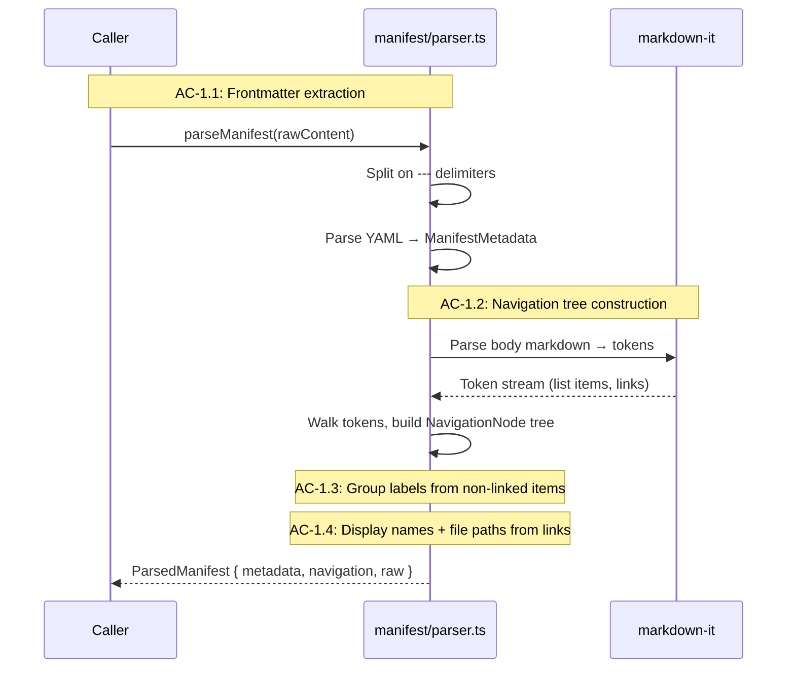
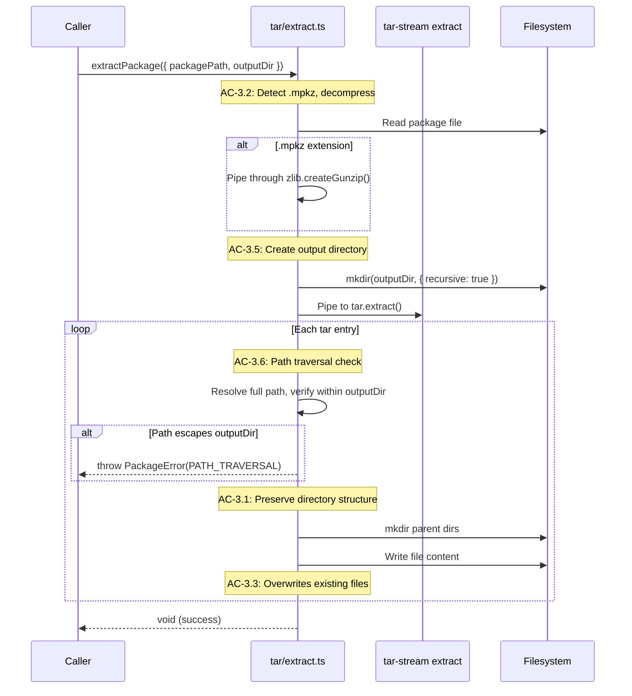
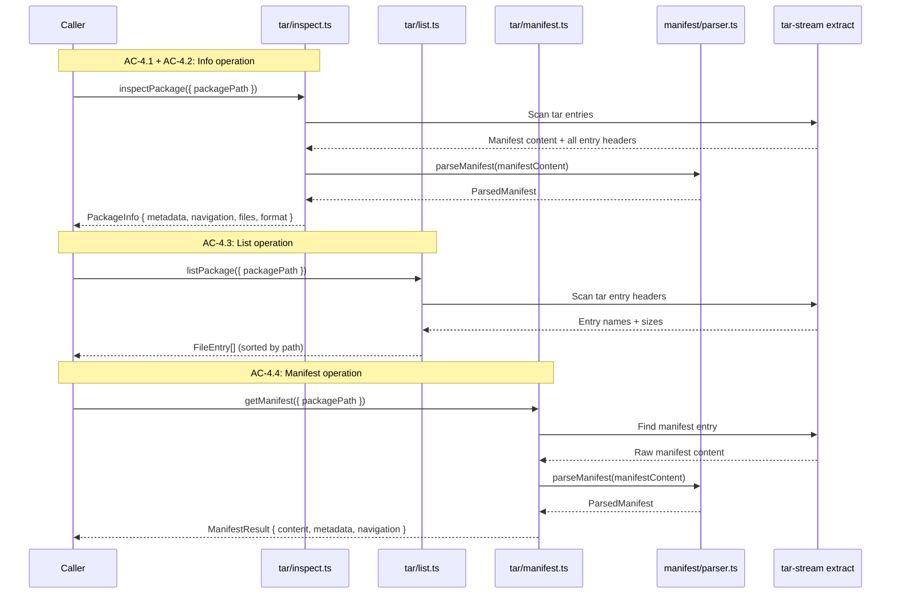
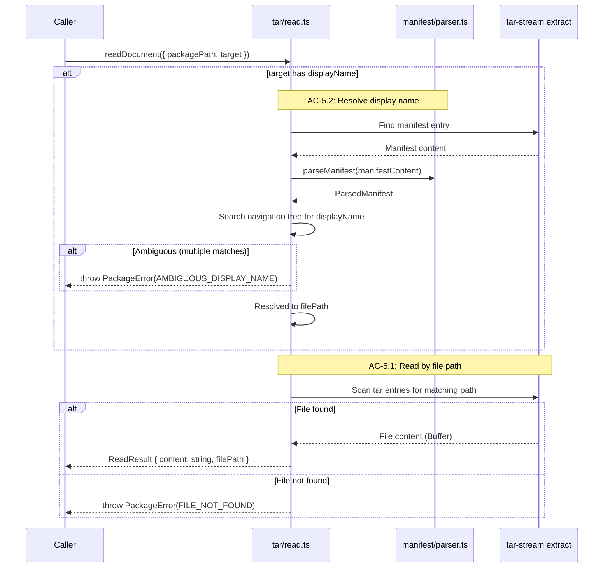
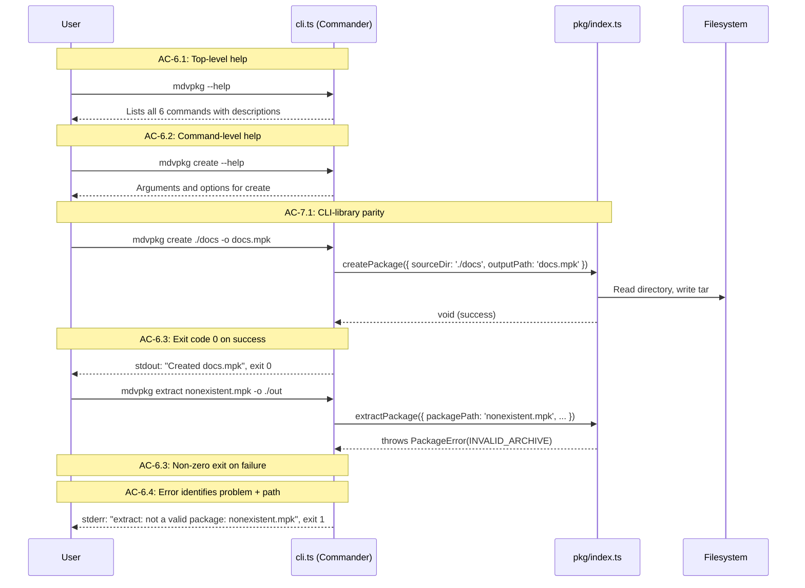
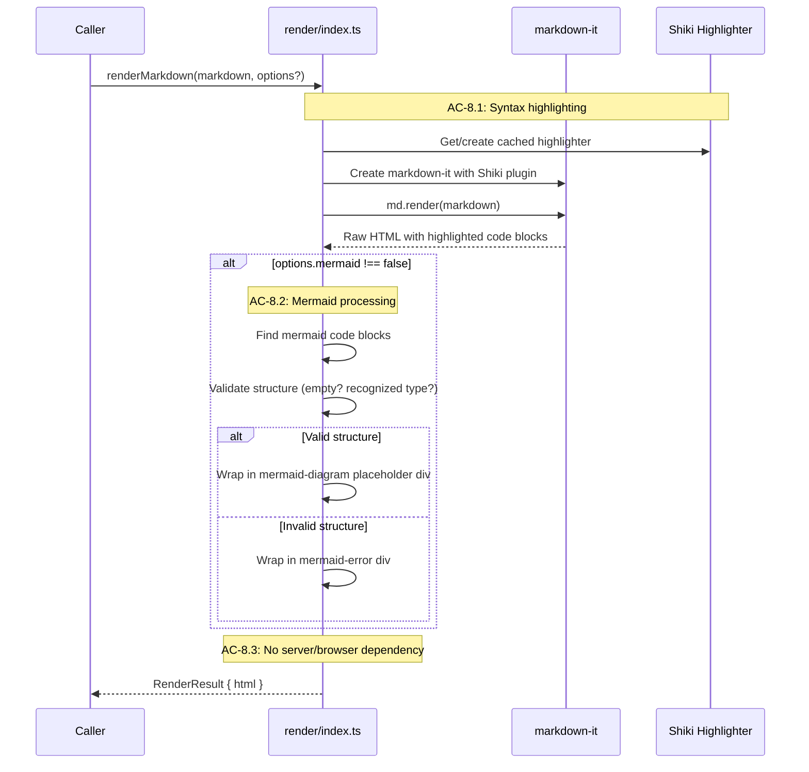

# Technical Design: Package Format Foundation

## Purpose

This document translates the Epic 8 requirements into implementable architecture for the markdown package format library and CLI tool. It serves three audiences:

| Audience | Value |
|----------|-------|
| Reviewers | Validate design before code is written |
| Developers | Clear blueprint for implementation |
| Story Tech Sections | Source of implementation targets, interfaces, and test mappings |

**Prerequisite:** Epic 8 is complete with 33 ACs, 71 TCs, and full coverage across 8 flows.

---

## Spec Validation

The Epic 8 spec was validated before design. All ACs map to implementation work, data contracts are fully typed, and the story breakdown covers all ACs.

**Validation Checklist:**
- [x] Every AC maps to clear implementation work
- [x] Data contracts are complete and realistic (TypeScript interfaces provided)
- [x] Edge cases have TCs, not just happy path
- [x] No technical constraints the BA missed
- [x] Flows make sense from implementation perspective

**Issues Found:**

| Issue | Spec Location | Resolution | Status |
|-------|---------------|------------|--------|
| TC-8.2b requires "styled error message" for invalid Mermaid, but TC-8.3b prohibits browser dependency. Full Mermaid syntax validation requires a Mermaid runtime (browser or Puppeteer). | AC-8.2, AC-8.3 | Design uses placeholder markup with basic structural validation (empty content, unrecognized diagram type keyword). Full syntax validation deferred to consumers with Mermaid runtime. | Resolved — deviated |
| TC-7.2a ("missing required field produces error") and TC-7.3a/b ("error code and message") are cross-cutting — they apply to every library function, but each TC describes testing a single representative function. | AC-7.2, AC-7.3 | TC-7.2a tested through createPackage (missing sourceDir). TC-7.2b through inspectPackage return type. TC-7.3a/b verified through extract and read error paths. All function-specific ACs (AC-2.4, AC-3.4, etc.) also exercise typed errors. | Resolved — clarified |
| `shared/types.ts` re-exports server schemas directly — package library types must not import from `src/server/`. | Data Contracts | Package types defined in `src/pkg/types.ts` with no server imports. Shared types remain unchanged for existing server/client use. | Resolved |

### Tech Design Questions — Answer Locations

The epic raised 8 questions for the Tech Lead. Each is answered in the section where the decision naturally arises:

| Question | Answer Location |
|----------|----------------|
| Q1: Manifest file name | §Tech Design Questions — Q1 |
| Q2: Package library module boundary | §Tech Design Questions — Q2; §Module Architecture |
| Q3: CLI framework choice | §Tech Design Questions — Q3 |
| Q4: Manifest auto-scaffold ordering | §Tech Design Questions — Q4 |
| Q5: Rendering library Mermaid runtime | §Tech Design Questions — Q5; §Flow 8 prose |
| Q6: Binary file handling in tar | §Tech Design Questions — Q6 |
| Q7: Package size limits | §Tech Design Questions — Q7 |
| Q8: ReadResult.content type | §Tech Design Questions — Q8 |

---

## Context

MD Viewer is a local-first markdown workspace built across 7 epics: a Fastify server, vanilla JS frontend, filesystem-backed content model, markdown-it + Shiki + Mermaid rendering pipeline, multi-tab editing, PDF/DOCX/HTML export, and E2E testing infrastructure. Everything runs on a developer's machine — no cloud, no database, no framework. The v2 roadmap extends this with two new capabilities: a markdown package format (Epics 8–9) and an experimental agent chat interface (Epics 10–14). This epic is the first v2 feature: the package format as an independent library and CLI, before viewer integration.

The package format solves a specific problem. Structured markdown collections — specs, documentation, agent outputs — currently live as loose files in directories. There is no standard way to bundle them with navigation metadata, share them as a single artifact, or inspect them without extracting. The `.mpk` format (tar archive with a markdown manifest at the root) provides that standard: a manifest defines navigation structure using the same markdown links and nested lists that users already write, and tar provides a universally-understood container. The format intentionally uses existing conventions (markdown for metadata, tar for archives, gzip for compression) rather than inventing new ones.

This epic produces two artifacts: a library and a CLI. The library (`src/pkg/`) provides programmatic access to all package operations: manifest parsing, package creation, extraction, inspection, single-document reading, and markdown rendering. The CLI (`mdvpkg`) wraps every library function with argument parsing, help output, and error formatting. Both are independently usable — no viewer, no server, no browser dependency. This independence is a hard constraint: the `src/pkg/` directory has zero imports from `src/server/`, `src/client/`, or `src/electron/`. The library is the foundation that Epic 9 builds on when integrating packages into the viewer.

The rendering library exposure is the secondary concern within this epic. The existing rendering pipeline (markdown-it with Shiki syntax highlighting and Mermaid diagram processing) lives inside `RenderService`, tightly coupled to the server through image processing, DOMPurify sanitization, and layout hints. Extracting the pure markdown-to-HTML transform — Shiki highlighting and Mermaid placeholder markup without filesystem or browser dependencies — makes it available to external tools. The PRD is explicit: rendering library exposure must not delay package core completion. The design separates them into independent chunks (Chunk 6 for rendering, Chunks 1–5 for package core) with no interdependency.

The implementation uses tar-stream for streaming tar read/write and Node built-in zlib for gzip compression, as specified in the Technical Architecture. Commander provides CLI argument parsing. All three are lightweight, well-maintained dependencies. The testing approach follows the service mock philosophy established in previous epics: test at the library function entry point, exercise internal modules (manifest parser, tar operations) through those entry points, mock nothing — the library's external boundary is the filesystem, and tests use real temp directories for speed and reliability.

---

## Tech Design Questions

### Q1: Manifest File Name

**Decision: `_nav.md`**

The underscore prefix signals "this is metadata, not content" — a convention established by frameworks like Jekyll (`_config.yml`), Hugo (`_index.md`), and Next.js (`_app.tsx`). It sorts to the top of directory listings in all operating systems and file managers, making the manifest immediately visible. The `nav` suffix is specific about purpose: this file defines navigation. `_index.md` was rejected because it implies a homepage or default document, which is a different concept. `manifest.md` was rejected because it lacks the underscore sort-to-top behavior and is too generic.

The constant `MANIFEST_FILENAME` is defined in `src/pkg/types.ts` and referenced by every module that needs to find or create a manifest.

### Q2: Package Library Module Boundary

**Decision: `src/pkg/` — new top-level source directory within the existing project**

The package library lives at `src/pkg/`, parallel to `src/server/`, `src/client/`, and `src/shared/`. This provides clean separation without the overhead of a separate workspace package. The module boundary is enforced by convention and validated by the rule: **`src/pkg/` has zero imports from `src/server/`, `src/client/`, `src/shared/`, or `src/electron/`**. Types needed by both the package library and the server (like `ManifestMetadata`, `NavigationNode`) are defined in `src/pkg/types.ts` — the server can import from `src/pkg/` but never the reverse.

The `tsconfig.json` include array is extended with `src/pkg/**/*.ts`. The package library compiles alongside the server but produces independent output in `dist/pkg/`. The CLI entry point at `dist/pkg/cli.js` is referenced by the `bin` field in `package.json`.

A separate workspace package (`packages/mdvpkg/`) was considered and rejected. The project is a single application, not a monorepo. Workspace packages add build orchestration complexity (separate `tsconfig`, separate `package.json`, workspace linking) without proportional benefit. The `src/pkg/` approach achieves the independence constraint (no server imports) with simpler tooling. If the library is later published as a standalone npm package, `src/pkg/` can be extracted into its own package at that point.

### Q3: CLI Framework Choice

**Decision: Commander**

Commander v14 is the most widely-used Node.js CLI framework, with built-in TypeScript declarations and a mature API. The `.command().description().argument().option().action()` pattern maps directly to the six `mdvpkg` commands. Commander provides free `--help` generation (both top-level and per-command), argument validation, and error messages — satisfying AC-6.1 and AC-6.2 with minimal code.

yargs was considered but rejected — it's heavier and its configuration-object style is less readable for a small command set. Hand-rolled parsing was considered but rejected — it would require implementing help generation, argument validation, and error formatting that Commander provides out of the box. For six commands with straightforward arguments, Commander hits the sweet spot.

### Q4: Manifest Auto-Scaffold Ordering

**Decision: Alphabetical by relative path, case-insensitive**

When auto-scaffolding a manifest from a directory, discovered markdown files are sorted alphabetically by their relative path (case-insensitive). This produces deterministic, predictable output that matches what users see in `ls` and file managers. Directory grouping emerges naturally from the path sort — `auth/api-keys.md` sorts near `auth/oauth2.md`.

Depth-first ordering was considered but rejected — it groups files by directory level, which is less intuitive when directory names don't sort meaningfully. The alphabetical-by-path approach is the least surprising default. Users can reorder the scaffolded manifest manually for their preferred navigation structure.

### Q5: Rendering Library Mermaid Runtime

**Decision: Placeholder markup — no browser required**

The rendering library transforms `mermaid` fenced code blocks into structured placeholder divs containing the diagram source. This is the same pattern already used by `RenderService.render()` in the server pipeline — mermaid blocks become `<div class="mermaid-diagram">` containers with the source code preserved inside. The client browser, Puppeteer-based export, or any downstream consumer renders the actual SVG from these placeholders.

This decision is forced by TC-8.3b, which explicitly requires "no Fastify server, HTTP listener, or browser is required for the render to complete." Puppeteer-based SSR (the existing `MermaidSsrService` approach) would violate this constraint. JSDOM-based rendering is unreliable for Mermaid's SVG generation.

**Spec deviation for TC-8.2b:** The TC requires "a styled error message in place of the diagram" for invalid Mermaid. Full syntax validation requires a Mermaid runtime. The rendering library provides basic structural validation: empty mermaid blocks and blocks with no recognizable diagram type keyword (e.g., `graph`, `sequenceDiagram`, `flowchart`, `classDiagram`, `stateDiagram`, `erDiagram`, `pie`, `gantt`, `gitgraph`, `mindmap`, `timeline`) produce an inline error div. Blocks with recognizable types are wrapped in placeholder divs regardless of deeper syntax validity. Full Mermaid syntax validation is available through `MermaidSsrService` for consumers with a Puppeteer runtime.

When `mermaid: false`, mermaid code blocks are left as standard `<pre><code class="language-mermaid">` blocks — no placeholder wrapping.

**CSS class naming:** The rendering library uses `mermaid-diagram` and `mermaid-error` for its output classes. The existing `RenderService.render()` in the server uses `mermaid-placeholder` — that class name reflects the server's role (creating placeholders for client-side rendering). The standalone rendering library uses `mermaid-diagram` because it is the final rendering output for library consumers, not an intermediate placeholder. The two contexts produce structurally similar markup but serve different downstream consumers.

### Q6: Binary File Handling in Tar

**Decision: Treat all entries as opaque byte streams**

tar-stream naturally handles all tar entries as byte streams. The package library makes no distinction between text and binary content during creation, extraction, or inspection. Files are bundled, extracted, and listed identically regardless of content type. The `FileEntry` type reports `path` and `size` for all entries.

The differentiation happens at the read level: `readDocument()` returns content as a UTF-8 string (appropriate for markdown and text files). Binary assets are extractable via `extractPackage()` and listable via `listPackage()`, but individual binary reads are not a primary use case for this epic.

### Q7: Package Size Limits

**Decision: No enforced limits**

The library does not enforce size limits on packages, individual files, or file counts. The NFR assumes "dozens of files, a few MB" — tar-stream handles larger archives efficiently, and Node's streaming I/O manages memory. Adding limits would require choosing thresholds without real-world usage data to inform them.

The `PackageInfo.files` array and `FileEntry.size` fields give consumers full visibility into package contents. Consumers who need size constraints can inspect before extracting.

### Q8: ReadResult.content Type

**Decision: Keep `string` — no `Buffer` support in ReadResult**

`ReadResult.content` remains typed as `string`. The primary use case for `readDocument()` is reading markdown files, which are text. Reading binary assets (images, PDFs) by individual file path within a package is not a use case this epic serves — binary assets are extracted via `extractPackage()` and served via the viewer's file API (Epic 9).

If binary reads become needed, a separate `readRaw()` function returning `Buffer` can be added in a future iteration. Overloading `content: string | Buffer` would make the API harder to use for the common case (every caller would need a type guard).

---

## System View

### System Context

The package library sits outside the MD Viewer application, independently usable from the command line or as a programmatic import. It interacts with the filesystem (reading source directories, writing package files) and the tar/gzip streams (creating and parsing archives). There are no network calls, no server dependencies, and no browser requirements.

```
┌─────────────────────────────────────────────────────┐
│ Consumer (CLI user / programmatic importer)          │
│                                                      │
│  CLI:  mdvpkg create ./docs -o docs.mpk             │
│  API:  import { createPackage } from 'md-viewer/pkg' │
└──────────────────────┬───────────────────────────────┘
                       │
                       │ function calls
                       │
┌──────────────────────┴───────────────────────────────┐
│ Package Library (src/pkg/)                            │
│                                                       │
│  ┌───────────────────────────────────────────────┐    │
│  │ Public API (index.ts)                         │    │
│  │  createPackage, extractPackage, inspectPackage │    │
│  │  listPackage, getManifest, readDocument        │    │
│  │  parseManifest, renderMarkdown                 │    │
│  └───────────────────┬───────────────────────────┘    │
│                      │                                │
│  ┌──────────┐  ┌─────┴──────┐  ┌──────────────────┐  │
│  │ Manifest │  │ Tar Ops    │  │ Render           │  │
│  │ Parser   │  │ create     │  │ markdown-it      │  │
│  │ Scaffold │  │ extract    │  │ + Shiki          │  │
│  │          │  │ inspect    │  │ + mermaid placeh. │  │
│  │          │  │ read       │  │                  │  │
│  └──────────┘  └────────────┘  └──────────────────┘  │
│                      │                                │
│              ┌───────┴────────┐                       │
│              │  tar-stream    │                       │
│              │  Node zlib     │                       │
│              └────────────────┘                       │
└───────────────────────┬───────────────────────────────┘
                        │
                        │ read/write
                        │
┌───────────────────────┴───────────────────────────────┐
│ Local Filesystem                                       │
│  Source directories, .mpk/.mpkz package files          │
└────────────────────────────────────────────────────────┘
```

The package library has no knowledge of the Fastify server, browser client, or Electron wrapper. When Epic 9 integrates packages into the viewer, it will import from `src/pkg/` — the server becomes a consumer of the library, not the other way around.

### External Contracts

The package library's external contract is its programmatic API — the functions exported from `src/pkg/index.ts`. There are no HTTP endpoints, no WebSocket messages, and no browser interactions. The contracts are the function signatures and return types defined in the Interface Definitions section.

**Incoming (from consumers):**

| Input | Type | Purpose |
|-------|------|---------|
| Source directory path | `string` | Directory to package |
| Package file path | `string` | `.mpk`/`.mpkz` file to inspect/extract/read |
| Output path | `string` | Where to write package or extracted files |
| Manifest content | `string` | Raw markdown string to parse |
| Markdown content | `string` | Raw markdown string to render |
| Options objects | Typed interfaces | Configuration for each operation |

**Outgoing (to consumers):**

| Output | Type | Purpose |
|--------|------|---------|
| `ParsedManifest` | Object | Structured metadata + navigation tree |
| `PackageInfo` | Object | Package metadata, navigation, file listing |
| `ReadResult` | Object | Document content + resolved file path |
| `RenderResult` | Object | Rendered HTML |
| `PackageError` | Thrown error | Typed error with code and message |

**Error Contract:**

Errors are thrown as `PackageError` instances with a `code` property from the `PackageErrorCode` enum. This is the machine-readable contract that consumers program against. Error codes are stable; messages may vary.

| Code | Thrown By | Meaning |
|------|-----------|---------|
| `INVALID_ARCHIVE` | extract, inspect, list, getManifest, readDocument | File is not a valid tar archive |
| `MANIFEST_NOT_FOUND` | getManifest, readDocument (by display name) | No manifest in package |
| `MANIFEST_PARSE_ERROR` | parseManifest, inspect, getManifest | Manifest content is malformed |
| `FILE_NOT_FOUND` | readDocument | Requested file not in package |
| `AMBIGUOUS_DISPLAY_NAME` | readDocument | Multiple nav entries match display name |
| `PATH_TRAVERSAL` | extract | Tar entry attempts directory escape |
| `SOURCE_DIR_NOT_FOUND` | create | Source directory doesn't exist |
| `SOURCE_DIR_EMPTY` | create | Source directory has no files |
| `COMPRESSION_ERROR` | extract | Gzip decompression failed |
| `READ_ERROR` | any | Filesystem read failure |
| `WRITE_ERROR` | create, extract | Filesystem write failure |

**Runtime Prerequisites:**

| Prerequisite | Where Needed | How to Verify |
|---|---|---|
| Node.js (>=18, project uses v25.x) | Local + CI | `node --version` |
| `npm install` (installs tar-stream, commander) | Before use | `ls node_modules/tar-stream` |
| `npm run build` (compiles `src/pkg/` to `dist/pkg/`) | Before CLI use | `ls dist/pkg/cli.js` |

---

## Module Architecture

The package library consists of six module groups: types/errors, manifest operations, tar operations (create, extract, inspect, read), CLI, rendering, and the public API index.

```
app/
├── src/
│   └── pkg/                                # NEW: Package library root
│       ├── index.ts                        # NEW: Public API — re-exports all functions
│       ├── types.ts                        # NEW: All package types + MANIFEST_FILENAME const
│       ├── errors.ts                       # NEW: PackageError class with error codes
│       ├── manifest/
│       │   ├── parser.ts                   # NEW: parseManifest() — markdown → ParsedManifest
│       │   └── scaffold.ts                 # NEW: scaffoldManifest() — directory → manifest string
│       ├── tar/
│       │   ├── create.ts                   # NEW: createPackage() — directory → .mpk/.mpkz
│       │   ├── extract.ts                  # NEW: extractPackage() — .mpk/.mpkz → directory
│       │   ├── inspect.ts                  # NEW: inspectPackage() — .mpk → PackageInfo
│       │   ├── list.ts                     # NEW: listPackage() — .mpk → FileEntry[]
│       │   ├── manifest.ts                 # NEW: getManifest() — .mpk → ManifestResult
│       │   └── read.ts                     # NEW: readDocument() — .mpk + target → ReadResult
│       ├── render/
│       │   └── index.ts                    # NEW: renderMarkdown() — markdown → HTML
│       └── cli.ts                          # NEW: mdvpkg CLI entry point
├── tests/
│   └── pkg/                                # NEW: Package library tests
│       ├── manifest-parser.test.ts         # Manifest parsing tests (17 TCs)
│       ├── create-package.test.ts          # Package creation tests (11 TCs)
│       ├── extract-package.test.ts         # Package extraction tests (9 TCs)
│       ├── inspect-package.test.ts         # Package inspection tests (10 TCs)
│       ├── read-document.test.ts           # Single document read tests (6 TCs)
│       ├── cli.test.ts                     # CLI tests (8 TCs)
│       ├── render-library.test.ts          # Rendering library tests (6 TCs)
│       ├── pkg-foundation.test.ts          # Structural/foundation tests (4 tests)
│       └── fixtures/
│           ├── workspaces.ts               # Temp workspace creation helpers
│           └── manifests.ts                # Manifest string constants
├── tsconfig.json                           # MODIFIED: add "src/pkg/**/*.ts" to include
├── package.json                            # MODIFIED: add tar-stream, commander; add bin field
└── esbuild.config.ts                       # EXISTS: unchanged (CLI doesn't need bundling)
```

### Module Responsibility Matrix

| Module | Status | Responsibility | Dependencies | ACs Covered |
|--------|--------|----------------|--------------|-------------|
| `pkg/types.ts` | NEW | All package types, `MANIFEST_FILENAME` constant, option/result interfaces | None | Foundation for all ACs |
| `pkg/errors.ts` | NEW | `PackageError` class with `PackageErrorCode` enum | `types.ts` | AC-7.3 (typed errors) |
| `pkg/manifest/parser.ts` | NEW | Parse manifest markdown → `ParsedManifest` (frontmatter + nav tree) | `types.ts`, `errors.ts` | AC-1.1 through AC-1.6 |
| `pkg/manifest/scaffold.ts` | NEW | Generate manifest markdown from directory contents | `types.ts` | AC-2.2 (auto-scaffold) |
| `pkg/tar/create.ts` | NEW | Create `.mpk`/`.mpkz` from directory, auto-scaffold manifest | `types.ts`, `errors.ts`, `manifest/*`, tar-stream, zlib | AC-2.1 through AC-2.5 |
| `pkg/tar/extract.ts` | NEW | Extract `.mpk`/`.mpkz` to directory, path traversal safety | `types.ts`, `errors.ts`, tar-stream, zlib | AC-3.1 through AC-3.6 |
| `pkg/tar/inspect.ts` | NEW | Read package metadata + nav tree without extracting | `types.ts`, `errors.ts`, `manifest/parser.ts`, tar-stream | AC-4.1, AC-4.2 |
| `pkg/tar/list.ts` | NEW | List all files in package with paths and sizes | `types.ts`, `errors.ts`, tar-stream | AC-4.3 |
| `pkg/tar/manifest.ts` | NEW | Extract and parse manifest from package | `types.ts`, `errors.ts`, `manifest/parser.ts`, tar-stream | AC-4.4 |
| `pkg/tar/read.ts` | NEW | Read single document by file path or display name | `types.ts`, `errors.ts`, `manifest/parser.ts`, tar-stream | AC-5.1, AC-5.2 |
| `pkg/render/index.ts` | NEW | Standalone markdown → HTML (Shiki + mermaid placeholder) | markdown-it, shiki | AC-8.1 through AC-8.3 |
| `pkg/cli.ts` | NEW | `mdvpkg` CLI — argument parsing, help, error formatting | `pkg/index.ts`, commander | AC-6.1 through AC-6.4, AC-7.1 |
| `pkg/index.ts` | NEW | Public API surface — re-exports all functions and types | All pkg modules | AC-7.1, AC-7.2 |

### Module Interaction

```
pkg/cli.ts (CLI entry point)
    │
    ├── commander parses args
    │
    └── calls pkg/index.ts exports
            │
            ├── parseManifest()     → manifest/parser.ts
            ├── createPackage()     → tar/create.ts → manifest/scaffold.ts
            │                                       → tar-stream (pack)
            │                                       → zlib (gzip)
            ├── extractPackage()    → tar/extract.ts → tar-stream (extract)
            │                                        → zlib (gunzip)
            ├── inspectPackage()    → tar/inspect.ts → manifest/parser.ts
            ├── listPackage()       → tar/list.ts
            ├── getManifest()       → tar/manifest.ts → manifest/parser.ts
            ├── readDocument()      → tar/read.ts → manifest/parser.ts (for display name)
            └── renderMarkdown()    → render/index.ts → markdown-it + shiki
```

The manifest parser is the most-referenced internal module — used by inspect, getManifest, readDocument (for display name resolution), and create (for manifest detection). It is tested directly through `manifest-parser.test.ts` (Chunk 1) and exercised indirectly through every function that reads packages.

### Stack Additions

| Package | Version | Purpose | Research Confirmed |
|---------|---------|---------|-------------------|
| tar-stream | ^3.1.8 | Streaming tar pack/extract | Yes — latest stable v3.1.8 (March 2026), actively maintained, types via @types/tar-stream ^3.1.4 |
| commander | ^14.0.3 | CLI argument parsing, help generation | Yes — latest stable v14.0.3 (Jan 2026), built-in TypeScript declarations, requires Node >=20 |

**Considered and rejected:**

| Package | Reason Rejected |
|---------|----------------|
| yargs | Heavier than needed for 6 commands; configuration-object API less readable |
| tar (npm) | Higher-level abstraction loses streaming control; tar-stream is specified in Technical Architecture |
| Hand-rolled CLI | Would require implementing help generation, arg validation, error formatting |
| archiver | Write-only; tar-stream handles both read and write |

---

## Flow-by-Flow Design

### Flow 1: Manifest Parsing

**Covers:** AC-1.1 through AC-1.6

The manifest parser is the foundation of the package format. Every package operation that reads metadata or navigation — inspection, single-document reading by display name, viewer integration in Epic 9 — depends on this parser. It takes a raw markdown string and produces a `ParsedManifest` with structured metadata and a navigation tree.

The parsing pipeline has two stages. First, YAML frontmatter extraction: if the manifest starts with `---`, the parser extracts the frontmatter block and parses it as YAML. The parser uses a lightweight approach — split on `---` delimiters, parse the YAML portion, pass the remainder as body. Second, navigation tree construction: the body is parsed as markdown, and list items are converted to `NavigationNode` entries. Linked items (`[Display Name](file-path.md)`) become navigable entries; non-linked items become group labels. Nesting is determined by list indentation.

The parser uses markdown-it (already a project dependency) to parse the body into tokens. List items at each nesting level become nodes in the tree. This approach handles ordered and unordered lists uniformly, manages arbitrary nesting depth, and ignores non-list content (paragraphs, headings) in the body.



**Skeleton Requirements:**

| What | Where | Stub Signature |
|------|-------|----------------|
| Parse manifest function | `src/pkg/manifest/parser.ts` | `export function parseManifest(content: string): ParsedManifest { throw new NotImplementedError('parseManifest') }` |

**TC Mapping for Flow 1:**

| TC | Test | Setup | Assert |
|----|------|-------|--------|
| TC-1.1a | All metadata fields extracted | Manifest with all 6 frontmatter fields | Each field available with correct value |
| TC-1.1b | Missing fields are absent | Manifest with only title and version | Other fields undefined |
| TC-1.1c | No frontmatter | Manifest with body only, no `---` | Empty metadata, nav tree still parsed |
| TC-1.2a | Flat list of links | Body with 3 top-level `- [Name](path)` | Flat list of 3 entries |
| TC-1.2b | Nested list | Top-level with indented sub-items | Tree reflects nesting |
| TC-1.2c | Three levels of nesting | 3-level deep list | Three levels in nav tree |
| TC-1.3a | Group label identified | Non-linked item with indented children | Group node with isGroup=true, children populated |
| TC-1.3b | Group label no children | Non-linked item followed by top-level item | Group node with empty children array |
| TC-1.4a | Display name and file path | `[Getting Started](getting-started.md)` | displayName="Getting Started", filePath="getting-started.md" |
| TC-1.4b | Paths with directories | `[OAuth2 Flow](auth/oauth2.md)` | filePath="auth/oauth2.md" |
| TC-1.5a | Non-list body content | Body with only paragraphs | Parser returns error (MANIFEST_PARSE_ERROR) |
| TC-1.5b | Invalid YAML | Malformed YAML between `---` | Parser returns error (MANIFEST_PARSE_ERROR) |
| TC-1.6a | Ordered list items | `1.`, `2.` syntax | Parsed as entries in order |
| TC-1.6b | Empty link target | `[Label]()` | Treated as group label |
| TC-1.6c | Non-markdown link | `[Data](data.csv)` | Entry with non-markdown file path |
| TC-1.6d | Paragraph between lists | Paragraphs interspersed | Paragraphs ignored, only lists form entries |
| TC-1.6e | Frontmatter, empty body | Valid YAML, no body content | Metadata populated, empty nav tree |

### Flow 2: Package Creation

**Covers:** AC-2.1 through AC-2.5

Package creation takes a source directory and produces a `.mpk` or `.mpkz` file. The function validates the source directory exists and is non-empty, checks for a manifest file (auto-scaffolding one if absent), then bundles all files into a tar archive preserving directory hierarchy. If compression is requested, the tar stream is piped through gzip to produce a `.mpkz`.

The auto-scaffolding mechanism (AC-2.2) writes a manifest file to the source directory on disk before bundling. This means the scaffolded manifest persists — the user can edit it for subsequent package builds. The scaffold function discovers all markdown files in the directory, sorts them alphabetically by relative path (case-insensitive), and generates a manifest with navigation entries linking to each file. If the directory has subdirectories, files within them appear with their relative paths.

tar-stream's `pack` API is used for creation. Each file in the source directory becomes a tar entry with its relative path as the entry name. The pack stream is piped to a write stream (for `.mpk`) or through `zlib.createGzip()` then to a write stream (for `.mpkz`).

```mermaid
sequenceDiagram
    participant Caller
    participant Create as tar/create.ts
    participant Scaffold as manifest/scaffold.ts
    participant TS as tar-stream pack
    participant FS as Filesystem

    Note over Caller,Create: AC-2.4: Validate source directory
    Caller->>Create: createPackage({ sourceDir, outputPath, compress })
    Create->>FS: Check sourceDir exists
    Create->>FS: Check sourceDir is non-empty

    Note over Create,FS: AC-2.2: Auto-scaffold if no manifest
    Create->>FS: Check for _nav.md at sourceDir root
    alt No manifest
        Create->>Scaffold: scaffoldManifest(sourceDir)
        Scaffold->>FS: Discover *.md files
        Scaffold-->>Create: manifest content string
        Create->>FS: Write _nav.md to sourceDir
    end

    Note over Create,TS: AC-2.1: Bundle all files into tar
    Create->>FS: Walk directory recursively
    loop Each file
        Create->>TS: pack.entry({ name: relativePath }, content)
    end

    Note over Create: AC-2.3: Optional gzip compression
    alt compress: true
        Create->>TS: pipe through zlib.createGzip()
    end

    Note over Create: AC-2.5: Overwrite existing output
    Create->>FS: Write to outputPath (overwrite)
    Create-->>Caller: void (success)
```

**TC Mapping for Flow 2:**

| TC | Test | Setup | Assert |
|----|------|-------|--------|
| TC-2.1a | Package created with correct files | Dir with manifest + 3 .md files | .mpk contains all 4 files |
| TC-2.1b | Supporting assets included | Dir with images/ subdirectory | .mpk contains image files at original paths |
| TC-2.1c | Directory hierarchy preserved | Nested subdirs with .md files | Tar entries match source paths |
| TC-2.2a | Manifest scaffolded and included | Dir with .md files, no manifest | _nav.md written to disk AND in package |
| TC-2.2b | Scaffold contains all .md entries | 3 .md files, no manifest | Scaffold has entries for all 3 files |
| TC-2.2c | Existing manifest not overwritten | Dir with custom _nav.md | Custom manifest preserved in package |
| TC-2.3a | Compressed package created | Source dir, compress: true | .mpkz smaller than .mpk |
| TC-2.3b | Compressed package is valid gzip | .mpkz file | Standard gzip decompresses to valid tar |
| TC-2.4a | Source dir does not exist | Nonexistent path | PackageError with SOURCE_DIR_NOT_FOUND |
| TC-2.4b | Source dir is empty | Empty directory | PackageError with SOURCE_DIR_EMPTY |
| TC-2.5a | Output file overwritten | Existing .mpk at output path | New package replaces old |

### Flow 3: Package Extraction

**Covers:** AC-3.1 through AC-3.6

Package extraction reads a `.mpk` or `.mpkz` file and writes its contents to a target directory, recreating the original directory structure. The function detects `.mpkz` files by extension and pipes through `zlib.createGunzip()` before tar extraction. Every tar entry's path is validated for directory traversal attacks before writing.

Path traversal safety (AC-3.6) is a security requirement. Before writing any entry, the function resolves the full output path and verifies it starts with the output directory prefix. Entries with paths containing `..` segments or absolute paths are rejected with a `PATH_TRAVERSAL` error. This prevents malicious tar archives from writing outside the intended extraction directory.

tar-stream's `extract` API provides an entry stream. For each entry, the function creates intermediate directories as needed, then writes the entry content to the resolved path.



**TC Mapping for Flow 3:**

| TC | Test | Setup | Assert |
|----|------|-------|--------|
| TC-3.1a | Full extraction preserves structure | .mpk with manifest + files in subdirs | All files at original relative paths |
| TC-3.1b | Extracted files match originals | Create then extract | Byte-identical comparison |
| TC-3.2a | Compressed package extracts | .mpkz file | Same result as equivalent .mpk |
| TC-3.3a | Overwrite behavior | Output dir has conflicting file | Package version replaces existing |
| TC-3.4a | Not a tar archive | Plain text file renamed to .mpk | PackageError with INVALID_ARCHIVE |
| TC-3.4b | Corrupted compressed archive | .mpkz with bad gzip data | PackageError with COMPRESSION_ERROR |
| TC-3.5a | Output directory created | Nonexistent nested output path | Full path created, files extracted |
| TC-3.6a | Path traversal blocked | Tar with `../../etc/malicious` entry | PackageError with PATH_TRAVERSAL |
| TC-3.6b | Absolute path blocked | Tar with `/etc/passwd` entry | PackageError with PATH_TRAVERSAL |

### Flow 4: Package Inspection

**Covers:** AC-4.1 through AC-4.4

Package inspection provides three operations for examining packages without extracting: `inspectPackage()` returns metadata and navigation tree, `listPackage()` returns all files with paths and sizes, and `getManifest()` returns the raw manifest content plus parsed data.

All three operations read from the tar archive without extracting to disk. They scan tar entries sequentially — `inspectPackage()` reads the manifest entry and the full entry list, `listPackage()` reads all entry headers (name + size), and `getManifest()` reads only the manifest entry.



**TC Mapping for Flow 4:**

| TC | Test | Setup | Assert |
|----|------|-------|--------|
| TC-4.1a | Metadata fields displayed | Package with full frontmatter | PackageInfo.metadata has all fields |
| TC-4.1b | Package with no metadata | Manifest with no frontmatter | metadata is empty, navigation still present |
| TC-4.1c | Info on invalid archive | Non-tar file | PackageError with INVALID_ARCHIVE |
| TC-4.2a | Hierarchical navigation tree | Package with nested manifest | Navigation reflects hierarchy with groups |
| TC-4.2b | Flat navigation list | Package with flat manifest | Flat list of entries |
| TC-4.3a | File listing with sizes | Package with 5 files | All 5 files listed with paths and sizes |
| TC-4.3b | Files sorted by path | Files in multiple directories | Sorted ascending by path |
| TC-4.4a | Raw manifest output | Package with manifest | Exact manifest content including frontmatter |
| TC-4.4b | Package with no manifest | Raw tar of .md files, no _nav.md | PackageError with MANIFEST_NOT_FOUND |
| TC-4.4c | Manifest on invalid archive | Non-tar file | PackageError with INVALID_ARCHIVE |

### Flow 5: Single Document Reading

**Covers:** AC-5.1, AC-5.2

The read operation retrieves a single document from a package by file path or navigation display name. When reading by display name, the function first scans for the manifest, parses the navigation tree, and resolves the display name to a file path. It then scans the tar archive for the matching entry and returns the content as a UTF-8 string.

Display name resolution (AC-5.2) requires handling ambiguity: if multiple navigation entries share the same display name (in different groups), the operation fails with an `AMBIGUOUS_DISPLAY_NAME` error listing the matching entries and their file paths. This prevents silent wrong-file reads.



**TC Mapping for Flow 5:**

| TC | Test | Setup | Assert |
|----|------|-------|--------|
| TC-5.1a | Read by file path | Package with `auth/oauth2.md` | Content of that file returned |
| TC-5.1b | File path not found | Package without `nonexistent.md` | PackageError with FILE_NOT_FOUND |
| TC-5.1c | Read from invalid archive | Non-tar file | PackageError with INVALID_ARCHIVE |
| TC-5.2a | Read by display name | Manifest maps "OAuth2 Flow" → `auth/oauth2.md` | Content of `auth/oauth2.md` returned |
| TC-5.2b | Display name not found | No entry named "Nonexistent" | PackageError with FILE_NOT_FOUND |
| TC-5.2c | Ambiguous display name | Two entries with same display name | PackageError with AMBIGUOUS_DISPLAY_NAME |

### Flow 6: CLI Interface

**Covers:** AC-6.1 through AC-6.4, AC-7.1

`mdvpkg` is a thin CLI wrapper. Commander handles argument parsing and help generation. Each command's `.action()` handler calls the corresponding library function, formats the output, and manages exit codes.

The CLI enforces a consistent pattern: successful operations print output to stdout and exit 0. Failed operations print an error message (including the command name and relevant file path) to stderr and exit with a non-zero code. Error messages are formatted by a shared error handler that extracts the `PackageError` code and message.



**TC Mapping for Flow 6:**

| TC | Test | Setup | Assert |
|----|------|-------|--------|
| TC-6.1a | Help lists all commands | Run `mdvpkg --help` | All 6 commands listed with descriptions |
| TC-6.2a | Command-level help | Run `mdvpkg create --help` | Arguments and options listed |
| TC-6.3a | Success exit code | Valid create operation | Exit code 0 |
| TC-6.3b | Failure exit code | Extract nonexistent file | Non-zero exit code |
| TC-6.4a | Error includes path | File not found failure | Error message includes the file path |
| TC-6.4b | Error includes operation | Any failure | Message prefixed with command name |
| TC-7.1a | Library-CLI parity | Create via CLI and library | Identical package files |
| TC-7.1b | Function exists per command | Import library | 6 exported functions present |

### Flow 7: Library API Cross-Cutting Properties

**Covers:** AC-7.2, AC-7.3

The library API properties (typed inputs/outputs and typed errors) are verified through representative functions rather than exhaustively across all six. Every library function follows the same contract: accept a typed options object, return a typed result, throw `PackageError` on failure with a code from `PackageErrorCode`.

**TC Mapping for Flow 7:**

| TC | Test File | Setup | Assert |
|----|-----------|-------|--------|
| TC-7.2a | `create-package.test.ts` | Call createPackage with missing sourceDir | Validation error before operation runs |
| TC-7.2b | `inspect-package.test.ts` | Call inspectPackage on valid package | Return value is PackageInfo with expected shape |
| TC-7.3a | `extract-package.test.ts` | Extract invalid archive | Error has `code` property from PackageErrorCode |
| TC-7.3b | `read-document.test.ts` | Read nonexistent file path | Error message describes what and where |

### Flow 8: Rendering Library

**Covers:** AC-8.1 through AC-8.3

The rendering library extracts the pure markdown-to-HTML transform from the existing `RenderService`. It uses the same markdown-it + Shiki pipeline but omits server-specific concerns: no image processing (filesystem-dependent), no DOMPurify (consumer's responsibility), no layout hints (export-specific). The result is a standalone async function that converts markdown to HTML with syntax highlighting and optional Mermaid placeholder markup.

The Shiki highlighter is initialized lazily on first call and cached for subsequent calls — the same pattern as `shikiHighlighterPromise` in `render.service.ts`. The supported language set matches the existing configuration (JavaScript, TypeScript, Python, Go, Rust, Java, C, C++, SQL, YAML, JSON, Bash, HTML, CSS, Markdown, TOML, Dockerfile).

When `mermaid: true` (default), mermaid fenced code blocks are transformed into structured placeholder divs. The placeholder contains the mermaid source code in a machine-readable format that downstream consumers (browser clients, Puppeteer-based exporters) can render to SVG. When `mermaid: false`, mermaid blocks remain as standard `<pre><code class="language-mermaid">` elements.

Basic Mermaid validation for TC-8.2b: the rendering library checks if the mermaid block content is empty or begins with a recognizable diagram type keyword. Empty blocks and blocks with unrecognized first tokens produce an inline error div (`<div class="mermaid-error">`) instead of a placeholder. This provides basic structural validation without requiring a Mermaid runtime.



**TC Mapping for Flow 8:**

| TC | Test | Setup | Assert |
|----|------|-------|--------|
| TC-8.1a | Basic rendering | Markdown with heading + paragraph | HTML has `<h1>` and `<p>` elements |
| TC-8.1b | Syntax highlighting | Markdown with JS code block | HTML has `<pre>` with highlighted spans |
| TC-8.2a | Mermaid processing | Markdown with valid mermaid block | HTML has mermaid-diagram div (not raw code block) |
| TC-8.2b | Invalid Mermaid error | Markdown with empty/invalid mermaid block | HTML has mermaid-error div; no exception thrown |
| TC-8.3a | Standalone import | Import renderMarkdown in isolated script | Import succeeds without server/viewer modules |
| TC-8.3b | No server dependency | Render a markdown string | Completes without Fastify, HTTP listener, or browser |

---

## Interface Definitions

### Types (`src/pkg/types.ts`)

```typescript
/**
 * Canonical manifest file name. Used by all modules that
 * need to find or create a manifest in a package or directory.
 */
export const MANIFEST_FILENAME = '_nav.md';

/**
 * Known Mermaid diagram type keywords for basic validation.
 * Blocks whose first token doesn't match are flagged as errors.
 */
export const MERMAID_DIAGRAM_TYPES = new Set([
  'graph', 'flowchart', 'sequencediagram', 'classdiagram',
  'statediagram', 'erdiagram', 'pie', 'gantt', 'gitgraph',
  'mindmap', 'timeline', 'quadrantchart', 'requirementdiagram',
  'journey', 'c4context', 'c4container', 'c4component', 'c4deployment',
  'block-beta', 'sankey-beta', 'xychart-beta', 'packet-beta',
]);

// ─── Manifest Types ───

/**
 * Package metadata from YAML frontmatter. All fields optional —
 * a manifest may have no frontmatter at all.
 *
 * Supports: AC-1.1 (frontmatter extraction)
 */
export interface ManifestMetadata {
  title?: string;
  version?: string;
  author?: string;
  description?: string;
  type?: string;
  status?: string;
}

/**
 * A single node in the navigation tree. Linked entries have a filePath;
 * group labels have isGroup=true and no filePath.
 *
 * Supports: AC-1.2 (navigation tree), AC-1.3 (group labels),
 *           AC-1.4 (display names and file paths)
 */
export interface NavigationNode {
  displayName: string;
  filePath?: string;
  children: NavigationNode[];
  isGroup: boolean;
}

/**
 * Result of parsing a manifest file. Contains structured metadata,
 * the navigation tree, and the original raw content.
 *
 * Supports: AC-1.1 through AC-1.6
 */
export interface ParsedManifest {
  metadata: ManifestMetadata;
  navigation: NavigationNode[];
  raw: string;
}

// ─── Package Types ───

/**
 * Complete information about a package, returned by inspectPackage().
 *
 * Supports: AC-4.1 (metadata), AC-4.2 (navigation), AC-4.3 (files)
 */
export interface PackageInfo {
  metadata: ManifestMetadata;
  navigation: NavigationNode[];
  files: FileEntry[];
  format: 'mpk' | 'mpkz';
}

/**
 * A file entry within a package — path and size.
 * Sorted ascending by path in PackageInfo.files and listPackage() results.
 */
export interface FileEntry {
  path: string;
  size: number;
}

// ─── Options Types ───

/**
 * Options for createPackage().
 * compress defaults to false (.mpk). Set true for .mpkz.
 *
 * Supports: AC-2.1 through AC-2.5
 */
export interface CreateOptions {
  sourceDir: string;
  outputPath: string;
  compress?: boolean;
}

/**
 * Options for extractPackage().
 *
 * Supports: AC-3.1 through AC-3.6
 */
export interface ExtractOptions {
  packagePath: string;
  outputDir: string;
}

/**
 * Options for inspectPackage().
 *
 * Supports: AC-4.1, AC-4.2
 */
export interface InspectOptions {
  packagePath: string;
}

/**
 * Options for listPackage().
 *
 * Supports: AC-4.3
 */
export interface ListOptions {
  packagePath: string;
}

/**
 * Options for getManifest().
 *
 * Supports: AC-4.4
 */
export interface ManifestOptions {
  packagePath: string;
}

/**
 * Read target — exactly one of filePath or displayName.
 *
 * Supports: AC-5.1 (by file path), AC-5.2 (by display name)
 */
export type ReadTarget =
  | { filePath: string }
  | { displayName: string };

/**
 * Options for readDocument().
 *
 * Supports: AC-5.1, AC-5.2
 */
export interface ReadOptions {
  packagePath: string;
  target: ReadTarget;
}

// ─── Result Types ───

/**
 * Result from getManifest(). Includes raw content and parsed data.
 *
 * Supports: AC-4.4
 */
export interface ManifestResult {
  content: string;
  metadata: ManifestMetadata;
  navigation: NavigationNode[];
}

/**
 * Result from readDocument(). Content is UTF-8 string.
 * filePath is the resolved path (always populated, even when
 * read by display name).
 *
 * Supports: AC-5.1, AC-5.2
 */
export interface ReadResult {
  content: string;
  filePath: string;
}

/**
 * Options for renderMarkdown().
 *
 * Supports: AC-8.1 through AC-8.3
 */
export interface RenderOptions {
  syntaxHighlight?: boolean;
  mermaid?: boolean;
}

/**
 * Result from renderMarkdown().
 *
 * Supports: AC-8.1
 */
export interface RenderResult {
  html: string;
}
```

### Errors (`src/pkg/errors.ts`)

```typescript
/**
 * Error codes for all package library operations.
 * These are the machine-readable contract that consumers program against.
 * Codes are stable; messages may vary.
 *
 * Supports: AC-7.3 (typed errors with codes)
 */
export const PackageErrorCode = {
  INVALID_ARCHIVE: 'INVALID_ARCHIVE',
  MANIFEST_NOT_FOUND: 'MANIFEST_NOT_FOUND',
  MANIFEST_PARSE_ERROR: 'MANIFEST_PARSE_ERROR',
  FILE_NOT_FOUND: 'FILE_NOT_FOUND',
  AMBIGUOUS_DISPLAY_NAME: 'AMBIGUOUS_DISPLAY_NAME',
  PATH_TRAVERSAL: 'PATH_TRAVERSAL',
  SOURCE_DIR_NOT_FOUND: 'SOURCE_DIR_NOT_FOUND',
  SOURCE_DIR_EMPTY: 'SOURCE_DIR_EMPTY',
  COMPRESSION_ERROR: 'COMPRESSION_ERROR',
  READ_ERROR: 'READ_ERROR',
  WRITE_ERROR: 'WRITE_ERROR',
} as const;

export type PackageErrorCode =
  (typeof PackageErrorCode)[keyof typeof PackageErrorCode];

/**
 * Typed error for all package library operations.
 * Includes a machine-readable code and a descriptive message.
 * Optionally includes the relevant file path.
 *
 * Supports: AC-7.3
 * Used by: All library functions on failure
 */
export class PackageError extends Error {
  readonly code: PackageErrorCode;
  readonly path?: string;

  constructor(code: PackageErrorCode, message: string, path?: string) {
    super(message);
    this.name = 'PackageError';
    this.code = code;
    this.path = path;
  }
}

/**
 * Thrown by skeleton stubs during TDD Red phase.
 */
export class NotImplementedError extends Error {
  constructor(name: string) {
    super(`Not implemented: ${name}`);
    this.name = 'NotImplementedError';
  }
}
```

### Manifest Parser (`src/pkg/manifest/parser.ts`)

```typescript
import type { ParsedManifest } from '../types.js';

/**
 * Parse a manifest markdown string into structured metadata and
 * navigation tree.
 *
 * Extracts YAML frontmatter (if present) and processes the markdown
 * body's list structure into NavigationNode tree.
 *
 * Supports: AC-1.1 through AC-1.6
 * Used by: inspectPackage, getManifest, readDocument (display name)
 *
 * @param content - Raw manifest file content (markdown string)
 * @returns ParsedManifest with metadata, navigation, and raw content
 * @throws PackageError with MANIFEST_PARSE_ERROR on malformed content
 */
export function parseManifest(content: string): ParsedManifest {
  throw new NotImplementedError('parseManifest');
}
```

### Manifest Scaffold (`src/pkg/manifest/scaffold.ts`)

```typescript
/**
 * Generate manifest markdown content from a directory's markdown files.
 *
 * Discovers all *.md files (excluding the manifest itself), sorts
 * alphabetically by relative path (case-insensitive), and produces
 * manifest content with navigation entries linking to each file.
 *
 * Supports: AC-2.2 (auto-scaffold)
 * Used by: createPackage when no manifest exists
 *
 * @param sourceDir - Absolute path to the source directory
 * @returns Manifest markdown content string
 */
export async function scaffoldManifest(
  sourceDir: string,
): Promise<string> {
  throw new NotImplementedError('scaffoldManifest');
}
```

### Package Creation (`src/pkg/tar/create.ts`)

```typescript
import type { CreateOptions } from '../types.js';

/**
 * Create a .mpk or .mpkz package from a source directory.
 *
 * Validates the source directory exists and is non-empty. If no
 * manifest file exists, auto-scaffolds one to disk. Bundles all
 * files into a tar archive preserving directory hierarchy. Optionally
 * compresses with gzip.
 *
 * Supports: AC-2.1 through AC-2.5, AC-7.2, AC-7.3
 * Used by: CLI create command
 *
 * @param options - Source directory, output path, compression flag
 * @throws PackageError with SOURCE_DIR_NOT_FOUND or SOURCE_DIR_EMPTY
 */
export async function createPackage(
  options: CreateOptions,
): Promise<void> {
  throw new NotImplementedError('createPackage');
}
```

### Package Extraction (`src/pkg/tar/extract.ts`)

```typescript
import type { ExtractOptions } from '../types.js';

/**
 * Extract a .mpk or .mpkz package to a directory.
 *
 * Creates the output directory if needed. Detects .mpkz by extension
 * and decompresses. Validates every tar entry path against directory
 * traversal attacks. Overwrites existing files.
 *
 * Supports: AC-3.1 through AC-3.6, AC-7.2, AC-7.3
 * Used by: CLI extract command
 *
 * @param options - Package path and output directory
 * @throws PackageError with INVALID_ARCHIVE, COMPRESSION_ERROR,
 *         or PATH_TRAVERSAL
 */
export async function extractPackage(
  options: ExtractOptions,
): Promise<void> {
  throw new NotImplementedError('extractPackage');
}
```

### Package Inspection (`src/pkg/tar/inspect.ts`)

```typescript
import type { InspectOptions, PackageInfo } from '../types.js';

/**
 * Inspect a package without extracting — returns metadata,
 * navigation tree, and file listing.
 *
 * Supports: AC-4.1, AC-4.2, AC-7.2
 * Used by: CLI info command
 *
 * @param options - Package file path
 * @returns PackageInfo with metadata, navigation, files, format
 * @throws PackageError with INVALID_ARCHIVE or MANIFEST_NOT_FOUND
 */
export async function inspectPackage(
  options: InspectOptions,
): Promise<PackageInfo> {
  throw new NotImplementedError('inspectPackage');
}
```

### Package Listing (`src/pkg/tar/list.ts`)

```typescript
import type { ListOptions, FileEntry } from '../types.js';

/**
 * List all files in a package with paths and sizes.
 * Results sorted ascending by path.
 *
 * Supports: AC-4.3
 * Used by: CLI ls command
 *
 * @param options - Package file path
 * @returns Array of FileEntry sorted by path
 * @throws PackageError with INVALID_ARCHIVE
 */
export async function listPackage(
  options: ListOptions,
): Promise<FileEntry[]> {
  throw new NotImplementedError('listPackage');
}
```

### Get Manifest (`src/pkg/tar/manifest.ts`)

```typescript
import type { ManifestOptions, ManifestResult } from '../types.js';

/**
 * Extract and parse the manifest from a package.
 * Returns raw content plus parsed metadata and navigation.
 *
 * Supports: AC-4.4
 * Used by: CLI manifest command
 *
 * @param options - Package file path
 * @returns ManifestResult with content, metadata, navigation
 * @throws PackageError with INVALID_ARCHIVE or MANIFEST_NOT_FOUND
 */
export async function getManifest(
  options: ManifestOptions,
): Promise<ManifestResult> {
  throw new NotImplementedError('getManifest');
}
```

### Read Document (`src/pkg/tar/read.ts`)

```typescript
import type { ReadOptions, ReadResult } from '../types.js';

/**
 * Read a single document from a package by file path or display name.
 *
 * When reading by display name, resolves through the manifest
 * navigation tree. Fails with AMBIGUOUS_DISPLAY_NAME if multiple
 * entries share the same display name.
 *
 * Supports: AC-5.1, AC-5.2, AC-7.2, AC-7.3
 * Used by: CLI read command
 *
 * @param options - Package path and read target (filePath or displayName)
 * @returns ReadResult with content (UTF-8) and resolved filePath
 * @throws PackageError with FILE_NOT_FOUND, AMBIGUOUS_DISPLAY_NAME,
 *         or INVALID_ARCHIVE
 */
export async function readDocument(
  options: ReadOptions,
): Promise<ReadResult> {
  throw new NotImplementedError('readDocument');
}
```

### Render Markdown (`src/pkg/render/index.ts`)

```typescript
import type { RenderOptions, RenderResult } from '../types.js';

/**
 * Convert markdown to HTML with syntax highlighting and optional
 * Mermaid placeholder markup.
 *
 * Uses the same markdown-it + Shiki pipeline as the viewer's
 * RenderService, but without server-specific concerns (no image
 * processing, no DOMPurify, no layout hints).
 *
 * Shiki highlighter is initialized lazily and cached.
 * No browser or server dependency — runs in pure Node.js.
 *
 * Supports: AC-8.1 (syntax highlighting), AC-8.2 (Mermaid),
 *           AC-8.3 (standalone import)
 * Used by: External consumers, future CLI enhancements
 *
 * @param markdown - Raw markdown string
 * @param options - syntaxHighlight (default: true), mermaid (default: true)
 * @returns RenderResult with rendered HTML
 */
export async function renderMarkdown(
  markdown: string,
  options?: RenderOptions,
): Promise<RenderResult> {
  throw new NotImplementedError('renderMarkdown');
}
```

### Public API (`src/pkg/index.ts`)

```typescript
/**
 * Package library public API.
 *
 * All package operations are exported from this module.
 * CLI and external consumers import from here.
 *
 * Supports: AC-7.1 (every CLI operation has a library function),
 *           AC-7.2 (typed inputs/outputs)
 */

// Types
export type {
  ManifestMetadata,
  NavigationNode,
  ParsedManifest,
  PackageInfo,
  FileEntry,
  CreateOptions,
  ExtractOptions,
  InspectOptions,
  ListOptions,
  ManifestOptions,
  ReadTarget,
  ReadOptions,
  ManifestResult,
  ReadResult,
  RenderOptions,
  RenderResult,
} from './types.js';

export { MANIFEST_FILENAME } from './types.js';

// Errors
export { PackageError, PackageErrorCode } from './errors.js';

// Manifest
export { parseManifest } from './manifest/parser.js';

// Package operations
export { createPackage } from './tar/create.js';
export { extractPackage } from './tar/extract.js';
export { inspectPackage } from './tar/inspect.js';
export { listPackage } from './tar/list.js';
export { getManifest } from './tar/manifest.js';
export { readDocument } from './tar/read.js';

// Rendering
export { renderMarkdown } from './render/index.js';
```

---

## Testing Strategy

### Test Pyramid

```
         /\
        /  \  CLI subprocess tests (8 tests)
       /----\  - Run mdvpkg as child process
      /      \  - Check stdout, stderr, exit codes
     /--------\  Library function tests (63+ tests)
    /          \  - Test at public function entry points
   /------------\  - Real filesystem (temp dirs)
  /              \  - Real tar-stream operations
 /----------------\  Pure function tests (manifest parser: 17 tests)
/                  \  - No mocks, no filesystem
```

### Mock Boundaries

The package library's external boundary is the filesystem. Unlike a typical service where you'd mock at the API layer, the package library's operations ARE filesystem operations — creating files, reading archives, writing directories. Mocking the filesystem would test mock behavior, not real behavior.

**Decision: No mocks. Use real temp directories.**

| Layer | Mock? | Why |
|-------|-------|-----|
| Filesystem (temp dirs) | **No** | Fast, reliable, tests real behavior |
| tar-stream | **No** | Exercise real tar operations through entry points |
| Node zlib | **No** | Exercise real compression/decompression |
| markdown-it + Shiki | **No** | Exercise real rendering pipeline |
| Commander (CLI framework) | **No** | Test CLI via subprocess |

Tests create temp directories in `beforeAll` or `beforeEach`, write fixture files, run library operations, assert on results, and clean up in `afterAll` or `afterEach`. This approach is fast (local I/O is sub-millisecond), reliable (no mock drift), and tests the exact code path that production uses.

The manifest parser tests are the purest — they take a string and return a data structure. No filesystem, no mocking, no setup beyond fixture strings.

### What Gets Tested Where

| Test File | Entry Point | External I/O | TCs |
|-----------|-------------|-------------- |-----|
| `manifest-parser.test.ts` | `parseManifest()` | None (pure function) | TC-1.1a through TC-1.6e |
| `create-package.test.ts` | `createPackage()` | Temp dirs, writes .mpk/.mpkz | TC-2.1a through TC-2.5a, TC-7.2a |
| `extract-package.test.ts` | `extractPackage()` | Temp dirs, reads .mpk, writes files | TC-3.1a through TC-3.6b, TC-7.3a |
| `inspect-package.test.ts` | `inspectPackage()` | Reads .mpk from temp dir | TC-4.1a through TC-4.2b, TC-7.2b |
| `read-document.test.ts` | `readDocument()` | Reads .mpk from temp dir | TC-5.1a through TC-5.2c, TC-7.3b |
| `cli.test.ts` | `mdvpkg` subprocess | Temp dirs, subprocess I/O | TC-6.1a through TC-7.1b |
| `render-library.test.ts` | `renderMarkdown()` | None (pure transform) | TC-8.1a through TC-8.3b |
| `pkg-foundation.test.ts` | Import checks | None | Structural (4 tests) |

Note: `listPackage()` and `getManifest()` TCs (TC-4.3a,b and TC-4.4a,b,c) are tested in `inspect-package.test.ts` since that file covers all inspection operations.

### Test Fixtures

Tests need three categories of fixtures:

1. **Manifest strings** — defined as constants in `tests/pkg/fixtures/manifests.ts`. Cover all manifest variations: full frontmatter, partial frontmatter, no frontmatter, nested lists, flat lists, group labels, edge cases.

2. **Workspace directories** — created dynamically in temp dirs per test suite. A helper function `createFixtureWorkspace()` in `tests/pkg/fixtures/workspaces.ts` creates a directory with a configurable set of markdown files, images, and optionally a manifest.

3. **Package files** — created by calling `createPackage()` on fixture workspaces. Tests for extraction, inspection, and reading first create a package, then operate on it. This validates the full round-trip.

A path-traversal fixture tar is created programmatically using tar-stream's pack API directly (not via `createPackage()`, since createPackage wouldn't produce malicious entries). This tests the security validation in `extractPackage()`.

---

## Verification Scripts

The existing verification scripts apply to the package library without modification:

| Script | Command | Purpose |
|--------|---------|---------|
| `red-verify` | `npm run format:check && npm run lint && npm run typecheck && npm run typecheck:client` | Everything except tests — for TDD Red exit |
| `verify` | `npm run red-verify && npm run test` | Standard development gate |
| `green-verify` | `npm run verify && npm run guard:no-test-changes` | Verify + test immutability guard |
| `verify-all` | `npm run verify && npm run test:e2e` | Deep verification including E2E |

The `tsconfig.json` change (adding `src/pkg/**/*.ts` to include) means `typecheck` automatically covers package library code. Vitest's `tests/**/*.test.ts` glob includes `tests/pkg/*.test.ts` without configuration changes. No new scripts are needed.

The CLI tests in `cli.test.ts` require the project to be built (`npm run build`) before running, since they invoke `node dist/pkg/cli.js` as a subprocess. The `verify` script runs `typecheck` (which requires compilation) but not `build`. Tests should use `tsx` or `ts-node` to run the CLI source directly, or the test setup should handle the build step.

**Design decision:** CLI tests invoke the CLI via `node --import tsx src/pkg/cli.ts` (using tsx for TypeScript execution) rather than requiring a pre-build step. This keeps the test flow simple and avoids build-order dependencies.

---

## Work Breakdown

### Chunk 0: Infrastructure

**Scope:** Project setup, types, error classes, test fixtures, structural tests.
**ACs:** Foundation for all ACs (no direct AC coverage — types and errors enable everything)
**TCs:** None directly (structural tests are non-TC)
**Relevant Tech Design Sections:** §Module Architecture (file tree), §Interface Definitions (types.ts, errors.ts), §Testing Strategy (fixtures)
**Non-TC Decided Tests:** 4 structural tests — types importable, PackageError instantiation, error code values, MANIFEST_FILENAME value

**Deliverables:**

| Deliverable | Path | What It Contains |
|-------------|------|------------------|
| Package types | `src/pkg/types.ts` | All interfaces, MANIFEST_FILENAME, MERMAID_DIAGRAM_TYPES |
| Error class | `src/pkg/errors.ts` | PackageError, PackageErrorCode, NotImplementedError |
| Public API index | `src/pkg/index.ts` | Re-exports (stub functions from subsequent chunks) |
| Test fixtures | `tests/pkg/fixtures/manifests.ts` | Manifest string constants |
| Test fixtures | `tests/pkg/fixtures/workspaces.ts` | createFixtureWorkspace() helper |
| Foundation tests | `tests/pkg/pkg-foundation.test.ts` | Structural import tests |
| tsconfig update | `tsconfig.json` | Add `src/pkg/**/*.ts` to include |
| package.json update | `package.json` | Add tar-stream ^3.1.8, commander ^14.0.3 (deps); @types/tar-stream ^3.1.4 (devDep); add bin field |

**Exit Criteria:** `npm run typecheck` passes. Foundation tests pass.

**Test Count:** 4 tests
**Running Total:** 4 tests

### Chunk 1: Manifest Parsing

**Scope:** The manifest parser — pure function, no I/O.
**ACs:** AC-1.1 through AC-1.6
**TCs:** TC-1.1a through TC-1.6e (17 TCs)
**Relevant Tech Design Sections:** §Flow 1: Manifest Parsing, §Interface Definitions (parser.ts, ParsedManifest, NavigationNode, ManifestMetadata), §Testing Strategy (pure function tests)
**Non-TC Decided Tests:** 3 — deeply nested manifest (4+ levels), very large manifest (100+ entries), unicode characters in display names and file paths

**Files:**
- `src/pkg/manifest/parser.ts` (implement)
- `tests/pkg/manifest-parser.test.ts` (17 TC + 3 non-TC)

#### TDD Red

| Test File | # Tests | TCs Covered |
|-----------|---------|-------------|
| `manifest-parser.test.ts` | 20 | TC-1.1a through TC-1.6e + 3 non-TC |

**Exit Criteria:** `red-verify` passes. 20 new tests ERROR (NotImplementedError). Existing tests PASS.

#### TDD Green

| Module | Implementation Notes |
|--------|---------------------|
| `manifest/parser.ts` | Use markdown-it to tokenize body. Walk list_item tokens building NavigationNode tree. Extract links with inline tokens. YAML parsing with `---` split + basic YAML parser (or regex for simple key:value). |

**Exit Criteria:** `green-verify` passes. All 20 tests PASS.

**Test Count:** 20 tests
**Running Total:** 24 tests

### Chunk 2: Package Creation

**Scope:** createPackage() and scaffoldManifest() — directory to .mpk/.mpkz.
**ACs:** AC-2.1 through AC-2.5
**TCs:** TC-2.1a through TC-2.5a (11 TCs) + TC-7.2a (1 TC)
**Relevant Tech Design Sections:** §Flow 2: Package Creation, §Interface Definitions (create.ts, scaffold.ts, CreateOptions), §Tech Design Questions Q4 (scaffold ordering)
**Non-TC Decided Tests:** 2 — symlink in source directory (should follow or skip?), source directory with only non-markdown files (should scaffold empty manifest?)

**Files:**
- `src/pkg/manifest/scaffold.ts` (implement)
- `src/pkg/tar/create.ts` (implement)
- `tests/pkg/create-package.test.ts` (12 TC + 2 non-TC)

#### TDD Red

| Test File | # Tests | TCs Covered |
|-----------|---------|-------------|
| `create-package.test.ts` | 14 | TC-2.1a through TC-2.5a, TC-7.2a + 2 non-TC |

**Exit Criteria:** `red-verify` passes. 14 new tests ERROR. Existing tests PASS.

#### TDD Green

| Module | Implementation Notes |
|--------|---------------------|
| `manifest/scaffold.ts` | Walk directory recursively, collect .md files, sort alphabetically case-insensitive, generate markdown list with links. |
| `tar/create.ts` | Validate sourceDir. Check for _nav.md. If absent, call scaffoldManifest(), write to disk. Walk directory, create tar entries with tar-stream pack. Optional gzip pipe. Write to outputPath. |

**Exit Criteria:** `green-verify` passes. All 14 tests PASS.

**Test Count:** 14 tests
**Running Total:** 38 tests

### Chunk 3: Package Extraction

**Scope:** extractPackage() — .mpk/.mpkz to directory with safety checks.
**ACs:** AC-3.1 through AC-3.6
**TCs:** TC-3.1a through TC-3.6b (9 TCs) + TC-7.3a (1 TC)
**Relevant Tech Design Sections:** §Flow 3: Package Extraction, §Interface Definitions (extract.ts, ExtractOptions), §System View (PATH_TRAVERSAL error)
**Non-TC Decided Tests:** 2 — unicode file names in tar entries, tar entry with very long path (>255 chars)

**Files:**
- `src/pkg/tar/extract.ts` (implement)
- `tests/pkg/extract-package.test.ts` (10 TC + 2 non-TC)

#### TDD Red

| Test File | # Tests | TCs Covered |
|-----------|---------|-------------|
| `extract-package.test.ts` | 12 | TC-3.1a through TC-3.6b, TC-7.3a + 2 non-TC |

**Exit Criteria:** `red-verify` passes. 12 new tests ERROR. Existing tests PASS.

#### TDD Green

| Module | Implementation Notes |
|--------|---------------------|
| `tar/extract.ts` | Read package file. Detect .mpkz → pipe through gunzip. Pipe to tar-stream extract. For each entry: resolve output path, validate no traversal (resolved path must start with outputDir), mkdir parent, write content. |

**Exit Criteria:** `green-verify` passes. All 12 tests PASS.

**Test Count:** 12 tests
**Running Total:** 50 tests

### Chunk 4: Package Inspection and Reading

**Scope:** inspectPackage(), listPackage(), getManifest(), readDocument() — all tar-scanning operations.
**ACs:** AC-4.1 through AC-4.4, AC-5.1, AC-5.2
**TCs:** TC-4.1a through TC-4.4c (10 TCs), TC-5.1a through TC-5.2c (6 TCs), TC-7.2b, TC-7.3b (2 TCs)
**Relevant Tech Design Sections:** §Flow 4: Package Inspection, §Flow 5: Single Document Reading, §Interface Definitions (inspect.ts, list.ts, manifest.ts, read.ts), §Tech Design Questions Q8
**Non-TC Decided Tests:** 2 — inspect .mpkz (compressed), read document from .mpkz (compressed)

**Files:**
- `src/pkg/tar/inspect.ts` (implement)
- `src/pkg/tar/list.ts` (implement)
- `src/pkg/tar/manifest.ts` (implement)
- `src/pkg/tar/read.ts` (implement)
- `tests/pkg/inspect-package.test.ts` (12 TC + 1 non-TC for inspect/list/manifest)
- `tests/pkg/read-document.test.ts` (6 TC + 1 non-TC + TC-7.2b + TC-7.3b)

#### TDD Red

| Test File | # Tests | TCs Covered |
|-----------|---------|-------------|
| `inspect-package.test.ts` | 12 | TC-4.1a–c, TC-4.2a–b, TC-4.3a–b, TC-4.4a–c, TC-7.2b + 1 non-TC |
| `read-document.test.ts` | 8 | TC-5.1a–c, TC-5.2a–c, TC-7.3b + 1 non-TC |

**Exit Criteria:** `red-verify` passes. 20 new tests ERROR. Existing tests PASS.

#### TDD Green

| Module | Implementation Notes |
|--------|---------------------|
| `tar/inspect.ts` | Open package, scan all entries collecting headers. Find manifest, parse it. Return PackageInfo with metadata, navigation, files (sorted), format. |
| `tar/list.ts` | Open package, scan entries collecting name + size. Sort by path. Return FileEntry[]. |
| `tar/manifest.ts` | Open package, find _nav.md entry, read content, parse. Return ManifestResult. |
| `tar/read.ts` | If target has displayName: read manifest, resolve to filePath. Scan entries for matching path. Return content as UTF-8 string. |

**Exit Criteria:** `green-verify` passes. All 20 tests PASS.

**Test Count:** 20 tests
**Running Total:** 70 tests

### Chunk 5: CLI Interface

**Scope:** mdvpkg CLI wrapping all library operations.
**ACs:** AC-6.1 through AC-6.4, AC-7.1
**TCs:** TC-6.1a through TC-6.4b (6 TCs), TC-7.1a, TC-7.1b (2 TCs)
**Relevant Tech Design Sections:** §Flow 6: CLI Interface, §Interface Definitions (cli.ts), §Tech Design Questions Q3 (Commander)
**Non-TC Decided Tests:** 2 — unknown command produces help, `--version` flag outputs version

**Files:**
- `src/pkg/cli.ts` (implement)
- `tests/pkg/cli.test.ts` (8 TC + 2 non-TC)

#### TDD Red

| Test File | # Tests | TCs Covered |
|-----------|---------|-------------|
| `cli.test.ts` | 10 | TC-6.1a through TC-7.1b + 2 non-TC |

**Exit Criteria:** `red-verify` passes. 10 new tests ERROR. Existing tests PASS.

#### TDD Green

| Module | Implementation Notes |
|--------|---------------------|
| `cli.ts` | Commander program with 6 commands. Each .action() calls library function. Success → stdout + exit 0. Failure → stderr with `${command}: ${error.message}` + exit 1. |

**Exit Criteria:** `green-verify` passes. All 10 tests PASS.

**Test Count:** 10 tests
**Running Total:** 80 tests

### Chunk 6: Rendering Library

**Scope:** renderMarkdown() — standalone markdown-to-HTML with Shiki + Mermaid placeholders.
**ACs:** AC-8.1 through AC-8.3
**TCs:** TC-8.1a through TC-8.3b (6 TCs)
**Relevant Tech Design Sections:** §Flow 8: Rendering Library, §Interface Definitions (render/index.ts), §Tech Design Questions Q5 (Mermaid runtime)
**Non-TC Decided Tests:** 2 — empty markdown input, mermaid: false leaves code blocks unchanged

**Files:**
- `src/pkg/render/index.ts` (implement)
- `tests/pkg/render-library.test.ts` (6 TC + 2 non-TC)

#### TDD Red

| Test File | # Tests | TCs Covered |
|-----------|---------|-------------|
| `render-library.test.ts` | 8 | TC-8.1a through TC-8.3b + 2 non-TC |

**Exit Criteria:** `red-verify` passes. 8 new tests ERROR. Existing tests PASS.

#### TDD Green

| Module | Implementation Notes |
|--------|---------------------|
| `render/index.ts` | Lazy-init Shiki highlighter (same config as RenderService). Create markdown-it with Shiki plugin. Render markdown. If mermaid enabled, process mermaid blocks: check first token against MERMAID_DIAGRAM_TYPES, wrap valid in placeholder div, wrap invalid/empty in error div. Return { html }. |

**Exit Criteria:** `green-verify` passes. All 8 tests PASS.

**Test Count:** 8 tests
**Running Total:** 88 tests

### Chunk Dependencies

```
Chunk 0 (Infrastructure)
    │
    ├── Chunk 1 (Manifest Parsing)
    │       │
    │       ├── Chunk 2 (Package Creation)
    │       │       │
    │       │       ├── Chunk 3 (Package Extraction)
    │       │       │
    │       │       └── Chunk 4 (Inspection + Reading)
    │       │               │
    │       │               └── Chunk 5 (CLI)
    │       │
    │       └──────────────────────────────────────→ Chunk 5 (CLI)
    │
    └── Chunk 6 (Rendering Library) ← independent track
```

Chunk 6 (Rendering Library) depends only on Chunk 0 (types). It can be implemented in parallel with Chunks 1–5 or sequentially after them. The epic notes this independence explicitly.

### Work Breakdown Summary

| Chunk | Scope | TC Tests | Non-TC Tests | Total | Running Total |
|-------|-------|----------|-------------- |-------|---------------|
| 0 | Infrastructure | 0 | 4 | 4 | 4 |
| 1 | Manifest Parsing | 17 | 3 | 20 | 24 |
| 2 | Package Creation | 12 | 2 | 14 | 38 |
| 3 | Package Extraction | 10 | 2 | 12 | 50 |
| 4 | Inspection + Reading | 18 | 2 | 20 | 70 |
| 5 | CLI Interface | 8 | 2 | 10 | 80 |
| 6 | Rendering Library | 6 | 2 | 8 | 88 |
| **Total** | | **71** | **17** | **88** | |

---

## Deferred Items

| Item | Related AC | Reason Deferred | Future Work |
|------|-----------|-----------------|-------------|
| Binary file reading API (`readRaw()`) | TDQ 8 | Primary use case is text (markdown). Binary reads are via extractPackage(). | Add in future iteration if needed |
| Full Mermaid syntax validation | AC-8.2, TC-8.2b | Requires Mermaid runtime (browser), contradicts TC-8.3b | Available via MermaidSsrService for consumers with Puppeteer |
| Package size limit enforcement | TDQ 7 | No real-world usage data to inform thresholds | Add based on usage patterns |
| Streaming tar reads (skip extract-to-temp) | Out of Scope | Optimization; extract-to-temp sufficient for expected sizes | Epic 9 viewer integration may revisit |
| LLM preamble / agent-optimized summaries | Out of Scope | Future feature | Not planned for v2 |

---

## Self-Review Checklist

### Completeness

- [x] Every TC from epic mapped to a test file (71 TCs across 7 test files)
- [x] All interfaces fully defined (types, function signatures, error class)
- [x] Module boundaries clear — `src/pkg/` has zero imports from server/client/shared/electron
- [x] Chunk breakdown includes test count estimates and relevant tech design section references
- [x] Non-TC decided tests identified and assigned to chunks (17 non-TC tests across 7 chunks)
- [x] Skeleton stubs are copy-paste ready with NotImplementedError

### Richness (The Spiral Test)

- [x] Context section is 5 paragraphs establishing rich background
- [x] Error contracts from System View appear again in Testing Strategy
- [x] Module descriptions include AC coverage references
- [x] Interface definitions include TC coverage references
- [x] Flows reference Context (why) and Interfaces (how)
- [x] Someone could enter at any section and navigate to related content

### Writing Quality

- [x] More prose than tables in explanatory sections
- [x] Lists and tables have paragraph context above them
- [x] Diagrams are introduced with prose, not orphaned
- [x] Sequence diagrams include AC annotations

### Agent Readiness

- [x] File paths are exact and complete
- [x] Stub signatures are copy-paste ready with correct throws
- [x] Test names describe user-visible outcomes
- [x] Each section standalone-readable

### Architecture Gate

- [x] Dependency decisions informed by research (tar-stream, commander)
- [x] Verification scripts defined (existing scripts apply unchanged)
- [x] Test segmentation decided (all in Vitest, CLI via subprocess)
- [x] Error contract defined (PackageErrorCode enum, PackageError class)
- [x] Runtime prerequisites documented

---

## Related Documentation

- Epic: `docs/spec-build/v2/epics/08--package-format-foundation/epic.md`
- Technical Architecture: `docs/spec-build/v2/technical-architecture.md`
- PRD: `docs/spec-build/v2/prd.md` (Feature 8, line ~315)
- Test Plan: `docs/spec-build/v2/epics/08--package-format-foundation/test-plan.md`
