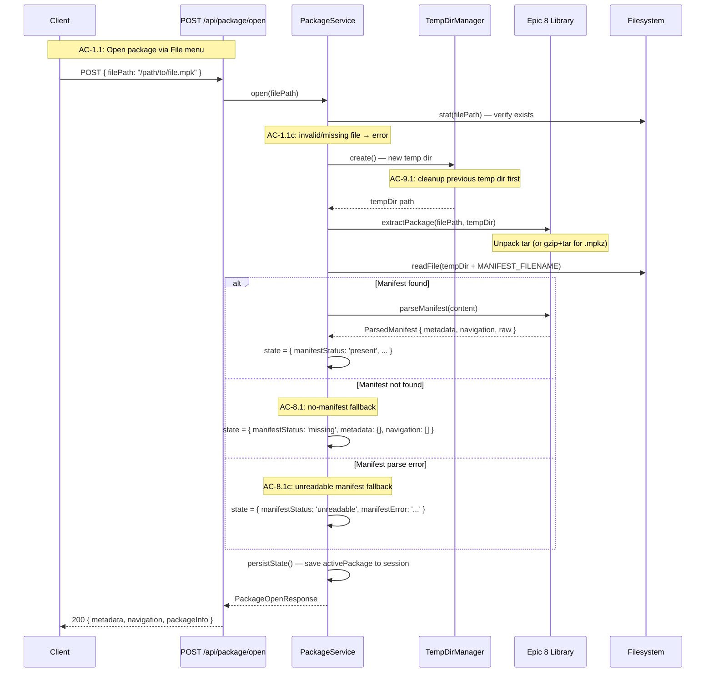
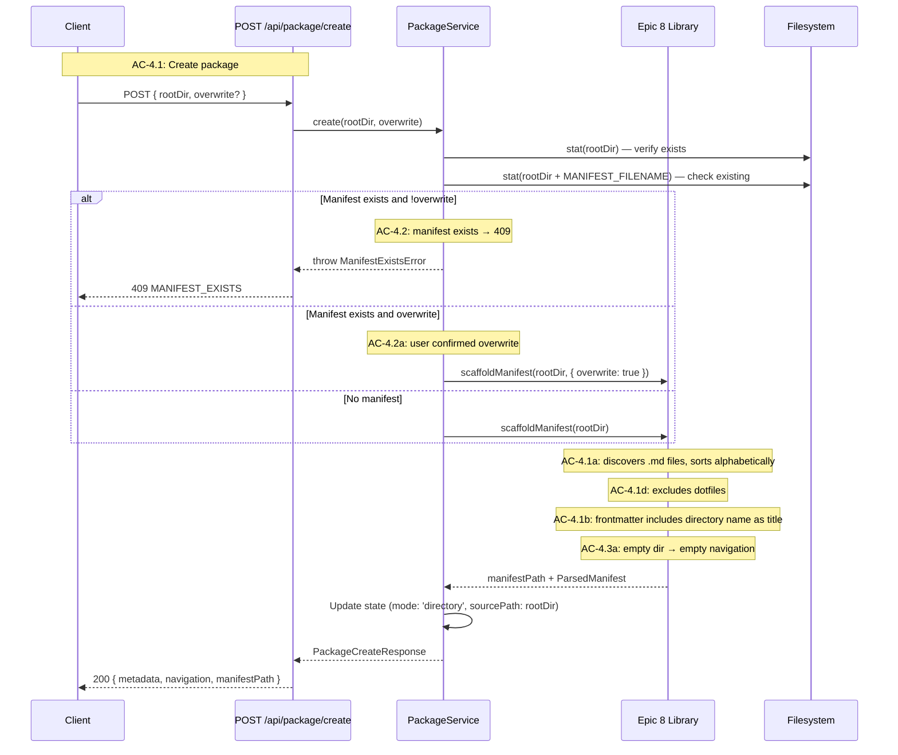
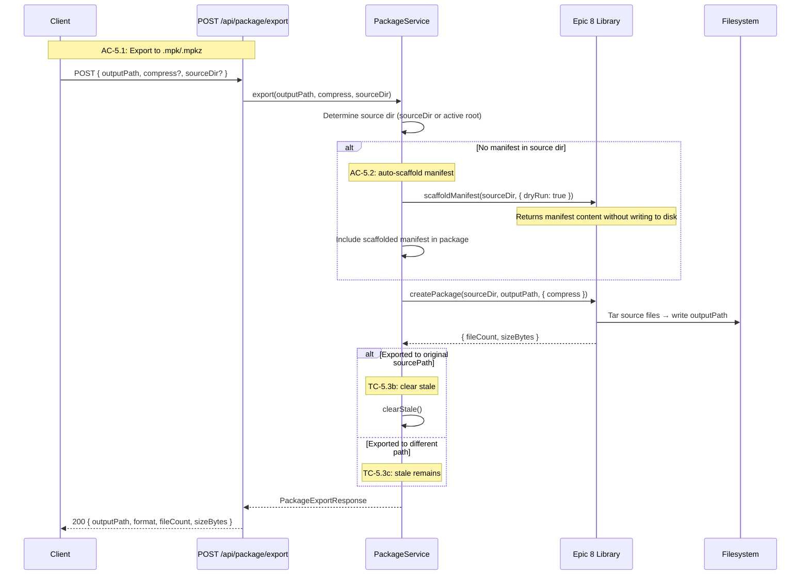
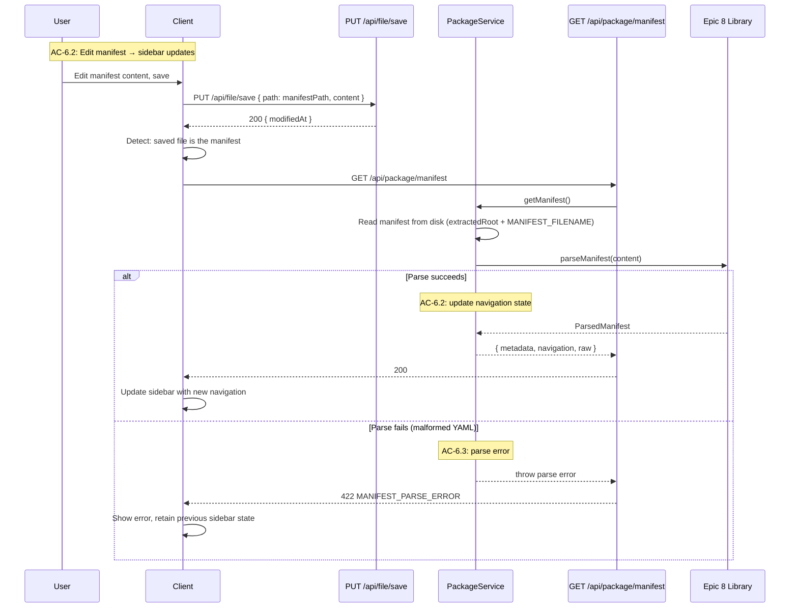

# Technical Design — Server Companion: Package Viewer Integration

This companion document details the server-side implementation for Epic 9. It covers the package service, temp directory management, route handlers, schemas, session state extension, and server-side flows. For system context, module overview, and work breakdown, see the index (`tech-design.md`).

---

## Schemas: `app/src/server/schemas/package.ts`

All package request/response types are defined as Zod schemas in a dedicated file, following the existing pattern in `schemas/index.ts`. The schemas are imported by routes for validation and by `shared/types.ts` for client consumption.

```typescript
import { z } from 'zod/v4';
import { AbsolutePathSchema } from './index.js';

// --- Package Open ---

export const PackageOpenRequestSchema = z.object({
  filePath: AbsolutePathSchema,
});

export const ManifestMetadataSchema = z.object({
  title: z.string().optional(),
  version: z.string().optional(),
  author: z.string().optional(),
  description: z.string().optional(),
  status: z.string().optional(),
});

export const NavigationNodeSchema: z.ZodType = z.lazy(() =>
  z.object({
    displayName: z.string(),
    filePath: z.string().optional(),
    children: z.array(NavigationNodeSchema),
    isGroup: z.boolean(),
  }),
);

export const PackageInfoSchema = z.object({
  sourcePath: AbsolutePathSchema,
  extractedRoot: AbsolutePathSchema,
  format: z.enum(['mpk', 'mpkz']),
  manifestStatus: z.enum(['present', 'missing', 'unreadable']),
  manifestError: z.string().optional(),
});

export const PackageOpenResponseSchema = z.object({
  metadata: ManifestMetadataSchema,
  navigation: z.array(NavigationNodeSchema),
  packageInfo: PackageInfoSchema,
});

// --- Package Manifest ---

export const PackageManifestResponseSchema = z.object({
  metadata: ManifestMetadataSchema,
  navigation: z.array(NavigationNodeSchema),
  raw: z.string(),
});

// --- Package Create ---

export const PackageCreateRequestSchema = z.object({
  rootDir: AbsolutePathSchema,
  overwrite: z.boolean().optional(),
});

export const PackageCreateResponseSchema = z.object({
  metadata: ManifestMetadataSchema,
  navigation: z.array(NavigationNodeSchema),
  manifestPath: AbsolutePathSchema,
});

// --- Package Export ---

export const PackageExportRequestSchema = z.object({
  outputPath: AbsolutePathSchema,
  compress: z.boolean().optional(),
  sourceDir: AbsolutePathSchema.optional(),
});

export const PackageExportResponseSchema = z.object({
  outputPath: AbsolutePathSchema,
  format: z.enum(['mpk', 'mpkz']),
  fileCount: z.number().int().nonnegative(),
  sizeBytes: z.number().int().nonnegative(),
});

// --- Session State Extension ---

export const ActivePackageSchema = z
  .object({
    sourcePath: AbsolutePathSchema,
    extractedRoot: AbsolutePathSchema,
    format: z.enum(['mpk', 'mpkz']),
    mode: z.enum(['extracted', 'directory']),
    stale: z.boolean(),
    manifestStatus: z.enum(['present', 'missing', 'unreadable']),
  })
  .nullable()
  .default(null);

// --- Error Codes ---

export const PackageErrorCode = {
  INVALID_FILE_PATH: 'INVALID_FILE_PATH',
  INVALID_ARCHIVE: 'INVALID_ARCHIVE',
  FILE_NOT_FOUND: 'FILE_NOT_FOUND',
  EXTRACTION_ERROR: 'EXTRACTION_ERROR',
  NO_ACTIVE_PACKAGE: 'NO_ACTIVE_PACKAGE',
  MANIFEST_NOT_FOUND: 'MANIFEST_NOT_FOUND',
  MANIFEST_PARSE_ERROR: 'MANIFEST_PARSE_ERROR',
  INVALID_DIR_PATH: 'INVALID_DIR_PATH',
  DIR_NOT_FOUND: 'DIR_NOT_FOUND',
  MANIFEST_EXISTS: 'MANIFEST_EXISTS',
  INVALID_OUTPUT_PATH: 'INVALID_OUTPUT_PATH',
  NO_SOURCE: 'NO_SOURCE',
  EXPORT_ERROR: 'EXPORT_ERROR',
} as const;

// --- Inferred Types ---

export type PackageOpenRequest = z.infer<typeof PackageOpenRequestSchema>;
export type PackageOpenResponse = z.infer<typeof PackageOpenResponseSchema>;
export type PackageManifestResponse = z.infer<typeof PackageManifestResponseSchema>;
export type PackageCreateRequest = z.infer<typeof PackageCreateRequestSchema>;
export type PackageCreateResponse = z.infer<typeof PackageCreateResponseSchema>;
export type PackageExportRequest = z.infer<typeof PackageExportRequestSchema>;
export type PackageExportResponse = z.infer<typeof PackageExportResponseSchema>;
export type PackageInfo = z.infer<typeof PackageInfoSchema>;
export type ManifestMetadata = z.infer<typeof ManifestMetadataSchema>;
export type ActivePackage = z.infer<typeof ActivePackageSchema>;
```

These schemas mirror the epic's data contracts precisely. The `ManifestMetadataSchema` and `NavigationNodeSchema` duplicate Epic 8's types as Zod schemas — this is intentional. Epic 8 produces TypeScript interfaces; Epic 9 needs Zod schemas for Fastify route validation. The shapes match exactly.

---

## Error Classes: `app/src/server/utils/errors.ts`

Add package-specific error classes alongside the existing ones. These follow the established pattern (named error classes with descriptive messages).

```typescript
// Additions to errors.ts

export class PackageNotFoundError extends Error {
  constructor(filePath: string) {
    super(`Package file not found: ${filePath}`);
    this.name = 'PackageNotFoundError';
  }
}

export class InvalidArchiveError extends Error {
  constructor(filePath: string, cause?: string) {
    super(`Invalid archive: ${filePath}${cause ? ` (${cause})` : ''}`);
    this.name = 'InvalidArchiveError';
  }
}

export class ExtractionError extends Error {
  constructor(filePath: string, cause?: string) {
    super(`Extraction failed: ${filePath}${cause ? ` (${cause})` : ''}`);
    this.name = 'ExtractionError';
  }
}

export class NoActivePackageError extends Error {
  constructor() {
    super('No package is currently open');
    this.name = 'NoActivePackageError';
  }
}

export class ManifestExistsError extends Error {
  constructor(path: string) {
    super(`Manifest already exists: ${path}`);
    this.name = 'ManifestExistsError';
  }
}

export class ManifestNotFoundError extends Error {
  constructor() {
    super('Active package has no manifest file');
    this.name = 'ManifestNotFoundError';
  }
}

export class ManifestParseError extends Error {
  constructor(cause?: string) {
    super(`Manifest could not be parsed${cause ? `: ${cause}` : ''}`);
    this.name = 'ManifestParseError';
  }
}
```

The `PackageErrorCode` constants are defined in `schemas/package.ts` (above) alongside the schemas they're used with. The error classes here are thrown by the service layer and caught by route handlers to produce the appropriate error code + HTTP status response.

---

## TempDirManager: `app/src/server/services/temp-dir.service.ts`

The TempDirManager handles the lifecycle of temp directories for extracted packages. It tracks the currently active temp directory, creates new ones, cleans up previous ones on switch, and performs startup cleanup of stale directories from crashed sessions.

All temp directories are created under a common parent: `os.tmpdir()/mdv-pkg-XXXXXX`. The parent prefix `mdv-pkg-` is the stable identifier used by startup cleanup to find stale directories.

```typescript
import * as fs from 'node:fs/promises';
import os from 'node:os';
import path from 'node:path';

const TEMP_PREFIX = 'mdv-pkg-';

export class TempDirManager {
  private activeTempDir: string | null = null;

  /**
   * Create a new temp directory for an extracted package.
   * If a previous temp dir exists, it is cleaned up first.
   *
   * Returns the absolute path to the new temp directory.
   * Covers: AC-9.1 (cleanup on switch), used by PackageService.open()
   */
  async create(): Promise<string> {
    await this.cleanup();
    const tempDir = await fs.mkdtemp(path.join(os.tmpdir(), TEMP_PREFIX));
    this.activeTempDir = tempDir;
    return tempDir;
  }

  /**
   * Remove the currently active temp directory (if any).
   * Called on package switch, folder open, or app shutdown.
   * Covers: AC-9.1
   */
  async cleanup(): Promise<void> {
    if (this.activeTempDir) {
      const dir = this.activeTempDir;
      this.activeTempDir = null;
      try {
        await fs.rm(dir, { recursive: true, force: true });
      } catch (err) {
        // Log but don't crash — cleanup failures are non-fatal (NFR: Reliability)
        console.warn(`Failed to cleanup temp directory ${dir}:`, err);
      }
    }
  }

  /**
   * Get the currently active temp directory path, or null if none.
   */
  getActive(): string | null {
    return this.activeTempDir;
  }

  /**
   * Set the active temp dir without creating a new one.
   * Used on startup to restore a persisted extracted package.
   */
  setActive(dir: string): void {
    this.activeTempDir = dir;
  }

  /**
   * Remove all stale temp directories from previous sessions.
   * Called on app startup. Identifies stale dirs by the TEMP_PREFIX pattern
   * and removes any that aren't the currently active one.
   * Covers: AC-9.2
   */
  async cleanupStale(): Promise<void> {
    const tmpBase = os.tmpdir();
    try {
      const entries = await fs.readdir(tmpBase);
      const staleDirs = entries.filter(
        (name) =>
          name.startsWith(TEMP_PREFIX) &&
          path.join(tmpBase, name) !== this.activeTempDir,
      );
      await Promise.all(
        staleDirs.map((name) =>
          fs.rm(path.join(tmpBase, name), { recursive: true, force: true }).catch((err) => {
            console.warn(`Failed to cleanup stale temp directory ${name}:`, err);
          }),
        ),
      );
    } catch (err) {
      console.warn('Failed to enumerate stale temp directories:', err);
    }
  }
}
```

The lifecycle is:
1. **Create** (`create()`): called by `PackageService.open()`. Cleans up any existing temp dir first.
2. **Cleanup on switch** (`cleanup()`): called when the user opens a different package or switches to a folder.
3. **Startup cleanup** (`cleanupStale()`): called during server boot. Scans tmpdir for `mdv-pkg-*` dirs and removes any that aren't the restored active one.
4. **Graceful shutdown** (`cleanup()`): called from Fastify's `onClose` hook.

This answers **Q1 (Temp directory lifecycle)**: temp dirs are cleaned up on package switch (create new → cleanup old), on app shutdown (Fastify onClose), and on startup (stale cleanup). The `mdv-pkg-` prefix is the stable identifier for stale detection. Crash recovery is handled by startup cleanup — if the app crashes, the temp dir persists until the next startup.

---

## PackageService: `app/src/server/services/package.service.ts`

The PackageService is the central service for all package operations. It wraps Epic 8's library functions with viewer-specific concerns: temp directory management, active package state tracking, stale detection, and session persistence.

### Active Package State (Q6)

The service maintains in-memory state for the currently active package:

```typescript
interface ActivePackageState {
  sourcePath: string;       // original .mpk/.mpkz path (or directory path for dir-mode)
  extractedRoot: string;    // temp dir path (or == sourcePath for dir-mode)
  format: 'mpk' | 'mpkz';
  mode: 'extracted' | 'directory';
  manifestStatus: 'present' | 'missing' | 'unreadable';
  manifestError?: string;
  stale: boolean;
  navigation: NavigationNode[];
  metadata: ManifestMetadata;
}
```

This state is:
- **In memory** during runtime (accessed by routes)
- **Persisted** to session state as `activePackage` (source path, extracted root, format, mode, stale) for restart recovery
- **Not persisted**: navigation and metadata (re-parsed from manifest on restore)

### Stale Tracking (Q7)

Stale detection uses a **flag-on-write** approach, not file modification time comparison. When any file in the extracted temp directory is saved (via the existing `/api/file/save` endpoint), the PackageService is notified and sets `stale = true`. This is simpler and more reliable than comparing timestamps.

The mechanism: after a successful file save, the server checks if the saved file's path is under the active package's `extractedRoot`. If yes, it calls `packageService.markStale()`. The stale flag is persisted in the session so it survives restarts.

This integration is implemented as a Fastify `onResponse` hook on the `PUT /api/file` route (or equivalently, in the `buildApp()` setup). The hook fires after every successful file save and performs the path prefix check:

```typescript
// In buildApp() — after PackageService is created:
app.addHook('onResponse', async (request, reply) => {
  // Only check successful file saves
  if (
    request.method === 'PUT' &&
    request.url === '/api/file' &&
    reply.statusCode === 200
  ) {
    const state = packageService.getState();
    if (
      state &&
      state.mode === 'extracted' &&
      !state.stale
    ) {
      const savedPath = (request.body as { path?: string })?.path;
      if (savedPath && savedPath.startsWith(state.extractedRoot)) {
        packageService.markStale();
      }
    }
  }
});
```

This server-side hook ensures the stale flag is persisted to the session regardless of whether the client detects it. The client also sets `packageState.stale = true` locally for immediate UI responsiveness (see Client Companion §Manifest Re-Sync Strategy), but the server-side hook is the authoritative persistence mechanism.

The stale flag clears when:
- The user re-exports to the **original** source path (`sourcePath`) — TC-5.3b
- The flag does NOT clear when exporting to a different path — TC-5.3c
- Directory-mode packages never show stale (they're edited in place) — TC-7.2c

### Service Interface

```typescript
import type { ManifestMetadata, NavigationNode, ParsedManifest } from '@md-viewer/package'; // Epic 8
import type { TempDirManager } from './temp-dir.service.js';
import type { SessionService } from './session.service.js';

export class PackageService {
  private state: ActivePackageState | null = null;

  constructor(
    private readonly tempDirManager: TempDirManager,
    private readonly sessionService: SessionService,
  ) {}

  /**
   * Open a .mpk or .mpkz package.
   * Extracts to a temp directory, parses the manifest, stores active state.
   *
   * Covers: AC-1.1 (open via File menu), AC-1.2 (drag-and-drop), AC-1.3 (CLI),
   *         AC-8.1 (no-manifest fallback)
   *
   * @throws PackageNotFoundError if filePath doesn't exist
   * @throws InvalidArchiveError if file is not a valid tar/gzip-tar
   * @throws ExtractionError if extraction fails
   */
  async open(filePath: string): Promise<PackageOpenResponse> {
    throw new NotImplementedError('PackageService.open');
  }

  /**
   * Get the current package's parsed manifest.
   * Re-reads and re-parses the manifest file from the extracted root.
   * Used for sidebar re-sync after manifest edits.
   *
   * Covers: AC-6.2 (manifest edit updates sidebar), AC-6.3 (parse error),
   *         AC-6.4 (empty navigation)
   *
   * @throws NoActivePackageError if no package is open
   */
  async getManifest(): Promise<PackageManifestResponse> {
    throw new NotImplementedError('PackageService.getManifest');
  }

  /**
   * Create a new package by scaffolding a manifest in a directory.
   * Uses Epic 8's scaffoldManifest().
   *
   * Covers: AC-4.1 (scaffold), AC-4.2 (overwrite), AC-4.3 (empty dir)
   *
   * @throws ManifestExistsError if manifest exists and overwrite is not true
   */
  async create(rootDir: string, overwrite?: boolean): Promise<PackageCreateResponse> {
    throw new NotImplementedError('PackageService.create');
  }

  /**
   * Export the current root or specified directory to a .mpk or .mpkz file.
   *
   * Covers: AC-5.1 (export), AC-5.2 (auto-scaffold), AC-5.3 (re-export)
   */
  async export(
    outputPath: string,
    compress?: boolean,
    sourceDir?: string,
  ): Promise<PackageExportResponse> {
    throw new NotImplementedError('PackageService.export');
  }

  /**
   * Mark the active extracted package as stale.
   * Called after any file save in the extracted temp directory.
   * Covers: AC-7.2
   */
  markStale(): void {
    if (this.state && this.state.mode === 'extracted') {
      this.state.stale = true;
      // Persist stale flag to session asynchronously
      this.persistState();
    }
  }

  /**
   * Clear the stale flag. Called after re-export to the original source path.
   * Covers: TC-5.3b
   */
  clearStale(): void {
    if (this.state) {
      this.state.stale = false;
      this.persistState();
    }
  }

  /**
   * Get the current active package state, or null if no package is open.
   */
  getState(): ActivePackageState | null {
    return this.state;
  }

  /**
   * Close the current package. Cleans up temp dir, clears state.
   * Called when switching to a folder or opening a different package.
   * Covers: AC-9.1
   */
  async close(): Promise<void> {
    if (this.state?.mode === 'extracted') {
      await this.tempDirManager.cleanup();
    }
    this.state = null;
    await this.persistState();
  }

  /**
   * Restore active package state from session on startup.
   * Re-validates the extracted root exists, re-parses the manifest.
   */
  async restore(): Promise<void> {
    throw new NotImplementedError('PackageService.restore');
  }

  private async persistState(): Promise<void> {
    // Persist activePackage to session via sessionService
  }
}
```

### Package Open Flow (Server Side)



### CLI Argument Detection (Q11)

The app's entry point (`src/server/index.ts`) currently processes a CLI argument as a folder path and calls `sessionService.setRoot()`. Extension for package support:

```typescript
// In startServer() or its caller
const cliArg = process.argv[2];
if (cliArg) {
  const ext = path.extname(cliArg).toLowerCase();
  if (ext === '.mpk' || ext === '.mpkz') {
    // Open as package
    await packageService.open(path.resolve(cliArg));
  } else {
    // Existing behavior: set as root
    await sessionService.setRoot(path.resolve(cliArg));
  }
}
```

Detection is by file extension (`.mpk` or `.mpkz`), not by probing the file type. This is simple and unambiguous — the file extensions are the canonical identifiers for the package format.

---

## Route Handlers: `app/src/server/routes/package.ts`

The package route plugin follows the established Fastify pattern: a plugin function that registers typed routes with Zod schema validation.

```typescript
import type { FastifyInstance } from 'fastify';
import type { ZodTypeProvider } from 'fastify-type-provider-zod';
import { ErrorResponseSchema } from '../schemas/index.js';
import {
  PackageCreateRequestSchema,
  PackageCreateResponseSchema,
  PackageErrorCode,
  PackageExportRequestSchema,
  PackageExportResponseSchema,
  PackageManifestResponseSchema,
  PackageOpenRequestSchema,
  PackageOpenResponseSchema,
} from '../schemas/package.js';
import type { PackageService } from '../services/package.service.js';
import {
  ExtractionError,
  InvalidArchiveError,
  InvalidPathError,
  ManifestExistsError,
  ManifestNotFoundError,
  ManifestParseError,
  NoActivePackageError,
  PackageNotFoundError,
  isNotFoundError,
  toApiError,
} from '../utils/errors.js';

export interface PackageRoutesOptions {
  packageService: PackageService;
}

export async function packageRoutes(app: FastifyInstance, opts: PackageRoutesOptions) {
  const { packageService } = opts;
  const typedApp = app.withTypeProvider<ZodTypeProvider>();

  // POST /api/package/open
  typedApp.post('/api/package/open', {
    schema: {
      body: PackageOpenRequestSchema,
      response: {
        200: PackageOpenResponseSchema,
        400: ErrorResponseSchema,
        404: ErrorResponseSchema,
        500: ErrorResponseSchema,
      },
    },
  }, async (request, reply) => {
    try {
      const result = await packageService.open(request.body.filePath);
      return result;
    } catch (err) {
      if (err instanceof PackageNotFoundError) {
        return reply.code(404).send(
          toApiError(PackageErrorCode.FILE_NOT_FOUND, err.message),
        );
      }
      if (err instanceof InvalidArchiveError) {
        return reply.code(400).send(
          toApiError(PackageErrorCode.INVALID_ARCHIVE, err.message),
        );
      }
      if (err instanceof ExtractionError) {
        return reply.code(500).send(
          toApiError(PackageErrorCode.EXTRACTION_ERROR, err.message),
        );
      }
      return reply.code(500).send(
        toApiError(PackageErrorCode.EXTRACTION_ERROR, 'Unexpected error opening package'),
      );
    }
  });

  // GET /api/package/manifest
  typedApp.get('/api/package/manifest', {
    schema: {
      response: {
        200: PackageManifestResponseSchema,
        404: ErrorResponseSchema,
        422: ErrorResponseSchema,
      },
    },
  }, async (_request, reply) => {
    try {
      const result = await packageService.getManifest();
      return result;
    } catch (err) {
      if (err instanceof NoActivePackageError) {
        return reply.code(404).send(
          toApiError(PackageErrorCode.NO_ACTIVE_PACKAGE, err.message),
        );
      }
      if (err instanceof ManifestNotFoundError) {
        return reply.code(404).send(
          toApiError(PackageErrorCode.MANIFEST_NOT_FOUND, err.message),
        );
      }
      if (err instanceof ManifestParseError) {
        return reply.code(422).send(
          toApiError(PackageErrorCode.MANIFEST_PARSE_ERROR, err.message),
        );
      }
      return reply.code(500).send(
        toApiError(PackageErrorCode.MANIFEST_PARSE_ERROR, 'Failed to read manifest'),
      );
    }
  });

  // POST /api/package/create
  typedApp.post('/api/package/create', {
    schema: {
      body: PackageCreateRequestSchema,
      response: {
        200: PackageCreateResponseSchema,
        400: ErrorResponseSchema,
        404: ErrorResponseSchema,
        409: ErrorResponseSchema,
      },
    },
  }, async (request, reply) => {
    try {
      const result = await packageService.create(
        request.body.rootDir,
        request.body.overwrite,
      );
      return result;
    } catch (err) {
      if (err instanceof ManifestExistsError) {
        return reply.code(409).send(
          toApiError(PackageErrorCode.MANIFEST_EXISTS, err.message),
        );
      }
      if (err instanceof InvalidPathError) {
        return reply.code(400).send(
          toApiError(PackageErrorCode.INVALID_DIR_PATH, err.message),
        );
      }
      if (isNotFoundError(err)) {
        return reply.code(404).send(
          toApiError(PackageErrorCode.DIR_NOT_FOUND, `Directory not found: ${request.body.rootDir}`),
        );
      }
      return reply.code(400).send(
        toApiError(PackageErrorCode.INVALID_DIR_PATH, err instanceof Error ? err.message : 'Invalid directory'),
      );
    }
  });

  // POST /api/package/export
  typedApp.post('/api/package/export', {
    schema: {
      body: PackageExportRequestSchema,
      response: {
        200: PackageExportResponseSchema,
        400: ErrorResponseSchema,
        500: ErrorResponseSchema,
      },
    },
  }, async (request, reply) => {
    try {
      const result = await packageService.export(
        request.body.outputPath,
        request.body.compress,
        request.body.sourceDir,
      );
      return result;
    } catch (err) {
      if (err instanceof InvalidPathError) {
        return reply.code(400).send(
          toApiError(PackageErrorCode.INVALID_OUTPUT_PATH, err.message),
        );
      }
      if (err instanceof NoActivePackageError) {
        return reply.code(400).send(
          toApiError(PackageErrorCode.NO_SOURCE, 'No active root or package to export'),
        );
      }
      return reply.code(500).send(
        toApiError(PackageErrorCode.EXPORT_ERROR, err instanceof Error ? err.message : 'Export failed'),
      );
    }
  });
}
```

### Route Registration in `app.ts`

```typescript
// In buildApp():
import { packageRoutes } from './routes/package.js';
import { PackageService } from './services/package.service.js';
import { TempDirManager } from './services/temp-dir.service.js';

// After sessionService is created:
const tempDirManager = new TempDirManager();
const packageService = new PackageService(tempDirManager, sessionService);

// Register routes:
await app.register(packageRoutes, { packageService });

// Cleanup on shutdown:
app.addHook('onClose', async () => {
  await tempDirManager.cleanup();
});

// Startup stale cleanup:
await tempDirManager.cleanupStale();
```

The `PackageService` instance is shared between the route plugin and the app's lifecycle hooks. It's injected via the options pattern, consistent with how `SessionService` is passed to routes.

---

## Session State Extension

The `SessionStateSchema` in `schemas/index.ts` is extended with the `activePackage` field:

```typescript
// Add to SessionStateSchema definition:
activePackage: ActivePackageSchema,
```

This adds to the persisted session at `~/Library/Application Support/md-viewer/session.json`. The field is nullable with a default of null, so existing session files without this field parse correctly (Zod's `.default(null)` handles this).

The `getDefaultSession()` function in `session.service.ts` adds `activePackage: null`.

On bootstrap, the client receives `activePackage` in the `GET /api/session` response. If non-null, the client initializes in the correct sidebar mode based on `manifestStatus` — package mode when `'present'`, fallback mode when `'missing'` or `'unreadable'`. The server's `PackageService.restore()` re-validates the extracted root (verifying the temp dir still exists) and re-parses the manifest to populate navigation state. If the manifest was changed since the last session (e.g., the user fixed a malformed manifest outside the app), `restore()` updates `manifestStatus` accordingly and persists the updated state.

---

## Flow 4: Package Creation (Server Side)



The `create()` flow operates in directory mode — no extraction, no temp directory. The source directory becomes the package root directly. The `activePackage` session state records `mode: 'directory'` and sets `extractedRoot` equal to `sourcePath`.

---

## Flow 5: Export to Package (Server Side)



For AC-5.2 (auto-scaffold on export), the manifest is scaffolded in memory or to a temporary location and included in the package — it is NOT written to the source directory. This is explicitly required by TC-5.2b ("no manifest file is created in the source directory"). The Epic 8 library's `scaffoldManifest()` may need a `dryRun` or `toString()` option. If not available, the PackageService generates the manifest content inline using Epic 8's discovery logic and includes it as a virtual file in the tar.

---

## Flow 6: Manifest Editing — Server Side (Q2)

**Manifest update propagation** uses a **client-initiated re-fetch** pattern, not server push. When the user saves the manifest file (via the existing `/api/file/save` endpoint), the client detects that the saved file is the manifest (by comparing the file path to the known manifest path) and re-fetches `GET /api/package/manifest` to get the re-parsed navigation tree.



This approach is simpler than WebSocket push and more consistent with the app's existing request/response patterns. The client already knows the manifest path (from `PackageOpenResponse.packageInfo.extractedRoot` + `MANIFEST_FILENAME`), so detecting "this save was the manifest" is a straightforward path comparison.

---

## Session State Restoration on Startup

On app startup, the server's `PackageService.restore()` runs:

1. Read `activePackage` from the loaded session state
2. If null → no package to restore, done
3. If `mode === 'directory'` → verify the source directory exists. If exists, re-parse the manifest to populate `navigation` and `metadata` in memory. If not, clear `activePackage` from session.
4. If `mode === 'extracted'` → verify the `extractedRoot` temp dir exists. If it does, re-parse the manifest. Set the temp dir as active in `TempDirManager`. If the temp dir is gone (crash cleanup), clear `activePackage` from session.
5. The `stale` flag is preserved from the persisted session — no recalculation needed.

The client receives the restored `activePackage` in the `GET /api/session` bootstrap response. If non-null, the client also calls `GET /api/package/manifest` to get the navigation tree for the sidebar.
