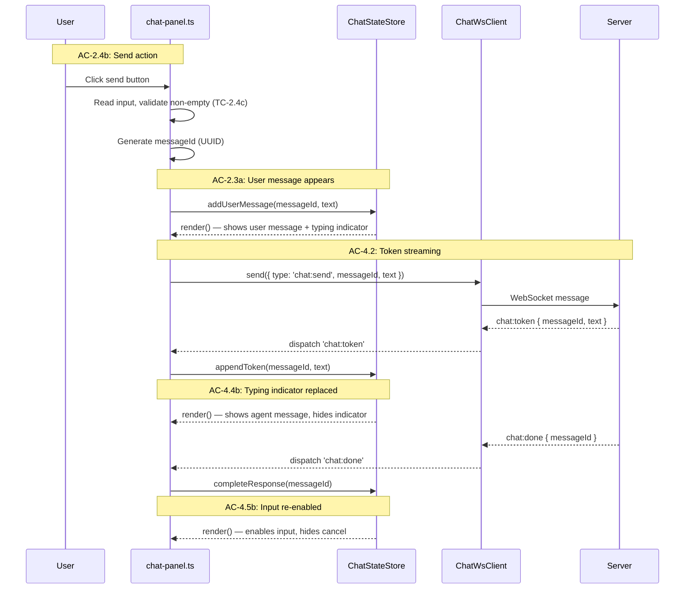
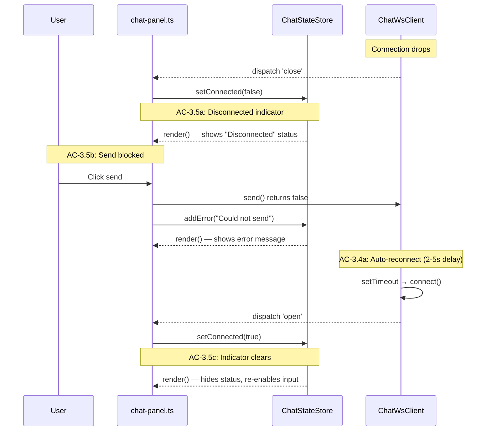

# Technical Design — Client (Epic 10: Chat Plumbing)

Companion to `tech-design.md`. This document covers client-side implementation depth: chat panel layout, WebSocket client, conversation display, input handling, and state management.

---

## Chat Panel Layout

The chat panel extends the existing layout grid. The current `#main` element uses a three-column CSS grid: `sidebar | sidebar-resizer | workspace`. The chat panel adds two more columns: `chat-resizer | chat-panel`, creating a five-column grid.

### DOM Creation

The chat panel DOM is created dynamically by `mountChatPanel()` — **no chat-related elements exist in `index.html`**. When the feature flag is disabled, `mountChatPanel()` is never called, so no chat DOM exists in the page. This satisfies AC-1.3 (TC-1.3a): when the flag is off, no chat panel element exists in the DOM.

`mountChatPanel()` creates the following DOM structure via `document.createElement()` and appends it to `#main`:

```
#chat-resizer  [role="separator", aria-label="Resize chat panel", tabindex=0]
#chat-panel    <aside>
  .chat-header
    .chat-title           "Spec Steward"
    .chat-header-actions
      .chat-clear-btn     <button> "Clear"
  .chat-status            [hidden]
  .chat-messages
  .chat-input-area
    .chat-input           <textarea placeholder="Send a message..." rows=3>
    .chat-send-btn        <button> "Send"
    .chat-cancel-btn      <button> "Cancel" [hidden]
```

All elements are created with `document.createElement()` and assembled in a `createChatDom(main)` helper function. The cleanup function returned by `mountChatPanel()` removes these elements from the DOM entirely, restoring the original three-column layout.

### CSS Grid Extension

```css
/* app/src/client/styles/chat.css */

/* Extend #main grid when chat is visible */
#main.chat-enabled {
  grid-template-columns:
    var(--sidebar-width, 15rem)  /* sidebar */
    0px                          /* sidebar-resizer */
    minmax(0, 1fr)               /* workspace */
    0px                          /* chat-resizer */
    var(--chat-width, 20rem);    /* chat-panel */
}

/* Chat resizer — mirrors sidebar-resizer pattern */
#chat-resizer {
  grid-column: 4;
  width: 4px;
  cursor: col-resize;
  background: var(--color-border);
  transition: background 0.15s;
  z-index: 10;
}

#chat-resizer:hover,
#chat-resizer.dragging {
  background: var(--color-accent);
}

/* Chat panel */
#chat-panel {
  grid-column: 5;
  display: flex;
  flex-direction: column;
  min-width: 0;
  min-height: 0;
  border-left: 1px solid var(--color-border);
  background: var(--color-bg-primary);
}

/* Chat header */
.chat-header {
  display: flex;
  align-items: center;
  justify-content: space-between;
  padding: 0.5rem 0.75rem;
  border-bottom: 1px solid var(--color-border);
  flex-shrink: 0;
}

.chat-title {
  font-weight: 600;
  font-size: 0.875rem;
}

/* Chat status indicator (disconnected, provider starting, etc.) */
.chat-status {
  padding: 0.25rem 0.75rem;
  font-size: 0.75rem;
  color: var(--color-text-secondary);
  background: var(--color-bg-secondary);
  border-bottom: 1px solid var(--color-border);
  flex-shrink: 0;
}

.chat-status.error {
  color: var(--color-error);
  background: var(--color-bg-tertiary);
}

/* Chat messages area — scrollable */
.chat-messages {
  flex: 1;
  overflow-y: auto;
  padding: 0.75rem;
  display: flex;
  flex-direction: column;
  gap: 0.75rem;
}

/* Message bubbles */
.chat-message {
  max-width: 90%;
  padding: 0.5rem 0.75rem;
  border-radius: 0.5rem;
  font-size: 0.875rem;
  line-height: 1.5;
  white-space: pre-wrap;
  word-wrap: break-word;
}

.chat-message.user {
  align-self: flex-end;
  background: var(--color-accent);
  color: #fff;
}

.chat-message.agent {
  align-self: flex-start;
  background: var(--color-bg-secondary);
  color: var(--color-text-primary);
}

/* Loading indicator */
.chat-typing-indicator {
  align-self: flex-start;
  padding: 0.5rem 0.75rem;
  font-size: 0.75rem;
  color: var(--color-text-secondary);
  font-style: italic;
}

/* Error message in conversation */
.chat-message.error {
  align-self: center;
  background: var(--color-bg-tertiary);
  color: var(--color-error);
  font-size: 0.75rem;
  text-align: center;
  max-width: 80%;
}

/* Chat input area */
.chat-input-area {
  display: flex;
  gap: 0.5rem;
  padding: 0.5rem 0.75rem;
  border-top: 1px solid var(--color-border);
  flex-shrink: 0;
  align-items: flex-end;
}

.chat-input {
  flex: 1;
  resize: none;
  border: 1px solid var(--color-border);
  border-radius: 0.375rem;
  padding: 0.5rem;
  font-family: inherit;
  font-size: 0.875rem;
  background: var(--color-bg-primary);
  color: var(--color-text-primary);
  min-height: 2.5rem;
  max-height: 8rem;
}

.chat-input:disabled {
  opacity: 0.5;
  cursor: not-allowed;
}

.chat-send-btn,
.chat-cancel-btn,
.chat-clear-btn {
  padding: 0.375rem 0.75rem;
  border-radius: 0.375rem;
  border: 1px solid var(--color-border);
  background: var(--color-bg-secondary);
  color: var(--color-text-primary);
  cursor: pointer;
  font-size: 0.8125rem;
  white-space: nowrap;
}

.chat-send-btn:hover,
.chat-cancel-btn:hover,
.chat-clear-btn:hover {
  background: var(--color-bg-hover);
}

.chat-send-btn:disabled {
  opacity: 0.5;
  cursor: not-allowed;
}

.chat-cancel-btn {
  color: var(--color-error);
  border-color: var(--color-error);
}
```

The CSS uses existing CSS custom properties (`--color-border`, `--color-bg-primary`, `--color-accent`, etc.) from the theme system defined in `themes.css`. No new custom properties are needed except `--chat-width` for the resizable panel width.

The grid change is activated by adding the `chat-enabled` class to `#main` — this is done by `mountChatPanel` when the feature flag is enabled. When the class is absent, the grid remains the original three-column layout.

---

## Chat Resizer

The chat resizer follows the exact same pattern as the existing `sidebar-resizer.ts`. It handles mouse drag events, clamps to min/max widths, and persists the width to localStorage.

```typescript
// app/src/client/steward/chat-resizer.ts

const STORAGE_KEY = 'mdv-chat-width';
const MIN_WIDTH = 200;
const MAX_WIDTH = 600;
const DEFAULT_WIDTH = 320;
const DRAG_THRESHOLD = 3;

/**
 * Mount the chat panel resize handle.
 * Follows the same pattern as sidebar-resizer.ts.
 *
 * Covers: AC-2.2 (TC-2.2a drag, TC-2.2b min/max clamp, TC-2.2c persistence)
 */
export function mountChatResizer(
  resizer: HTMLElement,
  main: HTMLElement,
): () => void {
  const stored = localStorage.getItem(STORAGE_KEY);
  let width = stored
    ? Math.max(MIN_WIDTH, Math.min(MAX_WIDTH, parseInt(stored, 10)))
    : DEFAULT_WIDTH;
  if (Number.isNaN(width)) width = DEFAULT_WIDTH;

  main.style.setProperty('--chat-width', `${width}px`);

  let startX = 0;
  let startWidth = 0;
  let didDrag = false;

  const onMouseMove = (e: MouseEvent) => {
    // Chat resizer drags from right side — delta is inverted
    const delta = startX - e.clientX;
    if (Math.abs(delta) > DRAG_THRESHOLD) didDrag = true;
    width = Math.max(MIN_WIDTH, Math.min(MAX_WIDTH, startWidth + delta));
    main.style.setProperty('--chat-width', `${width}px`);
  };

  const onMouseUp = () => {
    resizer.classList.remove('dragging');
    document.body.style.cursor = '';
    document.body.style.userSelect = '';
    document.removeEventListener('mousemove', onMouseMove);
    document.removeEventListener('mouseup', onMouseUp);
    if (didDrag) {
      try {
        localStorage.setItem(STORAGE_KEY, String(Math.round(width)));
      } catch {
        // localStorage may be unavailable
      }
    }
  };

  const onMouseDown = (e: MouseEvent) => {
    e.preventDefault();
    startX = e.clientX;
    startWidth = width;
    didDrag = false;
    resizer.classList.add('dragging');
    document.body.style.cursor = 'col-resize';
    document.body.style.userSelect = 'none';
    document.addEventListener('mousemove', onMouseMove);
    document.addEventListener('mouseup', onMouseUp);
  };

  resizer.addEventListener('mousedown', onMouseDown);

  return () => {
    resizer.removeEventListener('mousedown', onMouseDown);
    document.removeEventListener('mousemove', onMouseMove);
    document.removeEventListener('mouseup', onMouseUp);
  };
}
```

The key difference from `sidebar-resizer.ts`: the delta is inverted (`startX - e.clientX` instead of `e.clientX - startX`) because the chat panel is on the right side — dragging left increases width, dragging right decreases it.

---

## Chat WebSocket Client

The `ChatWsClient` handles the WebSocket connection to `/ws/chat`. It follows the same structural pattern as the existing `WsClient` (connect, send, on, disconnect, auto-reconnect) but uses the chat message schemas.

```typescript
// app/src/client/steward/chat-ws-client.ts

import {
  ChatServerMessageSchema,
  type ChatClientMessage,
  type ChatServerMessage,
} from '../../server/schemas/index.js';

type ChatServerMessageByType<T extends ChatServerMessage['type']> =
  Extract<ChatServerMessage, { type: T }>;

type ChatWsEventMap = {
  open: { type: 'open' };
  close: { type: 'close' };
  'chat:token': ChatServerMessageByType<'chat:token'>;
  'chat:done': ChatServerMessageByType<'chat:done'>;
  'chat:error': ChatServerMessageByType<'chat:error'>;
  'chat:status': ChatServerMessageByType<'chat:status'>;
};

type ChatWsEventType = keyof ChatWsEventMap;
type ChatWsHandler<T extends ChatWsEventType> = (event: ChatWsEventMap[T]) => void;

const WS_RECONNECT_DELAY_MS = 2_000;
const WS_MAX_RECONNECT_DELAY_MS = 5_000;

/**
 * WebSocket client for the /ws/chat route.
 *
 * Separate from WsClient — different message schemas, different
 * lifecycle, different event types.
 *
 * Covers: AC-3.1 (connection), AC-3.4 (reconnection),
 *         AC-3.5 (disconnected state)
 */
export class ChatWsClient {
  private socket: WebSocket | null = null;
  private readonly handlers = new Map<ChatWsEventType, Set<ChatWsHandler<ChatWsEventType>>>();
  private reconnectTimer: number | null = null;
  private shouldReconnect = true;
  private reconnectAttempts = 0;

  /**
   * Whether the WebSocket connection is open.
   * Used by the chat panel to show/hide disconnected indicator (AC-3.5).
   */
  get connected(): boolean {
    return this.socket?.readyState === WebSocket.OPEN;
  }

  /**
   * Connect to /ws/chat.
   *
   * Covers: AC-3.1 (TC-3.1a — connection established on mount)
   */
  connect(): void {
    this.shouldReconnect = true;

    if (
      this.socket &&
      (this.socket.readyState === WebSocket.CONNECTING ||
        this.socket.readyState === WebSocket.OPEN)
    ) {
      return;
    }

    if (this.reconnectTimer !== null) {
      window.clearTimeout(this.reconnectTimer);
      this.reconnectTimer = null;
    }

    const protocol = location.protocol === 'https:' ? 'wss:' : 'ws:';
    const socket = new WebSocket(`${protocol}//${location.host}/ws/chat`);
    this.socket = socket;

    socket.onopen = () => {
      if (this.socket !== socket) return;
      this.reconnectAttempts = 0;
      this.dispatch('open', { type: 'open' });
    };

    socket.onmessage = (event) => {
      if (typeof event.data !== 'string') return;

      try {
        const parsed = JSON.parse(event.data);
        const result = ChatServerMessageSchema.safeParse(parsed);
        if (!result.success) return;

        const message = result.data;
        this.dispatch(message.type as ChatWsEventType, message as ChatWsEventMap[typeof message.type & ChatWsEventType]);
      } catch {
        // Ignore malformed server messages
      }
    };

    socket.onclose = () => {
      if (this.socket === socket) {
        this.socket = null;
      }

      this.dispatch('close', { type: 'close' });

      if (!this.shouldReconnect) return;

      // Exponential backoff with jitter
      const delay = Math.min(
        WS_RECONNECT_DELAY_MS * Math.pow(1.5, this.reconnectAttempts),
        WS_MAX_RECONNECT_DELAY_MS,
      );
      this.reconnectAttempts++;

      this.reconnectTimer = window.setTimeout(() => {
        this.reconnectTimer = null;
        this.connect();
      }, delay);
    };

    socket.onerror = () => {
      // Reconnect handled by close event
    };
  }

  /**
   * Send a typed message to the server.
   *
   * Returns false if the connection is not open (AC-3.5b).
   */
  send(message: ChatClientMessage): boolean {
    if (this.socket?.readyState !== WebSocket.OPEN) {
      return false;
    }

    this.socket.send(JSON.stringify(message));
    return true;
  }

  /**
   * Subscribe to a server message type.
   * Returns an unsubscribe function.
   */
  on<T extends ChatWsEventType>(type: T, handler: ChatWsHandler<T>): () => void {
    const handlers = this.handlers.get(type) ?? new Set();
    handlers.add(handler as ChatWsHandler<ChatWsEventType>);
    this.handlers.set(type, handlers);

    return () => {
      handlers.delete(handler as ChatWsHandler<ChatWsEventType>);
      if (handlers.size === 0) {
        this.handlers.delete(type);
      }
    };
  }

  /**
   * Disconnect and stop reconnecting.
   */
  disconnect(): void {
    this.shouldReconnect = false;

    if (this.reconnectTimer !== null) {
      window.clearTimeout(this.reconnectTimer);
      this.reconnectTimer = null;
    }

    const socket = this.socket;
    this.socket = null;
    socket?.close();
  }

  private dispatch<T extends ChatWsEventType>(type: T, event: ChatWsEventMap[T]): void {
    const handlers = this.handlers.get(type);
    if (!handlers) return;
    for (const handler of handlers) {
      (handler as ChatWsHandler<T>)(event);
    }
  }
}
```

### Differences from WsClient

| Aspect | WsClient (file watch) | ChatWsClient (chat) |
|--------|----------------------|---------------------|
| URL | `/ws` | `/ws/chat` |
| Message schemas | `ClientWsMessageSchema` / `ServerWsMessageSchema` | `ChatClientMessageSchema` / `ChatServerMessageSchema` |
| Reconnect strategy | Fixed delay (2s) | Exponential backoff with jitter |
| `send()` return | void (fire and forget) | boolean (connection status feedback) |
| Event types | `open`, `close`, `file-change`, `error` | `open`, `close`, `chat:token`, `chat:done`, `chat:error`, `chat:status` |

The exponential backoff prevents rapid reconnection storms if the server is down. The `send()` return value lets the chat panel show feedback when the connection is down (AC-3.5b).

---

## Chat State

The chat panel has its own state management, separate from the main `StateStore`. This keeps Steward concerns isolated from core viewer state — a key architectural constraint from the Technical Architecture document.

```typescript
// app/src/client/steward/chat-state.ts

export interface ChatMessage {
  id: string;
  role: 'user' | 'agent' | 'error';
  text: string;
  /** True while the agent response is still streaming */
  streaming: boolean;
  /** True if the response was cancelled */
  cancelled?: boolean;
}

export interface ChatState {
  messages: ChatMessage[];
  /** Currently streaming response's messageId, or null */
  activeMessageId: string | null;
  /** True while waiting for the first token after send */
  waitingForResponse: boolean;
  /** WebSocket connection state */
  connected: boolean;
  /** Provider status (from chat:status messages) */
  providerStatus: string | null;
}

type ChatStateListener = (state: ChatState) => void;

/**
 * Chat-specific state store.
 * Isolated from the main StateStore to keep Steward concerns separate.
 *
 * Supports: AC-2.3 (conversation display), AC-4.2 (streaming state),
 *           AC-4.4 (waiting state), AC-3.5 (connected state)
 */
export class ChatStateStore {
  private state: ChatState = {
    messages: [],
    activeMessageId: null,
    waitingForResponse: false,
    connected: false,
    providerStatus: null,
  };

  private listeners = new Set<ChatStateListener>();

  get(): ChatState {
    return this.state;
  }

  subscribe(listener: ChatStateListener): () => void {
    this.listeners.add(listener);
    return () => this.listeners.delete(listener);
  }

  /**
   * Add a user message and mark as waiting for response.
   */
  addUserMessage(messageId: string, text: string): void {
    this.update({
      messages: [
        ...this.state.messages,
        { id: messageId, role: 'user', text, streaming: false },
      ],
      activeMessageId: messageId,
      waitingForResponse: true,
    });
  }

  /**
   * Append a token to the active agent message.
   * Creates the agent message on first token (clears waiting state).
   *
   * Covers: AC-4.2a (tokens append), AC-4.4b (indicator disappears)
   */
  appendToken(messageId: string, text: string): void {
    const existing = this.state.messages.find(
      (m) => m.id === messageId && m.role === 'agent',
    );

    if (existing) {
      // Append to existing agent message
      const messages = this.state.messages.map((m) =>
        m === existing ? { ...m, text: m.text + text } : m,
      );
      this.update({ messages, waitingForResponse: false });
    } else {
      // Create new agent message on first token
      const messages = [
        ...this.state.messages,
        { id: messageId, role: 'agent' as const, text, streaming: true },
      ];
      this.update({ messages, waitingForResponse: false });
    }
  }

  /**
   * Mark a response as complete.
   *
   * Covers: AC-4.2b (final response), AC-4.5b (input re-enabled)
   */
  completeResponse(messageId: string, cancelled?: boolean): void {
    const messages = this.state.messages.map((m) =>
      m.id === messageId && m.role === 'agent'
        ? { ...m, streaming: false, ...(cancelled ? { cancelled: true } : {}) }
        : m,
    );
    this.update({
      messages,
      activeMessageId: null,
      waitingForResponse: false,
    });
  }

  /**
   * Add an error message to the conversation.
   */
  addError(messageId: string | undefined, message: string): void {
    const messages = [
      ...this.state.messages,
      {
        id: messageId ?? crypto.randomUUID(),
        role: 'error' as const,
        text: message,
        streaming: false,
      },
    ];
    this.update({
      messages,
      activeMessageId: null,
      waitingForResponse: false,
    });
  }

  /**
   * Clear all messages.
   *
   * Covers: AC-6.1a (clear removes all messages)
   */
  clearMessages(): void {
    this.update({
      messages: [],
      activeMessageId: null,
      waitingForResponse: false,
    });
  }

  setConnected(connected: boolean): void {
    this.update({ connected });
  }

  setProviderStatus(status: string | null): void {
    this.update({ providerStatus: status });
  }

  private update(partial: Partial<ChatState>): void {
    this.state = { ...this.state, ...partial };
    for (const listener of this.listeners) {
      listener(this.state);
    }
  }
}
```

The state store follows the same pattern as the main `StateStore` — immutable updates, synchronous subscription, simple partial merging. The `ChatMessage` type includes a `streaming` flag to distinguish in-progress responses from completed ones, and a `role` discriminator for styling.

---

## Chat Panel

The chat panel module mounts the UI, wires events, and manages the render cycle. It's the largest client-side module — it coordinates the WebSocket client, state store, and DOM updates.

```typescript
// app/src/client/steward/chat-panel.ts

import { ChatWsClient } from './chat-ws-client.js';
import { ChatStateStore, type ChatState } from './chat-state.js';
import { mountChatResizer } from './chat-resizer.js';

export interface ChatPanelController {
  /** Wire a WebSocket client to this panel (Chunk 2/3). */
  connectWs(wsClient: ChatWsClient): void;
  /** Unmount and clean up. */
  destroy(): void;
}

/**
 * Mount the chat panel visual shell.
 * Creates all chat DOM elements dynamically and wires local UI interactions.
 * Does NOT create a WebSocket connection — call connectWs() separately.
 *
 * Covers: AC-2.1 (panel visible), AC-2.3 (conversation display),
 *         AC-2.4 (input), AC-2.5 (auto-scroll),
 *         AC-4.2 (streaming display), AC-4.4 (loading indicator),
 *         AC-4.5 (input disabled during streaming),
 *         AC-6.1 (clear), AC-6.2 (cancel visibility), AC-6.3 (clear during streaming)
 */
export function mountChatPanel(): ChatPanelController {
  const main = document.getElementById('main')!;

  // Create all chat DOM elements dynamically (FIX 1: AC-1.3 compliance)
  const { resizer, panel, messagesEl, inputEl, sendBtn, cancelBtn, clearBtn, statusEl } =
    createChatDom(main);

  main.classList.add('chat-enabled');

  // Initialize state (no WebSocket yet — Chunk 1 independence)
  const chatState = new ChatStateStore();
  let wsClient: ChatWsClient | null = null;
  const wsCleanups: Array<() => void> = [];

  // Mount resizer
  const unmountResizer = mountChatResizer(resizer, main);

  // --- Auto-scroll tracking ---
  let userScrolledUp = false;
  const SCROLL_THRESHOLD = 20; // pixels from bottom

  messagesEl.addEventListener('scroll', () => {
    const { scrollTop, scrollHeight, clientHeight } = messagesEl;
    userScrolledUp = scrollHeight - scrollTop - clientHeight > SCROLL_THRESHOLD;
  });

  function scrollToBottom(): void {
    if (!userScrolledUp) {
      messagesEl.scrollTop = messagesEl.scrollHeight;
    }
  }

  // --- Render function ---

  function render(state: ChatState): void {
    // Render messages
    renderMessages(messagesEl, state);

    // Status indicator (AC-3.5a, AC-5.7)
    if (!state.connected) {
      statusEl.hidden = false;
      statusEl.textContent = 'Disconnected — reconnecting...';
      statusEl.classList.add('error');
    } else if (state.providerStatus === 'provider:starting') {
      statusEl.hidden = false;
      statusEl.textContent = 'Starting provider...';
      statusEl.classList.remove('error');
    } else if (state.providerStatus === 'provider:crashed') {
      statusEl.hidden = false;
      statusEl.textContent = 'Provider crashed — send a message to restart';
      statusEl.classList.add('error');
    } else if (state.providerStatus === 'provider:not-found') {
      statusEl.hidden = false;
      statusEl.textContent = 'Claude CLI not found — install and add to PATH';
      statusEl.classList.add('error');
    } else {
      statusEl.hidden = true;
    }

    // Input state (AC-4.5, AC-3.5b)
    const inputDisabled = state.activeMessageId !== null || !state.connected;
    inputEl.disabled = inputDisabled;
    sendBtn.disabled = inputDisabled;

    // Cancel button visibility (AC-6.2)
    cancelBtn.hidden = state.activeMessageId === null;
    sendBtn.hidden = state.activeMessageId !== null;

    // Auto-scroll during streaming (AC-2.5a)
    scrollToBottom();
  }

  /**
   * Render the messages list. Uses a simple replace strategy —
   * re-renders all messages on each state change. For Epic 10's
   * plain text messages, this is fast enough. Epic 11 adds
   * incremental DOM diffing for markdown rendering.
   */
  function renderMessages(container: HTMLElement, state: ChatState): void {
    container.innerHTML = '';

    for (const msg of state.messages) {
      const el = document.createElement('div');
      el.className = `chat-message ${msg.role}`;
      el.textContent = msg.text;

      if (msg.cancelled) {
        const tag = document.createElement('span');
        tag.className = 'chat-cancelled-tag';
        tag.textContent = ' (cancelled)';
        el.appendChild(tag);
      }

      container.appendChild(el);
    }

    // Typing indicator (AC-4.4a)
    if (state.waitingForResponse) {
      const indicator = document.createElement('div');
      indicator.className = 'chat-typing-indicator';
      indicator.textContent = 'Thinking...';
      container.appendChild(indicator);
    }
  }

  // --- Event handlers ---

  function handleSend(): void {
    const text = inputEl.value.trim();
    if (!text) return; // TC-2.4c: empty input does not send

    // FIX 7: Check connection BEFORE adding user message (TC-3.5b)
    if (!wsClient || !wsClient.connected) {
      chatState.addError(undefined, 'Could not send — connection is down');
      return;
    }

    const messageId = crypto.randomUUID();
    chatState.addUserMessage(messageId, text);
    inputEl.value = '';

    // Send over WebSocket
    wsClient.send({ type: 'chat:send', messageId, text });
  }

  function handleCancel(): void {
    const { activeMessageId } = chatState.get();
    if (!activeMessageId) return;
    wsClient?.send({ type: 'chat:cancel', messageId: activeMessageId });
  }

  function handleClear(): void {
    // AC-6.3: If streaming, cancel first
    const { activeMessageId } = chatState.get();
    if (activeMessageId) {
      wsClient?.send({ type: 'chat:cancel', messageId: activeMessageId });
    }

    // Send clear to server (AC-6.1c)
    wsClient?.send({ type: 'chat:clear' });

    // Clear client state (AC-6.1a)
    chatState.clearMessages();
  }

  // Wire UI events
  sendBtn.addEventListener('click', handleSend);
  cancelBtn.addEventListener('click', handleCancel);
  clearBtn.addEventListener('click', handleClear);

  // Subscribe to state changes for rendering
  const unsubRender = chatState.subscribe(render);

  // Initial render (shell only — no WebSocket yet)
  render(chatState.get());

  // Return controller — WebSocket wired separately via connectWs()
  return {
    connectWs(client: ChatWsClient): void {
      wsClient = client;

      wsCleanups.push(
        client.on('open', () => chatState.setConnected(true)),
        client.on('close', () => chatState.setConnected(false)),
        client.on('chat:token', (msg) => chatState.appendToken(msg.messageId, msg.text)),
        client.on('chat:done', (msg) => chatState.completeResponse(msg.messageId, msg.cancelled)),
        client.on('chat:error', (msg) => chatState.addError(msg.messageId, msg.message)),
        client.on('chat:status', (msg) => chatState.setProviderStatus(msg.status)),
      );

      client.connect();
    },

    destroy(): void {
      wsClient?.disconnect();
      for (const cleanup of wsCleanups) cleanup();
      unmountResizer();
      unsubRender();
      sendBtn.removeEventListener('click', handleSend);
      cancelBtn.removeEventListener('click', handleCancel);
      clearBtn.removeEventListener('click', handleClear);
      // Remove dynamically created DOM elements
      resizer.remove();
      panel.remove();
      main.classList.remove('chat-enabled');
    },
  };
}
```

### Auto-Scroll Behavior

The auto-scroll implementation (AC-2.5) uses a scroll position threshold to detect when the user has manually scrolled up:

1. A scroll event listener on `.chat-messages` checks if the user is within `SCROLL_THRESHOLD` pixels of the bottom.
2. If the user scrolls up beyond the threshold, `userScrolledUp` is set to `true`.
3. On each render, `scrollToBottom()` only scrolls if `userScrolledUp` is `false`.
4. When new tokens arrive and the user hasn't scrolled up, the view auto-scrolls to show the latest content (TC-2.5a).
5. When the user has scrolled up, the view stays at their position (TC-2.5b).

The `userScrolledUp` flag resets implicitly — when the user scrolls back to the bottom, the threshold check sets it to `false`, re-enabling auto-scroll.

### Render Strategy

For Epic 10, `renderMessages` uses a full re-render on every state change (`container.innerHTML = ''` followed by rebuilding all message elements). This is simple and correct for plain text. The performance cost is negligible for typical conversation lengths (<100 messages).

Epic 11 replaces this with incremental DOM updates when markdown rendering is added — re-parsing the full conversation through markdown-it on every token would be expensive. The incremental strategy (only update the currently streaming message's content) is a design decision for that epic, not this one.

### Integration with app.ts

The chat panel is mounted conditionally during the app bootstrap:

```typescript
// In app.ts bootstrap function, after existing initialization:
import { isFeatureEnabled } from './steward/features.js';

// Fetch feature flags
const stewardEnabled = await isFeatureEnabled('specSteward');

// Conditionally mount chat panel
if (stewardEnabled) {
  const { mountChatPanel } = await import('./steward/chat-panel.js');
  const { ChatWsClient } = await import('./steward/chat-ws-client.js');

  // Chunk 1: Visual shell — no WebSocket dependency
  const chatPanel = mountChatPanel();

  // Chunk 2/3: Wire WebSocket connection
  const wsClient = new ChatWsClient();
  chatPanel.connectWs(wsClient);
}
```

The dynamic `import()` ensures the chat panel code isn't evaluated when the feature is disabled. The module is still in the bundle (acceptable for a local app) but the module-level side effects and initialization only occur when the feature is active.

The two-step initialization (`mountChatPanel()` → `connectWs()`) ensures Chunk 1 (Chat Panel Shell) can be implemented and tested independently of Chunk 2 (WebSocket Connection). The visual shell works without a WebSocket — it renders the panel, handles resize, and shows the input area. The connection is wired in a separate step.

---

## Client Flow Sequences

### Flow: User Sends a Message



### Flow: Disconnection and Reconnection



---

## Component Summary

| Component | File | Responsibility | ACs |
|-----------|------|----------------|-----|
| `ChatWsClient` | `steward/chat-ws-client.ts` | WS connection, reconnect, message dispatch | AC-3.1, AC-3.4, AC-3.5 |
| `ChatStateStore` | `steward/chat-state.ts` | Conversation state, streaming state, connection state | AC-2.3, AC-4.2, AC-4.4, AC-6.1 |
| `mountChatPanel` | `steward/chat-panel.ts` | Panel mount (dynamic DOM creation), render, event wiring | AC-2.1, AC-2.3–AC-2.5, AC-4.2, AC-4.4, AC-4.5, AC-6.1–AC-6.3 |
| `mountChatResizer` | `steward/chat-resizer.ts` | Drag resize, width persistence | AC-2.2 |
| CSS | `styles/chat.css` | Layout, grid, message styling | AC-2.1, AC-2.3 |
