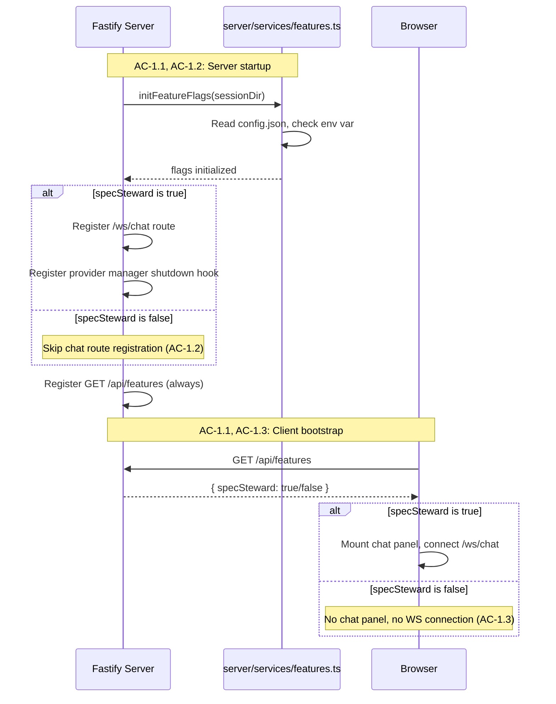
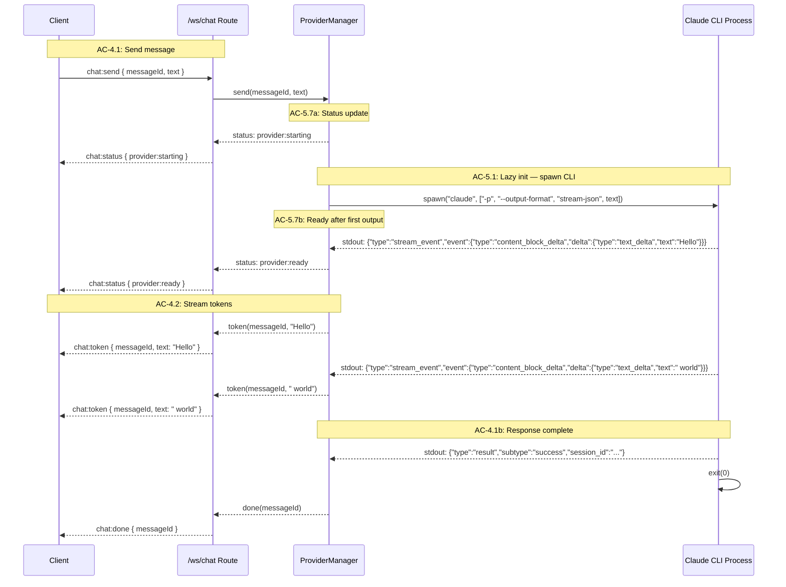
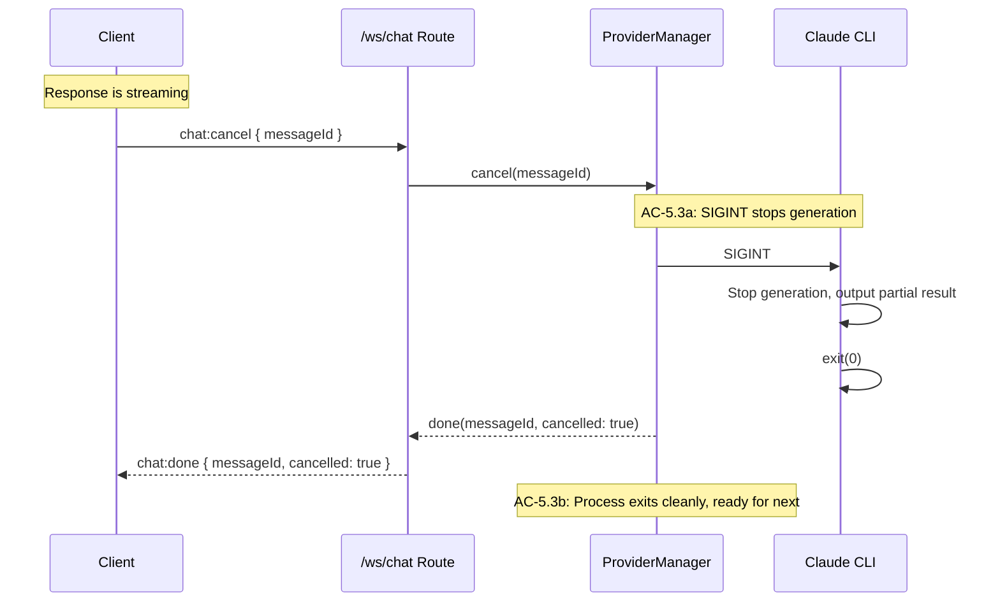
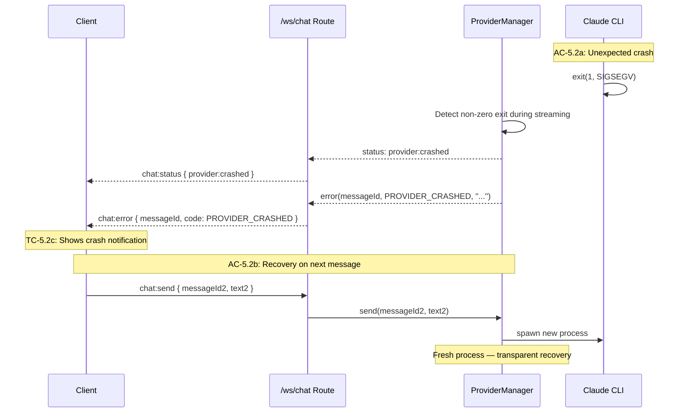
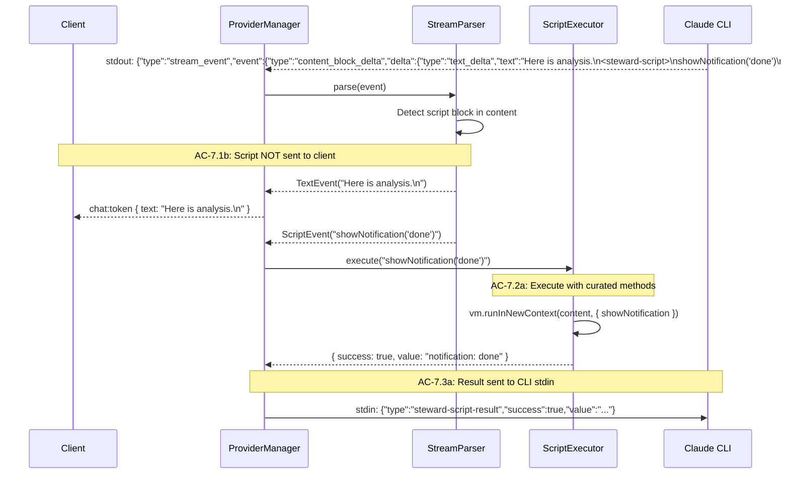

# Technical Design — Server (Epic 10: Chat Plumbing)

Companion to `tech-design.md`. This document covers server-side implementation depth: feature flag infrastructure, WebSocket chat route, provider manager, stream parser, and script executor.

---

## Feature Flag Infrastructure

The feature flag controls whether any Spec Steward code initializes. The system has three layers: a shared module that reads the flag, a REST endpoint that exposes it to the client, and conditional route registration in the server bootstrap.

### Feature Flag Module Split

The feature flag system is split across three modules to avoid pulling Node.js APIs (`node:fs`, `node:path`) into client bundles. The shared module has type definitions only — no Node.js imports.

#### `src/shared/features.ts` — Type Definitions Only

```typescript
// app/src/shared/features.ts — NO Node.js imports

export interface FeaturesResponse {
  specSteward: boolean;
}

export type FeatureFlag = keyof FeaturesResponse;
```

This module is safe to import from both server and client code because it contains only TypeScript types/interfaces.

#### `src/server/services/features.ts` — Server-Side Flag Logic

```typescript
// app/src/server/services/features.ts
import { readFileSync } from 'node:fs';
import { join } from 'node:path';
import type { FeaturesResponse, FeatureFlag } from '../../shared/features.js';

interface FeaturesConfig {
  features?: {
    specSteward?: boolean;
  };
}

let serverFlags: FeaturesResponse | null = null;

/**
 * Initialize feature flags from environment and optional config file.
 * Called once at server startup.
 *
 * Merge order: config file > env var > default (false).
 * Config file location: <sessionDir>/config.json
 *
 * Covers: AC-1.1, AC-1.4 (server-side)
 */
export function initFeatureFlags(sessionDir: string): void {
  let fromConfig: boolean | undefined;

  try {
    const configPath = join(sessionDir, 'config.json');
    const raw = readFileSync(configPath, 'utf-8');
    const parsed: FeaturesConfig = JSON.parse(raw);
    fromConfig = parsed.features?.specSteward;
  } catch {
    // Config file missing or malformed — fall through to env var
  }

  const fromEnv = process.env.FEATURE_SPEC_STEWARD?.toLowerCase() === 'true';

  serverFlags = {
    specSteward: fromConfig ?? fromEnv,
  };
}

/**
 * Synchronous check for server-side code.
 * Must call initFeatureFlags() first.
 *
 * Covers: AC-1.4a (server-side flag check)
 */
export function isFeatureEnabled(feature: FeatureFlag): boolean {
  if (!serverFlags) {
    throw new Error('Feature flags not initialized. Call initFeatureFlags() first.');
  }
  return serverFlags[feature];
}

/**
 * Get all feature flags for the REST endpoint response.
 *
 * Covers: AC-1.1 (endpoint response shape)
 */
export function getFeatureFlags(): FeaturesResponse {
  if (!serverFlags) {
    throw new Error('Feature flags not initialized.');
  }
  return { ...serverFlags };
}
```

#### `src/client/steward/features.ts` — Client-Side Flag Fetching

```typescript
// app/src/client/steward/features.ts
import type { FeaturesResponse, FeatureFlag } from '../../shared/features.js';

let cachedFlags: FeaturesResponse | null = null;

/**
 * Fetch feature flags from the server and cache the result.
 * Called once during client bootstrap.
 *
 * Covers: AC-1.4b (client-side flag check after bootstrap)
 */
async function fetchFlags(): Promise<FeaturesResponse> {
  if (cachedFlags) return cachedFlags;

  try {
    const res = await fetch('/api/features');
    if (res.ok) {
      cachedFlags = await res.json();
      return cachedFlags!;
    }
  } catch {
    // Features endpoint unavailable — all features disabled
  }

  cachedFlags = { specSteward: false };
  return cachedFlags;
}

/**
 * Check if a feature flag is enabled. Fetches flags on first call.
 *
 * Covers: AC-1.4b
 */
export async function isFeatureEnabled(feature: FeatureFlag): Promise<boolean> {
  const flags = await fetchFlags();
  return flags[feature];
}
```

This split ensures:
- **`shared/features.ts`**: Zero imports — safe for both esbuild client bundle and Node.js server.
- **`server/services/features.ts`**: Uses `node:fs` and `node:path` — only imported by server code.
- **`client/steward/features.ts`**: Uses `fetch()` — only imported by client code.

### routes/features.ts — The REST Endpoint

A minimal route that returns the current feature flag state. Registered unconditionally — the endpoint always exists, it just returns `{ specSteward: false }` when disabled. This lets the client check flags without the server needing conditional endpoint registration for the flags endpoint itself.

```typescript
// app/src/server/routes/features.ts
import type { FastifyInstance } from 'fastify';
import { getFeatureFlags } from '../services/features.js';

/**
 * GET /api/features — Returns feature flag state.
 *
 * Always registered (not conditional). Returns { specSteward: false }
 * when the flag is disabled.
 *
 * Covers: AC-1.1 (TC-1.1a, TC-1.1b, TC-1.1c)
 */
export async function featuresRoutes(app: FastifyInstance) {
  app.get('/api/features', async () => {
    return getFeatureFlags();
  });
}
```

### Conditional Route Registration in app.ts

The chat WebSocket route and provider manager are only registered when the feature flag is enabled. This implements AC-1.2 — when disabled, no chat WebSocket route exists, no provider processes are spawned.

```typescript
// In buildApp() — after existing route registrations:
import { initFeatureFlags, isFeatureEnabled } from './services/features.js';
import { featuresRoutes } from './routes/features.js';
import { chatWsRoutes } from './routes/ws-chat.js';

// Always register features endpoint
await app.register(featuresRoutes);

// Initialize feature flags
initFeatureFlags(sessionService.sessionDir);

// Conditionally register chat routes
if (isFeatureEnabled('specSteward')) {
  await app.register(chatWsRoutes);
}
```

This conditional registration means a WebSocket connection attempt to `/ws/chat` when the flag is disabled will get a 404 (route not found), satisfying TC-1.2a.

---

## Chat Message Schemas

All chat WebSocket messages are validated with Zod schemas, extending the existing pattern in `schemas/index.ts`. The schemas use `z.discriminatedUnion` on the `type` field, consistent with the existing `ClientWsMessageSchema` and `ServerWsMessageSchema`.

```typescript
// Added to app/src/server/schemas/index.ts

// --- Chat Message Schemas ---

export const ChatSendMessageSchema = z.object({
  type: z.literal('chat:send'),
  messageId: z.string().uuid(),
  text: z.string().min(1),
  context: z.object({}).optional(),
});

export const ChatCancelMessageSchema = z.object({
  type: z.literal('chat:cancel'),
  messageId: z.string().uuid(),
});

export const ChatClearMessageSchema = z.object({
  type: z.literal('chat:clear'),
});

export const ChatClientMessageSchema = z.discriminatedUnion('type', [
  ChatSendMessageSchema,
  ChatCancelMessageSchema,
  ChatClearMessageSchema,
]);

export const ChatTokenMessageSchema = z.object({
  type: z.literal('chat:token'),
  messageId: z.string().uuid(),
  text: z.string(),
});

export const ChatDoneMessageSchema = z.object({
  type: z.literal('chat:done'),
  messageId: z.string().uuid(),
  cancelled: z.boolean().optional(),
});

export const ChatErrorCodeSchema = z.enum([
  'INVALID_MESSAGE',
  'PROVIDER_NOT_FOUND',
  'PROVIDER_CRASHED',
  'PROVIDER_TIMEOUT',
  'PROVIDER_BUSY',
  'PROVIDER_AUTH_FAILED',
  'SCRIPT_ERROR',
  'SCRIPT_TIMEOUT',
  'CANCELLED',
]);

export const ChatErrorMessageSchema = z.object({
  type: z.literal('chat:error'),
  messageId: z.string().uuid().optional(),
  code: ChatErrorCodeSchema,
  message: z.string(),
});

export const ChatStatusSchema = z.object({
  type: z.literal('chat:status'),
  status: z.enum([
    'provider:ready',
    'provider:starting',
    'provider:crashed',
    'provider:not-found',
  ]),
  message: z.string().optional(),
});

export const ChatServerMessageSchema = z.discriminatedUnion('type', [
  ChatTokenMessageSchema,
  ChatDoneMessageSchema,
  ChatErrorMessageSchema,
  ChatStatusSchema,
]);

// Inferred types
export type ChatSendMessage = z.infer<typeof ChatSendMessageSchema>;
export type ChatCancelMessage = z.infer<typeof ChatCancelMessageSchema>;
export type ChatClearMessage = z.infer<typeof ChatClearMessageSchema>;
export type ChatClientMessage = z.infer<typeof ChatClientMessageSchema>;
export type ChatTokenMessage = z.infer<typeof ChatTokenMessageSchema>;
export type ChatDoneMessage = z.infer<typeof ChatDoneMessageSchema>;
export type ChatErrorMessage = z.infer<typeof ChatErrorMessageSchema>;
export type ChatStatusMessage = z.infer<typeof ChatStatusSchema>;
export type ChatServerMessage = z.infer<typeof ChatServerMessageSchema>;
export type ChatErrorCode = z.infer<typeof ChatErrorCodeSchema>;
```

The `messageId` field uses `z.string().uuid()` to validate client-generated UUIDs. The `text` field in `ChatSendMessage` uses `z.string().min(1)` to prevent empty messages at the schema level (supports TC-2.4c on the server side).

---

## WebSocket Chat Route

The `/ws/chat` route follows the pattern established by the existing `/ws` route: origin checking, message parsing, error handling. The key difference is that this route bridges to the provider manager rather than the watch service.

```typescript
// app/src/server/routes/ws-chat.ts
import type { FastifyInstance } from 'fastify';
import type { WebSocket } from 'ws';
import {
  ChatClientMessageSchema,
  ChatServerMessageSchema,
  type ChatServerMessage,
} from '../schemas/index.js';
import { ProviderManager } from '../services/provider-manager.js';

/**
 * Origin check — reuses the same logic as the existing /ws route.
 * Accepts localhost and 127.0.0.1 on any port.
 *
 * Covers: AC-3.2 (TC-3.2a, TC-3.2b, TC-3.2c)
 */
function isAllowedOrigin(origin: string | undefined): boolean {
  if (!origin) return true;
  try {
    const url = new URL(origin);
    return (
      url.protocol === 'http:' &&
      (url.hostname === 'localhost' || url.hostname === '127.0.0.1')
    );
  } catch {
    return false;
  }
}

/**
 * Send a typed server message over the WebSocket.
 */
function sendMessage(socket: WebSocket, message: ChatServerMessage): void {
  if (socket.readyState === socket.OPEN) {
    socket.send(JSON.stringify(ChatServerMessageSchema.parse(message)));
  }
}

/**
 * /ws/chat WebSocket route — chat streaming.
 *
 * Covers: AC-3.1, AC-3.2, AC-3.3, AC-4.1, AC-4.3, AC-4.6
 */
export async function chatWsRoutes(app: FastifyInstance) {
  const providerManager = new ProviderManager();

  // Graceful shutdown — kill CLI process when server stops
  // Covers: AC-5.4 (TC-5.4a, TC-5.4b)
  app.addHook('onClose', async () => {
    await providerManager.shutdown();
  });

  app.get('/ws/chat', { websocket: true }, (socket, request) => {
    // Origin check (AC-3.2)
    if (!isAllowedOrigin(request.headers.origin)) {
      sendMessage(socket as WebSocket, {
        type: 'chat:error',
        code: 'INVALID_MESSAGE',
        message: 'WebSocket origin not allowed',
      });
      socket.close(1008, 'Origin not allowed');
      return;
    }

    // Wire provider events to this socket
    const unsubToken = providerManager.onToken((messageId, text) => {
      sendMessage(socket as WebSocket, { type: 'chat:token', messageId, text });
    });

    const unsubDone = providerManager.onDone((messageId, cancelled) => {
      sendMessage(socket as WebSocket, {
        type: 'chat:done',
        messageId,
        ...(cancelled ? { cancelled: true } : {}),
      });
    });

    const unsubError = providerManager.onError((messageId, code, message) => {
      sendMessage(socket as WebSocket, {
        type: 'chat:error',
        ...(messageId ? { messageId } : {}),
        code,
        message,
      });
    });

    const unsubStatus = providerManager.onStatus((status, message) => {
      sendMessage(socket as WebSocket, {
        type: 'chat:status',
        status,
        ...(message ? { message } : {}),
      });
    });

    // Handle incoming messages
    socket.on('message', (raw) => {
      let parsed: unknown;
      try {
        parsed = JSON.parse(raw.toString());
      } catch {
        // TC-3.3c: Malformed JSON
        sendMessage(socket as WebSocket, {
          type: 'chat:error',
          code: 'INVALID_MESSAGE',
          message: 'Malformed JSON',
        });
        return;
      }

      const result = ChatClientMessageSchema.safeParse(parsed);
      if (!result.success) {
        // TC-3.3b: Invalid schema
        sendMessage(socket as WebSocket, {
          type: 'chat:error',
          code: 'INVALID_MESSAGE',
          message: 'Invalid message format',
        });
        return;
      }

      const msg = result.data;

      switch (msg.type) {
        case 'chat:send':
          providerManager.send(msg.messageId, msg.text);
          break;
        case 'chat:cancel':
          providerManager.cancel(msg.messageId);
          break;
        case 'chat:clear':
          providerManager.clear();
          break;
      }
    });

    // Cleanup on disconnect
    socket.on('close', () => {
      unsubToken();
      unsubDone();
      unsubError();
      unsubStatus();
    });
  });
}
```

The route creates a single `ProviderManager` instance shared across all connections (only one client is expected for a local app, but the event subscription pattern supports multiple). The `sendMessage` helper validates outgoing messages through the Zod schema — this catches type mismatches at the boundary rather than letting invalid messages escape.

The origin check is factored identically to the existing `/ws` route's `isAllowedOrigin` function. In a future refactor, this could be extracted to a shared utility, but for now duplication is acceptable — two callsites, identical logic, stable behavior.

---

## Provider Manager

The provider manager is the heart of Epic 10's server-side complexity. It manages the Claude CLI process lifecycle: spawning, streaming, cancellation, crash detection, and shutdown. Each user message spawns a new CLI invocation in `--print` mode.

### Architecture

The provider manager sits between the WebSocket route and the CLI process. It translates between the chat protocol (WebSocket messages) and the CLI protocol (stdin/stdout/signals).

```
WebSocket Route ──→ ProviderManager ──→ CLI Process
                         │                    │
                    StreamParser ←── stdout ──┘
                         │
                  ScriptExecutor (if script block found)
                         │
                    stdin ──→ CLI Process (script result)
```

### State Machine

The provider has a simple state model:

```
            ┌──────────┐
            │   idle   │ ← Initial state, no process running
            └────┬─────┘
                 │ send()
                 ▼
            ┌──────────┐
            │ starting │ ← Process spawning
            └────┬─────┘
                 │ first stdout event
                 ▼
            ┌──────────┐
            │ streaming│ ← Receiving tokens
            └────┬─────┘
                 │ result event / cancel / crash
                 ▼
            ┌──────────┐
            │   idle   │ ← Ready for next message
            └──────────┘
```

### Interface

```typescript
// app/src/server/services/provider-manager.ts

import { spawn, type ChildProcess } from 'node:child_process';
import { StreamParser, type ParsedEvent } from './stream-parser.js';
import { ScriptExecutor } from './script-executor.js';

type TokenHandler = (messageId: string, text: string) => void;
type DoneHandler = (messageId: string, cancelled?: boolean) => void;
type ErrorHandler = (messageId: string | undefined, code: string, message: string) => void;
type StatusHandler = (status: string, message?: string) => void;

const CLI_COMMAND = 'claude';
const CLI_ARGS = [
  '-p',
  '--output-format', 'stream-json',
  '--include-partial-messages',  // Token-level streaming events
  '--verbose',                    // Full turn-by-turn output
  '--bare',                       // Skip hooks/plugins for fast startup
  '--max-turns', '25',
];
const STARTUP_TIMEOUT_MS = 30_000;
const CANCEL_TIMEOUT_MS = 2_000;

export class ProviderManager {
  private process: ChildProcess | null = null;
  private activeMessageId: string | null = null;
  private state: 'idle' | 'starting' | 'streaming' = 'idle';
  private sessionId: string | null = null;
  private startupTimer: NodeJS.Timeout | null = null;

  private tokenHandlers = new Set<TokenHandler>();
  private doneHandlers = new Set<DoneHandler>();
  private errorHandlers = new Set<ErrorHandler>();
  private statusHandlers = new Set<StatusHandler>();

  private streamParser = new StreamParser();
  private scriptExecutor = new ScriptExecutor();

  /**
   * Send a message to the CLI provider. Spawns a new CLI process.
   *
   * Covers: AC-4.1 (initiate streaming), AC-5.1 (lazy init)
   *         AC-4.6 (busy rejection), AC-5.5 (CLI not found)
   *         AC-5.6 (startup timeout), AC-5.7 (status messages)
   *         AC-5.8 (auth failure)
   */
  send(messageId: string, text: string): void {
    // AC-4.6: Reject if already streaming
    if (this.state !== 'idle') {
      this.emitError(messageId, 'PROVIDER_BUSY', 'A message is already being processed');
      return;
    }

    this.activeMessageId = messageId;
    this.state = 'starting';
    this.emitStatus('provider:starting');

    // Spawn CLI process — use --resume for multi-turn context
    const args = [...CLI_ARGS];
    if (this.sessionId) {
      args.push('--resume', this.sessionId);
    }
    args.push(text);
    let proc: ChildProcess;

    try {
      proc = spawn(CLI_COMMAND, args, {
        stdio: ['pipe', 'pipe', 'pipe'],
        env: { ...process.env },
      });
    } catch (err) {
      // AC-5.5: CLI not found
      this.state = 'idle';
      this.activeMessageId = null;
      this.emitStatus('provider:not-found');
      this.emitError(messageId, 'PROVIDER_NOT_FOUND',
        `Claude CLI not found. Ensure 'claude' is installed and on PATH.`);
      return;
    }

    this.process = proc;

    // AC-5.6: Startup timeout
    this.startupTimer = setTimeout(() => {
      if (this.state === 'starting') {
        this.emitError(messageId, 'PROVIDER_TIMEOUT',
          'CLI process did not respond within timeout');
        this.killProcess();
        this.resetState();
      }
    }, STARTUP_TIMEOUT_MS);

    // Handle spawn errors (e.g., ENOENT)
    proc.on('error', (err) => {
      this.clearStartupTimer();
      if ((err as NodeJS.ErrnoException).code === 'ENOENT') {
        this.emitStatus('provider:not-found');
        this.emitError(messageId, 'PROVIDER_NOT_FOUND',
          `Claude CLI not found. Ensure 'claude' is installed and on PATH.`);
      } else {
        this.emitError(messageId, 'PROVIDER_CRASHED', err.message);
      }
      this.resetState();
    });

    // Parse stdout — streaming JSON events
    let stdoutBuffer = '';
    proc.stdout?.on('data', (chunk: Buffer) => {
      this.clearStartupTimer();

      if (this.state === 'starting') {
        this.state = 'streaming';
        this.emitStatus('provider:ready');
      }

      stdoutBuffer += chunk.toString();
      const lines = stdoutBuffer.split('\n');
      stdoutBuffer = lines.pop() ?? ''; // Keep incomplete line in buffer

      for (const line of lines) {
        if (!line.trim()) continue;
        this.handleStreamLine(messageId, line);
      }
    });

    // Handle stderr for auth errors
    let stderrBuffer = '';
    proc.stderr?.on('data', (chunk: Buffer) => {
      stderrBuffer += chunk.toString();
    });

    // Handle process exit
    proc.on('exit', (code, signal) => {
      this.clearStartupTimer();

      // Process remaining buffer
      if (stdoutBuffer.trim()) {
        this.handleStreamLine(messageId, stdoutBuffer);
      }

      // Check for auth errors in stderr
      if (stderrBuffer.includes('not authenticated') ||
          stderrBuffer.includes('auth') ||
          code === 1 && stderrBuffer.includes('login')) {
        this.emitError(messageId, 'PROVIDER_AUTH_FAILED',
          'Claude CLI is not authenticated. Run `claude login` to authenticate.');
      }

      // If we were still streaming, the process crashed
      if (this.state === 'streaming' && code !== 0 && signal !== 'SIGINT') {
        this.emitStatus('provider:crashed');
        this.emitError(messageId, 'PROVIDER_CRASHED',
          `CLI process exited unexpectedly (code: ${code}, signal: ${signal})`);
      }

      this.process = null;
      this.resetState();
    });
  }

  /**
   * Cancel the current streaming response.
   *
   * Covers: AC-5.3 (TC-5.3a, TC-5.3b)
   */
  cancel(messageId: string): void {
    if (!this.process || this.activeMessageId !== messageId) return;

    // Send SIGINT — CLI handles this gracefully
    this.process.kill('SIGINT');

    // Fallback: force kill after timeout
    const proc = this.process;
    setTimeout(() => {
      if (proc && !proc.killed) {
        proc.kill('SIGTERM');
      }
    }, CANCEL_TIMEOUT_MS);

    this.emitDone(messageId, true);
  }

  /**
   * Clear conversation — discard session ID so the next message
   * starts a fresh session without --resume.
   *
   * Session lifecycle:
   * 1. First chat:send → spawns `claude -p ... "message"` (no --resume)
   * 2. CLI result event includes session_id → stored in this.sessionId
   * 3. Next chat:send → spawns `claude -p --resume <sessionId> ... "message"`
   * 4. chat:clear → discards sessionId → next message starts fresh
   *
   * This directly implements AC-6.1b ("clear resets provider context").
   *
   * Covers: AC-6.1b (reset provider context)
   */
  clear(): void {
    // If streaming, cancel first (AC-6.3)
    if (this.activeMessageId && this.state === 'streaming') {
      this.cancel(this.activeMessageId);
    }
    this.sessionId = null;
  }

  /**
   * Graceful shutdown — kill any running CLI process.
   *
   * Covers: AC-5.4 (TC-5.4a, TC-5.4b)
   */
  async shutdown(): Promise<void> {
    if (this.process) {
      this.process.kill('SIGTERM');
      // Wait for exit with timeout
      await new Promise<void>((resolve) => {
        const timeout = setTimeout(() => {
          if (this.process && !this.process.killed) {
            this.process.kill('SIGKILL');
          }
          resolve();
        }, 5_000);
        this.process?.on('exit', () => {
          clearTimeout(timeout);
          resolve();
        });
      });
    }
  }

  // --- Event subscription ---

  onToken(handler: TokenHandler): () => void {
    this.tokenHandlers.add(handler);
    return () => this.tokenHandlers.delete(handler);
  }

  onDone(handler: DoneHandler): () => void {
    this.doneHandlers.add(handler);
    return () => this.doneHandlers.delete(handler);
  }

  onError(handler: ErrorHandler): () => void {
    this.errorHandlers.add(handler);
    return () => this.errorHandlers.delete(handler);
  }

  onStatus(handler: StatusHandler): () => void {
    this.statusHandlers.add(handler);
    return () => this.statusHandlers.delete(handler);
  }

  // --- Internal ---

  private handleStreamLine(messageId: string, line: string): void {
    let event: Record<string, unknown>;
    try {
      event = JSON.parse(line);
    } catch {
      return; // Skip malformed lines
    }

    const events = this.streamParser.parse(event);
    for (const parsed of events) {
      switch (parsed.type) {
        case 'text':
          if (parsed.text) this.emitToken(messageId, parsed.text);
          break;
        case 'script':
          this.executeScript(messageId, parsed.content);
          break;
        case 'result':
          if (parsed.sessionId) {
            this.sessionId = parsed.sessionId;
          }
          this.emitDone(messageId);
          break;
        case 'error':
          this.emitError(messageId, 'PROVIDER_CRASHED', parsed.message);
          break;
      }
    }
  }

  private async executeScript(messageId: string, scriptContent: string): Promise<void> {
    const result = await this.scriptExecutor.execute(scriptContent);

    // Relay result back to CLI stdin
    if (this.process?.stdin?.writable) {
      const resultJson = JSON.stringify({
        type: 'steward-script-result',
        success: result.success,
        ...(result.success ? { value: result.value } : { error: result.error }),
      });
      this.process.stdin.write(resultJson + '\n');
    }

    // If script errored, also send error to client
    if (!result.success) {
      this.emitError(
        messageId,
        result.error?.includes('timed out') ? 'SCRIPT_TIMEOUT' : 'SCRIPT_ERROR',
        result.error ?? 'Script execution failed',
      );
    }
  }

  private emitToken(messageId: string, text: string): void {
    for (const handler of this.tokenHandlers) handler(messageId, text);
  }

  private emitDone(messageId: string, cancelled?: boolean): void {
    for (const handler of this.doneHandlers) handler(messageId, cancelled);
    if (this.activeMessageId === messageId) {
      this.resetState();
    }
  }

  private emitError(messageId: string | undefined, code: string, message: string): void {
    for (const handler of this.errorHandlers) handler(messageId, code, message);
  }

  private emitStatus(status: string, message?: string): void {
    for (const handler of this.statusHandlers) handler(status, message);
  }

  private killProcess(): void {
    if (this.process && !this.process.killed) {
      this.process.kill('SIGTERM');
    }
    this.process = null;
  }

  private resetState(): void {
    this.state = 'idle';
    this.activeMessageId = null;
    this.clearStartupTimer();
  }

  private clearStartupTimer(): void {
    if (this.startupTimer) {
      clearTimeout(this.startupTimer);
      this.startupTimer = null;
    }
  }
}
```

### Key Design Decisions

**Per-invocation model with `--resume`:** Each `chat:send` spawns a fresh `claude -p` process. On first message, no `--resume` flag is passed. The `session_id` from the CLI's `result` event is stored in `ProviderManager.sessionId`. Subsequent messages pass `--resume <sessionId>` to continue the conversation. `chat:clear` discards the session ID so the next message starts fresh. This is simpler than maintaining a long-running interactive process and avoids complex stdin/stdout multiplexing. The trade-off is startup latency on each message (~1-2 seconds for CLI initialization), which is acceptable for Epic 10's "plumbing" scope.

**Event-based API:** The provider manager uses callback registration (`onToken`, `onDone`, etc.) rather than returning promises or using EventEmitter. This matches the streaming nature of the data — tokens arrive continuously, not as a single resolved value.

**SIGINT for cancellation:** The Claude CLI handles SIGINT gracefully, stopping generation and outputting a partial result. This is cleaner than `SIGTERM` (which doesn't give the CLI a chance to clean up) and more reliable than stdin-based cancellation.

**Auth error detection:** Authentication failures are detected by inspecting stderr content after process exit. The CLI outputs auth-related messages to stderr with a non-zero exit code. This is heuristic-based — the exact stderr format may vary, so the detection checks for common substrings.

---

## Stream Parser

The stream parser processes the CLI's streaming JSON output and separates text tokens from script blocks. It operates on individual JSON events (already line-split by the provider manager) and maintains state for partial script block accumulation.

```typescript
// app/src/server/services/stream-parser.ts

const SCRIPT_OPEN_TAG = '<steward-script>';
const SCRIPT_CLOSE_TAG = '</steward-script>';

export interface TextEvent {
  type: 'text';
  text: string;
}

export interface ScriptEvent {
  type: 'script';
  content: string;
}

export interface ResultEvent {
  type: 'result';
  sessionId?: string;
  text?: string;
}

export interface ErrorEvent {
  type: 'error';
  message: string;
}

export type ParsedEvent = TextEvent | ScriptEvent | ResultEvent | ErrorEvent;

/**
 * Parses CLI streaming JSON events and separates text from script blocks.
 *
 * The CLI emits events like:
 *   {"type":"stream_event","event":{"type":"content_block_delta","delta":{"type":"text_delta","text":"Hello"}}}
 *   {"type":"assistant","content":[{"type":"text","text":"Hello world"}]}  (complete message — ignored)
 *   {"type":"result","subtype":"success","result":"Hello world","session_id":"..."}
 *
 * Text content may contain <steward-script> blocks that need to be
 * intercepted before reaching the client.
 *
 * Covers: AC-7.1 (TC-7.1a through TC-7.1e)
 */
export class StreamParser {
  private scriptBuffer: string | null = null;
  private textBuffer = '';

  /**
   * Parse a single CLI JSON event into zero or more ParsedEvents.
   * Returns an array because a single event's text content may
   * contain text + script + text.
   */
  parse(event: Record<string, unknown>): ParsedEvent[] {
    // Result event — completion
    if (event.type === 'result') {
      const events: ParsedEvent[] = [];

      // Flush any partial script buffer as text (TC-7.1e: malformed)
      if (this.scriptBuffer !== null) {
        const discarded = SCRIPT_OPEN_TAG + this.scriptBuffer;
        this.scriptBuffer = null;
        events.push({ type: 'text', text: discarded });
      }

      if (event.subtype === 'error') {
        events.push({ type: 'error', message: String(event.error ?? 'Unknown error') });
      } else {
        events.push({
          type: 'result',
          sessionId: typeof event.session_id === 'string' ? event.session_id : undefined,
          text: typeof event.result === 'string' ? event.result : undefined,
        });
      }

      return events;
    }

    // Stream event — token-level streaming (with --include-partial-messages)
    if (event.type === 'stream_event') {
      const inner = event.event as Record<string, unknown> | undefined;
      const delta = (inner as Record<string, Record<string, unknown>> | undefined)?.delta;
      if (delta?.type === 'text_delta' && typeof delta.text === 'string') {
        return this.processTextContent(delta.text);
      }
      // Non-text stream events (tool_use, message_start, etc.) — skip
      return [];
    }

    // Complete assistant message — ignore (we already got tokens via stream_event)
    if (event.type === 'assistant') {
      return [];
    }

    // System events (init, compact_boundary, api_retry) — ignore
    return [];
  }

  /**
   * Process text content that may contain script blocks.
   * Handles partial blocks that span multiple events (TC-7.1d).
   * Called directly by parse() — returns the full array.
   */
  private processTextContent(content: string): ParsedEvent[] {
    const events: ParsedEvent[] = [];
    let remaining = content;

    while (remaining.length > 0) {
      if (this.scriptBuffer !== null) {
        // We're inside a script block — look for closing tag
        const closeIdx = remaining.indexOf(SCRIPT_CLOSE_TAG);
        if (closeIdx === -1) {
          // Still accumulating — buffer everything
          this.scriptBuffer += remaining;
          remaining = '';
        } else {
          // Found close — emit script event
          this.scriptBuffer += remaining.slice(0, closeIdx);
          events.push({ type: 'script', content: this.scriptBuffer.trim() });
          this.scriptBuffer = null;
          remaining = remaining.slice(closeIdx + SCRIPT_CLOSE_TAG.length);
        }
      } else {
        // Look for opening tag
        const openIdx = remaining.indexOf(SCRIPT_OPEN_TAG);
        if (openIdx === -1) {
          // No script block — emit as text
          if (remaining) events.push({ type: 'text', text: remaining });
          remaining = '';
        } else {
          // Found open tag — emit text before it, start buffering
          const before = remaining.slice(0, openIdx);
          if (before) events.push({ type: 'text', text: before });
          this.scriptBuffer = '';
          remaining = remaining.slice(openIdx + SCRIPT_OPEN_TAG.length);
        }
      }
    }

    return events;
  }

  /**
   * Reset parser state (for new conversations).
   */
  reset(): void {
    this.scriptBuffer = null;
    this.textBuffer = '';
  }
}
```

### Script Block Edge Cases

The stream parser handles several edge cases specified in the TCs:

**TC-7.1d (Partial blocks across chunks):** The `scriptBuffer` accumulates content across multiple `parse()` calls. When a `<steward-script>` tag arrives in one chunk and `</steward-script>` arrives later, the buffer holds the intermediate content.

**TC-7.1e (Malformed blocks — no closing tag):** When a `result` event arrives while `scriptBuffer` is non-null, the buffered content is flushed as text. The parser doesn't hang waiting for a closing tag that will never come.

**TC-7.1c (Mixed content):** The `processTextContent` method handles text-script-text sequences within a single content string, emitting separate events for each segment.

---

## Script Executor

The script executor runs intercepted script blocks in a sandboxed VM context with only the curated method surface available.

```typescript
// app/src/server/services/script-executor.ts

import { runInNewContext, type Context } from 'node:vm';

const DEFAULT_TIMEOUT_MS = 5_000;

export interface ScriptResult {
  success: boolean;
  value?: unknown;
  error?: string;
}

/**
 * Curated method surface for script execution.
 * These are the only functions available inside the VM.
 *
 * For Epic 10, the surface is minimal — expanded in Epics 12-14.
 *
 * Covers: AC-7.2 (TC-7.2a — curated methods available,
 *                 TC-7.2b — Node.js globals NOT available)
 */
function createScriptContext(): Record<string, unknown> {
  return {
    showNotification: (message: string): string => {
      // In Epic 10, this is a no-op that returns confirmation.
      // Future epics wire this to actual UI notifications.
      return `notification: ${message}`;
    },
    // Additional curated methods added in Epics 12-14:
    // openDocument, applyEditToActiveDocument, etc.
  };
}

/**
 * Execute a script in a sandboxed VM context.
 *
 * Covers: AC-7.2, AC-7.3, AC-7.4
 */
export class ScriptExecutor {
  private timeoutMs: number;

  constructor(timeoutMs = DEFAULT_TIMEOUT_MS) {
    this.timeoutMs = timeoutMs;
  }

  /**
   * Execute script content in a sandboxed VM.
   *
   * The VM context contains only the curated methods — no require,
   * process, fs, global, or any Node.js built-ins (TC-7.2b).
   *
   * Execution has a timeout to prevent infinite loops (TC-7.2c).
   * Errors are caught and returned as ScriptResult, never thrown (TC-7.4a, TC-7.4b).
   */
  async execute(content: string): Promise<ScriptResult> {
    const context = createScriptContext();

    try {
      const result = runInNewContext(content, context as Context, {
        timeout: this.timeoutMs,
        filename: 'steward-script.js',
      });

      return { success: true, value: result };
    } catch (err) {
      if (err instanceof Error && err.message.includes('Script execution timed out')) {
        return {
          success: false,
          error: `Script execution timed out after ${this.timeoutMs}ms`,
        };
      }

      return {
        success: false,
        error: err instanceof Error ? err.message : String(err),
      };
    }
  }
}
```

### Security Posture

`vm.runInNewContext` creates a separate global scope within the same V8 isolate. The context object is the only thing visible to the script — `require`, `process`, `fs`, `child_process`, and `global` are all undefined (TC-7.2b). This is sufficient for the single-user threat model: prevent Claude from accidentally doing something destructive.

Known limitations (from the Technical Architecture document):
- Not a true security sandbox — escape vectors exist
- Acceptable for the primary user only
- Escalation path: `isolated-vm` for proper V8 isolation before distribution

The `timeout` option prevents infinite loops from hanging the server (TC-7.2c). The timeout causes `vm.runInNewContext` to throw an error that is caught and returned as a `ScriptResult`.

### Script Result Relay with Per-Invocation Model

The script result relay works because `--max-turns 25` keeps the CLI process alive through multiple tool-use turns. When the CLI emits a `<steward-script>` block mid-response, the process is still running (mid-generation, waiting for tool results). The server:

1. Detects the `<steward-script>` block in the stream parser
2. Executes the script in the VM sandbox
3. Writes the JSON result to the CLI process's **stdin** (the process is still alive)
4. The CLI's tool harness reads the result from stdin and continues processing

This works because the CLI expects stdin input during multi-turn execution — the `--max-turns` flag enables the CLI to consume multiple rounds of tool input/output within a single invocation. The process only exits after the final `result` event, so stdin remains writable throughout the streaming phase.

If the process has already exited when the script completes (race condition on rapid cancellation), the stdin write is silently dropped (`this.process?.stdin?.writable` guard in `executeScript`).

---

## Server Flow Sequences

### Flow 1: Feature Flag Check (Server Boot → Client Bootstrap)



### Flow 2: Send Message → Stream Response



### Flow 3: Cancel In-Progress Response



### Flow 4: CLI Crash and Recovery



### Flow 5: Script Block Interception



---

## Error Handling Summary

All server-side errors follow the same pattern: detect the condition, emit a `chat:error` message with the appropriate error code, and ensure the server continues operating. No error condition crashes the server.

| Error Condition | Detection | Error Code | Server State After |
|----------------|-----------|------------|-------------------|
| CLI not on PATH | `spawn` ENOENT error | `PROVIDER_NOT_FOUND` | Idle, ready for next message |
| CLI auth failure | stderr content after exit | `PROVIDER_AUTH_FAILED` | Idle, ready for next message |
| CLI crash during streaming | Non-zero exit code | `PROVIDER_CRASHED` | Idle, ready for next message |
| CLI startup timeout | Timer fires in `starting` state | `PROVIDER_TIMEOUT` | Idle (process killed) |
| Concurrent message | `state !== 'idle'` check | `PROVIDER_BUSY` | Unchanged (existing stream continues) |
| Invalid WS message | Zod parse failure | `INVALID_MESSAGE` | Unchanged |
| Script execution error | `vm.runInNewContext` throws | `SCRIPT_ERROR` | Streaming continues |
| Script timeout | VM timeout option fires | `SCRIPT_TIMEOUT` | Streaming continues |
