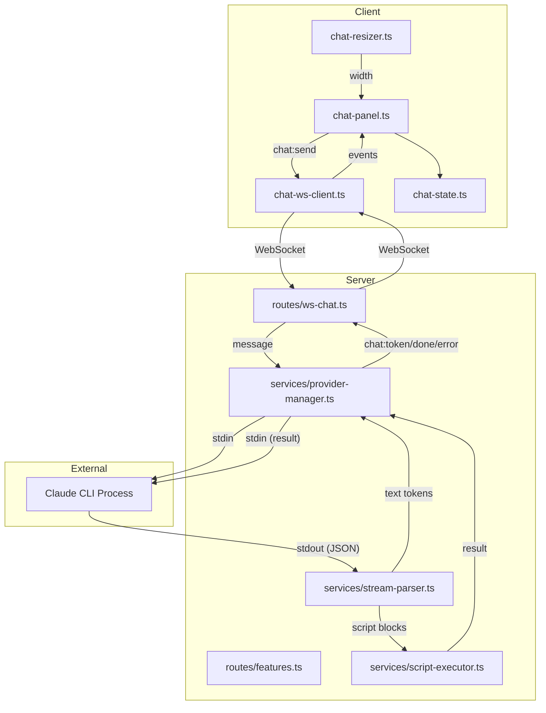

# Technical Design: Chat Plumbing (Epic 10)

## Purpose

This document translates the Epic 10 requirements into implementable architecture for the Spec Steward's infrastructure layer — feature flags, CLI provider abstraction, WebSocket streaming, a basic chat panel, and exploratory script execution. It serves three audiences:

| Audience | Value |
|----------|-------|
| Reviewers | Validate architecture decisions before code is written |
| Developers | Clear blueprint for implementation |
| Story Tech Sections | Source of implementation targets, interfaces, and test mappings |

**Output structure:** Config B (4 docs) — server + client domain split.

| Document | Content |
|----------|---------|
| `tech-design.md` (this file) | Index: decisions, context, system view, module architecture overview, work breakdown |
| `tech-design-server.md` | Server implementation depth: provider, WebSocket chat route, script execution, feature flags |
| `tech-design-client.md` | Client implementation depth: chat panel, WebSocket client, conversation display |
| `test-plan.md` | TC→test mapping, mock strategy, fixtures, chunk breakdown with test counts |

---

## Spec Validation

The epic is well-structured and implementation-ready. The following items were identified during validation:

| Issue | Spec Location | Resolution | Status |
|-------|---------------|------------|--------|
| Claude CLI pipe mode unvalidated (A1, A2) | Assumptions table | Research confirms `claude -p --output-format stream-json` works for headless child process usage. Provider design uses `--print` mode with streaming JSON output. See Q1/Q2 answers below. | Resolved — validated |
| Config file format unspecified | AC-1.1c, Q8 | Epic says "config file overrides env var" but doesn't specify format. Design uses JSON at `.mdv/config.json` — consistent with session storage pattern. See Q8 answer. | Resolved — clarified |
| Provider "ready" signal undefined | A2, Q9 | Epic defers to tech design. With `--print` mode, readiness is immediate — the process accepts stdin as soon as it spawns. No separate ready signal needed. See Q9 answer. | Resolved — clarified |
| Script block XML tag convention undefined | Q3 | Epic says "XML-fenced script blocks" but doesn't define the tag. Design uses `<steward-script>...</steward-script>`. See Q3 answer. | Resolved — clarified |
| `chat:status` type string includes `provider:not-found` but TC-5.7d mentions it alongside `chat:error` | AC-5.7d, Data Contracts | Both are sent — `chat:status` for lifecycle state, `chat:error` for the triggering message. The epic already clarifies this in the Data Contracts prose. No deviation needed. | Resolved — confirmed |
| Send method signature: `send(message: string, context?: ProviderContext)` vs CLI stdin piping | Data Contracts (Provider Interface) | The provider interface's `send()` writes the message to CLI stdin. The `context` parameter is ignored in Epic 10 (intentionally minimal). The CLI manages its own conversation history in `--print` mode across invocations via `--resume`. See Q4 answer. | Resolved — clarified |

| `PROVIDER_AUTH_FAILED` error code added by tech design | Error Codes table | The epic's error code table does not include `PROVIDER_AUTH_FAILED`. Tech design adds it to handle CLI authentication errors (AC-5.8). This is a design-level addition — the epic covers the AC, the tech design defines the error code. | Resolved — design addition |
| TC-5.3b per-invocation cancel semantics | AC-5.3, TC-5.3b | TC-5.3b says "cancel doesn't crash provider." With the per-invocation model, cancel sends SIGINT which kills the current process. "Doesn't crash" means the ProviderManager returns to idle state and can spawn a new process on the next message — the provider is not the process, it's the manager. | Resolved — clarified |

No blocking issues. All assumptions validated or design decisions made.

---

## Context

Epic 10 is the infrastructure foundation for the Spec Steward — an experimental agent interface that wraps the Claude CLI behind a streaming WebSocket. The user enables a feature flag, a chat panel appears, they type a message, the server spawns a Claude CLI process and pipes the message to it, and the response streams back as plain text. When the flag is off, no trace of the feature exists.

The core technical challenge is provider lifecycle management. The Claude CLI is an external process communicating via stdin/stdout, not an in-process SDK. This means the server must spawn the process, pipe messages to its stdin, parse its streaming JSON output from stdout, detect crashes, handle cancellation via SIGINT, and ensure graceful shutdown. The process model is "one shared foreground process for interactive chat" — background pipeline workers are deferred to Epic 14.

The feature flag architecture is deliberately simple: an environment variable (`FEATURE_SPEC_STEWARD`) with an optional config file override, a REST endpoint (`GET /api/features`), and a three-module split — `shared/features.ts` (types only), `server/services/features.ts` (reads env/config via `node:fs`), and `client/steward/features.ts` (fetches from the endpoint). This split prevents Node.js imports from contaminating the esbuild client bundle. When disabled, the server skips route registration for `/ws/chat` and the features endpoint returns `false`, causing the client to skip panel mounting entirely. The code is in the bundle but never executes — acceptable for a local app.

The WebSocket architecture extends the existing `@fastify/websocket` setup with a separate `/ws/chat` route. The existing `/ws` route handles file watching with its own message schemas; the chat route has different schemas, different lifecycle concerns, and different Zod validation. The origin-checking pattern from the existing `/ws` route is reused. All message types are defined as Zod discriminated unions, consistent with the existing `ClientWsMessageSchema` and `ServerWsMessageSchema` pattern.

The chat panel is vanilla JS — no framework, consistent with the entire frontend. The existing layout uses a CSS grid on `#main` with three columns: sidebar | resizer | workspace. The chat panel extends this to five columns: sidebar | sidebar-resizer | workspace | chat-resizer | chat-panel. The sidebar-resizer pattern (drag handle, localStorage persistence, min/max clamping) is directly reusable for the chat panel resizer.

---

## Tech Design Question Answers

The epic posed 11 questions (Q11 already resolved in the epic). Here are the answers:

### Q1: Claude CLI streaming output format

The Claude CLI supports `--print` (or `-p`) for non-interactive single-shot mode, and `--output-format stream-json` for streaming structured output. When combined (`claude -p --output-format stream-json "message"`), the CLI emits newline-delimited JSON events to stdout:

```jsonl
{"type":"system","subtype":"init","session_id":"...","tools":[...]}
{"type":"stream_event","event":{"type":"content_block_delta","delta":{"type":"text_delta","text":"Hello"}}}
{"type":"stream_event","event":{"type":"content_block_delta","delta":{"type":"text_delta","text":" world"}}}
{"type":"assistant","content":[{"type":"text","text":"Hello world"}]}
{"type":"result","subtype":"success","result":"Hello world","session_id":"...","cost_usd":0.01}
```

Key event types:
- `system` with `subtype: "init"` — session initialization (with `--include-partial-messages`)
- `stream_event` — raw API streaming events containing `text_delta` for token-level text
- `assistant` — complete assistant message (emitted after all streaming)
- `result` with `subtype: "success"` — completion with full text and metadata
- `result` with `subtype: "error"` — error completion

The provider uses `stream_event` with `text_delta` for real-time token streaming, and the `result` event for completion detection.

### Q2: CLI spawning flags

```bash
claude -p \
  --output-format stream-json \
  --include-partial-messages \
  --verbose \
  --bare \
  --max-turns 25 \
  "user message here"
```

- `-p` / `--print`: Non-interactive mode. Accepts message as final argument or on stdin.
- `--output-format stream-json`: Streaming newline-delimited JSON.
- `--include-partial-messages`: Token-level streaming events (without this, only complete messages are emitted).
- `--verbose`: Full turn-by-turn output (required for `stream-json` to show all events).
- `--bare`: Skip auto-discovery of hooks, plugins, MCP servers for fast startup. Recommended for scripted usage.
- `--max-turns`: Limit autonomous tool-use turns.
- Working directory: The app's root directory (so the CLI can access project files).
- Environment: Inherits the server process environment (includes PATH for tool access).

For multi-turn conversations, each invocation is independent — the CLI doesn't maintain state between invocations in `--print` mode. The server passes `--resume <session_id>` to continue a previous conversation (the session ID comes from the `result` event). The first message has no `--resume`; subsequent messages include it to maintain context. `chat:clear` discards the stored session ID so the next message starts fresh.

### Q3: XML tag convention for script blocks

The design uses `<steward-script>` as the XML tag:

```
Here is some analysis text.

<steward-script>
showNotification("Analysis complete");
</steward-script>

And here is more text after the script.
```

The tag name is distinctive (won't collide with HTML or markdown), self-describing, and easy to detect in a streaming parser. The stream parser looks for `<steward-script>` as the opening delimiter and `</steward-script>` as the closing delimiter.

### Q4: Conversation context management

In `--print` mode, each CLI invocation is stateless — the CLI doesn't maintain conversation history between invocations. For Epic 10, this is acceptable: each `chat:send` message spawns a new CLI invocation (or reuses the running process by writing to its stdin, depending on the interaction model).

The design uses a per-invocation model: each user message spawns a new `claude -p --output-format stream-json "message"` process. The CLI manages its own session persistence to `~/.claude/projects/<encoded-cwd>/<session-id>.jsonl`.

Multi-turn context is maintained via `--resume`:
1. First `chat:send` spawns `claude -p ... "message"` (no `--resume`)
2. The CLI's `result` event includes a `session_id` — the server stores it in `ProviderManager.sessionId`
3. Subsequent `chat:send` messages spawn `claude -p --resume <sessionId> ... "message"` to continue the conversation
4. `chat:clear` discards the stored `sessionId` — the next message starts a fresh session without `--resume`

This directly implements AC-6.1b ("clear resets provider context").

### Q5: Cancel mechanism

For a running CLI process:
1. Send `SIGINT` to the child process — the CLI handles SIGINT by stopping generation.
2. If the process doesn't exit within 2 seconds after SIGINT, send `SIGTERM`.
3. If still not exited after another 2 seconds, send `SIGKILL` as last resort.
4. The partial output already received is retained in the conversation display.

Note: Research identified known issues with SIGINT in `stream-json` mode where the process may not terminate immediately during active tool execution (GitHub issues #28408, #32223). The fallback to SIGTERM/SIGKILL handles this. The partial text already streamed to the client is preserved regardless of how the process terminates.

### Q6: Chat panel DOM structure

A single scrollable container with message elements. Each message is a `<div>` with a role class (`user-message` or `agent-message`). Agent messages have a text content span that is appended to during streaming.

No virtual scrolling for Epic 10 — the conversation is expected to be short (single session, no persistence). If conversation length becomes a concern in Epic 12, virtual scrolling can be added. The DOM element count for a typical session (50-100 messages) is well within browser performance limits.

### Q7: Chat WebSocket client module boundary

A separate `ChatWsClient` class in `app/src/client/steward/chat-ws-client.ts`. Not an extension of the existing `WsClient` — the message schemas, event types, and reconnection behavior are different enough to warrant a separate class. The existing `WsClient` is for file-watch events; the `ChatWsClient` is for chat protocol messages. Both follow the same structural pattern (connect, send, on, disconnect) but are independent implementations.

### Q8: Config file format and location

JSON format at `<app-session-dir>/config.json`, consistent with the existing session storage pattern. The session directory is already configurable (used for `session.json`). The config file format:

```json
{
  "features": {
    "specSteward": true
  }
}
```

Merge order: config file overrides environment variable. If the config file exists and contains a `features.specSteward` key, that value is used regardless of the environment variable. If the config file doesn't exist or doesn't contain the key, the environment variable is checked.

### Q9: Provider ready signal

With the per-invocation model (Q4), "ready" is not a separate state. Each `chat:send` spawns a new CLI process. The process is "ready" when `spawn()` returns successfully and the process is running. If `spawn()` fails (e.g., `ENOENT` because the CLI isn't installed), that's the `PROVIDER_NOT_FOUND` error.

The startup timeout (AC-5.6) covers the case where the process spawns but hangs — if no output events arrive within the timeout period, the process is killed and `PROVIDER_TIMEOUT` is reported.

### Q10: Script result relay format

Results are written to the CLI process's stdin as JSON:

```json
{"type":"steward-script-result","success":true,"value":"notification shown"}
```

```json
{"type":"steward-script-result","success":false,"error":"ReferenceError: fs is not defined"}
```

The CLI is instructed (via system prompt in Epic 12+) to expect this format after emitting a `<steward-script>` block.

### Q11: Concurrent message handling

Resolved in the epic: AC-4.6 specifies server-side rejection with `PROVIDER_BUSY`.

---

## System View

### System Context Diagram

```
┌────────────────────────────────────────────────────────────────┐
│ Browser                                                        │
│  ┌──────────────────────────────────────┬───────────────────┐  │
│  │ Existing Frontend                    │ Chat Panel        │  │
│  │  Sidebar │ Workspace │ Tabs          │ (feature-flagged) │  │
│  └────────────┬─────────────────────────┴────────┬──────────┘  │
│               │ HTTP + WS (file watch)           │ WS (chat)   │
└───────────────┼──────────────────────────────────┼─────────────┘
                │                                  │
┌───────────────┼──────────────────────────────────┼─────────────┐
│ Fastify Server│                                  │             │
│  ┌────────────┴──────────────────────────────────┴──────────┐  │
│  │ Existing REST + WS │ GET /api/features │ WS /ws/chat     │  │
│  ├──────────────────────────────────────────────────────────┤  │
│  │ Existing Services                                        │  │
│  │  + Feature Flag Module (server/services/features.ts)     │  │
│  │  + Provider Manager (spawn, stream, lifecycle)           │  │
│  │  + Stream Parser (text vs script blocks)                 │  │
│  │  + Script Executor (vm.runInNewContext)                   │  │
│  └──────────────────────┬───────────────────────────────────┘  │
│                         │                                      │
│                   CLI Process                                  │
│                   (claude -p --output-format stream-json)       │
└────────────────────────────────────────────────────────────────┘
```

### External Contracts

**Client → Server (REST):**

| Endpoint | Method | Purpose | Request | Response |
|----------|--------|---------|---------|----------|
| `/api/features` | GET | Feature flag state | — | `{ specSteward: boolean }` |

**Client → Server (WebSocket `/ws/chat`):**

| Message Type | Purpose | Key Fields |
|-------------|---------|------------|
| `chat:send` | Send user message | `messageId`, `text` |
| `chat:cancel` | Cancel streaming response | `messageId` |
| `chat:clear` | Clear conversation | — |

**Server → Client (WebSocket `/ws/chat`):**

| Message Type | Purpose | Key Fields |
|-------------|---------|------------|
| `chat:token` | Streaming text token | `messageId`, `text` |
| `chat:done` | Response complete | `messageId`, `cancelled?` |
| `chat:error` | Error (per-message or general) | `messageId?`, `code`, `message` |
| `chat:status` | Provider lifecycle state | `status`, `message?` |

**Server → CLI Process:**

| Direction | Format | Content |
|-----------|--------|---------|
| Server → CLI stdin | Plain text (CLI argument) | User message |
| CLI stdout → Server | Newline-delimited JSON | Streaming events (`stream_event` with `text_delta`, `result`) |
| Server → CLI stdin | JSON | Script execution results |
| Server → CLI | Signal | SIGINT for cancellation |

**Error Codes:**

| Code | Description | Related AC |
|------|-------------|-----------|
| `INVALID_MESSAGE` | Message didn't match Zod schema | AC-3.3 |
| `PROVIDER_NOT_FOUND` | CLI not on PATH | AC-5.5 |
| `PROVIDER_CRASHED` | CLI process exited unexpectedly | AC-5.2 |
| `PROVIDER_TIMEOUT` | CLI didn't respond within timeout | AC-5.6 |
| `PROVIDER_BUSY` | Response already streaming | AC-4.6 |
| `PROVIDER_AUTH_FAILED` | CLI not authenticated | AC-5.8 |
| `SCRIPT_ERROR` | Script execution failed | AC-7.4 |
| `SCRIPT_TIMEOUT` | Script execution timed out | AC-7.4 |
| `CANCELLED` | Response cancelled by user | AC-5.3 |

**Runtime Prerequisites:**

| Prerequisite | Where Needed | How to Verify |
|---|---|---|
| Node.js (inherited) | Local + CI | `node --version` |
| Claude CLI (`claude`) | Local only (dev machine) | `which claude` — provider reports `PROVIDER_NOT_FOUND` if absent |
| @fastify/websocket (existing) | Server | Already in `package.json` |
| Zod (existing) | Server + Client (shared schemas) | Already in `package.json` |

No new npm dependencies are required for Epic 10. Everything uses Node.js built-ins (`child_process`, `vm`) and existing project dependencies.

---

## Module Architecture Overview

### Server-Side Modules

```
app/src/server/
├── routes/
│   ├── ws.ts                          # EXISTS — unchanged
│   ├── ws-chat.ts                     # NEW — /ws/chat WebSocket route
│   └── features.ts                    # NEW — GET /api/features route
├── services/
│   ├── features.ts                    # NEW — Server-side flag logic (reads env/config, node:fs)
│   ├── provider-manager.ts            # NEW — CLI process lifecycle + streaming
│   ├── stream-parser.ts               # NEW — Parse CLI output (text vs script blocks)
│   └── script-executor.ts             # NEW — vm.runInNewContext execution
├── schemas/
│   └── index.ts                       # MODIFIED — Add chat message Zod schemas
├── utils/
│   └── errors.ts                      # MODIFIED — Add chat error codes
└── app.ts                             # MODIFIED — Conditional route registration
```

### Shared Module

```
app/src/shared/
├── features.ts                        # NEW — Type definitions only (FeaturesResponse, FeatureFlag)
└── types.ts                           # MODIFIED — Re-export chat types
```

### Client-Side Modules

```
app/src/client/
├── steward/
│   ├── chat-panel.ts                  # NEW — Chat panel mount (dynamic DOM), conversation display
│   ├── chat-ws-client.ts              # NEW — WebSocket client for /ws/chat
│   ├── chat-resizer.ts                # NEW — Chat panel resize handle
│   ├── chat-state.ts                  # NEW — Chat-specific state management
│   └── features.ts                    # NEW — Client-side flag fetching (fetch /api/features)
├── app.ts                             # MODIFIED — Conditional chat panel mount
└── styles/
    └── chat.css                       # NEW — Chat panel styles
```

### Module Responsibility Matrix

| Module | Status | Responsibility | Dependencies | ACs Covered |
|--------|--------|----------------|--------------|-------------|
| `shared/features.ts` | NEW | Type definitions only (`FeaturesResponse`, `FeatureFlag`) | — | AC-1.1 |
| `server/services/features.ts` | NEW | Server-side flag logic (env var, config file, `node:fs`) | `shared/features.ts` | AC-1.1, AC-1.2, AC-1.4 |
| `client/steward/features.ts` | NEW | Client-side flag fetching (`fetch /api/features`, cache) | `shared/features.ts` | AC-1.3, AC-1.4 |
| `routes/features.ts` | NEW | `GET /api/features` endpoint | `server/services/features.ts` | AC-1.1 |
| `routes/ws-chat.ts` | NEW | `/ws/chat` route, origin check, message validation, relay | `provider-manager`, schemas | AC-3.1, AC-3.2, AC-3.3, AC-4.1, AC-4.3, AC-4.6 |
| `services/provider-manager.ts` | NEW | CLI spawn, stdin/stdout piping, lifecycle, cancel, shutdown | `child_process`, `stream-parser` | AC-5.1–AC-5.8, AC-4.1, AC-4.3 |
| `services/stream-parser.ts` | NEW | Parse CLI JSON output, intercept script blocks | — | AC-7.1 |
| `services/script-executor.ts` | NEW | `vm.runInNewContext` execution with curated methods | Node.js `vm` | AC-7.2, AC-7.3, AC-7.4 |
| `schemas/index.ts` | MODIFIED | Add chat message Zod schemas | `zod` | AC-3.3 |
| `app.ts` | MODIFIED | Conditional registration of features + chat routes | `server/services/features.ts` | AC-1.2 |
| `steward/chat-panel.ts` | NEW | Panel mount (dynamic DOM creation), conversation display, input, auto-scroll | `chat-state`, `chat-resizer` | AC-2.1, AC-2.3, AC-2.4, AC-2.5, AC-4.2, AC-4.4, AC-4.5, AC-6.1, AC-6.2, AC-6.3 |
| `steward/chat-ws-client.ts` | NEW | WS connection to `/ws/chat`, reconnect, message dispatch | — | AC-3.1, AC-3.4, AC-3.5 |
| `steward/chat-resizer.ts` | NEW | Drag-resize handle for chat panel width | `localStorage` | AC-2.2 |
| `steward/chat-state.ts` | NEW | Chat conversation state, streaming state | — | (supports above) |
| `index.html` | UNCHANGED | No chat-related elements — chat DOM is created dynamically | — | — |

### Component Interaction Diagram



---

## Dependency Map

No new npm packages. All dependencies are Node.js built-ins or existing project dependencies:

| Dependency | Source | Used By |
|-----------|--------|---------|
| `child_process` | Node.js built-in | `provider-manager.ts` |
| `vm` | Node.js built-in | `script-executor.ts` |
| `@fastify/websocket` | Existing (v11.2.0) | `ws-chat.ts` |
| `zod` | Existing (v4.0.0) | `schemas/index.ts` |
| `ws` types | Existing (`@types/ws`) | `ws-chat.ts` |

---

## Verification Scripts

The existing verification scripts in `package.json` are sufficient. No changes needed:

| Script | Command | Purpose |
|--------|---------|---------|
| `red-verify` | `npm run format:check && npm run lint && npm run typecheck && npm run typecheck:client` | TDD Red exit gate — everything except tests |
| `verify` | `npm run red-verify && npm run test` | Standard development gate |
| `green-verify` | `npm run verify && npm run guard:no-test-changes` | TDD Green exit gate — verify + test immutability |
| `verify-all` | `npm run verify && npm run test:e2e` | Deep verification including E2E |

---

## Work Breakdown: Chunks and Phases

### Summary

| Chunk | Scope | ACs | Test Count | Running Total |
|-------|-------|-----|------------|---------------|
| 0 | Infrastructure (types, schemas, fixtures, feature flags) | AC-1.1–AC-1.4 | 12 | 12 |
| 1 | Chat Panel Shell and Layout | AC-2.1, AC-2.2, AC-2.4 | 9 | 21 |
| 2 | WebSocket Chat Connection | AC-3.1–AC-3.5 | 13 | 34 |
| 3 | Provider and Message Streaming | AC-4.1–AC-4.6, AC-5.1, AC-5.5–AC-5.8, AC-2.3, AC-2.5 | 30 | 64 |
| 4 | Provider Resilience and Conversation Management | AC-5.2–AC-5.4, AC-6.1–AC-6.3 | 13 | 77 |
| 5 | Script Execution (Exploratory) | AC-7.1–AC-7.4 | 14 | 91 |
| **Total** | | **35 ACs** | **91 tests** | |

### Chunk Dependencies

```
Chunk 0 (Infrastructure)
    ↓
Chunk 1 (Chat Panel Shell)    Chunk 2 (WebSocket Connection)
    ↓                              ↓
    └──────────┬───────────────────┘
               ↓
         Chunk 3 (Provider + Streaming)
               ↓
    ┌──────────┴───────────────────┐
    ↓                              ↓
Chunk 4 (Resilience)     Chunk 5 (Script Execution)
```

### Chunk 0: Infrastructure

**Scope:** Feature flag module, `GET /api/features` endpoint, chat message Zod schemas, provider interface types, test fixtures, error codes.
**ACs:** AC-1.1, AC-1.2, AC-1.3, AC-1.4
**TCs:** TC-1.1a–TC-1.1c, TC-1.2a–TC-1.2b, TC-1.3a–TC-1.3b, TC-1.4a–TC-1.4b
**Relevant Tech Design Sections:** §Context, §System View — External Contracts, §Module Architecture — shared/features.ts (types) + server/services/features.ts + client/steward/features.ts + routes/features.ts + schemas, §Tech Design Server — Feature Flag Infrastructure + Chat Message Schemas
**Non-TC Decided Tests:** Config file missing/malformed handling (2 tests), features endpoint 404 when flag disabled (already covered by TC-1.2a as route-not-registered)

**Test Count:** 12 tests (10 TC + 2 non-TC)

### Chunk 1: Chat Panel Shell and Layout

**Scope:** Chat panel dynamic DOM creation, CSS grid extension, resize handle with localStorage persistence, input area (UI only — not wired to WebSocket). `mountChatPanel()` creates all DOM elements via `document.createElement()` and returns a `ChatPanelController` — the WebSocket is wired separately via `connectWs()` in Chunk 2/3. No dependency on `ChatWsClient`.
**ACs:** AC-2.1, AC-2.2, AC-2.4
**TCs:** TC-2.1a–TC-2.1b, TC-2.2a–TC-2.2c, TC-2.4a–TC-2.4c
**Relevant Tech Design Sections:** §Tech Design Client — Chat Panel Layout + Chat Resizer + Input Area, §System View — layout grid changes
**Non-TC Decided Tests:** Panel hidden when feature flag disabled (overlap with AC-1.3 but tested from client component perspective), default width on first load (1 test)

**Test Count:** 9 tests (8 TC + 1 non-TC)

### Chunk 2: WebSocket Chat Connection

**Scope:** `/ws/chat` server route, `ChatWsClient` client class, origin checking, Zod message validation, reconnection, disconnected indicator.
**ACs:** AC-3.1, AC-3.2, AC-3.3, AC-3.4, AC-3.5
**TCs:** TC-3.1a–TC-3.1b, TC-3.2a–TC-3.2c, TC-3.3a–TC-3.3c, TC-3.4a–TC-3.4b, TC-3.5a–TC-3.5c
**Relevant Tech Design Sections:** §Tech Design Server — WebSocket Chat Route, §Tech Design Client — ChatWsClient, §System View — External Contracts (WS messages)
**Non-TC Decided Tests:** Multiple rapid reconnection attempts don't stack (1 test)

**Test Count:** 13 tests (12 TC + 1 non-TC)

### Chunk 3: Provider and Message Streaming

**Scope:** Provider manager (CLI spawn, stdin/stdout piping), stream parser (JSON event parsing), end-to-end message streaming, conversation display with user/agent distinction, auto-scroll, loading indicator, input disabling, busy rejection, provider status messages.
**ACs:** AC-4.1–AC-4.6, AC-5.1, AC-5.5–AC-5.8, AC-2.3, AC-2.5
**TCs:** TC-4.1a–TC-4.1b, TC-4.2a–TC-4.2b, TC-4.3a–TC-4.3b, TC-4.4a–TC-4.4b, TC-4.5a–TC-4.5b, TC-4.6a–TC-4.6b, TC-5.1a–TC-5.1b, TC-5.5a–TC-5.5b, TC-5.6a, TC-5.7a–TC-5.7d, TC-5.8a–TC-5.8b, TC-2.3a–TC-2.3c, TC-2.5a–TC-2.5b
**Relevant Tech Design Sections:** §Tech Design Server — Provider Manager + Stream Parser + WebSocket Chat Route (relay), §Tech Design Client — Conversation Display + Auto-Scroll + Loading States
**Non-TC Decided Tests:** Stream parser handles empty lines in JSON stream (1 test, in provider-manager.test.ts)

**Test Count:** 30 tests (29 TC + 1 non-TC)

### Chunk 4: Provider Resilience and Conversation Management

**Scope:** Crash detection and recovery, cancellation (SIGINT), graceful shutdown, clear conversation, cancel button visibility, clear during streaming.
**ACs:** AC-5.2, AC-5.3, AC-5.4, AC-6.1, AC-6.2, AC-6.3
**TCs:** TC-5.2a–TC-5.2c, TC-5.3a–TC-5.3b, TC-5.4a–TC-5.4b, TC-6.1a–TC-6.1c, TC-6.2a–TC-6.2b, TC-6.3a
**Relevant Tech Design Sections:** §Tech Design Server — Provider Manager (crash recovery, cancellation, shutdown), §Tech Design Client — Conversation Management
**Non-TC Decided Tests:** Double-cancel doesn't crash (1 test)

**Test Count:** 13 tests (12 TC + 1 non-TC)

### Chunk 5: Script Execution (Exploratory)

**Scope:** Stream parser script block interception, VM execution with curated methods, result relay to CLI stdin, error containment.
**ACs:** AC-7.1, AC-7.2, AC-7.3, AC-7.4
**TCs:** TC-7.1a–TC-7.1e, TC-7.2a–TC-7.2c, TC-7.3a–TC-7.3b, TC-7.4a–TC-7.4b
**Relevant Tech Design Sections:** §Tech Design Server — Stream Parser (script interception) + Script Executor
**Non-TC Decided Tests:** Nested XML tags inside script block don't confuse parser (1 test), script context methods are enumerable (1 test)

**Test Count:** 14 tests (12 TC + 2 non-TC)

---

## Deferred Items

| Item | Related AC | Reason Deferred | Future Work |
|------|-----------|-----------------|-------------|
| Persistent conversation history across page reloads | AC-6.1b (context reset) | Epic 10 uses `--resume` for multi-turn within a session but doesn't persist across reloads | Epic 12 — conversation persistence |
| Markdown rendering in chat | — | Explicitly out of scope | Epic 11 |
| Enter-to-send keyboard shortcut | AC-2.4b | Explicitly out of scope (Epic 11 polish) | Epic 11 |
| Document context injection | — | Explicitly out of scope | Epic 12 |
| Virtual scrolling for long conversations | AC-2.5 | Not needed for short sessions | Epic 12 if conversation persistence makes sessions long |
| `isolated-vm` upgrade for script execution | AC-7.2 | `vm.runInNewContext` acceptable for single-user threat model | Before distribution (per tech architecture) |

---

## Related Documentation

- Epic: `docs/spec-build/v2/epics/10--chat-plumbing/epic.md`
- PRD: `docs/spec-build/v2/prd.md` (Feature 10 section)
- Technical Architecture: `docs/spec-build/v2/technical-architecture.md`
- Server implementation depth: `tech-design-server.md` (this directory)
- Client implementation depth: `tech-design-client.md` (this directory)
- Test plan: `test-plan.md` (this directory)
