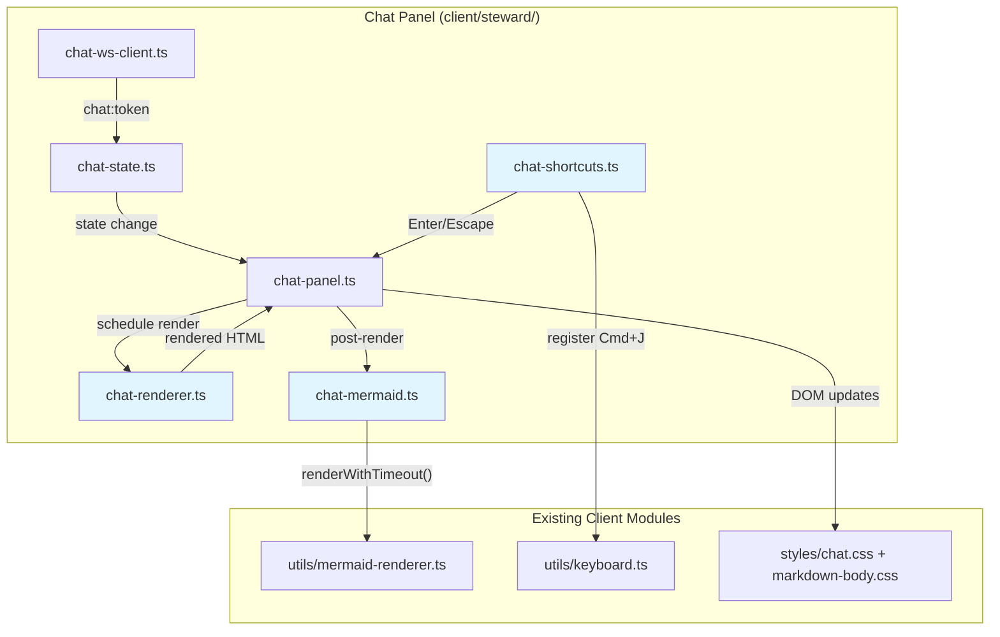
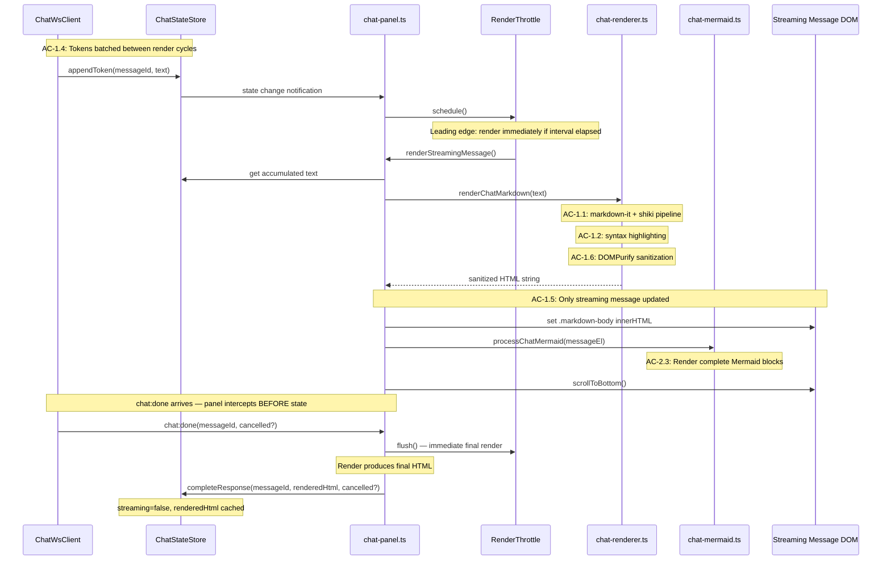
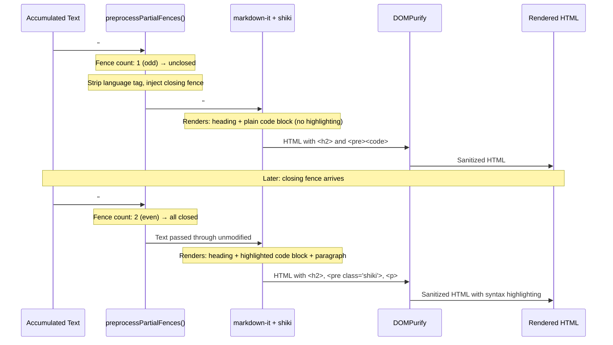

# Technical Design: Chat Rendering and Polish (Epic 11)

## Purpose

This document translates the Epic 11 requirements into implementable architecture for upgrading the chat panel from plain text streaming to streaming markdown rendering, with partial construct handling, debounce tuning, scroll behavior refinement, UI polish, and keyboard shortcuts. It serves three audiences:

| Audience | Value |
|----------|-------|
| Reviewers | Validate architecture decisions before code is written |
| Developers | Clear blueprint for implementation |
| Story Tech Sections | Source of implementation targets, interfaces, and test mappings |

**Output structure:** Config A (2 docs) — single client-side domain.

| Document | Content |
|----------|---------|
| `tech-design.md` (this file) | Index: decisions, context, system view, module architecture, interface definitions, flow design, work breakdown |
| `test-plan.md` | TC→test mapping, mock strategy, fixtures, chunk breakdown with test counts |

**Prerequisite:** Epic 10 complete (feature flag, WebSocket streaming, CLI provider, basic chat panel with plain text). Epic 11 spec (`epic.md`) is complete with 27 ACs and 82 TCs.

---

## Spec Validation

Before designing, the epic was validated as the downstream consumer. All ACs map to implementation work. The following items were identified and resolved:

| Issue | Spec Location | Resolution | Status |
|-------|---------------|------------|--------|
| Server-side `fromHighlighter` API differs from tech design sketch | A2, Q7 | The actual server code in `render.service.ts` uses `fromHighlighter()` (not `markdownItShiki()`), wraps `md.options.highlight` for Mermaid exclusion. Client pipeline uses the same `fromHighlighter` API for consistency. | Resolved — clarified |
| `isomorphic-dompurify` vs browser-native DOMPurify for client | Q6, AC-1.6 | `isomorphic-dompurify` (already installed) delegates to browser-native DOMPurify when bundled by esbuild for the browser. No new dependency needed. | Resolved — clarified |
| markdown-it-anchor needed for in-message anchor links | Q7, TC-1.1h | Epic TC-1.1h requires anchor links within agent messages. The client pipeline includes `markdown-it-anchor` + `github-slugger` (both already installed). Slugger is reset per message render. | Resolved — clarified |
| Mermaid SVG churn during streaming innerHTML replacement | Q3, TC-2.3b | Each render cycle replaces innerHTML, destroying Mermaid SVGs. Design uses a per-conversation Mermaid SVG cache (keyed by source hash + theme). Cached SVGs are re-injected after innerHTML replacement without calling `mermaid.run()`. | Resolved — design decision |
| Client pipeline initialization must handle shiki cold-start gracefully | A2, TC-6.2c | Two-phase init: `initChatRendererBase()` (synchronous, markdown-it only) then `initChatRendererShiki()` (async, adds shiki). During the loading window, code blocks render as monospace `<pre><code>` — NOT as escaped raw text. | Resolved — design decision |
| Server `langAlias` config missing from initial design | Q7, render.service.ts:67-73 | Server configures `langAlias: { js, ts, py, sh, yml }`. Client pipeline must match. Added to `createHighlighter()` config. | Resolved — R1 review fix |
| Shiki error fallback captured hooks in wrong order | Q7, render.service.ts:86-87 | Server captures `originalFence` and `originalHighlight` BEFORE shiki plugin installation, restores them on error. Initial design captured both AFTER, breaking the fallback. Fixed to match server ordering. | Resolved — R1 review fix |
| View menu toggle item had no owning module | AC-4.5, AC-5.3 | Added `components/menu-bar.ts` as MODIFIED to module architecture and responsibility matrix. It adds the "Toggle Chat Panel ⌘J" item to the View menu when the feature flag is enabled. | Resolved — R1 review fix |
| Mermaid cache-hit and theme-rerender paths skipped safety functions | AC-2.3, mermaid-renderer.ts | Cache-hit path now uses `replacePlaceholderWithSvg()` for consistent safety. Theme-rerender path applies `stripInlineEventHandlers()` + `applySvgSizing()`. Both functions exported from `mermaid-renderer.ts` as a prerequisite modification. | Resolved — R1 review fix |
| Link behavior used HTML attributes instead of click interceptor | TC-1.1g, TC-1.1i | Changed to delegated click listener pattern matching existing `link-handler.ts`. `http/https` → `window.open()`, `mailto:` → default behavior, `#anchor` → scroll within message. Electron compatibility documented. | Resolved — R1 review fix |
| Render error logging missing | TC-6.2a | Added `console.error()` call in `renderChatMarkdown` catch block. TC-6.2a test updated to assert logging. | Resolved — R1 review fix |
| Epic says "Enter to send" but Epic 10 has click-to-send only | AC-5.1, Epic 10 out-of-scope | Epic 10 explicitly deferred keyboard shortcuts including Enter-to-send to Epic 11. The keydown handler on the chat input textarea intercepts Enter (send) and allows Shift+Enter (newline). | Resolved — confirmed |
| Panel toggle shortcut must not conflict with existing shortcuts | AC-5.3, Q5 | Existing shortcuts: Cmd+O, Cmd+W, Cmd+E, Cmd+B, Cmd+S, Cmd+Z, Cmd+Shift+]/[. Design uses **Cmd+J** — not used by any existing shortcut or common browser binding. | Resolved — design decision |
| Chat panel toggle persistence location | AC-4.5c | Panel open/closed state stored in `localStorage` under key `mdv-chat-visible`, consistent with existing `mdv-chat-width` for resize persistence. | Resolved — design decision |

**Verdict:** Spec is implementation-ready. No blocking issues remain. All 8 tech design questions answered below.

---

## Context

Epic 10 delivered the chat infrastructure: a feature-flagged chat sidebar with plain text streaming over a WebSocket connection to the Claude CLI. The plumbing works — the user can send messages, see streamed responses, cancel mid-stream, and clear conversations. But the output is a wall of unformatted text. Agent responses that contain headings, code blocks, tables, and lists are unreadable. Epic 11 fixes this by adding a client-side markdown rendering pipeline that transforms the accumulated response text into formatted HTML at a debounced interval during streaming.

The central architectural challenge is that the existing markdown rendering pipeline lives entirely on the server. Epic 2 deviated from the original client-side rendering plan: `render.service.ts` runs markdown-it + shiki + DOMPurify + image URL rewriting on the server, returning finished HTML to the client. The client has never had a markdown-it instance. Epic 11 must create a new client-side pipeline — a genuine new capability, not a reuse. The client pipeline replicates the server's configuration for visual parity (same shiki themes, same markdown-it plugins, same sanitization approach) but omits server-specific concerns (image URL rewriting, file-relative path resolution).

The second challenge is streaming. The server pipeline renders a complete document once. The chat pipeline renders an incomplete, growing document repeatedly — every 150ms while tokens arrive. Each render cycle processes the full accumulated text through markdown-it + shiki, producing new HTML that replaces the streaming message's content. This creates three sub-problems: performance (is the pipeline fast enough at 150ms intervals?), partial constructs (what happens when a code fence is half-received?), and visual stability (does the content jump or flash when innerHTML is replaced?).

Performance is likely fine — chat responses are short compared to full documents (typically under 5000 tokens vs. 10,000+ line documents that the server handles). The pipeline is initialized once on panel mount (the expensive part — loading shiki WASM + grammars takes ~200ms), then each render call is fast. The debounce interval is a named constant (`DEBOUNCE_INTERVAL_MS = 150`) tunable at M3 without code changes.

Partial constructs are handled by pre-processing the accumulated text before passing it to markdown-it. An unclosed code fence (opening ` ``` ` with no closing ` ``` `) is detected by counting fence markers. If the count is odd, the pre-processor strips the language tag from the last opening fence and injects a sentinel closing fence. This causes markdown-it to render the partial code as a plain monospace block (no shiki highlighting) rather than eating all subsequent content. When the real closing fence arrives in a later render cycle, the pre-processing detects an even fence count, passes the text through unmodified, and shiki highlights the complete block normally.

Visual stability comes from the design constraint that only the currently streaming message is re-rendered — completed messages retain their cached HTML untouched. The single streaming message's innerHTML replacement causes a layout recalculation, but the scope is bounded to one message element. Scroll position is managed at the container level (`.chat-messages`), not per-message.

The Mermaid rendering approach is deliberately simpler than Epic 6's full caching infrastructure. Chat Mermaid blocks are rare (most agent responses are text + code), ephemeral (no tab switching), and typically appear once per conversation. The design uses a per-conversation SVG cache (Map, not LRU) to handle the innerHTML churn problem: once a Mermaid block is rendered, its SVG is cached by source hash + theme. Subsequent render cycles re-inject the cached SVG directly instead of calling `mermaid.run()` again. Theme switches clear the cache and re-render.

All changes remain gated behind the `FEATURE_SPEC_STEWARD` flag. When disabled, no rendering pipeline is initialized, no keyboard shortcuts are registered, and no chat-specific CSS classes are applied.

### Stack: No New Dependencies

Every package needed for the client-side pipeline is already installed:

| Package | Current Version | Purpose in Epic 11 |
|---------|----------------|-------------------|
| markdown-it | 14.1.1 | Markdown → HTML conversion (client-side instance) |
| shiki | (installed) | Syntax highlighting via `@shikijs/markdown-it` |
| @shikijs/markdown-it | (installed) | markdown-it plugin for shiki (`fromHighlighter`) |
| markdown-it-anchor | 9.2.0 | Heading anchor IDs for in-message navigation |
| github-slugger | 2.0.0 | GFM-compatible heading slug algorithm |
| markdown-it-task-lists | 2.1.1 | Task list checkbox rendering |
| isomorphic-dompurify | 3.5.1 | HTML sanitization (delegates to browser DOMPurify) |
| mermaid | (installed) | Diagram rendering (already loaded client-side by Epic 3) |

No new npm packages required. The client pipeline composes existing dependencies in a new context (browser instead of server).

---

## Tech Design Question Answers

The epic posed 8 questions for the tech lead. All are answered here; detailed implementation follows in subsequent sections.

### Q1: Debounce strategy

**Answer:** Leading+trailing edge throttle with a fixed 150ms interval.

The throttle fires immediately on the first token (leading edge), ensuring the user sees rendered output within one interval of the first token arrival. During steady streaming, renders execute at most every 150ms — tokens arriving between cycles are batched. After tokens stop arriving, the trailing edge fires one final render. `chat:done` bypasses the throttle entirely for an immediate final render.

Why not trailing-edge debounce: a trailing-edge debounce (render N ms after the *last* token) delays rendering during fast token bursts. When the CLI streams 50 tokens/second, a 150ms trailing debounce would wait 150ms after every burst pause — creating visible delays. The leading+trailing throttle provides a predictable cadence regardless of token rate.

Why 150ms: fast enough to feel responsive (6-7 renders/second during streaming), slow enough to avoid layout thrashing. The server-side pipeline renders full documents in under 50ms; a partial chat response through the same pipeline should be well under 150ms. The value is a named constant (`DEBOUNCE_INTERVAL_MS`) tunable at M3.

```typescript
function createRenderThrottle(renderFn: () => void, intervalMs: number) {
  let timer: number | null = null;
  let lastRun = 0;

  return {
    schedule(): void {
      const now = Date.now();
      const elapsed = now - lastRun;
      if (elapsed >= intervalMs) {
        renderFn();
        lastRun = now;
      } else if (timer === null) {
        timer = window.setTimeout(() => {
          timer = null;
          renderFn();
          lastRun = Date.now();
        }, intervalMs - elapsed);
      }
    },
    flush(): void {
      if (timer !== null) {
        window.clearTimeout(timer);
        timer = null;
      }
      renderFn();
      lastRun = Date.now();
    },
    cancel(): void {
      if (timer !== null) {
        window.clearTimeout(timer);
        timer = null;
      }
    },
  };
}
```

**Detailed design:** See Flow 1: Streaming Render Cycle below.

### Q2: Partial code fence detection

**Answer:** Pre-processing with fence count parity check and sentinel closing fence injection.

Before passing accumulated text to markdown-it, the pre-processor scans for fence markers (lines starting with 3+ backticks). If the count is odd (unclosed fence), it:

1. Locates the last opening fence
2. Strips the language tag from that fence (so shiki doesn't highlight partial code)
3. Appends a sentinel closing fence (`\n```\n`) at the end of the text

This causes markdown-it to render the incomplete code as a plain monospace `<pre><code>` block — visually appearing as code but without syntax highlighting. When the real closing fence arrives in a later token batch, the fence count becomes even, pre-processing passes the text through unmodified, and shiki applies full highlighting.

Why pre-processing over post-processing: markdown-it with an unclosed fence treats all subsequent text as part of the code block, consuming headings, paragraphs, and lists that follow. Pre-processing prevents this by ensuring markdown-it always sees balanced fences. Post-processing (fixing broken DOM after render) would require parsing HTML to detect unterminated `<code>` elements — fragile and more expensive.

```typescript
function preprocessPartialFences(text: string): string {
  const lines = text.split('\n');
  let fenceCount = 0;
  let lastOpenFenceLineIndex = -1;

  for (let i = 0; i < lines.length; i++) {
    if (/^`{3,}/.test(lines[i])) {
      fenceCount++;
      if (fenceCount % 2 === 1) {
        lastOpenFenceLineIndex = i;
      }
    }
  }

  if (fenceCount % 2 === 1 && lastOpenFenceLineIndex >= 0) {
    // Strip language tag from unclosed fence
    lines[lastOpenFenceLineIndex] = lines[lastOpenFenceLineIndex].replace(
      /^(`{3,}).*$/,
      '$1',
    );
    // Inject sentinel closing fence
    lines.push('```');
    return lines.join('\n');
  }

  return text;
}
```

**Detailed design:** See Flow 2: Partial Construct Handling below.

### Q3: Mermaid rendering in chat

**Answer:** Simplified approach — reuse existing `mermaid-renderer.ts` utilities with a per-conversation SVG cache. No reuse of Epic 6's LRU `MermaidCache` class.

The chat Mermaid pipeline differs from document Mermaid in three ways:

1. **Timing**: Mermaid blocks render mid-stream when the closing fence arrives (TC-2.3b), not deferred to `chat:done`. This is detected during the normal render cycle — when the fence count is even for a `mermaid` code block, markdown-it renders it as `<pre><code class="language-mermaid">`, and the post-render step in `processChatMermaid()` detects these elements and renders them as diagrams.

2. **SVG churn**: Each render cycle replaces the streaming message's innerHTML, destroying previously rendered Mermaid SVGs. The design caches rendered SVGs in a `Map<string, string>` keyed by `sourceHash:themeId`. After innerHTML replacement, the post-render step checks for `pre > code.language-mermaid` elements, looks up cached SVGs, and injects them directly via `replacePlaceholderWithSvg()` without calling `mermaid.run()`. Only uncached blocks trigger `mermaid.run()`.

3. **Scope**: The cache is per-conversation (cleared on `chat:clear`), not global across tabs like Epic 6's `MermaidCache`. No LRU eviction needed — chat conversations rarely have more than a handful of Mermaid diagrams.

For theme switching: listen for `data-theme` attribute changes via the existing MutationObserver pattern. When the theme changes, clear the SVG cache, find all `.mermaid-diagram` elements in chat messages, read their `data-mermaid-source` attribute, and re-render with the new theme via `mermaid.run()`.

The existing client-side Mermaid utilities (`renderWithTimeout`, `replacePlaceholderWithSvg`, `replacePlaceholderWithError`, `getMermaidTheme`) from `mermaid-renderer.ts` are reused directly. The cache is new but trivial.

**Detailed design:** See Flow 3: Mermaid in Chat below.

### Q4: DOM update strategy for streaming messages

**Answer:** innerHTML replacement for the streaming message, with Mermaid SVG re-injection.

The rendering pipeline produces a complete HTML string from the full accumulated text. The streaming message element's `.markdown-body` container receives this HTML via innerHTML assignment. This is the simplest approach and matches how the server-side pipeline delivers HTML to the document viewer (the client sets `contentArea.innerHTML = response.html`).

Why not surgical DOM updates (morphdom, diff-based patching):
- morphdom was rejected in dependency research
- The scope is bounded: only ONE element's innerHTML changes (the streaming message)
- Layout recalculation cost is proportional to one message, not the full conversation
- Completed messages are never touched — their HTML is cached in `ChatMessage.renderedHtml`

The one refinement is Mermaid SVG preservation. After setting innerHTML, the Mermaid post-processor runs: it finds `pre > code.language-mermaid` elements, checks the SVG cache, and either injects cached SVGs or renders new ones. This avoids the cost of calling `mermaid.run()` on every render cycle for already-rendered diagrams.

Scroll position is handled at the `.chat-messages` container level (the parent), not within the message being updated. The `scrollToBottom()` call happens after the render cycle completes.

**Detailed design:** See Flow 1: Streaming Render Cycle below.

### Q5: Chat panel toggle mechanism and shortcut

**Answer:** Cmd+J toggles panel visibility. Close button in header, reopen button at workspace edge.

**Keyboard shortcut: Cmd+J**

Verified against existing shortcuts:
- Cmd+O (Open File), Cmd+W (Close Tab), Cmd+E (Toggle Edit), Cmd+B (Toggle Sidebar), Cmd+S (Save), Cmd+Z (Undo), Cmd+Shift+]/[ (Next/Prev Tab) — none conflict.
- Cmd+J is not a standard browser shortcut on macOS (Chrome, Safari, Firefox).
- Cmd+J follows the convention of "toggle panel" shortcuts (VS Code uses Cmd+J for terminal panel).

The shortcut is registered on the global `KeyboardManager` (existing infrastructure from Epic 1) when the chat panel mounts, and unregistered on destroy. When the feature flag is disabled, `mountChatPanel()` is never called, so the shortcut is never registered (TC-5.3d).

**UI controls:**

- **Close**: An × button in the chat header (`.chat-close-btn`), next to the existing Clear button. Clicking it triggers the same close transition as the keyboard shortcut.
- **Reopen**: When the panel is closed, a floating toggle button appears at the right edge of the workspace (`.chat-toggle-btn`). Clicking it opens the panel. The button is positioned with `position: fixed` at the right edge, vertically centered.
- **View menu**: A "Toggle Chat Panel" item in the View menu dropdown with "⌘J" shortcut displayed. This uses the existing menu bar infrastructure.

**Persistence:** Panel visibility stored in `localStorage` key `mdv-chat-visible` (values: `'true'` or `'false'`). On app load with the feature flag enabled, the stored state is read. If `'false'`, the panel is mounted but immediately set to the closed state (no transition on initial load). Default is `'true'` (panel visible) when no stored value exists.

**Detailed design:** See Flow 5: Panel Toggle below.

### Q6: HTML sanitization

**Answer:** Same approach as document rendering — DOMPurify with default allowlist. Applied after markdown-it render, before innerHTML assignment.

The client-side pipeline uses `isomorphic-dompurify`, which is already installed and delegates to browser-native DOMPurify in the esbuild browser bundle. The default DOMPurify configuration preserves safe HTML elements (`<details>`, `<summary>`, `<kbd>`, `<br>`, `<mark>`, `<abbr>`, standard block/inline elements) and strips dangerous content (`<script>`, `<iframe>`, `<style>`, `<object>`, event handlers, `javascript:` URLs).

No custom allowlist configuration needed — the defaults match the server-side pipeline exactly.

```typescript
import DOMPurify from 'isomorphic-dompurify';

function sanitize(html: string): string {
  return DOMPurify.sanitize(html);
}
```

This runs on every render cycle output before innerHTML assignment. The cost is negligible — DOMPurify is fast on short HTML strings (chat message–sized).

**Detailed design:** See chat-renderer.ts module definition below.

### Q7: Client-side pipeline configuration scope

**Answer:** Replicate the server pipeline's configuration where applicable to chat content. Omit server-specific concerns.

**Replicate from server's `render.service.ts`:**

| Configuration | Server | Client (Chat) | Rationale |
|--------------|--------|---------------|-----------|
| `markdown-it({ html: true, linkify: true })` | Yes | Yes | Agent responses may contain HTML and bare URLs |
| `fromHighlighter()` with dual-theme CSS vars | Yes | Yes | Visual parity with document rendering |
| `defaultColor: false` | Yes | Yes | Theme switching via CSS variables, no re-render |
| `themes: { light: 'github-light', dark: 'github-dark' }` | Yes | Yes | Same shiki themes |
| 17 baseline languages | Yes | Yes | Same language coverage |
| Mermaid exclusion in highlight hook | Yes | Yes | Mermaid blocks handled separately |
| Shiki error → fallback to monospace | Yes | Yes | Same error resilience |
| `markdown-it-task-lists` | Yes | Yes | Agent responses may include task lists |
| `markdown-it-anchor` + `github-slugger` | Yes | Yes | In-message anchor links (TC-1.1h) |
| DOMPurify sanitization | Yes | Yes | Same sanitization for safety |

**Omit:**

| Configuration | Server | Client (Chat) | Rationale |
|--------------|--------|---------------|-----------|
| Image URL rewriting (`/api/image?path=...`) | Yes | No | Chat responses don't reference local images |
| Mermaid placeholder injection in markdown-it | Yes | No | Chat handles Mermaid post-render, not during render |
| `RenderWarning` collection | Yes | No | Chat doesn't surface rendering warnings to the user |

The `processMermaidBlocks()` function from the server pipeline transforms mermaid code blocks into `.mermaid-placeholder` divs during markdown-it rendering. The client pipeline handles Mermaid differently: markdown-it renders mermaid blocks as normal code blocks (since the highlight hook returns `''` for mermaid), and the post-render step in `chat-panel.ts` detects these blocks by checking for `code.language-mermaid` elements and processes them into diagrams.

**Detailed design:** See chat-renderer.ts Interface Definitions below.

### Q8: Client-side shiki theme configuration

**Answer:** Use the same dual-theme CSS variable approach (`defaultColor: false`). Existing `markdown-body.css` rules cover the chat context — no new shiki theme styles needed.

The server pipeline configures shiki with:
```typescript
fromHighlighter(highlighter, {
  themes: { light: 'github-light', dark: 'github-dark' },
  defaultColor: false,
})
```

This produces HTML with `--shiki-light` and `--shiki-dark` CSS custom properties on each token span. The existing `markdown-body.css` contains rules that activate the correct variable set based on the `data-theme` attribute:

```css
/* Already exists in markdown-body.css */
[data-theme^="light"] .shiki span { color: var(--shiki-light); }
[data-theme^="dark"] .shiki span { color: var(--shiki-dark); }
```

The client pipeline uses the identical `fromHighlighter` configuration. Since agent messages wrap their rendered content in `.markdown-body` (same class as document rendering), the existing CSS rules apply automatically. Theme switching works via CSS variable activation — no JavaScript re-rendering needed for shiki output.

**What the chat panel adds:**

The agent message DOM structure nests `.markdown-body` inside `.chat-message.agent`:

```html
<div class="chat-message agent">
  <div class="markdown-body">
    <!-- rendered HTML with .shiki spans -->
  </div>
</div>
```

The `.markdown-body` class scopes all existing markdown rendering styles (headings, tables, code blocks, blockquotes, lists) to the rendered content. This provides visual parity with document rendering while keeping chat message styling (padding, border-radius, alignment) separate.

**Mermaid theme switching** is the exception: Mermaid SVGs embed colors directly and cannot be updated via CSS variables. When the theme changes, Mermaid diagrams in chat messages must be re-rendered with the new theme. This uses the existing `getMermaidTheme()` function from `mermaid-renderer.ts` to map the `data-theme` attribute to Mermaid's `'default'` or `'dark'` theme, then re-renders each diagram via `mermaid.run()`.

---

## System View

### System Context

Epic 11 is entirely client-side. The server is unchanged — no new endpoints, no new WebSocket message types, no modified schemas. The `chat:token` messages still carry raw text tokens; the client now renders them as markdown instead of appending as plain text.

```
┌─────────────────────────────────────────────────────────────┐
│ Browser                                                      │
│  ┌─────────────────────────────────┬──────────────────────┐  │
│  │ Existing Frontend               │ Chat Panel           │  │
│  │  Sidebar │ Workspace │ Tabs     │ (feature-flagged)    │  │
│  │                                 │                      │  │
│  │                                 │ NEW: Rendering       │  │
│  │                                 │  markdown-it + shiki │  │
│  │                                 │  DOMPurify           │  │
│  │                                 │  Mermaid (existing)  │  │
│  │                                 │  Debounced pipeline  │  │
│  │                                 │  Keyboard shortcuts  │  │
│  │                                 │  Panel toggle + CSS  │  │
│  └────────────┬────────────────────┴──────────┬───────────┘  │
│               │ HTTP + WS (file watch)        │ WS (chat)    │
│               │ UNCHANGED                     │ UNCHANGED    │
└───────────────┼───────────────────────────────┼──────────────┘
                │                               │
┌───────────────┼───────────────────────────────┼──────────────┐
│ Fastify Server (UNCHANGED)                    │              │
│  REST API + WS (file watch) + WS (chat)      │              │
│  Provider Manager → CLI Process               │              │
│                                                              │
│  chat:token messages carry raw text — client renders it      │
└──────────────────────────────────────────────────────────────┘
```

### External Contracts

**No changes to server contracts.** All WebSocket message schemas from Epic 10 remain unchanged:

| Message Type | Direction | Key Fields | Epic 11 Impact |
|-------------|-----------|------------|----------------|
| `chat:token` | Server → Client | `messageId`, `text` | Client renders `text` as markdown instead of plain text |
| `chat:done` | Server → Client | `messageId`, `cancelled?` | Triggers immediate final render + HTML caching |
| `chat:send` | Client → Server | `messageId`, `text` | Unchanged |
| `chat:cancel` | Client → Server | `messageId` | Unchanged |
| `chat:clear` | Client → Server | — | Unchanged (also clears Mermaid SVG cache on client) |

**New client-side internal contracts:**

| Contract | Type | Purpose |
|----------|------|---------|
| `ChatMessage.renderedHtml` | State extension | Cached rendered HTML for completed messages |
| `initChatRenderer()` | Async initialization | Creates client-side markdown-it + shiki pipeline |
| `renderChatMarkdown(text)` | Sync render function | Pre-processes, renders, sanitizes accumulated text |
| `DEBOUNCE_INTERVAL_MS` | Named constant | Tunable render throttle interval (default: 150ms) |

**Runtime Prerequisites (unchanged from Epic 10):**

No new prerequisites. The client-side pipeline uses packages already in the esbuild bundle. Shiki's WASM grammar engine loads at runtime from the bundle — no external fetch needed.

---

## Module Architecture

Epic 11 adds 3 new modules and modifies 5 existing modules. No server-side changes.

```
app/src/client/steward/
├── chat-panel.ts          # MODIFIED — integrate rendering pipeline, toggle, shortcuts
├── chat-state.ts          # MODIFIED — add renderedHtml field to ChatMessage
├── chat-ws-client.ts      # UNCHANGED
├── chat-resizer.ts        # UNCHANGED
├── features.ts            # UNCHANGED
├── chat-renderer.ts       # NEW — client-side markdown-it + shiki + DOMPurify pipeline
├── chat-mermaid.ts        # NEW — Mermaid rendering for chat (SVG cache, theme re-render)
└── chat-shortcuts.ts      # NEW — Enter/Escape/Cmd+J keyboard handlers

app/src/client/styles/
├── chat.css               # MODIFIED — .markdown-body scoping, transitions, toggle button
└── markdown-body.css      # EXISTS — reused for rendered markdown styling (unchanged)

app/src/client/components/
└── mermaid-cache.ts       # EXISTS — NOT reused (Epic 6 LRU cache is for documents)

app/src/client/utils/
├── mermaid-renderer.ts    # MODIFIED — export stripInlineEventHandlers + applySvgSizing for reuse
└── keyboard.ts            # EXISTS — KeyboardManager used for Cmd+J registration

app/src/client/components/
└── menu-bar.ts            # MODIFIED — add "Toggle Chat Panel" View menu item when flag enabled
```

### Module Responsibility Matrix

| Module | Status | Responsibility | Dependencies | ACs Covered |
|--------|--------|----------------|--------------|-------------|
| `steward/chat-renderer.ts` | NEW | Client-side markdown-it + shiki pipeline. Initialization, render function, partial fence pre-processing, DOMPurify sanitization. | markdown-it, shiki, @shikijs/markdown-it, markdown-it-anchor, github-slugger, markdown-it-task-lists, isomorphic-dompurify | AC-1.1, AC-1.2, AC-1.3, AC-1.6, AC-2.1, AC-2.2, AC-6.1, AC-6.2 |
| `steward/chat-mermaid.ts` | NEW | Mermaid rendering for chat messages. Per-conversation SVG cache. Post-render placeholder processing. Theme re-render. | mermaid-renderer.ts (existing utilities) | AC-2.3, AC-1.3 (TC-1.3b Mermaid theme) |
| `steward/chat-shortcuts.ts` | NEW | Keyboard shortcuts for chat: Enter-to-send, Escape-to-cancel, Cmd+J toggle. Registration/unregistration lifecycle. | keyboard.ts (KeyboardManager) | AC-5.1, AC-5.2, AC-5.3, AC-5.4, AC-6.4 (TC-6.4b) |
| `steward/chat-panel.ts` | MODIFIED | Integrate rendering pipeline into message display. Debounced render cycle. Incremental DOM updates (only streaming message re-rendered). Panel toggle open/close with transitions. Auto-scroll refinement for markdown height changes. | chat-renderer, chat-mermaid, chat-shortcuts, chat-state | AC-1.4, AC-1.5, AC-2.4, AC-3.1–3.4, AC-4.1–4.5, AC-6.3 |
| `steward/chat-state.ts` | MODIFIED | Add `renderedHtml` field to `ChatMessage`. Cache rendered HTML on `chat:done`. | — | AC-1.5 (completed messages not re-rendered) |
| `styles/chat.css` | MODIFIED | Add `.markdown-body` scoping inside agent messages, panel open/close CSS transition, toggle button styles, multi-line input growth, wide table/code scroll overflow. | themes.css, markdown-body.css (existing) | AC-4.1, AC-4.2, AC-4.3, AC-4.4, AC-1.1e, AC-1.2d, AC-6.4 (TC-6.4c) |
| `components/menu-bar.ts` | MODIFIED | Add "Toggle Chat Panel ⌘J" item to View menu when feature flag is enabled. Calls the toggle function exposed by `chat-panel.ts`. | steward/features.ts (flag check) | AC-4.5 (TC-4.5b reopen control), AC-5.3 |
| `utils/mermaid-renderer.ts` | MODIFIED | Export `stripInlineEventHandlers()` and `applySvgSizing()` for reuse by `chat-mermaid.ts`. No behavior changes. | — | (supports AC-2.3 Mermaid safety) |

### Component Interaction Diagram



### Dependency Map

```
chat-panel.ts
├── chat-renderer.ts
│   ├── markdown-it (npm)
│   ├── @shikijs/markdown-it → shiki (npm, async init)
│   ├── markdown-it-anchor + github-slugger (npm)
│   ├── markdown-it-task-lists (npm)
│   └── isomorphic-dompurify (npm)
├── chat-mermaid.ts
│   └── utils/mermaid-renderer.ts
│       └── mermaid (npm, dynamic import)
├── chat-shortcuts.ts
│   └── utils/keyboard.ts (existing KeyboardManager)
├── chat-state.ts (no external deps)
└── chat-ws-client.ts (unchanged)
```

All npm packages are existing project dependencies. No new installs.

---

## Flow-by-Flow Design

### Flow 1: Streaming Render Cycle

**Covers:** AC-1.1 (markdown rendering), AC-1.2 (code highlighting), AC-1.4 (debounced rendering), AC-1.5 (incremental updates), AC-1.6 (sanitization), AC-2.4 (smooth transitions)

When tokens arrive from the WebSocket, the accumulated text is rendered through the client-side markdown-it + shiki pipeline at a throttled interval. Only the currently streaming message's DOM content is updated — completed messages retain their cached HTML.



**Rendering flow detail:**

The `renderStreamingMessage()` function in `chat-panel.ts` is the core render cycle:

1. Read the streaming message's accumulated `text` from `ChatStateStore`
2. Call `renderChatMarkdown(text)` — this pre-processes partial fences, renders through markdown-it + shiki, and sanitizes via DOMPurify
3. Find the streaming message's `.markdown-body` element in the DOM
4. Set `element.innerHTML = renderedHtml`
5. Call `processChatMermaid(element)` — finds complete Mermaid code blocks, injects cached SVGs or renders new ones
6. Attach click interceptor for links (see Link Click Handling below)
7. Call `scrollToBottom()` — auto-scrolls if user hasn't scrolled up

**`chat:done` sequencing (critical ordering):**

When `chat:done` arrives, the panel intercepts the event BEFORE updating state. This ordering is essential because the render function targets the "streaming" message — if state flips `streaming: false` first, the final render loses its target.

1. `chat:done` event arrives from `ChatWsClient`
2. `chat-panel.ts` intercepts directly (registered on the WS client alongside state handlers)
3. Call `throttle.flush()` — immediately renders the accumulated text one final time
4. Capture the rendered HTML from the flush
5. THEN call `chatState.completeResponse(messageId, renderedHtml, cancelled?)` — this sets `streaming: false` and caches the HTML

This sequence satisfies AC-1.4c (final render on completion), AC-1.4d (final render on cancel), and AC-1.5 (only streaming message re-rendered).

```typescript
// In chat-state.ts
completeResponse(messageId: string, renderedHtml: string, cancelled?: boolean): void {
  const messages = this.state.messages.map((m) =>
    m.id === messageId && m.role === 'agent'
      ? { ...m, streaming: false, renderedHtml, ...(cancelled ? { cancelled: true } : {}) }
      : m,
  );
  // ...
}
```

Subsequent renders (new message streaming, theme change via CSS) skip completed messages — their `.markdown-body` innerHTML is set once from the cached `renderedHtml` and never re-rendered. The exception is Mermaid theme re-rendering, which operates on `.mermaid-diagram` elements directly without replacing message HTML.

### Flow 2: Partial Construct Handling

**Covers:** AC-2.1 (incomplete code fences), AC-2.2 (incomplete inline formatting), AC-2.4 (smooth transitions)

Partial constructs are handled at the pre-processing stage, before markdown-it runs. The key insight: markdown-it handles incomplete inline formatting gracefully by default (unclosed `**` renders as literal `**`). The only construct that requires pre-processing is code fences, because an unclosed fence causes markdown-it to treat all subsequent text as code.



**What markdown-it handles natively (no pre-processing needed):**

| Construct | Incomplete State | markdown-it Behavior |
|-----------|-----------------|---------------------|
| `**bold` | No closing `**` | Renders as literal `**bold` (TC-2.2a) |
| `*italic` | No closing `*` | Renders as literal `*italic` (TC-2.2b) |
| `~~strike` | No closing `~~` | Renders as literal `~~strike` (TC-2.2b) |
| `[link text](` | No closing `)` | Renders as literal `[link text](` (TC-2.2c) |
| `# Heading` | Complete | Renders as heading immediately |
| `- list item` | Complete | Renders as list immediately |

This is a significant simplification: only code fences need pre-processing. All other partial constructs degrade gracefully through markdown-it's default behavior.

### Flow 3: Mermaid in Chat

**Covers:** AC-2.3 (Mermaid renders when complete), AC-1.3 TC-1.3b (Mermaid theme re-rendering)

Mermaid processing happens after the main render cycle sets innerHTML. The flow distinguishes between streaming (where SVG churn is a concern) and completed messages.

**During streaming:**

1. `renderChatMarkdown()` runs markdown-it. The shiki highlight hook returns `''` for `mermaid` language, so markdown-it's default fence renderer produces `<pre><code class="language-mermaid">source</code></pre>`.
2. After innerHTML is set, `processChatMermaid(messageEl)` scans for `pre > code.language-mermaid` elements.
3. For each found element: extract the source text, compute `fnv1a(source) + ':' + themeId` as the cache key.
4. If cached: replace the `<pre>` with a `.mermaid-diagram` div containing the cached SVG.
5. If not cached: call `renderWithTimeout(source, id, theme)` from `mermaid-renderer.ts`, cache the SVG, replace the element.
6. On subsequent render cycles, the same Mermaid source produces the same cache key — the cached SVG is re-injected without calling `mermaid.run()`.

**On theme change:**

1. MutationObserver on `document.documentElement` `data-theme` attribute (same pattern as document rendering).
2. When theme changes: clear the chat Mermaid SVG cache.
3. Find all `.mermaid-diagram` elements within `.chat-messages`.
4. For each: read `data-mermaid-source`, call `renderWithTimeout()` with new theme, update innerHTML.
5. New SVGs are cached under the new theme key.

**On `chat:clear`:** Clear the Mermaid SVG cache.

**Incomplete Mermaid blocks (TC-2.3a):** When the accumulated text has an unclosed mermaid fence, the pre-processor strips the language tag and injects a closing fence. This causes the block to render as plain monospace code — the user sees the partial Mermaid source as text, not as a broken diagram. When the closing fence arrives, the block has the `mermaid` language tag, produces a `code.language-mermaid` element, and triggers Mermaid rendering.

### Flow 4: Scroll Behavior

**Covers:** AC-3.1 (auto-scroll during streaming), AC-3.2 (scroll-up disengages), AC-3.3 (scroll-to-bottom re-engages), AC-3.4 (no scroll jump on completion)

Epic 10 established the basic auto-scroll mechanism with a `userScrolledUp` flag and 20px threshold. Epic 11 refines it for markdown rendering where content height changes are less predictable.

The refinement is minimal because the mechanism is sound — the key change is timing. Epic 10 called `scrollToBottom()` on every state change. Epic 11 calls it at the end of each render cycle (after innerHTML replacement and Mermaid processing), which is the correct point — the DOM height has stabilized.

```typescript
// In chat-panel.ts — scroll tracking (refined from Epic 10)
const SCROLL_THRESHOLD = 20;
let userScrolledUp = false;

messagesEl.addEventListener('scroll', () => {
  const { scrollTop, scrollHeight, clientHeight } = messagesEl;
  userScrolledUp = scrollHeight - scrollTop - clientHeight > SCROLL_THRESHOLD;
});

function scrollToBottom(): void {
  if (!userScrolledUp) {
    messagesEl.scrollTop = messagesEl.scrollHeight;
  }
}
```

**Height change handling (TC-3.1b):** When an incomplete code fence upgrades to a highlighted code block, or a Mermaid diagram renders, the message height changes. The `scrollToBottom()` call at the end of the render cycle handles this — it reads `scrollHeight` after the DOM update, so it accounts for the new height. If the user hasn't scrolled up, the view follows the content.

**Completion (TC-3.4a):** The final render on `chat:done` calls `scrollToBottom()` like any other render cycle. Since the message content only changes if there were unrendered tokens (the flush), the scroll position doesn't jump if there's no content change.

### Flow 5: Panel Toggle

**Covers:** AC-4.2 (open/close transition), AC-4.5 (toggle controls and persistence), AC-5.3 (toggle shortcut)

The panel toggle adds open/close state management on top of Epic 10's always-visible panel.

**State:** `panelVisible` boolean, stored in `localStorage` key `mdv-chat-visible`.

**CSS transition:** The grid column for the chat panel animates between its target width and `0px`:

```css
#main.chat-enabled {
  transition: grid-template-columns 0.2s ease-out;
}

#main.chat-enabled.chat-hidden {
  grid-template-columns:
    var(--sidebar-width, 15rem)  /* sidebar */
    0px                          /* sidebar-resizer */
    minmax(0, 1fr)               /* workspace */
    0px                          /* chat-resizer */
    0px;                         /* chat-panel — collapsed */
}
```

When `chat-hidden` is added to `#main`, the chat panel column transitions to `0px` and the workspace expands to fill the space. Removing `chat-hidden` transitions back to the stored width.

**Panel overflow:** When the panel width is `0px`, the panel contents must be hidden to avoid overflow artifacts:

```css
#main.chat-hidden #chat-panel {
  overflow: hidden;
  visibility: hidden; /* hidden after transition completes */
}
```

The `visibility: hidden` is set via a `transitionend` listener to avoid hiding content during the transition.

**Toggle button:** When the panel is closed, a small floating button appears:

```html
<button class="chat-toggle-btn" title="Toggle Chat Panel (⌘J)" aria-label="Toggle Chat Panel">
  <!-- Chat icon or ">" chevron -->
</button>
```

Positioned with `position: fixed; right: 0; top: 50%; transform: translateY(-50%)`. Hidden when panel is open.

**View menu integration:** The existing `menu-bar.ts` is modified to add a "Toggle Chat Panel" item to the View menu when the feature flag is enabled. The menu item shows the Cmd+J shortcut and calls the toggle function.

### Flow 6: Keyboard Shortcuts

**Covers:** AC-5.1 (Enter to send), AC-5.2 (Escape to cancel), AC-5.3 (toggle shortcut), AC-5.4 (tooltip discoverability)

Three keyboard shortcuts are added, registered in `chat-shortcuts.ts`:

**Enter to send (AC-5.1):**
- Handled via `keydown` listener on the chat input `<textarea>`, not via the global `KeyboardManager`.
- `Enter` without Shift: call `preventDefault()`, trigger send (same as send button click).
- `Shift+Enter`: do nothing (default textarea behavior inserts newline).
- Enter on empty input: do nothing (TC-5.1c).
- Enter while streaming (input disabled): do nothing (TC-5.1d).

Why textarea-scoped and not global: Enter should only send when the chat input has focus. A global handler would intercept Enter in other text inputs (edit mode, search).

**Escape to cancel (AC-5.2):**
- Handled via `keydown` listener on the chat panel container (`#chat-panel`).
- When a response is streaming (`activeMessageId !== null`): trigger cancel (same as cancel button click).
- When idle: no action (TC-5.2b).

Why panel-scoped: Escape should work when any element within the chat panel has focus, not just the input. But it shouldn't fire when focus is in the sidebar or content area.

**Cmd+J to toggle (AC-5.3):**
- Registered on the global `KeyboardManager` via `keyboard.register()`.
- Triggers the panel toggle function.
- Global scope: works regardless of focus (TC-5.3c).
- Registered when chat panel mounts, unregistered on destroy.
- Not registered when feature flag is disabled (TC-5.3d).

**Tooltip discoverability (AC-5.4):**
- Send button: `title="Send (Enter)"`
- Cancel button: `title="Cancel (Esc)"`
- Panel toggle button: `title="Toggle Chat Panel (⌘J)"`
- Close button in header: `title="Close (⌘J)"`

---

## Interface Definitions

### Types

```typescript
// Extended from Epic 10's ChatMessage in chat-state.ts
export interface ChatMessage {
  id: string;
  role: 'user' | 'agent' | 'error';
  text: string;                    // Raw accumulated text (markdown source)
  streaming: boolean;
  cancelled?: boolean;
  renderedHtml?: string;           // Cached rendered HTML for completed agent messages
}
```

```typescript
// chat-renderer.ts — Pipeline configuration
export interface ChatRendererConfig {
  /** Debounce interval in ms for streaming re-renders. Default: 150 */
  debounceIntervalMs?: number;
}

export interface ChatRendererInstance {
  /** Render accumulated markdown text to sanitized HTML */
  render(text: string): string;
  /** Whether the pipeline is ready (shiki loaded) */
  readonly ready: boolean;
}
```

```typescript
// chat-mermaid.ts — Mermaid SVG cache for chat
export interface ChatMermaidManager {
  /** Process Mermaid placeholders in a message element */
  processPlaceholders(messageEl: HTMLElement): Promise<void>;
  /** Re-render all Mermaid diagrams in chat with new theme */
  reRenderForTheme(): Promise<void>;
  /** Clear the SVG cache (on chat:clear) */
  clearCache(): void;
}
```

```typescript
// chat-shortcuts.ts — Shortcut registration
export interface ChatShortcutHandlers {
  onSend: () => void;
  onCancel: () => void;
  onToggle: () => void;
}

export interface ChatShortcutCleanup {
  destroy: () => void;
}
```

### chat-renderer.ts Module Interface

```typescript
// app/src/client/steward/chat-renderer.ts

import MarkdownIt from 'markdown-it';
import { fromHighlighter } from '@shikijs/markdown-it';
import markdownItAnchor from 'markdown-it-anchor';
import markdownItTaskLists from 'markdown-it-task-lists';
import GithubSlugger from 'github-slugger';
import DOMPurify from 'isomorphic-dompurify';
import { createHighlighter } from 'shiki';

/** Named constant — tunable at M3 without code changes */
export const DEBOUNCE_INTERVAL_MS = 150;

const SHIKI_THEMES = { light: 'github-light', dark: 'github-dark' } as const;

const SHIKI_LANGUAGES = [
  'javascript', 'typescript', 'python', 'go', 'rust', 'java',
  'c', 'cpp', 'sql', 'yaml', 'json', 'bash', 'html', 'css',
  'markdown', 'toml', 'dockerfile',
] as const;

/** Language aliases — matches server render.service.ts exactly */
const SHIKI_LANG_ALIASES: Record<string, string> = {
  js: 'javascript',
  ts: 'typescript',
  py: 'python',
  sh: 'bash',
  yml: 'yaml',
};

let md: MarkdownIt | null = null;
let shikiReady = false;
const slugger = new GithubSlugger();

/**
 * Initialize markdown-it base pipeline (synchronous, no shiki).
 * Called immediately on chat panel mount. Code blocks render as
 * plain monospace <pre><code> until shiki loads.
 *
 * Covers: AC-6.2c (monospace code blocks while shiki loading)
 */
export function initChatRendererBase(): void {
  md = new MarkdownIt({ html: true, linkify: true, typographer: false });
  md.use(markdownItTaskLists, { enabled: false, label: true });
  md.use(markdownItAnchor, { slugify: (s: string) => slugger.slug(s) });
}

/**
 * Load shiki and attach it to the markdown-it instance.
 * Async because shiki loads WASM + grammars (~200ms).
 * Called after initChatRendererBase(). Until this completes, code
 * blocks render without syntax highlighting (TC-6.2c).
 *
 * Covers: AC-1.2, AC-1.3
 */
export async function initChatRendererShiki(): Promise<void> {
  if (!md) throw new Error('Call initChatRendererBase() first');

  const highlighter = await createHighlighter({
    themes: [SHIKI_THEMES.light, SHIKI_THEMES.dark],
    langs: [...SHIKI_LANGUAGES],
    langAlias: SHIKI_LANG_ALIASES,
  });

  // Capture pre-shiki hooks BEFORE installing the plugin
  const originalFence = md.renderer.rules.fence;
  const originalHighlight = md.options.highlight;

  // Shiki plugin — same configuration as server-side render.service.ts
  const shikiPlugin = fromHighlighter(highlighter, {
    themes: SHIKI_THEMES,
    defaultColor: false,
    fallbackLanguage: undefined,
  });
  md.use(shikiPlugin);

  // Mermaid exclusion — wrap md.options.highlight (same pattern as server)
  const shikiHighlight = md.options.highlight;
  md.options.highlight = (code, lang, attrs) => {
    const normalizedLang = lang.trim().toLowerCase();
    if (!normalizedLang || normalizedLang === 'mermaid') {
      return '';  // Fall through to default renderer
    }
    return shikiHighlight ? shikiHighlight(code, normalizedLang, attrs) : '';
  };

  // Shiki error fallback — capture shiki fence AFTER plugin, restore
  // original pre-shiki hooks on error (same pattern as server)
  const shikiFence = md.renderer.rules.fence;
  md.renderer.rules.fence = (tokens, idx, options, env, self) => {
    try {
      return shikiFence
        ? shikiFence(tokens, idx, options, env, self)
        : self.renderToken(tokens, idx, options);
    } catch {
      // Restore pre-shiki highlight and fence for fallback render
      const previousHighlight = md!.options.highlight;
      md!.options.highlight = originalHighlight;
      try {
        return originalFence
          ? originalFence(tokens, idx, options, env, self)
          : self.renderToken(tokens, idx, options);
      } finally {
        md!.options.highlight = previousHighlight;
      }
    }
  };

  shikiReady = true;
}

/**
 * Render accumulated markdown text to sanitized HTML.
 * Pre-processes partial fences, renders through markdown-it (+ shiki if loaded),
 * sanitizes via DOMPurify.
 *
 * Three degradation levels:
 * 1. Full pipeline (md + shiki): syntax-highlighted code blocks
 * 2. Base pipeline (md, no shiki): monospace <pre><code> blocks (TC-6.2c)
 * 3. Complete failure: escaped plain text (TC-6.2a)
 *
 * Covers: AC-1.1, AC-1.2, AC-1.6, AC-2.1, AC-2.2, AC-6.2a, AC-6.2c
 */
export function renderChatMarkdown(text: string): string {
  if (!md) {
    // Pipeline not initialized at all — escape as last resort
    return escapeHtml(text);
  }

  try {
    slugger.reset();
    const preprocessed = preprocessPartialFences(text);
    const rawHtml = md.render(preprocessed);
    return DOMPurify.sanitize(rawHtml);
  } catch (error) {
    // AC-6.2a: Render failure — log error and fall back to plain text
    console.error('[chat-renderer] Render failed, falling back to plain text:', error);
    return escapeHtml(text);
  }
}

/** Whether shiki syntax highlighting is loaded and ready */
export function isShikiReady(): boolean {
  return shikiReady;
}

/** Whether the base markdown-it pipeline is initialized */
export function isRendererInitialized(): boolean {
  return md !== null;
}
```

### chat-mermaid.ts Module Interface

```typescript
// app/src/client/steward/chat-mermaid.ts

import {
  renderWithTimeout,
  replacePlaceholderWithSvg,
  replacePlaceholderWithError,
  getMermaidTheme,
  stripInlineEventHandlers,
  applySvgSizing,
} from '../utils/mermaid-renderer.js';

/** Simple FNV-1a hash — same algorithm as mermaid-cache.ts */
function fnv1a(str: string): string {
  let hash = 0x811c9dc5;
  for (let i = 0; i < str.length; i++) {
    hash ^= str.charCodeAt(i);
    hash = (hash * 0x01000193) >>> 0;
  }
  return hash.toString(16);
}

const svgCache = new Map<string, string>();
let renderIndex = 0;

function cacheKey(source: string, theme: string): string {
  return `${fnv1a(source)}:${theme}`;
}

/**
 * Process Mermaid code blocks in a chat message element.
 * Finds <pre><code class="language-mermaid"> elements, renders them as diagrams.
 * Uses SVG cache to avoid re-rendering on subsequent innerHTML replacements.
 *
 * Covers: AC-2.3 (TC-2.3a incomplete shows as code, TC-2.3b complete renders mid-stream)
 */
export async function processChatMermaid(messageEl: HTMLElement): Promise<void> {
  const codeBlocks = messageEl.querySelectorAll<HTMLElement>(
    'pre > code.language-mermaid',
  );
  if (codeBlocks.length === 0) return;

  const theme = getMermaidTheme();

  for (const codeEl of codeBlocks) {
    const source = codeEl.textContent?.trim() ?? '';
    if (!source) continue;

    const preEl = codeEl.parentElement;
    if (!preEl) continue;

    const key = cacheKey(source, theme);
    const cached = svgCache.get(key);

    if (cached) {
      // Re-inject cached SVG — reuse replacePlaceholderWithSvg for
      // consistent safety (stripInlineEventHandlers + applySvgSizing)
      replacePlaceholderWithSvg(preEl, cached, source);
      continue;
    }

    try {
      const { svg } = await renderWithTimeout(
        source,
        `chat-mermaid-${renderIndex++}`,
        theme,
      );
      svgCache.set(key, svg);
      replacePlaceholderWithSvg(preEl, svg, source);
    } catch (error) {
      const message = error instanceof Error ? error.message : String(error);
      replacePlaceholderWithError(preEl, source, message);
    }
  }
}

/**
 * Re-render all Mermaid diagrams in the chat messages container
 * with the current theme. Called on theme change.
 *
 * Covers: AC-1.3 TC-1.3b (Mermaid theme re-rendering)
 */
export async function reRenderChatMermaid(
  messagesContainer: HTMLElement,
): Promise<void> {
  svgCache.clear();
  const diagrams = messagesContainer.querySelectorAll<HTMLElement>(
    '.mermaid-diagram',
  );
  if (diagrams.length === 0) return;

  const theme = getMermaidTheme();

  for (const diagram of diagrams) {
    const source = diagram.dataset.mermaidSource;
    if (!source) continue;

    try {
      const { svg } = await renderWithTimeout(
        source,
        `chat-mermaid-re-${renderIndex++}`,
        theme,
      );
      svgCache.set(cacheKey(source, theme), svg);
      // Apply same safety steps as replacePlaceholderWithSvg
      diagram.innerHTML = svg;
      stripInlineEventHandlers(diagram);
      applySvgSizing(diagram);
    } catch {
      // Keep existing SVG on re-render failure
    }
  }
}

/** Clear the SVG cache. Called on chat:clear. */
export function clearChatMermaidCache(): void {
  svgCache.clear();
  renderIndex = 0;
}
```

### chat-shortcuts.ts Module Interface

```typescript
// app/src/client/steward/chat-shortcuts.ts

import type { KeyboardManager } from '../utils/keyboard.js';

export interface ChatShortcutHandlers {
  onSend: () => void;
  onCancel: () => void;
  onTogglePanel: () => void;
}

/**
 * Register chat keyboard shortcuts.
 * Returns cleanup function that unregisters all handlers.
 *
 * Covers: AC-5.1 (Enter/Shift+Enter), AC-5.2 (Escape), AC-5.3 (Cmd+J),
 *         AC-5.4 (tooltip text set on buttons), AC-6.4b (not registered when flag off)
 */
export function registerChatShortcuts(
  inputEl: HTMLTextAreaElement,
  panelEl: HTMLElement,
  keyboardManager: KeyboardManager,
  handlers: ChatShortcutHandlers,
): () => void {
  // Enter to send (textarea-scoped)
  const onInputKeydown = (e: KeyboardEvent) => {
    if (e.key === 'Enter' && !e.shiftKey) {
      e.preventDefault();
      handlers.onSend();
    }
  };
  inputEl.addEventListener('keydown', onInputKeydown);

  // Escape to cancel (panel-scoped)
  const onPanelKeydown = (e: KeyboardEvent) => {
    if (e.key === 'Escape') {
      handlers.onCancel();
    }
  };
  panelEl.addEventListener('keydown', onPanelKeydown);

  // Cmd+J to toggle panel (global via KeyboardManager)
  const unregisterToggle = keyboardManager.register({
    key: 'j',
    meta: true,
    action: handlers.onTogglePanel,
    description: 'Toggle Chat Panel',
  });

  return () => {
    inputEl.removeEventListener('keydown', onInputKeydown);
    panelEl.removeEventListener('keydown', onPanelKeydown);
    unregisterToggle();
  };
}
```

### chat-panel.ts Modifications

The existing `chat-panel.ts` from Epic 10 is modified significantly. The key changes:

1. **`renderMessages()` replaced**: The Epic 10 implementation used `container.innerHTML = ''` and re-created all message elements on every state change. Epic 11 replaces this with incremental rendering — only the streaming message is updated, completed messages keep their DOM.

2. **Rendering pipeline integration**: On mount, `initChatRendererBase()` is called synchronously (markdown-it configured, code blocks render as monospace). Then `initChatRendererShiki()` is called async (shiki WASM loads in the background — subsequent render cycles get syntax highlighting). The render throttle is created with `DEBOUNCE_INTERVAL_MS`. State changes during streaming schedule throttled renders.

3. **Panel toggle**: `mountChatPanel()` now reads `mdv-chat-visible` from localStorage and applies the `chat-hidden` class if needed. A toggle function manages the open/close state, CSS transitions, and localStorage persistence.

4. **Keyboard shortcuts**: `registerChatShortcuts()` is called during mount with handler functions that delegate to existing send/cancel/toggle behavior.

5. **Theme change observer**: A MutationObserver on `document.documentElement` watches for `data-theme` attribute changes and calls `reRenderChatMermaid()`.

6. **Link click handling**: A delegated click listener on `.chat-messages` intercepts ALL link clicks in rendered agent messages, following the same pattern as the existing `link-handler.ts` in document rendering:
    - `http://`/`https://` links: `preventDefault()`, then `window.open(url, '_blank', 'noopener')` (TC-1.1g).
    - `mailto:` links: NOT intercepted — default browser/Electron behavior opens the system mail client (TC-1.1i). Detected by checking `href.startsWith('mailto:')` and returning early before `preventDefault()`.
    - `#anchor` links: `preventDefault()`, then scroll within the containing message element (TC-1.1h).
    - **Relative paths and all other links**: `preventDefault()`, no navigation. markdown-it renders `[spec](docs/epic.md)` as `<a href="docs/epic.md">` — without interception, clicking this would cause the browser to navigate away from the app. The click interceptor catches all non-http/non-mailto/non-anchor clicks and neutralizes them by calling `preventDefault()` with no further action. This is the explicit "rendered as text, no navigation" behavior from the epic's Link Behavior table. Epic 12 may later add document-aware navigation for relative markdown links.

    **Electron compatibility note:** The existing `link-handler.ts` uses `window.open(url, '_blank', 'noopener')` for external links. The Electron wrapper (`window.ts`) does not configure `setWindowOpenHandler`, so Electron's default behavior applies. This is an existing pattern — Epic 11 replicates it rather than introducing a different approach. If Electron external link handling needs improvement, it should be addressed across the entire app, not chat-specific.

8. **View menu integration**: When the feature flag is enabled, a "Toggle Chat Panel ⌘J" item is added to the View menu.

### chat-state.ts Modifications

Minimal changes:

1. **`ChatMessage` type**: Add optional `renderedHtml?: string` field.
2. **`completeResponse()` signature**: Accept `renderedHtml` parameter and store it on the message.
3. **No other changes** — the state store's API is unchanged. Token accumulation, message lifecycle, and subscription mechanism remain the same.

### CSS Changes (chat.css)

```css
/* Agent message with rendered markdown */
.chat-message.agent .markdown-body {
  /* Reset markdown-body defaults that conflict with chat bubble */
  padding: 0;
  background: transparent;
}

/* Wide tables scroll within message */
.chat-message.agent .markdown-body table {
  display: block;
  overflow-x: auto;
  max-width: 100%;
}

/* Code blocks scroll horizontally */
.chat-message.agent .markdown-body pre {
  overflow-x: auto;
  max-width: 100%;
}

/* Panel open/close transition */
#main.chat-enabled {
  transition: grid-template-columns 0.2s ease-out;
}

#main.chat-enabled.chat-hidden {
  grid-template-columns:
    var(--sidebar-width, 15rem)
    0px
    minmax(0, 1fr)
    0px
    0px;  /* chat-panel collapsed */
}

#main.chat-hidden #chat-panel,
#main.chat-hidden #chat-resizer {
  overflow: hidden;
  pointer-events: none;
}

/* Toggle button (visible when panel is closed) */
.chat-toggle-btn {
  position: fixed;
  right: 0;
  top: 50%;
  transform: translateY(-50%);
  z-index: 20;
  padding: 0.5rem;
  border: 1px solid var(--color-border);
  border-right: none;
  border-radius: 0.375rem 0 0 0.375rem;
  background: var(--color-bg-secondary);
  color: var(--color-text-primary);
  cursor: pointer;
  font-size: 0.75rem;
  display: none;  /* Shown via JS when panel is hidden */
}

/* Multi-line input growth */
.chat-input {
  min-height: 2.5rem;
  max-height: 8rem;
  overflow-y: auto;
  field-sizing: content;  /* CSS field-sizing for auto-grow */
}

/* Close button in header */
.chat-close-btn {
  padding: 0.25rem 0.5rem;
  border: none;
  background: transparent;
  color: var(--color-text-secondary);
  cursor: pointer;
  font-size: 1rem;
  line-height: 1;
}

.chat-close-btn:hover {
  color: var(--color-text-primary);
}
```

---

## Verification Scripts

Epic 11 uses the same verification scripts established in prior epics:

| Script | Command | Purpose |
|--------|---------|---------|
| `red-verify` | `npm run format:check && npm run lint && npm run typecheck` | TDD Red exit (tests expected to fail) |
| `verify` | `npm run format:check && npm run lint && npm run typecheck && npm run test` | Standard development gate |
| `build` | `npm run build` | Separate build gate — esbuild bundle compilation |
| `verify-all` | `npm run verify && npm run build && npm run test:e2e` | Deep verification including E2E |

The `build` step is important for Epic 11: the client-side pipeline adds new imports (shiki, markdown-it, etc.) to the esbuild bundle. Build failures from import resolution or bundle size issues must be caught before merging.

---

## Work Breakdown: Chunks and Stories

### Summary

| Chunk | Scope | ACs | Estimated Tests |
|-------|-------|-----|-----------------|
| 0 | Foundation: types, fixtures, CSS, renderer stub, debounce utility | Infrastructure for AC-1.3, AC-1.4, AC-1.6 | 10 |
| 1 | Streaming Markdown Rendering | AC-1.1, AC-1.2, AC-1.3a, AC-1.4, AC-1.5, AC-1.6 | 28 |
| 2 | Partial Constructs + Mermaid | AC-2.1, AC-2.2, AC-2.3, AC-2.4, AC-1.3b | 16 |
| 3 | Scroll Behavior + Keyboard Shortcuts | AC-3.1–3.4, AC-5.1–5.4 | 19 |
| 4 | UI Polish, Panel Toggle, Error Handling | AC-4.1–4.5, AC-6.1–6.4 | 19 |
| **Total** | | **27 ACs, 82 TCs** | **92 tests** |

### Chunk 0: Foundation (Infrastructure)

**Scope:** Types, test fixtures, CSS for rendered markdown in chat, debounce utility, DOMPurify sanitization setup, `ChatMessage.renderedHtml` field extension.

**ACs:** Infrastructure supporting AC-1.3, AC-1.4, AC-1.6

**Deliverables:**

| Deliverable | Path | Contents |
|-------------|------|----------|
| ChatMessage type extension | `app/src/client/steward/chat-state.ts` | Add `renderedHtml?: string` field |
| Render throttle utility | `app/src/client/steward/chat-renderer.ts` | `createRenderThrottle()`, `DEBOUNCE_INTERVAL_MS`, `preprocessPartialFences()`, `escapeHtml()` |
| Chat Mermaid stubs | `app/src/client/steward/chat-mermaid.ts` | Module skeleton with exports |
| Chat shortcuts stubs | `app/src/client/steward/chat-shortcuts.ts` | Module skeleton with exports |
| CSS additions | `app/src/client/styles/chat.css` | `.markdown-body` scoping, table/code overflow, transition classes |
| Test fixtures | `app/tests/fixtures/chat-rendering.ts` | Markdown samples for streaming scenarios |
| Sanitization tests | `app/tests/client/steward/chat-renderer.test.ts` | DOMPurify integration, partial fence pre-processing |

**Relevant Tech Design Sections:** Context (pipeline overview), Q2 (partial fence pre-processing), Q6 (sanitization), Q1 (debounce utility), CSS Changes.

**Non-TC Decided Tests:** `preprocessPartialFences` edge cases (nested fences, tilde fences, empty text), `escapeHtml` correctness, `createRenderThrottle` timing behavior.

**Test Count:** 10 tests (3 TC-mapped: TC-1.6a, TC-1.6b, TC-1.6c + 7 non-TC infrastructure tests)

**Exit Criteria:** `npm run typecheck` passes. New modules compile. CSS loads without errors.

### Chunk 1: Streaming Markdown Rendering

**Scope:** Client-side markdown-it + shiki pipeline initialization. Agent responses render as formatted markdown. Debounced re-render pipeline. Incremental DOM updates. Final render on `chat:done`.

**ACs:** AC-1.1, AC-1.2, AC-1.3 (TC-1.3a), AC-1.4, AC-1.5

**Prerequisite:** Chunk 0

**Relevant Tech Design Sections:** Context (pipeline architecture), Q1 (debounce strategy), Q4 (DOM update strategy), Q7 (pipeline configuration), Q8 (shiki theme configuration), Flow 1 (streaming render cycle), chat-renderer.ts interface, chat-panel.ts modifications.

**Non-TC Decided Tests:** `initChatRendererBase` creates working markdown-it pipeline, `initChatRendererShiki` adds syntax highlighting, `renderChatMarkdown` fallback when not initialized, link click interceptor attaches and dispatches correctly, agent message wraps content in `.markdown-body`.

**Test Count:** 28 tests (23 TC-mapped + 5 non-TC)

### Chunk 2: Partial Constructs + Mermaid

**Scope:** Incomplete code fences, inline formatting, and Mermaid blocks degrade gracefully. Complete Mermaid blocks render as diagrams mid-stream. Mermaid theme re-rendering. Smooth transitions.

**ACs:** AC-2.1, AC-2.2, AC-2.3, AC-2.4, AC-1.3 (TC-1.3b)

**Prerequisite:** Chunk 1

**Relevant Tech Design Sections:** Q2 (partial fence detection), Q3 (Mermaid in chat), Flow 2 (partial construct handling), Flow 3 (Mermaid in chat), chat-mermaid.ts interface.

**Non-TC Decided Tests:** SVG cache hit/miss behavior, `clearChatMermaidCache` empties cache, Mermaid render timeout handling, `fnv1a` hash consistency.

**Test Count:** 16 tests (12 TC-mapped + 4 non-TC)

### Chunk 3: Scroll Behavior + Keyboard Shortcuts

**Scope:** Refined auto-scroll for markdown height changes. Enter/Shift+Enter/Escape/Cmd+J shortcuts. Tooltip discoverability.

**ACs:** AC-3.1, AC-3.2, AC-3.3, AC-3.4, AC-5.1, AC-5.2, AC-5.3, AC-5.4

**Prerequisite:** Chunk 1

**Relevant Tech Design Sections:** Q5 (toggle mechanism and shortcut), Flow 4 (scroll behavior), Flow 6 (keyboard shortcuts), chat-shortcuts.ts interface.

**Non-TC Decided Tests:** Scroll position preserved across render cycles, `registerChatShortcuts` returns working cleanup function.

**Test Count:** 19 tests (17 TC-mapped + 2 non-TC)

### Chunk 4: UI Polish, Panel Toggle, Error Handling

**Scope:** Typography/spacing consistency, panel open/close transition, resize handle feedback, multi-line input, panel toggle controls + persistence, close/reopen buttons. Render error fallback. Feature isolation verification.

**ACs:** AC-4.1, AC-4.2, AC-4.3, AC-4.4, AC-4.5, AC-6.1, AC-6.2, AC-6.3, AC-6.4

**Prerequisites:** Chunks 1 and 3

**Relevant Tech Design Sections:** Q5 (panel toggle), Flow 5 (panel toggle), CSS Changes, chat-panel.ts modifications (toggle section).

**Non-TC Decided Tests:** `mdv-chat-visible` localStorage read/write, toggle button visibility syncs with panel state.

**Test Count:** 19 tests (17 TC-mapped + 2 non-TC)

### Chunk Dependencies

```
Chunk 0 (Foundation)
    ↓
Chunk 1 (Streaming Rendering)
    ├──→ Chunk 2 (Partial Constructs + Mermaid)
    └──→ Chunk 3 (Scroll + Shortcuts)
              ↓
         Chunk 4 (Polish + Toggle + Errors)
```

Chunks 2 and 3 can proceed in parallel after Chunk 1. Chunk 4 depends on both Chunks 1 and 3 (needs the rendering pipeline and keyboard shortcuts in place before adding polish and error handling).

---

## Deferred Items

| Item | Related AC | Reason Deferred | Future Work |
|------|-----------|-----------------|-------------|
| Copy-to-clipboard for code blocks | — | Not in PRD Feature 11 scope | Future polish (post-M3) |
| Message-level actions (retry, edit) | — | Not in scope | Future polish |
| Image rendering in chat | — | Agent responses rarely contain images; no proxy for chat | Epic 12+ or post-M3 |
| User messages rendered as markdown | — | Epic says "user messages display as-is" | Future polish if requested |
| Relative link navigation in chat | TC-1.1g (partial) | Requires document awareness (Epic 12) | Epic 12 |
| Virtual scrolling for long conversations | — | Not needed for typical session length | Epic 12 if conversation persistence creates long histories |
| morphdom DOM diffing | Q4 | Rejected in dependency research; innerHTML sufficient | Contingency if UX issues arise |

---

## Self-Review Checklist

### Completeness

- [x] Every TC from epic mapped to implementation approach (82 TCs → 92 tests including non-TC)
- [x] All interfaces defined (chat-renderer, chat-mermaid, chat-shortcuts, state extensions)
- [x] Module boundaries clear — 3 new modules, 5 modified, clear responsibilities
- [x] Chunk breakdown includes test count estimates and relevant tech design section references
- [x] Non-TC decided tests identified and assigned to chunks (13 total)
- [x] All 8 tech design questions answered with detailed rationale

### Richness

- [x] Context section establishes rich background (5 paragraphs)
- [x] External contracts and module responsibilities cross-reference ACs
- [x] Interface definitions include TC coverage references
- [x] Flows reference both functional requirements and implementation details
- [x] Multiple entry points: module matrix, flow diagrams, interface definitions

### Architecture

- [x] No new dependencies — all packages already installed
- [x] Verification scripts defined (inherited from prior epics + build gate)
- [x] Mock boundaries clear (DOMPurify, mermaid, shiki — all exercised through the pipeline, not mocked internally)
- [x] Error contracts from Epic 10 unchanged
- [x] Feature flag isolation verified (TC-6.4a/b/c all addressed)
