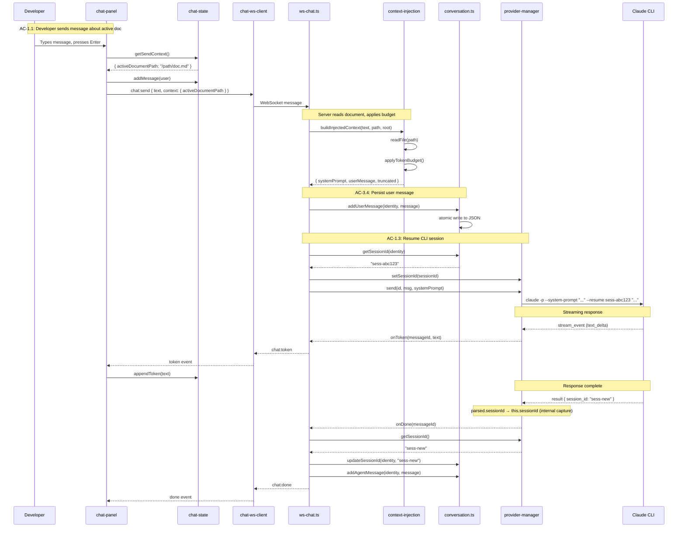
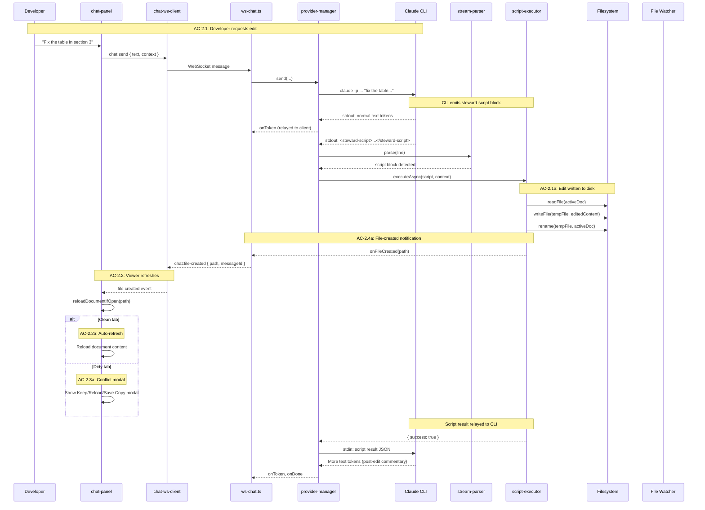

# Technical Design — Client (Epic 12: Document Awareness and Editing)

Companion to `tech-design.md`. This document covers client-side implementation depth: context indicator, conversation restoration, local file link detection, chat state extensions, and WebSocket client extensions.

---

## Context Indicator

The context indicator shows the developer which document the Steward currently sees. It sits in the chat panel header area, below the title and above the message list. It updates when the developer switches tabs and shows truncation status when the document exceeds the token budget.

### DOM Structure

The context indicator is created dynamically by `mountChatPanel()`, consistent with the Epic 10 pattern where all chat DOM is created programmatically. No elements exist in `index.html`.

```
.chat-context-indicator        [visible when document is open]
  .chat-context-icon           📄 (file icon)
  .chat-context-path           "docs/spec.md"
  .chat-context-truncated      "(truncated)" [visible when truncated]
```

The indicator sits between `.chat-header` and `.chat-status` in the chat panel layout:

```
#chat-panel
  .chat-header                 "Spec Steward" + Clear button
  .chat-context-indicator      NEW — active document display
  .chat-status                 [hidden] — provider status
  .chat-messages               Conversation
  .chat-input-area             Input + Send/Cancel
```

### Implementation

```typescript
// app/src/client/steward/context-indicator.ts

/**
 * Mount the context indicator in the chat panel.
 * Shows the active document path and truncation status.
 *
 * Covers: AC-1.2 (TC-1.2a through TC-1.2d)
 */
export function mountContextIndicator(
  chatPanel: HTMLElement,
  insertBefore: HTMLElement,
): ContextIndicatorController {
  const container = document.createElement('div');
  container.className = 'chat-context-indicator';
  container.style.display = 'none'; // Hidden initially (TC-1.2b)

  const icon = document.createElement('span');
  icon.className = 'chat-context-icon';
  icon.textContent = '📄';

  const pathEl = document.createElement('span');
  pathEl.className = 'chat-context-path';

  const truncatedEl = document.createElement('span');
  truncatedEl.className = 'chat-context-truncated';
  truncatedEl.textContent = '(truncated)';
  truncatedEl.style.display = 'none';

  container.append(icon, pathEl, truncatedEl);
  chatPanel.insertBefore(container, insertBefore);

  return {
    /**
     * Update the indicator with a new document path.
     *
     * TC-1.2a: Shows filename or relative path
     * TC-1.2c: Updates on tab switch
     * TC-1.2d: Truncates long paths with ellipsis (CSS handles truncation)
     */
    update(relativePath: string | null, truncated: boolean) {
      if (!relativePath) {
        container.style.display = 'none';
        return;
      }

      container.style.display = 'flex';
      pathEl.textContent = relativePath;
      pathEl.title = relativePath; // Full path in tooltip (TC-1.2d)
      truncatedEl.style.display = truncated ? 'inline' : 'none';
    },

    /** Remove the indicator from the DOM */
    destroy() {
      container.remove();
    },
  };
}

interface ContextIndicatorController {
  update(relativePath: string | null, truncated: boolean): void;
  destroy(): void;
}
```

### CSS

```css
/* Added to app/src/client/styles/chat.css */

.chat-context-indicator {
  display: flex;
  align-items: center;
  gap: 0.375rem;
  padding: 0.25rem 0.75rem;
  font-size: 0.75rem;
  color: var(--color-text-secondary);
  background: var(--color-bg-secondary);
  border-bottom: 1px solid var(--color-border);
  flex-shrink: 0;
  min-width: 0; /* Allow truncation */
}

.chat-context-icon {
  flex-shrink: 0;
}

.chat-context-path {
  overflow: hidden;
  text-overflow: ellipsis;
  white-space: nowrap;
  min-width: 0;
}

.chat-context-truncated {
  flex-shrink: 0;
  color: var(--color-warning, #c19a00);
  font-style: italic;
}
```

### Tab Switch Integration

The context indicator updates from two sources:

1. **Tab switch (immediate):** When the developer switches tabs, the indicator shows the new filename with truncation unknown (hidden). This is responsive — no server round-trip needed for the filename.

2. **`chat:context` message (server truth):** When the server processes a `chat:send`, it sends `chat:context` confirming the actual truncation status. The indicator updates truncation from this server response.

```typescript
// In chat-panel.ts — mountChatPanel()

// Subscribe to active tab changes via app-level state
// The app store uses store.subscribe(callback) with (state, changed) params
// (established in Epics 1-6, see app/src/client/app.ts)
const unsubTab = store.subscribe((state, changed) => {
  if (!changed.includes('activeTabId')) return;
  const activeTab = state.tabs.find((t) => t.id === state.activeTabId);
  if (activeTab) {
    const root = state.session.lastRoot;
    const relativePath = root ? relative(root, activeTab.path) : activeTab.path;
    // Show filename immediately; truncation unknown until next chat:send
    contextIndicator.update(relativePath, false);
  } else {
    contextIndicator.update(null, false);
  }
});

// Subscribe to chat:context messages — server truth for truncation
const unsubContext = chatWsClient.onContext((messageId, activeDocument) => {
  if (activeDocument) {
    contextIndicator.update(activeDocument.relativePath, activeDocument.truncated);
  } else {
    contextIndicator.update(null, false);
  }
});
```

This avoids the client-side heuristic approach — the server is the authoritative source for truncation status. The indicator may show the filename without truncation info between tab switch and the next `chat:send`, which is acceptable since the developer hasn't asked about the document yet.

---

## Conversation Restoration

When the client receives a `chat:conversation-load` message, it replaces the current conversation display with the loaded messages. Agent messages are re-rendered through the markdown pipeline.

### Flow

```
1. WebSocket connects (or workspace switch)
2. Server sends chat:conversation-load { messages, workspaceIdentity, cliSessionId }
3. Client clears current conversation display
4. Client iterates messages:
   a. User messages → render as-is (plain text)
   b. Agent messages → render through markdown-it + shiki pipeline
   c. Error messages → render as error blocks
5. Scroll to bottom
6. Update chat state with loaded messages
```

### Implementation

```typescript
// In chat-panel.ts — handling chat:conversation-load

/**
 * Load a persisted conversation into the chat panel.
 * Re-renders all agent messages through the markdown pipeline.
 *
 * Covers: AC-3.1a (conversation restored on relaunch),
 *         AC-3.1d (conversation loads on WebSocket connect)
 */
function loadConversation(
  messagesContainer: HTMLElement,
  messages: PersistedMessage[],
  renderMarkdown: (text: string) => string,
): void {
  // Clear existing messages
  messagesContainer.innerHTML = '';

  for (const msg of messages) {
    const messageEl = document.createElement('div');
    messageEl.className = `chat-message ${msg.role}`;
    messageEl.dataset.messageId = msg.id;

    if (msg.role === 'agent') {
      // Re-render through markdown pipeline
      const rendered = renderMarkdown(msg.text);
      messageEl.innerHTML = rendered;

      // Post-process for local file links
      processFileLinks(messageEl);
    } else if (msg.role === 'error') {
      messageEl.textContent = msg.text;
    } else {
      // User messages render as plain text
      messageEl.textContent = msg.text;
    }

    messagesContainer.appendChild(messageEl);
  }

  // Scroll to bottom
  messagesContainer.scrollTop = messagesContainer.scrollHeight;
}
```

### Chat State — Conversation Replace

The `ChatStateStore` (Epic 10) is extended with a `replaceConversation()` method that atomically replaces the entire conversation state:

```typescript
// Extension to chat-state.ts

/**
 * Replace the entire conversation with loaded messages.
 * Used when the server sends chat:conversation-load.
 *
 * Covers: AC-3.1c (switching workspaces swaps conversations),
 *         AC-3.1d (replace semantics)
 */
replaceConversation(
  messages: PersistedMessage[],
  workspaceIdentity: string,
): void {
  this.messages = messages.map((msg) => ({
    id: msg.id,
    role: msg.role,
    text: msg.text,
    streaming: false,
    activeDocumentPath: msg.activeDocumentPath,
  }));
  this.workspaceIdentity = workspaceIdentity;
  this.notify('conversation-replaced');
}
```

### Performance Characteristics

For a 200-message conversation (~100 agent messages):

| Operation | Estimated Time |
|-----------|---------------|
| JSON parse of conversation-load message | < 1ms |
| Clear existing DOM | < 1ms |
| markdown-it render per agent message | 1-3ms |
| Shiki highlight per code-heavy message | 5-10ms |
| DOM insertion per message | < 0.5ms |
| Mermaid render (rare in chat) | 50-200ms per diagram |
| **Total (no Mermaid)** | **200-500ms** |
| **Total (with 2 Mermaid diagrams)** | **300-900ms** |

The 200ms NFR target applies to synchronous initialization latency — reading the file and parsing JSON. The subsequent markdown rendering (200-500ms for text, plus async Mermaid) occurs after the panel is interactive. For conversations under 500 messages, the file read + JSON parse is under 200ms; the rendering pipeline then populates the display progressively. Mermaid diagrams render asynchronously, consistent with Epic 11's Mermaid rendering behavior.

---

## Local File Link Detection

After the chat rendering pipeline produces HTML for an agent message, a post-processor scans for links that reference local files. These become clickable links that open the file in a viewer tab.

### Detection Algorithm

```typescript
// app/src/client/steward/file-link-processor.ts

/**
 * Post-process rendered HTML to detect and activate local file links.
 * Scans <a> elements for hrefs that look like local file paths.
 *
 * Covers: AC-1.5 (TC-1.5a through TC-1.5d)
 */
export function processFileLinks(
  messageEl: HTMLElement,
  workspaceRoot?: string | null,
  fileTreePaths?: Set<string>,
  openFile?: (path: string) => void,
): void {
  if (!workspaceRoot || !fileTreePaths || !openFile) return;

  const links = messageEl.querySelectorAll('a');

  for (const link of links) {
    const href = link.getAttribute('href');
    if (!href) continue;

    // TC-1.5d: Skip external links (handled by Epic 11)
    if (href.startsWith('http://') ||
        href.startsWith('https://') ||
        href.startsWith('mailto:') ||
        href.startsWith('#')) {
      continue;
    }

    // Resolve the path relative to workspace root
    const resolved = resolvePath(workspaceRoot, href);

    // TC-1.5c: Path outside root or nonexistent — skip
    if (!resolved || !resolved.startsWith(workspaceRoot)) continue;
    if (!fileTreePaths.has(resolved)) continue;

    // TC-1.5a, TC-1.5b: Activate the link
    link.classList.add('local-file-link');
    link.addEventListener('click', (e) => {
      e.preventDefault();
      openFile(resolved);
    });

    // Remove target="_blank" that the rendering pipeline adds
    link.removeAttribute('target');
    link.removeAttribute('rel');
  }

  // Also detect bare file paths in text nodes
  detectBareFilePaths(messageEl, workspaceRoot, fileTreePaths, openFile);
}

/**
 * Detect bare file paths in text nodes (e.g., "see docs/spec.md").
 * Wraps matched paths in clickable spans.
 */
function detectBareFilePaths(
  messageEl: HTMLElement,
  workspaceRoot: string,
  fileTreePaths: Set<string>,
  openFile: (path: string) => void,
): void {
  // Match patterns like path/to/file.md or ./relative/path.md
  const pathPattern = /(?:^|\s)(\.?(?:[\w.-]+\/)+[\w.-]+\.(?:md|markdown))(?:\s|$|[,;.!?)])/g;

  const walker = document.createTreeWalker(
    messageEl,
    NodeFilter.SHOW_TEXT,
    null,
  );

  const replacements: Array<{ node: Text; match: string; resolved: string }> = [];

  let textNode: Text | null;
  while ((textNode = walker.nextNode() as Text | null)) {
    // Skip text inside <code> and <pre> elements
    if (textNode.parentElement?.closest('code, pre')) continue;

    let match: RegExpExecArray | null;
    pathPattern.lastIndex = 0;

    while ((match = pathPattern.exec(textNode.textContent ?? '')) !== null) {
      const filePath = match[1];
      const resolved = resolvePath(workspaceRoot, filePath);

      if (resolved &&
          resolved.startsWith(workspaceRoot) &&
          fileTreePaths.has(resolved)) {
        replacements.push({
          node: textNode,
          match: filePath,
          resolved,
        });
      }
    }
  }

  // Apply replacements in reverse order to preserve offsets
  for (const { node, match, resolved } of replacements.reverse()) {
    const text = node.textContent ?? '';
    const idx = text.indexOf(match);
    if (idx === -1) continue;

    const before = document.createTextNode(text.slice(0, idx));
    const link = document.createElement('span');
    link.className = 'local-file-link';
    link.textContent = match;
    link.addEventListener('click', () => openFile(resolved));
    const after = document.createTextNode(text.slice(idx + match.length));

    node.parentNode?.replaceChild(after, node);
    after.parentNode?.insertBefore(link, after);
    link.parentNode?.insertBefore(before, link);
  }
}

/**
 * Resolve a potentially relative path against the workspace root.
 * Returns an absolute path or null if resolution fails.
 */
function resolvePath(root: string, href: string): string | null {
  try {
    if (href.startsWith('/')) {
      // Absolute path — check if it's within root
      return href;
    }
    // Relative path — resolve against root
    // Simple resolution: join root + href, normalize
    const parts = [...root.split('/'), ...href.split('/')];
    const resolved: string[] = [];
    for (const part of parts) {
      if (part === '..') {
        resolved.pop();
      } else if (part !== '.' && part !== '') {
        resolved.push(part);
      }
    }
    return '/' + resolved.join('/');
  } catch {
    return null;
  }
}
```

### CSS for Local File Links

```css
/* Added to app/src/client/styles/chat.css */

.local-file-link {
  color: var(--color-accent);
  cursor: pointer;
  text-decoration: underline;
  text-decoration-style: dotted;
}

.local-file-link:hover {
  text-decoration-style: solid;
}
```

### File Tree Path Cache

The link detector needs a set of known file paths to validate against. The file tree is already loaded by the sidebar (Epic 1). The chat panel accesses the same cached tree data:

```typescript
// Helper to extract paths from the file tree
function collectTreePaths(
  tree: TreeNode[],
  root: string,
): Set<string> {
  const paths = new Set<string>();

  function walk(nodes: TreeNode[]) {
    for (const node of nodes) {
      if (node.type === 'file') {
        paths.add(node.path);
      }
      if (node.children) {
        walk(node.children);
      }
    }
  }

  walk(tree);
  return paths;
}
```

This set is rebuilt when the file tree changes (workspace switch, file tree refresh). It's a lightweight operation — the tree data is already in memory.

### Integration with Rendering Pipeline

The file link processor runs after every markdown render — both during streaming (on each debounce cycle) and on conversation restoration. It's called from the same point where the rendered HTML is inserted into the DOM:

```typescript
// In chat-panel.ts — after rendering agent message HTML

// Replace streaming message content
streamingMessage.innerHTML = renderedHtml;

// Post-process for local file links
processFileLinks(
  streamingMessage,
  store.get().session.lastRoot,
  fileTreePathCache,
  (path) => openFileInTab(path),
);
```

---

## Chat State Extensions

The `ChatStateStore` from Epic 10/11 is extended with document context tracking and workspace identity awareness.

### Extended ChatMessage

```typescript
// Extension to chat-state.ts ChatMessage interface

interface ChatMessage {
  id: string;
  role: 'user' | 'agent' | 'error';
  text: string;
  streaming: boolean;
  cancelled?: boolean;
  renderedHtml?: string;
  activeDocumentPath?: string;  // NEW — document context at time of message
}
```

### New State Fields

```typescript
// Extensions to ChatStateStore

class ChatStateStore {
  // Existing fields (from Epic 10/11)...

  // NEW — Epic 12
  private workspaceIdentity: string | null = null;
  private activeDocumentPath: string | null = null;

  /**
   * Set the active document path.
   * Called on tab switch.
   *
   * Covers: AC-1.2c (indicator updates on tab switch)
   */
  setActiveDocumentPath(path: string | null): void {
    this.activeDocumentPath = path;
    this.notify('activeDocumentPath');
  }

  /**
   * Get the active document path for the context indicator.
   */
  getActiveDocumentPath(): string | null {
    return this.activeDocumentPath;
  }

  /**
   * Replace the entire conversation with loaded messages.
   *
   * Covers: AC-3.1c, AC-3.1d
   */
  replaceConversation(
    messages: PersistedMessage[],
    workspaceIdentity: string,
  ): void {
    this.messages = messages.map((msg) => ({
      id: msg.id,
      role: msg.role,
      text: msg.text,
      streaming: false,
      activeDocumentPath: msg.activeDocumentPath,
    }));
    this.workspaceIdentity = workspaceIdentity;
    this.notify('conversation-replaced');
  }

  /**
   * Get the context to include in a chat:send message.
   * Returns the active document path for the server to read.
   */
  getSendContext(): { activeDocumentPath: string | null } {
    return {
      activeDocumentPath: this.activeDocumentPath,
    };
  }
}
```

### Send Message — Include Context

The send action in `chat-panel.ts` includes the context when dispatching `chat:send`:

```typescript
// Modified send in chat-panel.ts

function sendMessage(text: string): void {
  const messageId = crypto.randomUUID();
  const context = chatState.getSendContext();

  // Add user message to state (with document context)
  chatState.addMessage({
    id: messageId,
    role: 'user',
    text,
    streaming: false,
    activeDocumentPath: context.activeDocumentPath ?? undefined,
  });

  // Send over WebSocket with context
  chatWsClient.send({
    type: 'chat:send',
    messageId,
    text,
    context,
  });
}
```

---

## WebSocket Client Extensions

The `ChatWsClient` from Epic 10 handles new message types: `chat:file-created` and `chat:conversation-load`.

### New Event Handlers

```typescript
// Extensions to chat-ws-client.ts

// New event types
type FileCreatedHandler = (path: string, messageId: string) => void;
type ConversationLoadHandler = (
  workspaceIdentity: string,
  messages: PersistedMessage[],
  cliSessionId: string | null,
) => void;
type ContextHandler = (
  messageId: string,
  activeDocument: { relativePath: string; truncated: boolean; totalLines?: number } | null,
) => void;

class ChatWsClient {
  // Existing handlers (from Epic 10)...
  private fileCreatedHandlers = new Set<FileCreatedHandler>();
  private conversationLoadHandlers = new Set<ConversationLoadHandler>();
  private contextHandlers = new Set<ContextHandler>();

  onFileCreated(handler: FileCreatedHandler): () => void {
    this.fileCreatedHandlers.add(handler);
    return () => this.fileCreatedHandlers.delete(handler);
  }

  onConversationLoad(handler: ConversationLoadHandler): () => void {
    this.conversationLoadHandlers.add(handler);
    return () => this.conversationLoadHandlers.delete(handler);
  }

  onContext(handler: ContextHandler): () => void {
    this.contextHandlers.add(handler);
    return () => this.contextHandlers.delete(handler);
  }

  // Extended message dispatch
  private handleMessage(data: unknown): void {
    // ... existing parsing ...

    switch (msg.type) {
      // ... existing cases ...

      case 'chat:file-created':
        for (const handler of this.fileCreatedHandlers) {
          handler(msg.path, msg.messageId);
        }
        break;

      case 'chat:conversation-load':
        for (const handler of this.conversationLoadHandlers) {
          handler(msg.workspaceIdentity, msg.messages, msg.cliSessionId);
        }
        break;

      case 'chat:context':
        for (const handler of this.contextHandlers) {
          handler(msg.messageId, msg.activeDocument);
        }
        break;
    }
  }
}
```

### File-Created Handler — Viewer Refresh

When `chat:file-created` arrives, the client triggers a document reload. This uses the existing file-reload infrastructure from Epic 2, with a fast-path bypass of the file watcher polling interval.

```typescript
// In chat-panel.ts — wired during mount

chatWsClient.onFileCreated((path, messageId) => {
  // Trigger immediate document reload
  // Covers: AC-2.2a (clean tab reloads automatically),
  //         AC-2.3a (dirty tab shows conflict modal)
  reloadDocumentIfOpen(path, store);
});

/**
 * Reload a document if it's open in a tab.
 * Clean tabs auto-refresh; dirty tabs trigger the conflict modal.
 *
 * Triggers the same behavior as if the file watcher had detected a
 * 'modified' event for the given path. The existing file-change logic
 * lives inline in app.ts's `wsClient.on('file-change', ...)` handler
 * (lines ~1927-1946). It checks dirty state, shows the conflict modal
 * for dirty tabs, and calls refreshWatchedFile() for clean tabs.
 *
 * **New integration point:** This inline handler needs to be extracted
 * into a reusable function (e.g., `handleExternalFileChange(path)`) that
 * both the file-watcher WS handler and the chat file-created handler
 * can call. The extraction is part of Epic 12's implementation — the
 * contract is: given a file path, apply the same dirty/clean/conflict
 * logic as the file watcher.
 *
 * The extracted function must:
 * - Find the tab by path (`state.tabs.find(t => t.path === path)`)
 * - Skip if save is pending (`isSavePending(path)`)
 * - Show conflict modal if tab is dirty (`showConflictModal(tab)`)
 * - Refresh if tab is clean (`refreshWatchedFile(path)`)
 */
function reloadDocumentIfOpen(path: string, store: AppStore): void {
  const state = store.get();
  const isOpen = state.tabs.some((tab) => tab.path === path);

  if (!isOpen) return;

  // Call the extracted handleExternalFileChange(path) function
  // (extracted from app.ts's wsClient.on('file-change', ...) handler)
  handleExternalFileChange(path);
}
```

The `file-changed` custom event is the integration point with the existing file watch infrastructure. The file watcher already dispatches this event when it detects disk changes; we're triggering it immediately rather than waiting for the next poll cycle.

### Conversation Load Handler — Replace Display

```typescript
// In chat-panel.ts — wired during mount

chatWsClient.onConversationLoad((workspaceIdentity, messages, cliSessionId) => {
  // Replace conversation state
  chatState.replaceConversation(messages, workspaceIdentity);

  // Re-render the conversation display
  loadConversation(
    messagesContainer,
    messages,
    renderMarkdownForChat,
  );

  // Update context indicator (may need to clear if workspace changed)
  const activeTab = store.get().activeTabId;
  if (activeTab) {
    const root = store.get().session.lastRoot;
    const relativePath = root ? relative(root, activeTab) : activeTab;
    contextIndicator.update(relativePath, false);
  } else {
    contextIndicator.update(null, false);
  }
});
```

---

## Chat Panel Mount — Extended

The `mountChatPanel()` function from Epic 10 is extended to create the context indicator, wire the new event handlers, and set up tab-change subscriptions.

```typescript
// Extended mountChatPanel() — additions for Epic 12

export function mountChatPanel(
  main: HTMLElement,
  store: AppStore,
  chatWsClient: ChatWsClient,
): () => void {
  // ... existing DOM creation (Epic 10) ...

  // NEW — Context indicator (between header and status)
  const contextIndicator = mountContextIndicator(
    chatPanel,
    statusEl, // Insert before the status element
  );

  // NEW — Set initial context from active tab
  const state = store.get();
  const activeTab = state.tabs.find((t) => t.id === state.activeTabId);
  if (activeTab) {
    const root = state.session.lastRoot;
    const relativePath = root ? relative(root, activeTab.path) : activeTab.path;
    contextIndicator.update(relativePath, false);
  }

  // NEW — Subscribe to tab changes
  // Uses store.subscribe(callback) pattern established in Epics 1-6
  // Callback receives (state, changedKeys) — see app/src/client/app.ts
  const unsubTab = store.subscribe((newState, changed) => {
    if (!changed.includes('activeTabId')) return;
    const tab = newState.tabs.find((t) => t.id === newState.activeTabId);
    if (tab) {
      const root = newState.lastRoot;
      const relativePath = root ? relative(root, tab.path) : tab.path;
      contextIndicator.update(relativePath, false);
    } else {
      contextIndicator.update(null, false);
    }
  });

  // NEW — Context message handler (server truth for truncation)
  const unsubContext = chatWsClient.onContext((messageId, activeDocument) => {
    if (activeDocument) {
      contextIndicator.update(activeDocument.relativePath, activeDocument.truncated);
    }
  });

  // NEW — File-created handler
  const unsubFileCreated = chatWsClient.onFileCreated((path) => {
    reloadDocumentIfOpen(path, store);
  });

  // NEW — Conversation load handler
  const unsubConvLoad = chatWsClient.onConversationLoad(
    (workspaceIdentity, messages) => {
      chatState.replaceConversation(messages, workspaceIdentity);
      loadConversation(messagesContainer, messages, renderMarkdownForChat);
    },
  );

  // ... existing return cleanup ...
  return () => {
    // ... existing cleanup ...
    contextIndicator.destroy();
    unsubTab();
    unsubContext();
    unsubFileCreated();
    unsubConvLoad();
  };
}
```

---

## Send Message Flow — Complete

The end-to-end flow for sending a message with document context, from user action to CLI invocation:



---

## Edit Flow — Complete

The end-to-end flow when the Steward edits the active document:


