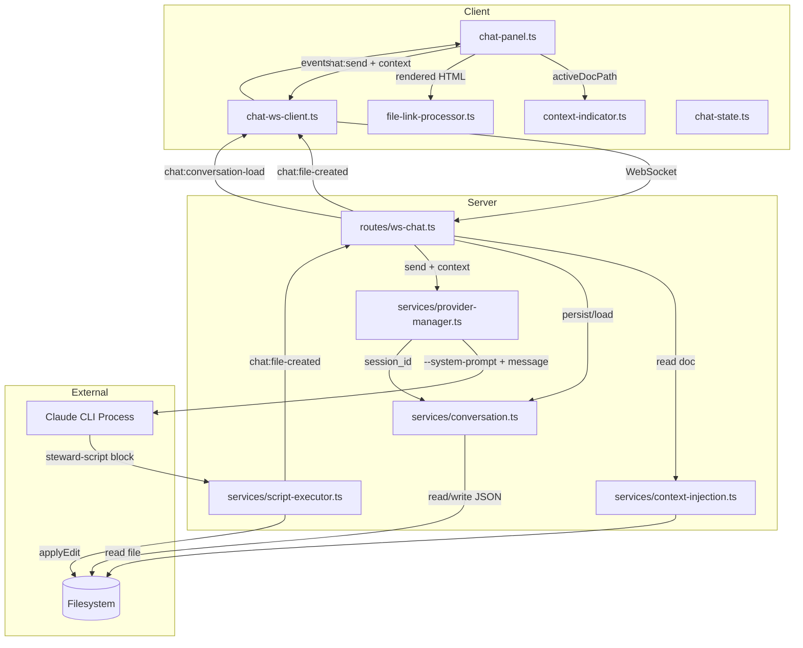

# Technical Design: Document Awareness and Editing (Epic 12)

## Purpose

This document translates the Epic 12 requirements into implementable architecture for the Spec Steward's document awareness layer — context injection, document editing through chat, conversation persistence, and local file navigation. It serves three audiences:

| Audience | Value |
|----------|-------|
| Reviewers | Validate architecture decisions before code is written |
| Developers | Clear blueprint for implementation |
| Story Tech Sections | Source of implementation targets, interfaces, and test mappings |

**Output structure:** Config B (4 docs) — server + client domain split, consistent with Epic 10's tech design structure.

| Document | Content |
|----------|---------|
| `tech-design.md` (this file) | Index: decisions, context, system view, module architecture overview, work breakdown |
| `tech-design-server.md` | Server implementation depth: context injection, conversation persistence, script context, schema extensions |
| `tech-design-client.md` | Client implementation depth: context indicator, conversation restoration, local file links |
| `test-plan.md` | TC→test mapping, mock strategy, fixtures, chunk breakdown with test counts |

**Prerequisite:** Epic 12 spec (`epic.md`) is complete with 18 ACs and 51 TCs, verified through 3 rounds. Epic 10 (chat plumbing) and Epic 11 (chat rendering and polish) tech designs define the extension points this design builds on.

---

## Spec Validation

Before designing, the epic was validated as the downstream consumer. All ACs map to implementation work. The following issues were identified and resolved during validation:

| Issue | Spec Location | Resolution | Status |
|-------|---------------|------------|--------|
| `packageSourcePath` field not yet in `SessionState` | A4, AC-3.2 | Epic 9 (package viewer integration) hasn't been implemented yet. The field will be added by Epic 9 before Epic 12 executes. The conversation service checks for the field and falls back to `lastRoot`. Design assumes the field exists at runtime. | Resolved — clarified |
| `chat:send` context field expands from `z.object({}).optional()` to document-aware shape | Data Contracts | The `ChatSendMessageSchema` context field was left as an empty object in Epic 10 with the note "expanded in Epics 12-13." The design extends it with `activeDocumentPath` using a backward-compatible optional field. | Resolved — clarified |
| `ChatServerMessage` union needs two new message types | Data Contracts | `chat:file-created` and `chat:conversation-load` are added to the `ChatServerMessageSchema` discriminated union. This extends the existing pattern without breaking it. | Resolved — clarified |
| Token budget interacts with CLI's own context management | Q1, AC-1.4 | The CLI manages conversation history via `--resume`. The token budget applies only to the document content we inject, not to the CLI's internal context. The budget is a document-level limit, not a conversation-level limit. | Resolved — clarified |
| Script execution VM context is async but `vm.runInNewContext` is synchronous | Data Contracts (ScriptContext) | Epic 12 script methods (`getActiveDocumentContent`, `applyEditToActiveDocument`, `openDocument`) are async (return `Promise`). The script executor must support async execution — use `vm.runInNewContext` with an async wrapper function. Epic 10's `ScriptExecutor` already handles return values; the design extends it with `Promise` resolution and timeout on async results. | Resolved — clarified |
| `applyEditToActiveDocument` needs to know the active document path | ScriptContext | The script context must be constructed with the current active document path from the `chat:send` context. The path is injected when the script context is built for each message, not stored globally. | Resolved — clarified |
| Edit flow requires the file watcher to detect changes | AC-2.2, AC-2.3, A6 | Steward edits write to disk via `applyEditToActiveDocument`. The existing file watcher (`/ws` route) detects disk changes with a polling interval. The `chat:file-created` notification provides a fast-path bypass — the client triggers an immediate reload without waiting for the watcher. For dirty tabs, the watcher's conflict detection still applies because it checks dirty state regardless of the notification source. | Resolved — clarified |

**Verdict:** Spec is implementation-ready. No blocking issues remain. All 10 tech design questions are answered below. The extension points from Epics 10-11 are designed for exactly this type of additive extension.

---

## Context

Epic 12 is where the Spec Steward becomes contextually intelligent. Epics 10 and 11 built the plumbing and polish — a working chat panel that connects to the Claude CLI via WebSocket and renders streamed markdown responses. But the Steward doesn't know what the developer is looking at. It can't see the document, can't edit it, and forgets everything on restart. Epic 12 fixes all three: the Steward receives the active document's content as context, can edit it through the script execution lane, and persists conversations across restarts keyed by workspace identity.

The core technical challenge splits into three orthogonal systems. First, **context injection**: the server reads the active document from disk, applies a token budget to prevent context overflow, and constructs a prompt that gives the CLI both the document content and system instructions about Steward capabilities. This is a server-side concern — document content never transits the WebSocket. The client sends only the path; the server does the heavy lifting.

Second, **conversation persistence**: chat history is stored as JSON files in the session storage directory (`~/Library/Application Support/md-viewer/conversations/`), consistent with the existing session persistence pattern. The key innovation is the canonical workspace identity — conversations are keyed by the absolute folder path for regular workspaces, or the package source path for opened packages. This means conversations survive package re-extraction to different temp directories. Persistence is incremental (written on every send and done), atomic (temp file + rename), and crash-recoverable.

Third, **document editing**: the Steward produces edits via the script execution lane established in Epic 10. The `applyEditToActiveDocument(content)` method writes the full replacement content to disk and sends a `chat:file-created` notification that triggers an immediate viewer refresh. This integrates with the existing dirty-tab conflict model from Epic 5 — clean tabs auto-refresh, dirty tabs show the conflict modal. The mechanism is deliberately simple: full content replacement, not structured patches. The CLI produces the complete edited document, the script context writes it atomically.

The design builds on well-established extension points. The `ProviderContext` interface was left intentionally empty in Epic 10. The `ScriptContext` had only `showNotification`. The `ChatServerMessage` union was designed for additive types. Epic 12 fills these slots without modifying any existing behavior — pure extension.

The `startServer()` injection pattern, the atomic write pattern, the Zod discriminated union pattern, the session storage directory convention — all are established idioms from Epics 1-6 that Epic 12 reuses. No new patterns are introduced; everything builds on what exists.

---

## Tech Design Question Answers

The epic posed 10 questions. All are answered here; detailed implementation follows in the companion documents.

### Q1: Token budget calculation

**Answer:** Character-based heuristic with a configurable budget of 100,000 characters (~25,000 tokens).

There is no offline Claude tokenizer available for JavaScript. The research confirmed this and recommended the character heuristic `Math.ceil(text.length / 4)` as a reasonable approximation. The budget is applied to the document content only — the CLI manages its own conversation history and system prompt internally via `--resume`.

```typescript
const TOKEN_BUDGET_CHARS = 100_000; // ~25K tokens at 4 chars/token

function isWithinBudget(content: string): boolean {
  return content.length <= TOKEN_BUDGET_CHARS;
}
```

The 100K character budget is generous — typical spec documents are 20-80KB (500-2,000 lines), well within the budget. Very large specs (5,000+ lines, 150KB+) will be truncated, which is the intended behavior for documents of that size. Documents exceeding the budget are truncated with a notification (see Q2). The budget is a named constant in the context injection service, adjustable without code changes.

**Why not count lines?** Line-based limits are less accurate because line lengths vary wildly (a table row vs. a blank line). Character count is a better proxy for token count. The 4:1 ratio is conservative — actual ratio for English prose is closer to 3.5:1, so the budget errs on the side of including more content.

**Detailed design:** See server companion doc, Context Injection Service section.

### Q2: Truncation strategy

**Answer:** End truncation — include the first N characters (at a line boundary), discard the rest.

When a document exceeds the token budget, the server truncates from the end: find the last newline before the character limit, cut there, and append a truncation notice. The truncation notice is injected into the context so the CLI knows the document is incomplete:

```
[Document truncated: showing first 2,847 of 5,421 total lines]
```

**Why end truncation?** For spec documents — the primary content type — the beginning is the most valuable: title, overview, scope, early requirements. The end is typically appendices, amendments, and checklists. End truncation preserves the high-value content.

**Why not first + last?** More complex to implement, creates a discontinuous context that confuses the model ("the middle is missing"), and the last section of a spec is rarely what the developer asks about.

**Detailed design:** See server companion doc, Token Budget section.

### Q3: Context construction

**Answer:** System prompt via `--system-prompt` flag; document content embedded in the user message with XML delimiters.

The server constructs the CLI invocation with two prompt components:

1. **System prompt** (via `--system-prompt`): Instructions about Steward capabilities, script execution, editing conventions. Static across messages, updated only when capabilities change.

2. **User message** (final argument): The developer's message text prefixed with the document context block:

```
<active-document path="docs/spec.md" truncated="false" total-lines="150">
[document content here]
</active-document>

[user's message text]
```

When no document is open, the `<active-document>` block is omitted entirely.

The system prompt instructs the CLI to:
- Reference the document content when answering questions
- Use `<steward-script>` blocks for editing (not built-in Read/Write tools)
- Call `applyEditToActiveDocument(content)` with the full replacement content
- Call `openDocument(path)` when the user asks to open a file

The system prompt is a string constant in the context injection service. It's not stored in a file — it's code, versioned with the implementation, and should change only when Steward capabilities change.

**Detailed design:** See server companion doc, Context Injection Service section.

### Q4: Conversation file encoding

**Answer:** SHA-256 hash prefix (16 hex chars) of the canonical workspace identity, using Node's built-in `crypto` module.

The conversation filename is derived from the workspace identity:

```typescript
import { createHash } from 'node:crypto';

function conversationFilename(workspaceIdentity: string): string {
  const hash = createHash('sha256')
    .update(workspaceIdentity)
    .digest('hex')
    .slice(0, 16);
  return `${hash}.json`;
}
```

This produces filenames like `a3f8b2c1d4e5f6a7.json`, stored at `<session-dir>/conversations/`. The encoding is:

- **Filesystem-safe:** Hex characters only, no path separators or special characters.
- **Deterministic:** Same workspace identity always produces the same filename.
- **Collision-resistant:** 16 hex chars = 64 bits. For a local app with at most dozens of workspaces, collision probability is negligible (~1 in 10^18).
- **No external dependencies:** Uses Node's built-in `crypto`.

Consistent with the research finding that recommended SHA-256 prefix for conversation filenames.

**Detailed design:** See server companion doc, Conversation Persistence Service section.

### Q5: Canonical identity resolution

**Answer:** Check session state for an active package source path; fall back to the folder root.

The canonical workspace identity is resolved from the current session state:

```typescript
function resolveWorkspaceIdentity(session: SessionState): string | null {
  // Epic 9 adds packageSourcePath when a package is open
  if (session.packageSourcePath) {
    return session.packageSourcePath;
  }
  // Regular folder workspace
  return session.lastRoot;
}
```

Epic 9 (package viewer integration) adds a `packageSourcePath` field to `SessionState` when a `.mpk`/`.mpkz` file is opened. This field stores the absolute path to the original package file, not the temp extraction directory. When the user closes the package and browses a regular folder, the field is cleared and `lastRoot` takes over.

The conversation service calls `resolveWorkspaceIdentity()` on every `chat:send` and on WebSocket connect. If the identity changes between messages (workspace switch), the conversation swaps (see Q10).

**Edge case — identity is null:** If `lastRoot` is null and no package is open (app just launched with no workspace), the conversation is not persisted. Messages work but are ephemeral. This matches the empty-state behavior — the developer hasn't pointed the app at anything yet.

**Detailed design:** See server companion doc, Conversation Persistence Service section.

### Q6: Edit mechanism

**Answer:** Script execution lane as the primary mechanism. The system prompt instructs the CLI to use `<steward-script>` blocks for edits rather than its built-in Read/Write tools.

The edit flow:

1. Developer sends "fix the table in section 3"
2. Server constructs prompt with document content and system instructions
3. CLI emits a `<steward-script>` block:
   ```
   <steward-script>
   const content = await getActiveDocumentContent();
   const fixed = content.replace(/broken table/g, 'fixed table');
   await applyEditToActiveDocument(fixed);
   </steward-script>
   ```
4. Stream parser intercepts the block
5. Script executor runs it with the curated context containing `applyEditToActiveDocument`
6. The method writes to disk atomically (temp + rename) and emits `chat:file-created`
7. Result relayed back to CLI stdin
8. CLI continues with post-edit commentary

**Why script lane over CLI built-in tools?** The script lane provides:
- **Notification control:** `applyEditToActiveDocument` sends `chat:file-created` immediately, bypassing the file watcher's polling interval.
- **Scope control:** The method is scoped to the active document only — the CLI's built-in Write tool can write anywhere.
- **Observability:** Script execution is logged and error-handled by the script executor.
- **Consistency:** The Technical Architecture recommends coarse-grained product actions over raw filesystem methods.

**Fallback — CLI uses built-in tools anyway:** If the CLI writes directly via its built-in tools despite system prompt instructions, the file watcher still detects the change. The developer sees the update, just with a slight delay (watcher poll interval). No data is lost; the `chat:file-created` notification is a fast-path optimization, not a requirement.

**Detailed design:** See server companion doc, Script Context Extensions section.

### Q7: Local file link detection

**Answer:** Post-process rendered markdown-it output in the client. Scan `<a>` tags for paths that resolve to files within the workspace root.

After the chat rendering pipeline (markdown-it + shiki) produces HTML for an agent message, a post-processor walks the DOM looking for `<a>` elements whose `href` could be a local file path:

1. Skip links with `http://`, `https://`, `mailto:`, `#` prefixes — these are handled by Epic 11's link behavior.
2. For remaining links, resolve the path against the workspace root.
3. Check if the resolved path exists in the cached file tree (already available in client state from the sidebar).
4. If the file exists and is within root: replace the `<a>` with a click handler that calls the existing `openFile(path)` API to open or activate the tab.
5. If not: leave the link as-is (renders as non-clickable text, consistent with TC-1.5c).

The detection also handles bare file paths that appear as inline code or plain text in agent responses. The post-processor looks for patterns like `path/to/file.md` or `/absolute/path/file.md` in text nodes and wraps them in clickable spans if they resolve to existing files.

**Why client-side, not server-side?** The file tree is already cached on the client. Checking file existence against the cached tree is synchronous and avoids round-trips. The client already has the `openFile` capability. No server involvement needed.

**Detailed design:** See client companion doc, Local File Link Detection section.

### Q8: Conversation restoration rendering

**Answer:** Eager rendering — re-render all agent messages through the markdown pipeline immediately on load.

When a `chat:conversation-load` message arrives, the client:
1. Parses the `PersistedMessage[]` array
2. For each agent message, renders the `text` through the same markdown-it + shiki pipeline used during streaming
3. Caches the `renderedHtml` on the `ChatMessage` object
4. Inserts all messages into the conversation display DOM

Performance for a 200-message conversation (~100 agent messages):
- File read + JSON parse: < 50ms (well within 200ms NFR for initialization)
- markdown-it rendering: ~1-3ms per message for typical chat responses
- Shiki highlighting: ~5-10ms per code-heavy message
- Total rendering: ~200-500ms for 100 messages — occurs after initialization, while the panel is already interactive

**Why not lazy rendering?** Lazy rendering (render visible messages, render off-screen on scroll) adds complexity: scroll-position-aware rendering, placeholder heights, visible-on-scroll handlers. The performance characteristics of chat messages (short, low Mermaid frequency) don't warrant this complexity. Eager rendering is simpler and fast enough.

**Mermaid diagrams on restore:** Mermaid blocks in restored messages are re-rendered with the current theme, consistent with how they behave during streaming (Epic 11 AC-2.3). The async Mermaid rendering from the streaming pipeline handles this.

**Detailed design:** See client companion doc, Conversation Restoration section.

### Q9: Structured edit support

**Answer:** Full content replacement only. Structured patches are deferred.

`applyEditToActiveDocument(content: string)` takes the complete replacement content. The CLI produces the full edited document, the method writes it atomically.

**Why full replacement is sufficient:**
- The CLI already has the full document content in context (from the `<active-document>` block).
- The CLI is good at producing complete edited documents — it's the natural output format.
- Structured patches (line-range replacements, insertions) add complexity on both the CLI instruction side and the server validation side.
- For documents within the token budget (~100KB), the write cost of full replacement is negligible.

**When structured patches would matter:** Very large documents where sending the full content back is wasteful. But these documents are already truncated by the token budget, so the CLI doesn't have the full content to edit anyway. Structured patches are a future enhancement that would pair with a smarter truncation strategy (section-based) — deferred to post-v2.

**Detailed design:** See server companion doc, Script Context Extensions section.

### Q10: Workspace switch during streaming

**Answer:** Cancel completes before swap — synchronous sequence with a timeout.

When the developer switches workspaces while a response is streaming:

1. Client detects workspace change (root change or package open/close)
2. Client sends `chat:cancel` for the active message
3. Server sends SIGINT to CLI process
4. Server waits up to 2 seconds for process exit
5. If not exited: SIGTERM, wait 2 more seconds, then SIGKILL
6. Server sends `chat:done` with `cancelled: true`
7. Server saves current workspace's conversation (including the partial response)
8. Server loads new workspace's conversation and session ID
9. Server sends `chat:conversation-load` with new workspace's messages
10. Client replaces conversation display

The cancel is **not** fire-and-forget. The swap waits for cancellation to complete (or timeout) to prevent race conditions where tokens from the old conversation arrive after the new conversation is loaded.

**Implementation:** The `ProviderManager` exposes a `cancelAndWait(): Promise<void>` method that resolves when the current process has exited. The workspace swap handler awaits this before proceeding. The method has a hard timeout (6 seconds: 2 SIGINT + 2 SIGTERM + 2 SIGKILL) to prevent indefinite blocking.

**Detailed design:** See server companion doc, Conversation Persistence Service section.

---

## System View

### System Context Diagram

Epic 12 extends the Epic 10 system with three new data flows: document content flows from the filesystem into the CLI prompt, conversation state flows between the server and filesystem, and edit notifications flow from the server to the client.

```
┌────────────────────────────────────────────────────────────────────┐
│ Browser                                                            │
│  ┌──────────────────────────────────────┬───────────────────────┐  │
│  │ Existing Frontend                    │ Chat Panel            │  │
│  │  Sidebar │ Workspace │ Tabs          │ + Context indicator   │  │
│  │          │           │               │ + Local file links    │  │
│  │          │           │               │ + Conversation load   │  │
│  └────────────┬─────────────────────────┴────────┬──────────────┘  │
│               │ HTTP + WS (file watch)           │ WS (chat)       │
└───────────────┼──────────────────────────────────┼─────────────────┘
                │                                  │
┌───────────────┼──────────────────────────────────┼─────────────────┐
│ Fastify Server│                                  │                 │
│  ┌────────────┴──────────────────────────────────┴──────────────┐  │
│  │ Existing REST + WS │ GET /api/features │ WS /ws/chat         │  │
│  ├──────────────────────────────────────────────────────────────┤  │
│  │ Existing Services                                            │  │
│  │  + Context Injection Service (read doc, token budget, prompt)│  │
│  │  + Conversation Service (persist, load, swap, clear)         │  │
│  │  + Extended Script Executor (edit, read, open)               │  │
│  │  + Extended Provider Manager (context, session ID swap)      │  │
│  └──────────────────────┬─────────┬─────────────────────────────┘  │
│                         │         │                                │
│            ┌────────────┼─────────┼────────────┐                   │
│            │            │         │            │                   │
│      Local Filesystem   │    Conversations    CLI Process          │
│      (workspace docs)   │    JSON files       (claude -p)          │
│                         │    (~/.../md-viewer/                     │
│                    Session Dir  conversations/)                    │
└────────────────────────────────────────────────────────────────────┘
```

### External Contracts

**Client → Server (WebSocket `/ws/chat`) — Extended Messages:**

| Message Type | Change | Key Fields |
|-------------|--------|------------|
| `chat:send` | MODIFIED — context field expanded | `messageId`, `text`, `context.activeDocumentPath` |

**Server → Client (WebSocket `/ws/chat`) — New Messages:**

| Message Type | Purpose | Key Fields |
|-------------|---------|------------|
| `chat:file-created` | Steward edited a file | `path`, `messageId` |
| `chat:conversation-load` | Deliver persisted conversation (or empty array for clear/empty workspace) | `workspaceIdentity`, `messages[]`, `cliSessionId` |
| `chat:context` | Server confirmation of context injection (truncation truth) | `messageId`, `activeDocument: { relativePath, truncated, totalLines? }` |

**Server → CLI Process — Extended:**

| Direction | Format | Content |
|-----------|--------|---------|
| Server → CLI | `--system-prompt` flag | Steward capability instructions |
| Server → CLI | Message argument | `<active-document>` block + user message |
| Server → CLI | `--resume <id>` flag | Persisted CLI session ID |

**New Error Codes:**

| Code | Description | Related AC |
|------|-------------|-----------|
| `CONTEXT_READ_FAILED` | Server could not read active document | AC-4.1 |
| `EDIT_FAILED` | Script-lane edit could not write to disk | AC-2.4c |

**Runtime Prerequisites:**

| Prerequisite | Where Needed | How to Verify |
|---|---|---|
| Node.js (inherited) | Local + CI | `node --version` |
| Claude CLI (`claude`) | Local only | `which claude` |
| Epic 10 + 11 complete | — | Chat panel functional with streaming markdown rendering |
| Epic 9 complete | — | `packageSourcePath` field in `SessionState` |

No new npm dependencies. Everything uses Node.js built-ins (`crypto`, `fs`, `path`) and existing project dependencies.

---

## Module Architecture Overview

### Server-Side Modules

```
app/src/server/
├── routes/
│   ├── ws-chat.ts                       # MODIFIED — handle context, workspace swap,
│   │                                    #   conversation load on connect
│   └── features.ts                      # UNCHANGED
├── services/
│   ├── context-injection.ts             # NEW — read doc, token budget, prompt construction
│   ├── conversation.ts                  # NEW — persist, load, swap, clear, incremental writes
│   ├── provider-manager.ts              # MODIFIED — systemPrompt in send(),
│   │                                    #   setSessionId/getSessionId, cancelAndWait()
│   ├── stream-parser.ts                 # UNCHANGED
│   ├── script-executor.ts              # MODIFIED — async execution, new curated methods
│   ├── session.service.ts              # UNCHANGED (reads sessionDir for conversation path)
│   └── features.ts                      # UNCHANGED
├── schemas/
│   └── index.ts                         # MODIFIED — extended ChatSendMessage context,
│                                        #   ChatFileCreatedMessage, ChatConversationLoadMessage,
│                                        #   PersistedConversation, new error codes
└── app.ts                               # UNCHANGED
```

### Client-Side Modules

```
app/src/client/
├── steward/
│   ├── chat-panel.ts                    # MODIFIED — context indicator, conversation load,
│   │                                    #   file link click handlers
│   ├── chat-ws-client.ts               # MODIFIED — handle new message types
│   │                                    #   (file-created, conversation-load, context)
│   ├── chat-state.ts                   # MODIFIED — activeDocumentPath in messages,
│   │                                    #   conversation replace on load
│   ├── context-indicator.ts             # NEW — shows active document in chat panel
│   ├── file-link-processor.ts           # NEW — post-process rendered HTML for local links
│   ├── chat-resizer.ts                 # UNCHANGED
│   └── features.ts                      # UNCHANGED
└── styles/
    └── chat.css                         # MODIFIED — context indicator styles, file link styles
```

### Module Responsibility Matrix

| Module | Status | Responsibility | Dependencies | ACs Covered |
|--------|--------|----------------|--------------|-------------|
| `server/services/context-injection.ts` | NEW | Read document, apply token budget, construct CLI prompt with system instructions | `fs`, `path`, `crypto` | AC-1.1, AC-1.4 |
| `server/services/conversation.ts` | NEW | Conversation CRUD: persist, load, swap, clear. Atomic writes. Canonical identity resolution. | `fs`, `path`, `crypto`, `session.service` | AC-3.1–AC-3.6 |
| `server/services/provider-manager.ts` | MODIFIED | `send(messageId, text, systemPrompt?)` with `--system-prompt` flag, `setSessionId(id)` / `getSessionId()` for persistence integration, `cancelAndWait()` for workspace switch | `child_process`, `stream-parser`, `script-executor` | AC-1.1, AC-1.3, AC-3.3 |
| `server/services/script-executor.ts` | MODIFIED | Async script support, `applyEditToActiveDocument`, `getActiveDocumentContent`, `openDocument` | `vm`, `fs` | AC-2.1, AC-2.4, AC-1.5 |
| `server/routes/ws-chat.ts` | MODIFIED | Send context with messages, load conversation on connect, handle workspace swap, clear with persistence, send `chat:file-created`, send `chat:context` | `context-injection`, `conversation`, `provider-manager` | AC-1.1, AC-2.2, AC-2.4, AC-3.1, AC-3.5 |
| `server/schemas/index.ts` | MODIFIED | Extended `ChatSendMessage`, new `ChatFileCreatedMessage`, `ChatConversationLoadMessage`, `ChatContextMessage`, `PersistedConversation`, new error codes | `zod` | (supports all ACs) |
| `client/steward/context-indicator.ts` | NEW | Show active document name, truncation status, update on tab switch | `chat-state` | AC-1.2 |
| `client/steward/file-link-processor.ts` | NEW | Post-process rendered HTML, detect local file paths, add click handlers | client file tree cache, `openFile` API | AC-1.5 |
| `client/steward/chat-panel.ts` | MODIFIED | Mount context indicator, handle `chat:file-created` reload, handle `chat:conversation-load` | `context-indicator`, `file-link-processor`, `chat-state` | AC-2.2, AC-2.3, AC-3.1 |
| `client/steward/chat-ws-client.ts` | MODIFIED | Dispatch `chat:file-created`, `chat:conversation-load`, and `chat:context` events | — | AC-1.4c, AC-2.4, AC-3.1d |
| `client/steward/chat-state.ts` | MODIFIED | `activeDocumentPath` on messages, `replaceConversation()` for load, workspace identity tracking | — | AC-1.2, AC-3.1 |

### Component Interaction Diagram



---

## Dependency Map

No new npm packages. All dependencies are Node.js built-ins or existing project dependencies:

| Dependency | Source | Used By |
|-----------|--------|---------|
| `node:crypto` | Built-in | `conversation.ts` (SHA-256 hash for filename), `context-injection.ts` |
| `node:fs/promises` | Built-in | `conversation.ts` (read/write JSON), `context-injection.ts` (read doc), `script-executor.ts` (write edit) |
| `node:path` | Built-in | `conversation.ts` (file paths), `context-injection.ts` (relative path) |
| `node:vm` | Built-in (existing) | `script-executor.ts` (async script execution) |
| `zod` | Existing | `schemas/index.ts` (new message schemas) |
| `@fastify/websocket` | Existing | `ws-chat.ts` (unchanged) |

---

## Work Breakdown Summary

| Chunk | Scope | ACs | Estimated Tests |
|-------|-------|-----|-----------------|
| 0 | Infrastructure: types, schemas, fixtures, conversation file utilities | — | 8 |
| 1 | Context injection + context indicator | AC-1.1, AC-1.2, AC-1.4 | 16 |
| 2 | Document editing + dirty-tab safety | AC-2.1–AC-2.5 | 17 |
| 3 | Conversation persistence + clear + flag isolation | AC-3.1–AC-3.6, AC-4.2b | 26 |
| 4 | Local file links + session continuity + error handling | AC-1.3, AC-1.5, AC-4.1, AC-4.2a | 14 |
| **Total** | | **18 ACs, 51 TCs** | **~81** |

Chunk dependencies:

```
Chunk 0 (Infrastructure)
    ↓
Chunk 1 (Context Injection) → Chunk 2 (Editing)
    ↓                              ↓
Chunk 3 (Persistence) ────────────→ Chunk 4 (Links + Errors)
```

Chunks 1 and 3 can proceed in parallel after Chunk 0. Chunk 2 depends on Chunk 1 (needs context injection for the edit flow). Chunk 4 depends on Chunks 1 and 3 (needs both context and persistence for session continuity and workspace-aware error handling).

Detailed chunk breakdown with TDD phases, skeleton requirements, and TC mappings is in the test plan companion document.

---

## Verification Scripts

Epic 12 uses the existing verification infrastructure. The project already has these scripts:

| Script | Command | Purpose |
|--------|---------|---------|
| `build` | `npm run build` | Compile TypeScript (server + client) |
| `test` | `npm test` | Run Vitest test suite |
| `lint` | `npm run lint` | ESLint check |
| `typecheck` | `npm run typecheck` | TypeScript strict mode check |

For story execution:

| Gate | Composition | When |
|------|-------------|------|
| `red-verify` | `npm run build && npm run lint && npm run typecheck` | After writing tests, before Green |
| `verify` | `npm run build && npm run lint && npm run typecheck && npm test` | Standard development |
| `green-verify` | `verify` + confirm no test file modifications | After Green implementation |
| `verify-all` | `verify` + E2E tests (when available) | Story completion |

---

## Deferred Items

| Item | Related AC | Reason Deferred | Future Work |
|------|-----------|-----------------|-------------|
| Structured patch edits (line-range replacement) | AC-2.1 | Full replacement is sufficient for current use cases; structured patches add complexity | Post-v2 — pair with section-based truncation |
| Conversation size pruning | AC-3.4 | Conversations may grow; size management not needed for primary user | Future iteration — rotation or summarization |
| Inline diff display (showing what Steward changed) | AC-2.2 | Viewer shows updated content, not diffs | Future polish |
| Unsaved editor content in context | AC-1.1d | The Steward sees the on-disk version, not unsaved edits | Future — would require editor↔chat coordination |
| Lazy conversation restoration rendering | Q8 | Eager rendering is fast enough for expected conversation sizes | If 500+ message conversations become common |
| Real-time context push on tab switch | Out of Scope | Context updates are attached to the next `chat:send`, not pushed independently | Could reduce latency for context-dependent features |

---

## Open Questions

| # | Question | Owner | Blocks | Resolution |
|---|----------|-------|--------|------------|
| — | No open questions remain | — | — | All 10 tech design questions resolved |

---

## Related Documentation

- **Epic:** [epic.md](epic.md)
- **Server design:** [tech-design-server.md](tech-design-server.md)
- **Client design:** [tech-design-client.md](tech-design-client.md)
- **Test plan:** [test-plan.md](test-plan.md)
- **Epic 10 tech design:** [../10--chat-plumbing/tech-design.md](../10--chat-plumbing/tech-design.md)
- **Epic 10 server design:** [../10--chat-plumbing/tech-design-server.md](../10--chat-plumbing/tech-design-server.md)
- **Epic 10 client design:** [../10--chat-plumbing/tech-design-client.md](../10--chat-plumbing/tech-design-client.md)
- **v2 Technical Architecture:** [../../technical-architecture.md](../../technical-architecture.md)
- **PRD:** [../../prd.md](../../prd.md)
