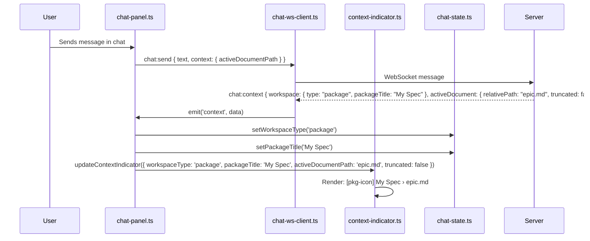
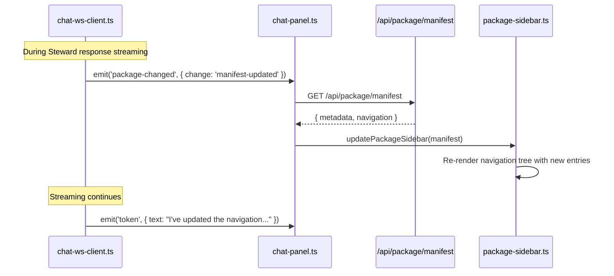
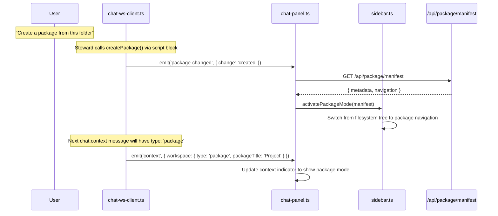

# Technical Design — Client (Epic 13: Package and Spec Awareness)

Companion to `tech-design.md`. This document covers client-side implementation depth: extended context indicator, `chat:package-changed` message handling, sidebar re-synchronization, and workspace state tracking.

---

## Extended Context Indicator

The context indicator from Epic 12 shows the active document path and truncation status. Epic 13 extends it to display workspace type (folder or package) and the package title when a package is open. The indicator receives its data from the server via the extended `chat:context` message — the server is the source of truth for workspace state.

### Layout Architecture

The indicator is a CSS flex row within the existing chat panel header:

```
┌──────────────────────────────────────────────────────────────────┐
│  📦 My Spec  ›  docs/epic.md                       [truncated]  │
│  ╰─ package ─╯  ╰── document path ──╯              ╰─ badge ──╯ │
└──────────────────────────────────────────────────────────────────┘
```

| Workspace Mode | Indicator Display |
|---------------|------------------|
| Folder + document | `docs/epic.md` (Epic 12 behavior, unchanged) |
| Folder + document + truncated | `docs/epic.md [truncated]` |
| Package + document | `[pkg-icon] My Spec › docs/epic.md` |
| Package + document + truncated | `[pkg-icon] My Spec › docs/epic.md [truncated]` |
| Package + no document | `[pkg-icon] My Spec` |
| Folder + no document | (empty) |

The package icon is rendered via CSS `::before` pseudo-element on the `.context-package-title` class — a small rectangle outline matching the theme's secondary color. Not an emoji (cross-platform rendering inconsistency).

### Implementation

```typescript
// Modifications to app/src/client/steward/context-indicator.ts

/**
 * Extended state for the context indicator.
 * Receives data from chat:context server messages.
 *
 * Covers: AC-1.2 (TC-1.2a package, TC-1.2b folder, TC-1.2c no doc, TC-1.2d truncated)
 */
interface ContextIndicatorState {
  // Epic 12 (unchanged):
  activeDocumentPath: string | null;
  truncated: boolean;

  // Epic 13 (new):
  workspaceType: 'folder' | 'package';
  packageTitle: string | null;
  warning: string | null;  // AC-8.2: degraded package context warning
}

/**
 * Update the context indicator from a chat:context message.
 *
 * Called by chat-panel.ts when a chat:context message arrives.
 * The server message includes workspace info (type, title) alongside
 * the existing document info (path, truncation).
 *
 * Covers: AC-1.2 (TC-1.2a through TC-1.2d)
 */
export function updateContextIndicator(
  container: HTMLElement,
  state: ContextIndicatorState,
): void {
  // Clear existing content
  container.innerHTML = '';

  // Package title section (only in package mode)
  if (state.workspaceType === 'package' && state.packageTitle) {
    const titleEl = document.createElement('span');
    titleEl.className = 'context-package-title';
    titleEl.textContent = state.packageTitle;
    container.appendChild(titleEl);

    // Separator (only when document also present)
    if (state.activeDocumentPath) {
      const sep = document.createElement('span');
      sep.className = 'context-separator';
      sep.textContent = '›';
      container.appendChild(sep);
    }
  }

  // Document path section (both modes)
  if (state.activeDocumentPath) {
    const pathEl = document.createElement('span');
    pathEl.className = 'context-document-path';
    pathEl.textContent = state.activeDocumentPath;
    container.appendChild(pathEl);
  }

  // Truncation badge
  if (state.truncated) {
    const badge = document.createElement('span');
    badge.className = 'context-truncated-badge';
    badge.textContent = 'truncated';
    container.appendChild(badge);
  }

  // AC-8.2: Warning badge for degraded package context
  if (state.warning) {
    const warn = document.createElement('span');
    warn.className = 'context-warning-badge';
    warn.textContent = state.warning;
    warn.title = 'Package context unavailable — Steward has limited awareness';
    container.appendChild(warn);
  }
}
```

### CSS

```css
/* Additions to app/src/client/styles/chat.css */

.context-indicator {
  display: flex;
  align-items: center;
  gap: 6px;
  padding: 4px 8px;
  font-size: 12px;
  color: var(--color-text-secondary);
  overflow: hidden;
  white-space: nowrap;
}

.context-package-title {
  display: flex;
  align-items: center;
  gap: 4px;
  flex-shrink: 0;
  max-width: 200px;
  overflow: hidden;
  text-overflow: ellipsis;
  font-weight: 500;
}

.context-package-title::before {
  content: '';
  display: inline-block;
  width: 12px;
  height: 10px;
  border: 1.5px solid var(--color-text-secondary);
  border-radius: 2px;
  flex-shrink: 0;
}

.context-separator {
  color: var(--color-text-tertiary);
  flex-shrink: 0;
}

.context-document-path {
  overflow: hidden;
  text-overflow: ellipsis;
}

.context-truncated-badge {
  flex-shrink: 0;
  padding: 1px 6px;
  border-radius: 3px;
  background: var(--color-bg-warning);
  color: var(--color-text-warning);
  font-size: 10px;
  font-weight: 500;
  text-transform: uppercase;
}
```

The `.context-package-title` has a `max-width: 200px` with ellipsis overflow — this prevents a long package title from pushing the document path off-screen. The document path fills remaining flex space. The truncation badge is `flex-shrink: 0` so it's always visible.

---

## Package-Changed Message Handling

When the server sends `chat:package-changed`, the client needs to update the sidebar and workspace state. The message arrives during streaming (between `chat:token` messages, before `chat:done`), so the handler must not block the streaming pipeline.

### Dispatch Chain

```
ws-chat route (server)
    │ sends chat:package-changed
    ▼
ChatWsClient (client)
    │ dispatches 'package-changed' event
    ▼
chat-panel.ts
    │ handles event, calls sidebar API
    ▼
sidebar.ts / package-sidebar.ts (existing)
    │ re-renders based on change type
```

### ChatWsClient Extension

```typescript
// Modifications to app/src/client/steward/chat-ws-client.ts

/**
 * Handle new message types in the WebSocket message handler.
 *
 * Covers: AC-3.4 (client UI updates after package operations)
 */
// In the message handler switch:
case 'chat:package-changed': {
  const data = parsed as {
    type: 'chat:package-changed';
    messageId: string;
    change: 'created' | 'exported' | 'manifest-updated';
    details?: { manifestPath?: string; exportPath?: string };
  };
  this.emit('package-changed', data);
  break;
}

// AC-3.3: Open/activate a file in a viewer tab
case 'chat:open-document': {
  const data = parsed as {
    type: 'chat:open-document';
    path: string;
    messageId: string;
  };
  this.emit('open-document', data);
  break;
}

// Extended chat:context handling:
case 'chat:context': {
  const data = parsed as {
    type: 'chat:context';
    messageId: string;
    activeDocument: { relativePath: string; truncated: boolean; totalLines?: number } | null;
    workspace?: { type: 'folder' | 'package'; rootPath: string; packageTitle?: string; warning?: string };
  };
  this.emit('context', data);
  break;
}
```

### Chat Panel Wiring

The chat panel registers handlers for the new events and coordinates with the sidebar:

```typescript
// Modifications to app/src/client/steward/chat-panel.ts

/**
 * Wire package-changed handler.
 * Called during chat panel initialization.
 *
 * Covers: AC-3.4 (TC-3.4a manifest update, TC-3.4b package creation, TC-3.4c export)
 */
function wirePackageChangedHandler(wsClient: ChatWsClient): void {
  wsClient.on('package-changed', async (data: {
    change: 'created' | 'exported' | 'manifest-updated';
    details?: { manifestPath?: string; exportPath?: string };
  }) => {
    switch (data.change) {
      case 'manifest-updated':
        // TC-3.4a: Re-fetch manifest and update sidebar navigation
        await refreshSidebarNavigation();
        break;

      case 'created':
        // TC-3.4b: Switch sidebar to package mode
        await switchToPackageMode();
        // TC-3.5c: Immediately update context indicator to package mode
        // Don't wait for next chat:context message — update now.
        chatState.setWorkspaceType('package');
        updateContextIndicator(contextIndicatorEl, {
          activeDocumentPath: chatState.getActiveDocumentPath(),
          truncated: false,
          workspaceType: 'package',
          packageTitle: null, // Will be populated from next chat:context
          warning: null,
        });
        break;

      case 'exported':
        // TC-3.4c: No sidebar change — export success is in the Steward's
        // response text. Stale indicator update: the server clears stale
        // in session state (via PackageService.clearStale()) for re-export
        // to original path. The client reflects this by re-reading session
        // state from the existing stale-indicator mechanism in Epic 9's
        // package-header.ts which reads from the session API, not via
        // polling. Trigger an immediate session re-read to pick up the
        // stale flag change.
        await refreshStaleIndicator();
        break;
    }
  });
}

/**
 * Re-fetch the manifest and update the sidebar navigation tree.
 * Uses the existing GET /api/package/manifest endpoint from Epic 9.
 *
 * Covers: AC-3.4a (manifest update refreshes sidebar)
 */
async function refreshSidebarNavigation(): Promise<void> {
  try {
    const response = await fetch('/api/package/manifest');
    if (response.ok) {
      const manifest = await response.json();
      // Call into the existing sidebar module to update the navigation tree
      // The sidebar's package-sidebar.ts already has a render method
      // that accepts a parsed manifest
      updatePackageSidebar(manifest);
    }
  } catch {
    // Manifest fetch failed — sidebar retains previous state
    // The next message's chat:context will reflect the current state
  }
}

/**
 * Switch the sidebar to package mode.
 * Mirrors the behavior of opening a package via the File menu (Epic 9).
 *
 * Covers: AC-3.4b (package creation switches sidebar), AC-3.5c (indicator updates)
 */
async function switchToPackageMode(): Promise<void> {
  try {
    const response = await fetch('/api/package/manifest');
    if (response.ok) {
      const manifest = await response.json();
      // Switch sidebar mode — same function called by Epic 9's package open flow
      activatePackageMode(manifest);
    }
  } catch {
    // Mode switch failed — sidebar retains current mode
  }
}
```

/**
 * Refresh the stale indicator by re-reading session state.
 * Epic 9's package-header.ts reads stale from the session API.
 * After server-side stale state changes (export, file write),
 * trigger a re-read so the UI reflects immediately.
 *
 * Covers: TC-3.2d (re-export clears stale)
 */
async function refreshStaleIndicator(): Promise<void> {
  try {
    const response = await fetch('/api/session');
    if (response.ok) {
      const session = await response.json();
      // Update the client-side package state from session
      // Epic 9's stale indicator reads from this state
      updatePackageStateFromSession(session);
    }
  } catch {
    // Session fetch failed — stale indicator retains previous state
  }
}
```

The `updatePackageSidebar()`, `activatePackageMode()`, and `updatePackageStateFromSession()` functions are provided by the existing sidebar infrastructure from Epic 9. Epic 13 only calls them — it doesn't modify them.

### chat:open-document Handler

The `chat:open-document` message (new in Epic 13) opens or activates a viewer tab for any file. This is distinct from `chat:file-created` which only reloads already-open tabs (Epic 12 contract). The client calls the existing `openFileInTab(path)` function from Epic 2.

```typescript
/**
 * Handle chat:open-document — open/activate a file in a viewer tab.
 *
 * Covers: AC-3.3 (TC-3.3a open by manifest path)
 */
chatWsClient.on('open-document', (data: { path: string; messageId: string }) => {
  // openFileInTab is the existing function from Epic 2 that:
  // 1. Checks if the file is already open in a tab → activate it
  // 2. If not → creates a new tab and loads the file
  openFileInTab(data.path);
});
```

### Extended Context Handler

The existing `context` event handler in `chat-panel.ts` is extended to pass workspace info to the context indicator:

```typescript
/**
 * Handle extended chat:context messages.
 *
 * Covers: AC-1.2 (context indicator shows workspace type)
 */
wsClient.on('context', (data: {
  messageId: string;
  activeDocument: { relativePath: string; truncated: boolean; totalLines?: number } | null;
  workspace?: { type: 'folder' | 'package'; rootPath?: string; packageTitle?: string; warning?: string };
}) => {
  // Update chat state with workspace info
  chatState.setWorkspaceType(data.workspace?.type ?? 'folder');
  chatState.setPackageTitle(data.workspace?.packageTitle ?? null);

  // Update context indicator with full state including warning (AC-8.2)
  updateContextIndicator(contextIndicatorEl, {
    activeDocumentPath: data.activeDocument?.relativePath ?? null,
    truncated: data.activeDocument?.truncated ?? false,
    workspaceType: data.workspace?.type ?? 'folder',
    packageTitle: data.workspace?.packageTitle ?? null,
    warning: data.workspace?.warning ?? null,
  });
});
```

---

## Chat State Extension

The chat state module tracks workspace-level information that the context indicator and other components need. The extension is minimal — two new fields.

```typescript
// Modifications to app/src/client/steward/chat-state.ts

/**
 * Extended chat state with workspace tracking.
 *
 * Covers: AC-1.2 (workspace type for indicator)
 */
interface ChatState {
  // ... existing fields (messages, streaming, activeDocumentPath) ...

  // Epic 13 (new):
  workspaceType: 'folder' | 'package';
  packageTitle: string | null;
}

// Initial state extension:
const initialState: ChatState = {
  // ... existing ...
  workspaceType: 'folder',
  packageTitle: null,
};

// New setters:
export function setWorkspaceType(type: 'folder' | 'package'): void {
  state.workspaceType = type;
}

export function setPackageTitle(title: string | null): void {
  state.packageTitle = title;
}
```

---

## Client Integration Points

### Sidebar API Dependency

The chat panel calls into the sidebar infrastructure from Epic 9. These are the integration points — functions that Epic 9 exports and Epic 13 consumes:

| Function | Source (Epic 9) | Called By (Epic 13) | When |
|----------|-----------------|---------------------|------|
| `updatePackageSidebar(manifest)` | `package-sidebar.ts` | `refreshSidebarNavigation()` | `chat:package-changed` with `manifest-updated` |
| `activatePackageMode(manifest)` | `sidebar.ts` | `switchToPackageMode()` | `chat:package-changed` with `created` |

If these functions don't exist as named exports in Epic 9's implementation, they need to be extracted during Chunk 4's skeleton phase. The existing sidebar code handles these operations internally (when the user opens a package via File menu or edits the manifest in edit mode) — the refactoring is to make these internal operations callable from the chat panel.

### Existing File-Created Handling

The `chat:file-created` handler from Epic 12 continues to work unchanged for all file operations in Epic 13. When `addFile` or `editFile` triggers `chat:file-created`:

1. If the file is open in the active tab → auto-refresh (clean) or conflict modal (dirty)
2. If the file is open in a non-active tab → same rules apply
3. If the file is not open in any tab → no immediate UI effect (file appears in sidebar on next tree refresh)

No modifications to the existing `chat:file-created` client handling are needed. The server reuses the same message type for the new file operations, and the client's existing handling covers all cases.

### Feature Flag Isolation

All Epic 13 client changes are within the `steward/` directory, which is conditionally mounted when `FEATURE_SPEC_STEWARD` is enabled (Epic 10). When the flag is disabled:

- No context indicator renders (no chat panel at all)
- No `chat:package-changed` handler is registered (no WebSocket connection)
- No sidebar integration code executes

TC-8.3a and TC-8.3b are satisfied by the existing feature flag architecture from Epic 10 — no additional isolation code is needed for Epic 13.

---

## Client Flow Sequences

### Flow 1: Package Context Indicator Update



### Flow 2: Manifest Update → Sidebar Refresh



### Flow 3: Folder → Package Transition


