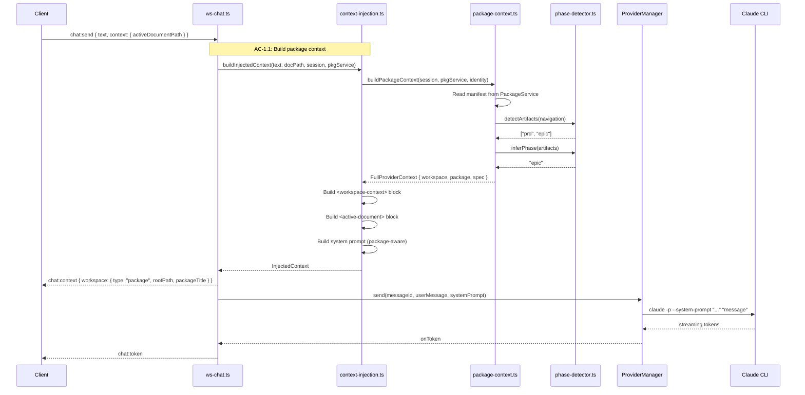
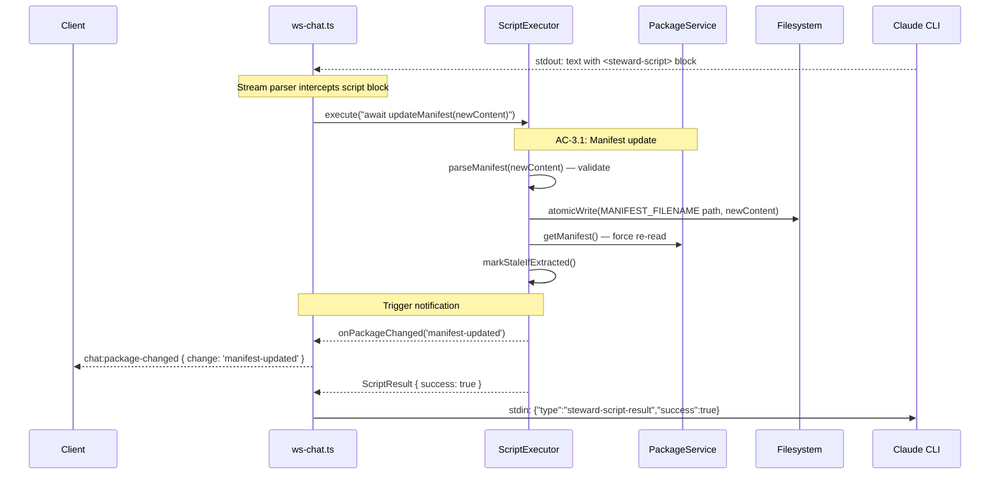
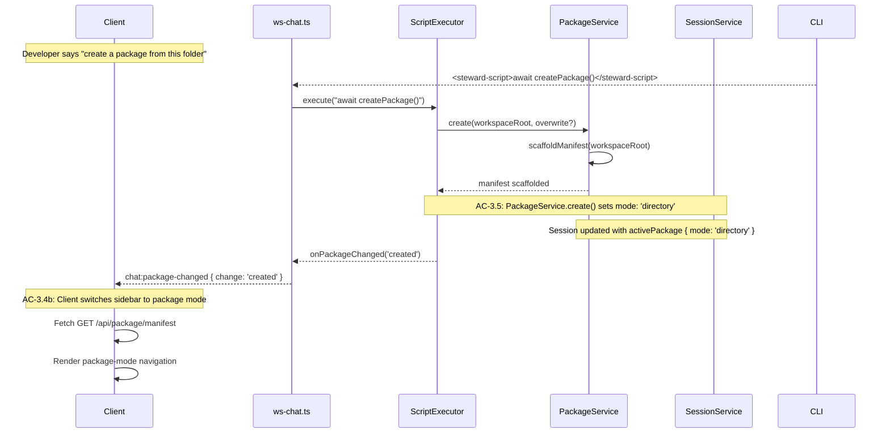

# Technical Design — Server (Epic 13: Package and Spec Awareness)

Companion to `tech-design.md`. This document covers server-side implementation depth: package context service, phase detection, context injection extension, script context methods, schema extensions, and the workspace integration flows.

---

## PackageContextService

The package context service builds the package portion of the provider context. It reads the current package state from the session service, fetches the manifest from the package service, extracts spec metadata, and runs phase detection. The result is a structured `PackageContext` object that the context injection service embeds in the CLI prompt.

### Architecture

```
ws-chat.ts (on chat:send)
    │
    ▼
package-context.ts
    │ 1. Read session state (activePackage, lastRoot)
    │ 2. If package → read manifest from PackageService
    │ 3. Extract spec metadata from frontmatter (js-yaml)
    │ 4. Run PhaseDetector on navigation entries
    │ 5. Build PackageContext object
    ▼
context-injection.ts
    │ Embed in <workspace-context> block
    ▼
CLI Process (receives full context)
```

### Implementation

```typescript
// app/src/server/services/package-context.ts
import yaml from 'js-yaml';
import type { SessionState } from '../schemas/index.js';
import type { PackageService } from './package.service.js';
import type { ParsedManifest, NavigationNode, ManifestMetadata } from '../../shared/types.js';
import { detectArtifacts, inferPhase } from './phase-detector.js';

/**
 * Workspace context for the provider prompt.
 * Always present — every message has workspace context.
 *
 * Covers: AC-1.1 (package context in provider),
 *         AC-5.1 (spec metadata in context),
 *         AC-5.3 (spec field in context)
 */
export interface WorkspaceContext {
  type: 'folder' | 'package';
  rootPath: string;
  canonicalIdentity: string;
}

export interface PackageContext {
  mode: 'directory' | 'extracted';
  sourcePath?: string;
  format?: 'mpk' | 'mpkz';
  metadata: ManifestMetadata;
  navigation: NavigationNode[];
  manifestStatus: 'present' | 'missing' | 'unreadable';
  fileCount: number;
}

export interface SpecContext {
  declaredPhase?: string;
  declaredStatus?: string;
  detectedPhase?: string;
  detectedArtifacts: string[];
}

export interface FullProviderContext {
  workspace: WorkspaceContext;
  package?: PackageContext;
  spec?: SpecContext;
}

/**
 * Build the package/workspace portion of the provider context.
 *
 * Called on every chat:send to construct the context for the CLI.
 * Reads from session state and package service — no client input needed.
 *
 * Covers: AC-1.1 (TC-1.1a through TC-1.1d), AC-1.3 (TC-1.3a, TC-1.3b),
 *         AC-5.1 (TC-5.1a through TC-5.1c), AC-5.3 (TC-5.3a, TC-5.3b)
 */
export async function buildPackageContext(
  session: SessionState,
  packageService: PackageService,
  canonicalIdentity: string,
): Promise<FullProviderContext> {
  const activePackage = (session as Record<string, unknown>).activePackage as {
    sourcePath: string;
    extractedRoot: string;
    format: 'mpk' | 'mpkz';
    mode: 'extracted' | 'directory';
    stale: boolean;
    manifestStatus: 'present' | 'missing' | 'unreadable';
  } | null;

  // Determine effective root
  const rootPath = activePackage?.extractedRoot ?? session.lastRoot ?? '';

  // TC-1.1b: No package — folder mode
  if (!activePackage) {
    return {
      workspace: {
        type: 'folder',
        rootPath,
        canonicalIdentity,
      },
    };
  }

  // Package is open — build package context
  const workspace: WorkspaceContext = {
    type: 'package',
    rootPath,
    canonicalIdentity,
  };

  // TC-1.1d: Manifest missing or unreadable
  if (activePackage.manifestStatus !== 'present') {
    return {
      workspace,
      package: {
        mode: activePackage.mode,
        ...(activePackage.mode === 'extracted' ? {
          sourcePath: activePackage.sourcePath,
          format: activePackage.format,
        } : {}),
        metadata: {} as ManifestMetadata,
        navigation: [],
        manifestStatus: activePackage.manifestStatus,
        fileCount: 0,
      },
    };
  }

  // Manifest present — parse and build full context
  let manifest: ParsedManifest;
  try {
    manifest = await packageService.getManifest();
  } catch {
    return {
      workspace,
      package: {
        mode: activePackage.mode,
        ...(activePackage.mode === 'extracted' ? {
          sourcePath: activePackage.sourcePath,
          format: activePackage.format,
        } : {}),
        metadata: {} as ManifestMetadata,
        navigation: [],
        manifestStatus: 'unreadable',
        fileCount: 0,
      },
    };
  }

  const packageCtx: PackageContext = {
    mode: activePackage.mode,
    ...(activePackage.mode === 'extracted' ? {
      sourcePath: activePackage.sourcePath,
      format: activePackage.format,
    } : {}),
    metadata: manifest.metadata,
    navigation: manifest.navigation,
    manifestStatus: 'present',
    fileCount: await countWorkspaceFiles(rootPath),
  };

  const result: FullProviderContext = { workspace, package: packageCtx };

  // Extract spec metadata — check if this is a spec package
  const specMeta = extractSpecMetadata(manifest.raw);
  if (specMeta?.type === 'spec') {
    const artifacts = detectArtifacts(manifest.navigation);
    const detectedPhase = inferPhase(artifacts);

    result.spec = {
      declaredPhase: specMeta.specPhase,
      declaredStatus: specMeta.specStatus,
      detectedPhase: detectedPhase ?? undefined,
      detectedArtifacts: artifacts,
    };
  }

  return result;
}

/**
 * Extract spec-specific metadata fields from manifest frontmatter.
 * Uses js-yaml to parse the YAML frontmatter section.
 *
 * The standard ManifestMetadata type from Epic 8 includes type and status.
 * specPhase and specStatus are additional fields that may be present
 * in the frontmatter but are not part of the typed ManifestMetadata.
 *
 * Covers: AC-5.1 (TC-5.1a spec metadata present, TC-5.1c partial)
 */
function extractSpecMetadata(rawManifestContent: string): {
  type?: string;
  specPhase?: string;
  specStatus?: string;
} | null {
  // Extract YAML frontmatter between --- delimiters
  const match = rawManifestContent.match(/^---\n([\s\S]*?)\n---/);
  if (!match) return null;

  try {
    const parsed = yaml.load(match[1]) as Record<string, unknown>;
    return {
      type: typeof parsed.type === 'string' ? parsed.type : undefined,
      specPhase: typeof parsed.specPhase === 'string' ? parsed.specPhase : undefined,
      specStatus: typeof parsed.specStatus === 'string' ? parsed.specStatus : undefined,
    };
  } catch {
    return null;
  }
}

/**
 * Count total files in the workspace directory (not just manifest entries).
 * Uses the tree service's scan to get the real file count.
 * Consistent with epic's "total files in the workspace" definition.
 */
async function countWorkspaceFiles(rootPath: string): Promise<number> {
  // Delegate to the existing tree service scan (from Epic 1).
  // The tree service already handles markdown filtering and counting.
  // For a lightweight count, use fs.readdir recursive + markdown filter.
  const { readdir } = await import('node:fs/promises');
  const { join, extname } = await import('node:path');
  const mdExts = new Set(['.md', '.markdown']);
  let count = 0;

  async function walk(dir: string): Promise<void> {
    const entries = await readdir(dir, { withFileTypes: true });
    for (const entry of entries) {
      if (entry.name.startsWith('.')) continue;
      const full = join(dir, entry.name);
      if (entry.isDirectory()) await walk(full);
      else if (mdExts.has(extname(entry.name).toLowerCase())) count++;
    }
  }

  await walk(rootPath);
  return count;
}
```

The service is stateless — it reads from session and package services on every call. No caching is needed because the cost is negligible (see Q9 answer).

---

## Phase Detection

Phase detection scans manifest navigation entries for known Liminal Spec artifact patterns. It's a pure function — no side effects, no I/O, no dependencies. This makes it trivially testable and keeps the computation fast.

### Implementation

```typescript
// app/src/server/services/phase-detector.ts
import type { NavigationNode } from '../../shared/types.js';

/**
 * Artifact type patterns.
 * Each artifact type has one or more regex patterns
 * that match against NavigationNode.filePath values.
 *
 * Covers: AC-6.1 (TC-6.1a through TC-6.1d)
 */
const ARTIFACT_PATTERNS: Record<string, RegExp[]> = {
  prd: [
    /prd\.md$/i,
    /product.?requirements/i,
  ],
  epic: [
    /epic\.md$/i,
    /epic[-_]/i,
    /feature.?spec/i,
  ],
  'tech-design': [
    /tech.?design/i,
    /technical.?(design|architecture)/i,
  ],
  stories: [
    /stories?\//i,
    /story[-_]/i,
  ],
};

/**
 * Pipeline phase order — earlier artifacts indicate earlier phases.
 * Implementation is NOT detectable from artifacts (TC-6.1c).
 */
const PHASE_ORDER = ['prd', 'epic', 'tech-design', 'stories'];

/**
 * Detect artifact types from navigation entries.
 *
 * Scans filePath of every NavigationNode (including children)
 * against the artifact patterns. Returns a deduplicated list
 * of detected artifact type strings.
 *
 * Covers: AC-6.1 (artifact detection)
 */
export function detectArtifacts(navigation: NavigationNode[]): string[] {
  const detected = new Set<string>();
  const allPaths = flattenPaths(navigation);

  for (const path of allPaths) {
    for (const [artifactType, patterns] of Object.entries(ARTIFACT_PATTERNS)) {
      for (const pattern of patterns) {
        if (pattern.test(path)) {
          detected.add(artifactType);
          break; // Found match for this type — move to next type
        }
      }
    }
  }

  return Array.from(detected);
}

/**
 * Infer the pipeline phase from detected artifacts.
 *
 * Returns the highest artifact type in PHASE_ORDER that was detected.
 * Returns null if no artifacts were detected (TC-6.1d).
 *
 * Covers: AC-6.1 (TC-6.1a prd, TC-6.1b epic, TC-6.1c stories)
 */
export function inferPhase(artifacts: string[]): string | null {
  if (artifacts.length === 0) return null;

  // Find the highest phase in order
  for (let i = PHASE_ORDER.length - 1; i >= 0; i--) {
    if (artifacts.includes(PHASE_ORDER[i])) {
      return PHASE_ORDER[i];
    }
  }

  return null;
}

/**
 * Flatten the navigation tree into a list of file paths.
 */
function flattenPaths(nodes: NavigationNode[]): string[] {
  const paths: string[] = [];
  for (const node of nodes) {
    if (node.filePath) paths.push(node.filePath);
    if (node.children) paths.push(...flattenPaths(node.children));
  }
  return paths;
}
```

### Design Decisions

**Filename-only matching:** Content analysis (reading files to check for frontmatter or heading patterns) would require filesystem I/O on every message. For a 50-file package, that's 50 file reads — adding 50-200ms latency. Filename patterns achieve the same result in <1ms.

**Broad patterns with accepted false positives:** A file named `epic-story.md` would match both `epic` and `stories` patterns. This is acceptable — the guidance is conversational, and the declared metadata (from `specPhase`) takes precedence when present (TC-6.1e).

**Implementation not artifact-detectable:** There's no reliable filename pattern for "this is implementation code" — it could be any `.ts`, `.js`, `.py` file. Only the declared `specPhase: implementation` metadata triggers this phase.

---

## Context Injection Extension

The `buildInjectedContext()` function from Epic 12 is extended to include a `<workspace-context>` XML block in the user message and to extend the system prompt with package-aware instructions.

### Extended buildInjectedContext

```typescript
// Modifications to app/src/server/services/context-injection.ts

import { buildPackageContext, type FullProviderContext } from './package-context.js';
import type { PackageService } from './package.service.js';
import type { SessionState } from '../schemas/index.js';

/**
 * Extended context injection result — now includes workspace context.
 *
 * Covers: AC-1.1 (package context in prompt)
 */
export interface InjectedContext {
  systemPrompt: string;
  userMessage: string;
  truncated: boolean;
  totalLines?: number;
  relativePath?: string;
  workspaceType: 'folder' | 'package';  // NEW
  workspaceRootPath: string;             // NEW — effective root for chat:context
  packageTitle?: string;                  // NEW
  warning?: string;                       // NEW — AC-8.2 degraded context
}

/**
 * Build the injected context for a CLI invocation.
 *
 * Extended from Epic 12: now includes workspace and package context
 * alongside the active document context.
 *
 * Covers: AC-1.1 (TC-1.1a through TC-1.1d),
 *         AC-1.4 (token budget — unchanged from Epic 12)
 */
export async function buildInjectedContext(
  userText: string,
  activeDocumentPath: string | null,
  session: SessionState,
  packageService: PackageService,
): Promise<InjectedContext> {
  const workspaceRoot = session.lastRoot;

  // Build package/workspace context
  const identity = resolveWorkspaceIdentity(session);
  const providerCtx = identity
    ? await buildPackageContext(session, packageService, identity)
    : null;

  // Build system prompt (extended with package awareness)
  const systemPrompt = buildSystemPrompt(providerCtx);

  // Build workspace context block
  const workspaceBlock = providerCtx
    ? buildWorkspaceBlock(providerCtx)
    : '';

  // Build document context block (Epic 12 logic, unchanged)
  let documentBlock = '';
  let truncated = false;
  let totalLines: number | undefined;
  let relativePath: string | undefined;

  if (activeDocumentPath) {
    try {
      let content = await readFile(activeDocumentPath, 'utf-8');
      relativePath = workspaceRoot
        ? relative(workspaceRoot, activeDocumentPath)
        : activeDocumentPath;

      totalLines = content.split('\n').length;
      if (content.length > TOKEN_BUDGET_CHARS) {
        content = truncateDocument(content, TOKEN_BUDGET_CHARS);
        truncated = true;
      }

      documentBlock = buildDocumentBlock(relativePath, content, truncated, totalLines);
    } catch {
      throw new ContextReadError(activeDocumentPath);
    }
  }

  // Compose the user message: workspace context → document → user text
  const parts = [workspaceBlock, documentBlock, userText].filter(Boolean);
  const userMessage = parts.join('\n\n');

  // Determine warning for degraded package context (AC-8.2)
  let warning: string | undefined;
  if (providerCtx?.workspace.type === 'package' && !providerCtx.package) {
    warning = 'Package context unavailable';
  } else if (providerCtx?.package?.manifestStatus === 'unreadable') {
    warning = 'Manifest unreadable — limited package awareness';
  }

  return {
    systemPrompt,
    userMessage,
    truncated,
    totalLines: truncated ? totalLines : undefined,
    relativePath,
    workspaceType: providerCtx?.workspace.type ?? 'folder',
    workspaceRootPath: providerCtx?.workspace.rootPath ?? workspaceRoot ?? '',
    packageTitle: providerCtx?.package?.metadata?.title,
    warning,
  };
}
```

### Workspace Context Block Builder

```typescript
/**
 * Build the <workspace-context> XML block for the CLI prompt.
 *
 * Covers: AC-1.1 (package structure in context),
 *         AC-1.3 (package structure questions),
 *         AC-5.1 (spec metadata)
 */
function buildWorkspaceBlock(ctx: FullProviderContext): string {
  const attrs: string[] = [
    `type="${ctx.workspace.type}"`,
    `rootPath="${ctx.workspace.rootPath}"`,
  ];

  if (ctx.package) {
    if (ctx.package.metadata?.title) {
      attrs.push(`title="${ctx.package.metadata.title}"`);
    }
    attrs.push(`mode="${ctx.package.mode}"`);
    attrs.push(`manifestStatus="${ctx.package.manifestStatus}"`);
    attrs.push(`fileCount="${ctx.package.fileCount}"`);
  }

  const lines: string[] = [
    `<workspace-context ${attrs.join(' ')}>`,
  ];

  // Metadata section
  if (ctx.package?.metadata) {
    lines.push('## Metadata');
    const meta = ctx.package.metadata;
    if (meta.title) lines.push(`title: ${meta.title}`);
    if (meta.version) lines.push(`version: ${meta.version}`);
    if (meta.author) lines.push(`author: ${meta.author}`);
    if (meta.description) lines.push(`description: ${meta.description}`);
    if (meta.type) lines.push(`type: ${meta.type}`);
    if (meta.status) lines.push(`status: ${meta.status}`);
    lines.push('');
  }

  // Navigation section
  if (ctx.package?.navigation?.length) {
    lines.push('## Navigation');
    lines.push(renderNavigationTree(ctx.package.navigation, 0));
    lines.push('');
  }

  // Spec section
  if (ctx.spec) {
    lines.push('## Spec Phase');
    if (ctx.spec.detectedArtifacts.length) {
      lines.push(`Detected artifacts: ${ctx.spec.detectedArtifacts.join(', ')}`);
    }
    if (ctx.spec.detectedPhase) {
      lines.push(`Detected phase: ${ctx.spec.detectedPhase}`);
    }
    if (ctx.spec.declaredPhase) {
      lines.push(`Declared phase: ${ctx.spec.declaredPhase}`);
    }
    if (ctx.spec.declaredStatus) {
      lines.push(`Declared status: ${ctx.spec.declaredStatus}`);
    }
    lines.push('');
  }

  lines.push('</workspace-context>');
  return lines.join('\n');
}

/**
 * Render the navigation tree as indented markdown list.
 */
function renderNavigationTree(nodes: NavigationNode[], depth: number): string {
  const indent = '  '.repeat(depth);
  return nodes.map(node => {
    const prefix = `${indent}- `;
    const label = node.filePath
      ? `[${node.displayName}](${node.filePath})`
      : node.displayName;  // Group label — no link
    const line = `${prefix}${label}`;

    if (node.children?.length) {
      return `${line}\n${renderNavigationTree(node.children, depth + 1)}`;
    }
    return line;
  }).join('\n');
}
```

### Extended System Prompt

The system prompt (from Epic 12's `buildSystemPrompt()`) is extended with package-aware instructions and new script method documentation. The prompt is parameterized based on the workspace context — package-specific instructions are included only when a package is open.

```typescript
/**
 * Build the system prompt for the Steward.
 * Extended from Epic 12 with package awareness and new script methods.
 *
 * Covers: AC-1.1 (package-aware behavior),
 *         AC-6.2 (context supports guidance)
 */
function buildSystemPrompt(ctx: FullProviderContext | null): string {
  const basePrompt = `You are the Spec Steward, an AI assistant embedded in MD Viewer. You help the developer work with markdown documents and packages — answering questions, suggesting improvements, making edits, and managing packages.

## Context

The developer's workspace context is provided in a <workspace-context> block before their message. Use it to understand the project structure. The currently active document (if any) is in an <active-document> block.

## Editing Documents

When the developer asks you to edit the active document, use a <steward-script> block:

<steward-script>
const content = await getActiveDocumentContent();
// ... modify content ...
await applyEditToActiveDocument(modifiedContent);
</steward-script>

For editing other files, use editFile:

<steward-script>
const content = await getFileContent("path/to/file.md");
// ... modify content ...
await editFile("path/to/file.md", modifiedContent);
</steward-script>

## Reading Files

To read any file in the workspace by relative path:

<steward-script>
const result = await getFileContent("docs/prd.md");
// result.content contains the file text
// result.truncated indicates if the file was too large
</steward-script>

## Creating Files

<steward-script>
await addFile("docs/new-epic.md", "# New Epic\\n\\nContent here.");
</steward-script>

## Package Operations

<steward-script>
// Read the manifest
const manifest = await getPackageManifest();

// Update the manifest
await updateManifest(newManifestContent);

// Create a package from the current folder
await createPackage();

// Export the workspace as a package
await exportPackage({ outputPath: "/path/to/output.mpk", compress: false });
</steward-script>

## Available Script Methods

- \`getActiveDocumentContent()\` — Read the currently active document
- \`applyEditToActiveDocument(content)\` — Replace the active document's content
- \`openDocument(path)\` — Open a file in the viewer
- \`showNotification(message)\` — Show a notification
- \`getFileContent(path)\` — Read any workspace file by relative path (returns { content, truncated, totalLines? })
- \`addFile(path, content)\` — Create a new file (error if exists)
- \`editFile(path, content)\` — Replace an existing file's content
- \`getPackageManifest()\` — Read the manifest (package mode only)
- \`updateManifest(content)\` — Replace the manifest content (package mode only)
- \`createPackage(options?)\` — Scaffold a manifest from workspace files
- \`exportPackage(options)\` — Export workspace to .mpk/.mpkz

## Guidelines

- Reference the workspace context when answering questions about the project
- Use the navigation tree to find files by name or path
- When editing, explain what you changed after the edit
- If a document was truncated, note that you can only see part of it
- All file paths are relative to the workspace root
- Be concise — the developer is working, not chatting`;

  // Add spec-awareness instructions when spec package detected
  if (ctx?.spec) {
    return basePrompt + `

## Spec Awareness

This is a spec package following the Liminal Spec methodology. The pipeline phases are: PRD → Epic → Tech Design → Stories → Implementation.

${ctx.spec.detectedPhase ? `Current detected phase: ${ctx.spec.detectedPhase}` : ''}
${ctx.spec.declaredPhase ? `Declared phase: ${ctx.spec.declaredPhase}` : ''}
${ctx.spec.detectedArtifacts.length ? `Detected artifacts: ${ctx.spec.detectedArtifacts.join(', ')}` : ''}

When the developer asks about next steps or what to do, reference the detected phase and suggest the next pipeline step. This guidance is conversational — the developer may follow it, skip phases, or work in any order. Suggest, don't enforce.

You can update the spec metadata in the manifest frontmatter using updateManifest to set specPhase and specStatus as the project progresses.`;
  }

  return basePrompt;
}
```

---

## Script Context Extensions

Epic 12 established the `buildScriptContext()` function with four methods: `showNotification`, `getActiveDocumentContent`, `applyEditToActiveDocument`, and `openDocument`. Epic 13 adds seven new methods. The construction pattern is unchanged — context is built per-message with captured state from the current `chat:send`.

### Read Budget Tracker

```typescript
// app/src/server/services/read-budget.ts

const READ_BUDGET_CHARS = 300_000;

/**
 * Tracks cumulative character reads within a single response turn.
 * Created fresh for each chat:send. Passed to script context builder.
 *
 * Covers: AC-2.2 (TC-2.2c budget exceeded, TC-2.2d budget resets)
 */
export class ReadBudgetTracker {
  private consumed = 0;

  /**
   * Attempt to consume characters from the budget.
   * Returns true if within budget, false if exceeded.
   */
  canConsume(chars: number): boolean {
    return (this.consumed + chars) <= READ_BUDGET_CHARS;
  }

  consume(chars: number): void {
    this.consumed += chars;
  }

  get remaining(): number {
    return Math.max(0, READ_BUDGET_CHARS - this.consumed);
  }
}
```

### Extended buildScriptContext

```typescript
// Extensions to app/src/server/services/script-executor.ts

import { readFile, writeFile, rename, mkdir, stat, access } from 'node:fs/promises';
import { resolve, relative, dirname } from 'node:path';
import { constants } from 'node:fs';
import type { PackageService } from './package.service.js';
import type { SessionService } from './session.service.js';
import type { ReadBudgetTracker } from './read-budget.js';

const FILE_TRUNCATION_CHARS = 100_000; // Same budget as active document

/**
 * Build the extended script context for a message.
 *
 * Extends Epic 12's buildScriptContext with file operations,
 * package operations, and manifest manipulation.
 *
 * Context is per-message: captures the active document path,
 * workspace root, and service references from the current message.
 *
 * Covers: AC-2.1–2.4 (file reading), AC-3.1–3.6 (package ops),
 *         AC-4.1–4.3 (file create/edit), AC-7.1–7.3 (folder mode)
 */
export function buildExtendedScriptContext(
  activeDocumentPath: string | null,
  workspaceRoot: string | null,
  packageService: PackageService,
  sessionService: SessionService,
  readBudget: ReadBudgetTracker,
  onFileCreated: (path: string) => void,
  onPackageChanged: (change: string, details?: Record<string, string>) => void,
  onOpenDocument: (path: string) => void,
  onNotification: (message: string) => void,
): Record<string, unknown> {
  return {
    // --- Epic 10 (unchanged) ---
    showNotification: (message: string) => {
      onNotification(message);
      return `notification: ${message}`;
    },

    // --- Epic 12 (unchanged) ---
    getActiveDocumentContent: async (): Promise<string> => {
      if (!activeDocumentPath) throw new Error('No active document');
      return readFile(activeDocumentPath, 'utf-8');
    },

    applyEditToActiveDocument: async (content: string): Promise<void> => {
      if (!activeDocumentPath) throw new Error('No active document');
      await atomicWrite(activeDocumentPath, content);
      markStaleIfExtracted(sessionService, packageService);
      onFileCreated(activeDocumentPath);
    },

    openDocument: async (path: string): Promise<void> => {
      if (!workspaceRoot) throw new Error('No workspace root');
      const resolved = resolveAndValidate(path, workspaceRoot);
      onOpenDocument(resolved);
    },

    // --- Epic 13: File Operations ---

    /**
     * Read any file in the workspace by relative path.
     *
     * Covers: AC-2.1 (TC-2.1a read, TC-2.1c not found, TC-2.1d traversal),
     *         AC-2.2 (TC-2.2c budget), AC-2.3 (TC-2.3a–c truncation/binary),
     *         AC-2.4 (TC-2.4a folder, TC-2.4b package)
     */
    getFileContent: async (path: string): Promise<{
      content: string;
      truncated: boolean;
      totalLines?: number;
    }> => {
      if (!workspaceRoot) throw new Error('No workspace root');
      const resolved = resolveAndValidate(path, workspaceRoot);

      // Check file exists
      try {
        await stat(resolved);
      } catch {
        throw new Error(`File not found: ${path}`);
      }

      // Read file
      const buffer = await readFile(resolved);

      // Binary detection: check for null bytes in first 8KB
      const probe = buffer.subarray(0, 8192);
      if (probe.includes(0)) {
        throw new Error(`Not a text file: ${path}`);
      }

      let content = buffer.toString('utf-8');
      const totalLines = content.split('\n').length;

      // Check read budget BEFORE consuming
      if (!readBudget.canConsume(content.length)) {
        throw new Error('Per-response file read budget exceeded. You can still use files already read in this response.');
      }

      // Apply truncation if needed
      let truncated = false;
      if (content.length > FILE_TRUNCATION_CHARS) {
        content = truncateContent(content, FILE_TRUNCATION_CHARS, totalLines);
        truncated = true;
      }

      readBudget.consume(content.length);

      return { content, truncated, totalLines: truncated ? totalLines : undefined };
    },

    /**
     * Create a new file in the workspace.
     *
     * Covers: AC-4.1 (TC-4.1a create, TC-4.1b nested, TC-4.1c exists,
     *                  TC-4.1d traversal, TC-4.1e permission)
     */
    addFile: async (path: string, content: string): Promise<void> => {
      if (!workspaceRoot) throw new Error('No workspace root');
      const resolved = resolveAndValidate(path, workspaceRoot);

      // Check file does NOT exist
      try {
        await stat(resolved);
        throw new Error(`File already exists: ${path}. Use editFile() for existing files.`);
      } catch (err) {
        if ((err as Error).message.includes('already exists')) throw err;
        // ENOENT is expected — file doesn't exist
      }

      // Create intermediate directories
      await mkdir(dirname(resolved), { recursive: true });

      // Write atomically
      await atomicWrite(resolved, content);
      markStaleIfExtracted(sessionService, packageService);
      onFileCreated(resolved);
    },

    /**
     * Edit an existing file in the workspace (full replacement).
     *
     * Covers: AC-4.2 (TC-4.2a non-active, TC-4.2b clean tab, TC-4.2c dirty,
     *                  TC-4.2d not found, TC-4.2e traversal, TC-4.2f permission)
     */
    editFile: async (path: string, content: string): Promise<void> => {
      if (!workspaceRoot) throw new Error('No workspace root');
      const resolved = resolveAndValidate(path, workspaceRoot);

      // Check file exists
      try {
        await stat(resolved);
      } catch {
        throw new Error(`File not found: ${path}. Use addFile() for new files.`);
      }

      // Check writable
      try {
        await access(resolved, constants.W_OK);
      } catch {
        throw new Error(`Permission denied: ${path}`);
      }

      // Write atomically
      await atomicWrite(resolved, content);
      markStaleIfExtracted(sessionService, packageService);
      onFileCreated(resolved);
    },

    // --- Epic 13: Package Operations ---

    /**
     * Read the current package manifest.
     *
     * Covers: AC-3.1 (manifest access for reading before update)
     */
    getPackageManifest: async (): Promise<{
      content: string;
      metadata: Record<string, unknown>;
      navigation: unknown[];
    }> => {
      const pkg = getActivePackage(sessionService);
      if (!pkg) throw new Error('No package is open. Use createPackage() first.');
      if (pkg.manifestStatus !== 'present') {
        throw new Error('Package has no readable manifest.');
      }

      const manifest = await packageService.getManifest();
      return {
        content: manifest.raw,
        metadata: manifest.metadata as unknown as Record<string, unknown>,
        navigation: manifest.navigation,
      };
    },

    /**
     * Replace the manifest content. Server re-parses to validate.
     *
     * Covers: AC-3.1 (TC-3.1a add entry, TC-3.1b remove, TC-3.1c reorder,
     *                  TC-3.1d invalid content)
     */
    updateManifest: async (content: string): Promise<void> => {
      const pkg = getActivePackage(sessionService);
      if (!pkg) throw new Error('No package is open. Use createPackage() first.');
      if (!workspaceRoot) throw new Error('No workspace root');

      // Validate by parsing through Epic 8's parser
      const { parseManifest, MANIFEST_FILENAME } = await import('../../shared/types.js');
      try {
        parseManifest(content);
      } catch (err) {
        throw new Error(`Invalid manifest content: ${(err as Error).message}`);
      }

      // Atomic write to manifest file using Epic 8's canonical name
      const manifestPath = resolve(workspaceRoot, MANIFEST_FILENAME);
      await atomicWrite(manifestPath, content);

      // Force re-read of manifest state in PackageService.
      // getManifest() re-reads and re-parses per Epic 9's contract.
      await packageService.getManifest();

      markStaleIfExtracted(sessionService, packageService);
      onPackageChanged('manifest-updated', { manifestPath });
    },

    /**
     * Create a package by scaffolding a manifest.
     *
     * For folder mode and directory-mode packages: delegates to
     * PackageService.create(rootDir, overwrite?) which scaffolds
     * the manifest and sets activePackage with mode: 'directory'.
     *
     * For extracted packages in fallback mode (TC-7.1d, TC-7.1e):
     * scaffolds the manifest directly in the extracted temp dir
     * WITHOUT calling PackageService.create() — which would switch
     * to directory mode. Instead, scaffolds via Epic 8's library
     * and updates manifestStatus to 'present' in session state.
     *
     * Covers: AC-7.1 (TC-7.1a folder, TC-7.1b exists, TC-7.1c overwrite,
     *                  TC-7.1d fallback repair, TC-7.1e unreadable repair)
     */
    createPackage: async (options?: { overwrite?: boolean }): Promise<void> => {
      if (!workspaceRoot) throw new Error('No workspace root');

      const pkg = getActivePackage(sessionService);
      const { MANIFEST_FILENAME } = await import('../../shared/types.js');

      if (pkg?.mode === 'extracted') {
        // Fallback repair: scaffold in the extracted temp dir
        // but keep mode as 'extracted' (not 'directory')
        const { scaffoldManifest } = await import('../../shared/types.js');
        await scaffoldManifest(workspaceRoot, { overwrite: options?.overwrite });
        // Update manifestStatus in session without changing mode
        // This is a direct session state update, not PackageService.create()
        // because create() would switch to directory mode
        const session = sessionService.getSession();
        const activePkg = (session as Record<string, unknown>).activePackage as Record<string, unknown>;
        activePkg.manifestStatus = 'present';
        await sessionService.persist();
        markStaleIfExtracted(sessionService, packageService);
      } else {
        // Folder mode or directory-mode package: use PackageService.create()
        // Epic 9 signature: create(rootDir, overwrite?)
        await packageService.create(workspaceRoot, options?.overwrite);
      }

      onPackageChanged('created', {
        manifestPath: resolve(workspaceRoot, MANIFEST_FILENAME),
      });
    },

    /**
     * Export the workspace to a .mpk or .mpkz file.
     *
     * Covers: AC-3.2 (TC-3.2a mpk, TC-3.2b mpkz, TC-3.2c not writable,
     *                  TC-3.2d re-export clears stale, TC-3.2e different path)
     */
    exportPackage: async (options: {
      outputPath: string;
      compress?: boolean;
    }): Promise<void> => {
      if (!workspaceRoot) throw new Error('No workspace root');

      // Validate absolute path
      if (!options.outputPath.startsWith('/')) {
        throw new Error('outputPath must be an absolute path');
      }

      // Validate parent directory writable
      const parentDir = dirname(options.outputPath);
      try {
        await access(parentDir, constants.W_OK);
      } catch {
        throw new Error(`Cannot write to directory: ${parentDir}`);
      }

      // Epic 9 signature: export(outputPath, compress?, sourceDir?)
      await packageService.export(
        options.outputPath,
        options.compress ?? false,
        workspaceRoot,
      );

      // Check if re-exporting to original source path clears stale
      const pkg = getActivePackage(sessionService);
      if (pkg?.mode === 'extracted' && pkg.sourcePath === options.outputPath) {
        packageService.clearStale();
      }

      onPackageChanged('exported', { exportPath: options.outputPath });
    },
  };
}

// --- Utility Functions ---

/**
 * Resolve a relative path against the workspace root and
 * validate it doesn't escape the root (path traversal prevention).
 *
 * Covers: TC-2.1d, TC-4.1d, TC-4.2e (path traversal blocked)
 */
function resolveAndValidate(relativePath: string, root: string): string {
  const resolved = resolve(root, relativePath);
  if (!resolved.startsWith(root + '/') && resolved !== root) {
    throw new Error(`Path outside workspace root: ${relativePath}`);
  }
  return resolved;
}

/**
 * Atomic write: temp file + rename.
 * Consistent with session.service.ts and Epic 12's edit pattern.
 */
async function atomicWrite(filePath: string, content: string): Promise<void> {
  const tempPath = `${filePath}.${process.pid}.${Date.now()}.tmp`;
  await writeFile(tempPath, content, 'utf-8');
  await rename(tempPath, filePath);
}

/**
 * Mark the package as stale if it's an extracted package.
 *
 * Covers: AC-3.6 (TC-3.6a addFile, TC-3.6b editFile, TC-3.6c updateManifest)
 */
function markStaleIfExtracted(
  sessionService: SessionService,
  packageService: PackageService,
): void {
  const pkg = getActivePackage(sessionService);
  if (pkg && pkg.mode === 'extracted') {
    packageService.markStale();
  }
}

/**
 * Get the active package from session state.
 */
function getActivePackage(sessionService: SessionService): {
  mode: 'extracted' | 'directory';
  sourcePath?: string;
  manifestStatus: string;
} | null {
  const session = sessionService.getSession();
  return (session as Record<string, unknown>).activePackage as {
    mode: 'extracted' | 'directory';
    sourcePath?: string;
    manifestStatus: string;
  } | null;
}

/**
 * Truncate file content to budget, consistent with Epic 12 pattern.
 */
function truncateContent(content: string, budget: number, totalLines: number): string {
  const truncateAt = content.lastIndexOf('\n', budget);
  const truncated = truncateAt === -1 ? content.slice(0, budget) : content.slice(0, truncateAt);
  const truncatedLines = truncated.split('\n').length;
  return `${truncated}\n\n[Content truncated: showing first ${truncatedLines} of ${totalLines} total lines]`;
}
```

### Script Context Wiring in ws-chat.ts

The `ws-chat.ts` route handler constructs the extended script context on each `chat:send`. The key change is passing additional service references and creating the read budget tracker:

```typescript
// In ws-chat.ts — extended chat:send handler
case 'chat:send': {
  const docPath = msg.context?.activeDocumentPath ?? null;
  const session = sessionService.getSession();
  const identity = conversationService.resolveIdentity(session);
  const root = resolveEffectiveRoot(session); // extractedRoot or lastRoot

  // Create per-message read budget tracker
  const readBudget = new ReadBudgetTracker();

  // Build script context with all methods
  const scriptContext = buildExtendedScriptContext(
    docPath,
    root,
    packageService,
    sessionService,
    readBudget,
    // onFileCreated callback
    (path: string) => {
      sendMessage(socket, {
        type: 'chat:file-created',
        path,
        messageId: msg.messageId,
      });
    },
    // onPackageChanged callback
    (change: string, details?: Record<string, string>) => {
      sendMessage(socket, {
        type: 'chat:package-changed',
        messageId: msg.messageId,
        change: change as 'created' | 'exported' | 'manifest-updated',
        details,
      });
    },
    // onOpenDocument callback — uses chat:open-document (NOT chat:file-created)
    // chat:file-created only reloads already-open tabs (Epic 12 contract).
    // chat:open-document opens or activates a tab for any file.
    (path: string) => {
      sendMessage(socket, {
        type: 'chat:open-document',
        path,
        messageId: msg.messageId,
      });
    },
    // onNotification callback
    (message: string) => {
      // Future: send notification to client
    },
  );

  // Pass the per-message script context to the provider manager.
  // ProviderManager owns the ScriptExecutor (Epic 10). Epic 13 adds
  // setScriptContext() to ProviderManager so the route can inject
  // per-message context before each send(). The provider manager
  // passes this context to its private ScriptExecutor.executeAsync()
  // when script blocks are intercepted during streaming.
  providerManager.setScriptContext(scriptContext);

  // Build injected context (extended with package awareness)
  try {
    const injected = await buildInjectedContext(
      msg.text,
      docPath,
      session,
      packageService,
    );

    // Send extended context acknowledgment
    sendMessage(socket, {
      type: 'chat:context',
      messageId: msg.messageId,
      activeDocument: injected.relativePath
        ? { relativePath: injected.relativePath, truncated: injected.truncated, totalLines: injected.totalLines }
        : null,
      workspace: {
        type: injected.workspaceType,
        rootPath: injected.workspaceRootPath,
        ...(injected.packageTitle ? { packageTitle: injected.packageTitle } : {}),
        ...(injected.warning ? { warning: injected.warning } : {}),
      },
    });

    // ... rest of Epic 12 send logic (session ID, persistence, provider.send) ...
  } catch (err) {
    // ... Epic 12 error handling (ContextReadError) ...
  }
  break;
}
```

The `resolveEffectiveRoot()` helper determines the workspace root:

```typescript
function resolveEffectiveRoot(session: SessionState): string | null {
  const pkg = (session as Record<string, unknown>).activePackage as {
    extractedRoot?: string;
    mode?: string;
  } | null;

  if (pkg?.extractedRoot && pkg.mode === 'extracted') {
    return pkg.extractedRoot;
  }
  return session.lastRoot;
}
```

---

## Schema Extensions

All schema changes are additive — extending existing Zod discriminated unions and adding new types. No breaking changes to existing message types.

### ChatPackageChangedMessage

```typescript
// Added to app/src/server/schemas/index.ts

export const ChatPackageChangedMessageSchema = z.object({
  type: z.literal('chat:package-changed'),
  messageId: z.string().uuid(),
  change: z.enum(['created', 'exported', 'manifest-updated']),
  details: z.object({
    manifestPath: z.string().optional(),
    exportPath: z.string().optional(),
  }).optional(),
});

/**
 * Open or activate a file in a viewer tab.
 * Distinct from chat:file-created which only reloads already-open tabs.
 * chat:open-document can open a tab for a file that isn't currently open.
 *
 * Covers: AC-3.3 (navigate to file through chat)
 */
export const ChatOpenDocumentMessageSchema = z.object({
  type: z.literal('chat:open-document'),
  path: z.string(),
  messageId: z.string().uuid(),
});

export type ChatPackageChangedMessage = z.infer<typeof ChatPackageChangedMessageSchema>;
```

### Extended ChatContextMessage

```typescript
// Modified in app/src/server/schemas/index.ts

export const ChatContextMessageSchema = z.object({
  type: z.literal('chat:context'),
  messageId: z.string().uuid(),
  activeDocument: z.object({
    relativePath: z.string(),
    truncated: z.boolean(),
    totalLines: z.number().optional(),
  }).nullable(),
  workspace: z.object({                    // NEW — Epic 13
    type: z.enum(['folder', 'package']),
    rootPath: z.string(),                  // Effective workspace root
    packageTitle: z.string().optional(),
    warning: z.string().optional(),        // AC-8.2: degraded context
  }).optional(),
});
```

### Extended ChatServerMessage Union

```typescript
export const ChatServerMessageSchema = z.discriminatedUnion('type', [
  ChatTokenMessageSchema,
  ChatDoneMessageSchema,
  ChatErrorMessageSchema,
  ChatStatusSchema,
  ChatFileCreatedMessageSchema,
  ChatConversationLoadMessageSchema,
  ChatContextMessageSchema,
  ChatPackageChangedMessageSchema,         // NEW — Epic 13
  ChatOpenDocumentMessageSchema,           // NEW — Epic 13
]);
```

### New Error Codes

```typescript
export const ChatErrorCodeSchema = z.enum([
  // Existing (Epic 10):
  'INVALID_MESSAGE', 'PROVIDER_NOT_FOUND', 'PROVIDER_CRASHED',
  'PROVIDER_TIMEOUT', 'PROVIDER_BUSY', 'PROVIDER_AUTH_FAILED',
  'SCRIPT_ERROR', 'SCRIPT_TIMEOUT', 'CANCELLED',
  // Epic 12:
  'CONTEXT_READ_FAILED', 'EDIT_FAILED',
  // Epic 13 (NEW):
  'FILE_NOT_FOUND', 'FILE_ALREADY_EXISTS', 'PATH_TRAVERSAL',
  'MANIFEST_NOT_FOUND', 'MANIFEST_PARSE_ERROR', 'PERMISSION_DENIED',
  'NOT_TEXT_FILE', 'READ_BUDGET_EXCEEDED', 'PACKAGE_EXPORT_FAILED',
  'PACKAGE_CREATE_FAILED',
]);
```

---

## Error Handling

All script method errors follow the same pattern established in Epic 10: errors are caught by the script executor, returned as `ScriptResult` with `success: false`, and relayed to the CLI stdin as JSON. The server continues operating. No error crashes the server.

| Error Condition | Detection | Error Code | Server State After |
|----------------|-----------|------------|-------------------|
| File not found | `stat()` throws ENOENT | `FILE_NOT_FOUND` | Unchanged — streaming continues |
| File already exists | `stat()` succeeds before `addFile` | `FILE_ALREADY_EXISTS` | Unchanged |
| Path traversal | Resolved path doesn't start with root | `PATH_TRAVERSAL` | Unchanged |
| No manifest for package op | `activePackage` null or `manifestStatus !== 'present'` | `MANIFEST_NOT_FOUND` | Unchanged |
| Manifest parse failure | `parseManifest()` throws | `MANIFEST_PARSE_ERROR` | Unchanged — existing manifest preserved |
| Permission denied | `access()` throws EACCES | `PERMISSION_DENIED` | Unchanged |
| Binary file | Null bytes in first 8KB | `NOT_TEXT_FILE` | Unchanged |
| Read budget exceeded | `ReadBudgetTracker.canConsume()` false | `READ_BUDGET_EXCEEDED` | Unchanged — budget state preserved |
| Export failure | `PackageService.export()` throws | `PACKAGE_EXPORT_FAILED` | Unchanged — no partial file on disk |
| Package create failure | `PackageService.create()` throws | `PACKAGE_CREATE_FAILED` | Unchanged |
| Package context unavailable | `packageService.getManifest()` throws | Graceful degradation | Message sent without package context; warning in `chat:context` |

The graceful degradation for package context errors (AC-8.2) means the message is dispatched without the `<workspace-context>` block. The `chat:context` response indicates the workspace type but notes the missing package context. The Steward operates with reduced awareness — it knows a package is open but doesn't have the navigation tree.

---

## Server Flow Sequences

### Flow 1: Chat Message with Package Context



### Flow 2: Script Block with Package Operation



### Flow 3: Folder-to-Package Transition


