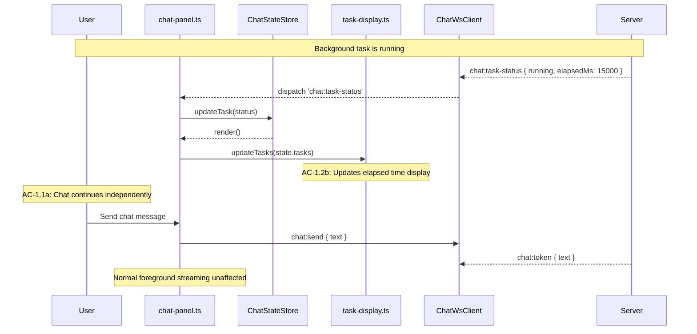
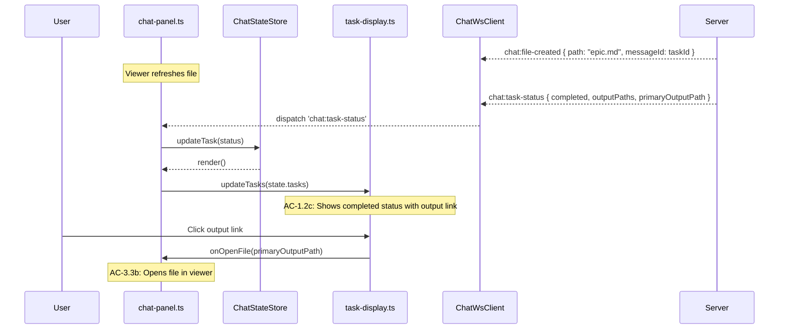
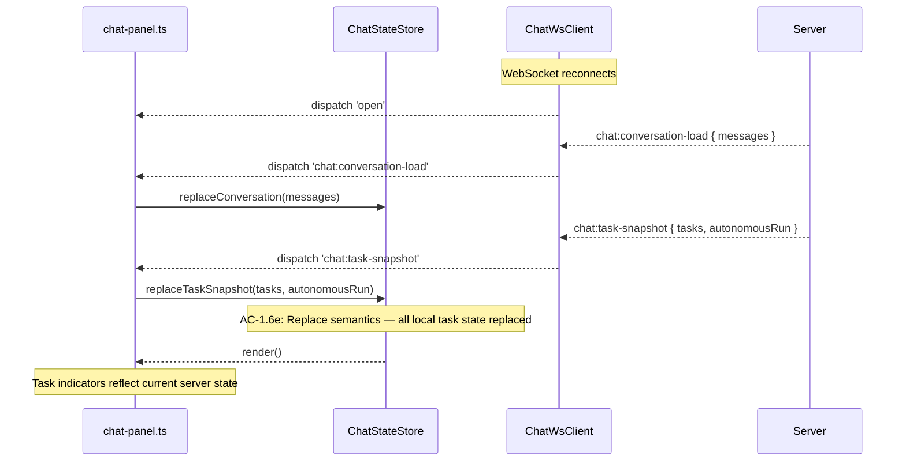

# Technical Design — Client (Epic 14: Pipeline Orchestration)

Companion to `tech-design.md`. This document covers client-side implementation depth: task state management, task status display, autonomous run display, approval interaction, and WebSocket client extensions.

---

## Chat State Extensions

The `ChatStateStore` from Epics 10/12 gains task-related state. Task state is separate from conversation messages — tasks are tracked in their own array, rendered in a dedicated area, and replaced on snapshot.

### Extended ChatState

```typescript
// Extensions to app/src/client/steward/chat-state.ts

export interface ClientTaskInfo {
  taskId: string;
  phase: string;
  target: string;              // Feature/artifact identity
  description: string;
  status: 'started' | 'running' | 'completed' | 'failed' | 'cancelled';
  startedAt: string;           // ISO 8601
  elapsedMs: number;
  outputDir?: string;
  outputPaths?: string[];
  primaryOutputPath?: string;
  autonomousRunId?: string;
  sequenceInfo?: {
    current: number;
    total: number;
    phaseName: string;
  };
  error?: string;
}

export interface ClientAutonomousRun {
  runId: string;
  status: 'started' | 'running' | 'completed' | 'failed' | 'cancelled';
  phases: string[];
  skippedPhases?: string[];
  currentPhaseIndex?: number;
  completedPhases?: string[];
  failedPhase?: string;
  error?: string;
}

export interface ChatState {
  // Existing (Epics 10/12):
  messages: ChatMessage[];
  activeMessageId: string | null;
  waitingForResponse: boolean;
  connected: boolean;
  providerStatus: string | null;

  // Epic 14 additions:
  tasks: ClientTaskInfo[];
  autonomousRun: ClientAutonomousRun | null;
}
```

### New ChatStateStore Methods

```typescript
// Added to ChatStateStore

/**
 * Replace all task state from a snapshot.
 * Called on WebSocket connect and workspace switch.
 *
 * Covers: AC-1.6 (TC-1.6a, TC-1.6e — snapshot replace semantics)
 */
replaceTaskSnapshot(
  tasks: ClientTaskInfo[],
  autonomousRun: ClientAutonomousRun | null,
): void {
  this.update({ tasks, autonomousRun });
}

/**
 * Update a single task from a chat:task-status event.
 *
 * If the task exists, update in place. If new, append.
 * Covers: AC-1.2 (status visibility), AC-1.4 (lifecycle events)
 */
updateTask(status: ChatTaskStatusMessage): void {
  const existing = this.state.tasks.find((t) => t.taskId === status.taskId);

  if (existing) {
    const tasks = this.state.tasks.map((t) =>
      t.taskId === status.taskId
        ? {
            ...t,
            status: status.status,
            elapsedMs: status.elapsedMs ?? t.elapsedMs,
            outputPaths: status.outputPaths ?? t.outputPaths,
            primaryOutputPath: status.primaryOutputPath ?? t.primaryOutputPath,
            error: status.error ?? t.error,
            sequenceInfo: status.sequenceInfo ?? t.sequenceInfo,
          }
        : t,
    );
    this.update({ tasks });
  } else {
    // New task — append
    const tasks = [
      ...this.state.tasks,
      {
        taskId: status.taskId,
        phase: status.phase,
        target: status.target,             // R2 minor fix: copy target
        description: status.description,
        status: status.status,
        startedAt: new Date().toISOString(),
        elapsedMs: status.elapsedMs ?? 0,
        outputDir: status.outputDir,
        outputPaths: status.outputPaths,
        primaryOutputPath: status.primaryOutputPath,
        autonomousRunId: status.autonomousRunId,
        sequenceInfo: status.sequenceInfo,
        error: status.error,
      },
    ];
    this.update({ tasks });
  }
}

/**
 * Update autonomous run state from a chat:autonomous-run event.
 *
 * Covers: AC-4.3 (run progress visibility)
 */
updateAutonomousRun(event: ChatAutonomousRunMessage): void {
  this.update({
    autonomousRun: {
      runId: event.runId,
      status: event.status,
      phases: event.phases,
      skippedPhases: event.skippedPhases,
      currentPhaseIndex: event.currentPhaseIndex,
      completedPhases: event.completedPhases,
      failedPhase: event.failedPhase,
      error: event.error,
    },
  });

  // Clear autonomous run when terminal
  if (
    event.status === 'completed' ||
    event.status === 'failed' ||
    event.status === 'cancelled'
  ) {
    // Keep for display but mark as terminal — will be cleared on next snapshot
  }
}

/**
 * Remove a specific task from the list (for cleanup).
 */
removeTask(taskId: string): void {
  const tasks = this.state.tasks.filter((t) => t.taskId !== taskId);
  this.update({ tasks });
}
```

The initial state includes empty task arrays:

```typescript
private state: ChatState = {
  // ... existing initial state ...
  tasks: [],
  autonomousRun: null,
};
```

---

## WebSocket Client Extensions

The `ChatWsClient` from Epics 10/12 dispatches three new server message types and sends two new client message types.

### New Event Types

```typescript
// Extended ChatWsEventMap in chat-ws-client.ts

type ChatWsEventMap = {
  // Existing:
  open: { type: 'open' };
  close: { type: 'close' };
  'chat:token': ChatServerMessageByType<'chat:token'>;
  'chat:done': ChatServerMessageByType<'chat:done'>;
  'chat:error': ChatServerMessageByType<'chat:error'>;
  'chat:status': ChatServerMessageByType<'chat:status'>;
  'chat:file-created': ChatServerMessageByType<'chat:file-created'>;
  'chat:conversation-load': ChatServerMessageByType<'chat:conversation-load'>;
  'chat:context': ChatServerMessageByType<'chat:context'>;
  'chat:package-changed': ChatServerMessageByType<'chat:package-changed'>;

  // Epic 14 additions:
  'chat:task-status': ChatServerMessageByType<'chat:task-status'>;
  'chat:task-snapshot': ChatServerMessageByType<'chat:task-snapshot'>;
  'chat:autonomous-run': ChatServerMessageByType<'chat:autonomous-run'>;
};
```

The `onmessage` handler in `ChatWsClient` already dispatches any message type that passes Zod validation against `ChatServerMessageSchema`. Since the three new message types are added to the discriminated union on the server, they'll be dispatched automatically when the client's schema bundle is updated. No logic change needed in the dispatch code — only the event map type needs extension.

### New Send Methods

```typescript
// Convenience methods on ChatWsClient

/**
 * Send a task cancellation request.
 * Covers: AC-1.3a (cancel via WebSocket message)
 */
cancelTask(taskId: string): boolean {
  return this.send({ type: 'chat:task-cancel', taskId });
}

/**
 * Send an autonomous run cancellation request.
 * Covers: AC-4.4 (cancel run)
 */
cancelAutonomousRun(runId: string): boolean {
  return this.send({ type: 'chat:autonomous-cancel', runId });
}
```

---

## Task Status Display

The `task-display.ts` module renders task status indicators in the chat panel. Tasks appear in a dedicated area above the message list, separate from conversation messages.

### DOM Structure

```
.chat-task-area                        [above .chat-messages]
  .chat-task-indicator                 [per active/recent task]
    .chat-task-header
      .chat-task-phase                 "Epic Drafting"
      .chat-task-status                "running" | "completed" | "failed"
      .chat-task-elapsed               "2m 15s"
    .chat-task-description             "Drafting epic for Feature 2"
    .chat-task-output                  [shown on completed — clickable link]
      "Output: epics/feature-2/epic.md"
    .chat-task-error                   [shown on failed]
      "Error: CLI process exited..."
    .chat-task-actions
      .chat-task-cancel-btn            [shown for running tasks]
```

### Implementation

```typescript
// app/src/client/steward/task-display.ts

import type { ClientTaskInfo } from './chat-state.js';

/**
 * Create and mount the task display area.
 * Returns an update function called on state changes.
 *
 * Covers: AC-1.2 (task status visibility), AC-3.3 (completion notification)
 */
export function mountTaskDisplay(
  container: HTMLElement,
  onCancelTask: (taskId: string) => void,
  onOpenFile: (path: string) => void,
): (tasks: ClientTaskInfo[]) => void {
  const taskArea = document.createElement('div');
  taskArea.className = 'chat-task-area';
  container.prepend(taskArea);

  return function updateTasks(tasks: ClientTaskInfo[]) {
    // Show all non-empty task states (cancelled is a terminal state carried by the protocol)
    const visible = tasks.filter((t) =>
      t.status === 'started' ||
      t.status === 'running' ||
      t.status === 'completed' ||
      t.status === 'failed' ||
      t.status === 'cancelled',
    );

    // AC-1.2d: No indicators when no tasks
    if (visible.length === 0) {
      taskArea.hidden = true;
      return;
    }

    taskArea.hidden = false;
    taskArea.innerHTML = '';

    for (const task of visible) {
      const indicator = createTaskIndicator(task, onCancelTask, onOpenFile);
      taskArea.appendChild(indicator);
    }
  };
}

/**
 * Create a single task indicator element.
 */
function createTaskIndicator(
  task: ClientTaskInfo,
  onCancelTask: (taskId: string) => void,
  onOpenFile: (path: string) => void,
): HTMLElement {
  const el = document.createElement('div');
  el.className = `chat-task-indicator ${task.status}`;
  el.dataset.taskId = task.taskId;

  // Header: phase + status + elapsed
  const header = document.createElement('div');
  header.className = 'chat-task-header';

  const phase = document.createElement('span');
  phase.className = 'chat-task-phase';
  phase.textContent = task.sequenceInfo?.phaseName ?? formatPhase(task.phase);

  const status = document.createElement('span');
  status.className = `chat-task-status ${task.status}`;
  status.textContent = task.status;

  // AC-1.2b: Elapsed time
  const elapsed = document.createElement('span');
  elapsed.className = 'chat-task-elapsed';
  elapsed.textContent = formatElapsed(task.elapsedMs);

  header.append(phase, status, elapsed);

  // Description
  const desc = document.createElement('div');
  desc.className = 'chat-task-description';
  desc.textContent = task.description;

  el.append(header, desc);

  // Sequence info for autonomous tasks
  if (task.sequenceInfo) {
    const seq = document.createElement('div');
    seq.className = 'chat-task-sequence';
    seq.textContent = `Phase ${task.sequenceInfo.current} of ${task.sequenceInfo.total}`;
    el.appendChild(seq);
  }

  // AC-1.2c / AC-3.3a: Output location on completed
  if (task.status === 'completed' && task.primaryOutputPath) {
    const output = document.createElement('div');
    output.className = 'chat-task-output';

    const link = document.createElement('a');
    link.href = '#';
    link.className = 'chat-task-output-link';
    link.textContent = task.primaryOutputPath;
    // AC-3.3b: Clickable output path opens file in viewer
    link.addEventListener('click', (e) => {
      e.preventDefault();
      onOpenFile(task.primaryOutputPath!);
    });

    output.append(document.createTextNode('Output: '), link);
    el.appendChild(output);
  }

  // Error display on failed
  if (task.status === 'failed' && task.error) {
    const errorEl = document.createElement('div');
    errorEl.className = 'chat-task-error';
    errorEl.textContent = task.error;
    el.appendChild(errorEl);
  }

  // Cancel button for active tasks
  if (task.status === 'started' || task.status === 'running') {
    const actions = document.createElement('div');
    actions.className = 'chat-task-actions';

    const cancelBtn = document.createElement('button');
    cancelBtn.className = 'chat-task-cancel-btn';
    cancelBtn.textContent = 'Cancel';
    cancelBtn.addEventListener('click', () => onCancelTask(task.taskId));

    actions.appendChild(cancelBtn);
    el.appendChild(actions);
  }

  return el;
}

/**
 * Format elapsed milliseconds as human-readable time.
 */
function formatElapsed(ms: number): string {
  const seconds = Math.floor(ms / 1000);
  if (seconds < 60) return `${seconds}s`;
  const minutes = Math.floor(seconds / 60);
  const remainingSeconds = seconds % 60;
  if (minutes < 60) return `${minutes}m ${remainingSeconds}s`;
  const hours = Math.floor(minutes / 60);
  const remainingMinutes = minutes % 60;
  return `${hours}h ${remainingMinutes}m`;
}

function formatPhase(phase: string): string {
  const names: Record<string, string> = {
    'epic': 'Epic Drafting',
    'tech-design': 'Technical Design',
    'stories': 'Story Generation',
    'implementation': 'Implementation',
  };
  return names[phase] ?? phase;
}
```

---

## Autonomous Run Display

The `autonomous-display.ts` module renders autonomous run progress: the phase list with completion checkmarks, the current phase indicator, and a cancel button.

### DOM Structure

```
.chat-autonomous-area                  [above .chat-task-area when run is active]
  .chat-autonomous-header
    .chat-autonomous-title             "Autonomous Pipeline Run"
    .chat-autonomous-status            "running" | "completed" | "failed"
    .chat-autonomous-cancel-btn        [shown when running]
  .chat-autonomous-phases
    .chat-autonomous-phase             [per phase in sequence]
      .chat-autonomous-phase-check     "✓" (completed) | "•" (current) | "○" (pending)
      .chat-autonomous-phase-name      "Epic Drafting"
  .chat-autonomous-skipped             [if phases were skipped]
    "Skipped: epic (already exists)"
  .chat-autonomous-error               [shown on failure]
```

### Implementation

```typescript
// app/src/client/steward/autonomous-display.ts

import type { ClientAutonomousRun } from './chat-state.js';

/**
 * Create and mount the autonomous run display.
 * Returns an update function called on state changes.
 *
 * Covers: AC-4.3 (autonomous mode progress visibility)
 */
export function mountAutonomousDisplay(
  container: HTMLElement,
  onCancelRun: (runId: string) => void,
): (run: ClientAutonomousRun | null) => void {
  const runArea = document.createElement('div');
  runArea.className = 'chat-autonomous-area';
  runArea.hidden = true;
  container.prepend(runArea);

  return function updateAutonomousRun(run: ClientAutonomousRun | null) {
    if (!run) {
      runArea.hidden = true;
      return;
    }

    runArea.hidden = false;
    runArea.innerHTML = '';

    // Header
    const header = document.createElement('div');
    header.className = 'chat-autonomous-header';

    const title = document.createElement('span');
    title.className = 'chat-autonomous-title';
    title.textContent = 'Autonomous Pipeline Run';

    const status = document.createElement('span');
    status.className = `chat-autonomous-status ${run.status}`;
    status.textContent = run.status;

    header.append(title, status);

    // Cancel button (for active runs)
    if (run.status === 'started' || run.status === 'running') {
      const cancelBtn = document.createElement('button');
      cancelBtn.className = 'chat-autonomous-cancel-btn';
      cancelBtn.textContent = 'Cancel Run';
      cancelBtn.addEventListener('click', () => onCancelRun(run.runId));
      header.appendChild(cancelBtn);
    }

    runArea.appendChild(header);

    // Phase list with progress indicators
    const phaseList = document.createElement('div');
    phaseList.className = 'chat-autonomous-phases';

    for (let i = 0; i < run.phases.length; i++) {
      const phaseName = run.phases[i];
      const phaseEl = document.createElement('div');
      phaseEl.className = 'chat-autonomous-phase';

      const check = document.createElement('span');
      check.className = 'chat-autonomous-phase-check';

      const completed = run.completedPhases?.includes(phaseName);
      const current = run.currentPhaseIndex === i &&
        (run.status === 'started' || run.status === 'running');
      const failed = run.failedPhase === phaseName;

      if (completed) {
        check.textContent = '✓';
        check.classList.add('completed');
      } else if (failed) {
        check.textContent = '✗';
        check.classList.add('failed');
      } else if (current) {
        check.textContent = '●';
        check.classList.add('current');
      } else {
        check.textContent = '○';
        check.classList.add('pending');
      }

      const name = document.createElement('span');
      name.className = 'chat-autonomous-phase-name';
      name.textContent = formatPhase(phaseName);

      phaseEl.append(check, name);
      phaseList.appendChild(phaseEl);
    }

    runArea.appendChild(phaseList);

    // Skipped phases
    if (run.skippedPhases && run.skippedPhases.length > 0) {
      const skipped = document.createElement('div');
      skipped.className = 'chat-autonomous-skipped';
      skipped.textContent = `Skipped: ${run.skippedPhases.map(formatPhase).join(', ')} (already exist)`;
      runArea.appendChild(skipped);
    }

    // Error display
    if (run.error) {
      const errorEl = document.createElement('div');
      errorEl.className = 'chat-autonomous-error';
      errorEl.textContent = run.error;
      runArea.appendChild(errorEl);
    }
  };
}

function formatPhase(phase: string): string {
  const names: Record<string, string> = {
    'epic': 'Epic Drafting',
    'tech-design': 'Technical Design',
    'stories': 'Story Generation',
    'implementation': 'Implementation',
  };
  return names[phase] ?? phase;
}
```

---

## CSS Additions

```css
/* Added to app/src/client/styles/chat.css */

/* --- Task Status Indicators --- */

.chat-task-area {
  padding: 0.5rem 0.75rem;
  border-bottom: 1px solid var(--color-border);
  display: flex;
  flex-direction: column;
  gap: 0.5rem;
  flex-shrink: 0;
}

.chat-task-indicator {
  padding: 0.5rem;
  border-radius: 0.375rem;
  background: var(--color-bg-secondary);
  font-size: 0.8125rem;
}

.chat-task-indicator.completed {
  border-left: 3px solid var(--color-success, #22c55e);
}

.chat-task-indicator.failed {
  border-left: 3px solid var(--color-error);
}

.chat-task-indicator.running,
.chat-task-indicator.started {
  border-left: 3px solid var(--color-accent);
}

.chat-task-indicator.cancelled {
  border-left: 3px solid var(--color-text-secondary);
  opacity: 0.7;
}

.chat-task-header {
  display: flex;
  align-items: center;
  gap: 0.5rem;
}

.chat-task-phase {
  font-weight: 600;
}

.chat-task-status {
  font-size: 0.75rem;
  padding: 0.1rem 0.375rem;
  border-radius: 0.25rem;
  background: var(--color-bg-tertiary);
}

.chat-task-status.running,
.chat-task-status.started {
  color: var(--color-accent);
}

.chat-task-status.completed {
  color: var(--color-success, #22c55e);
}

.chat-task-status.failed {
  color: var(--color-error);
}

.chat-task-elapsed {
  color: var(--color-text-secondary);
  font-size: 0.75rem;
  margin-left: auto;
}

.chat-task-description {
  color: var(--color-text-secondary);
  font-size: 0.75rem;
  margin-top: 0.25rem;
}

.chat-task-output {
  margin-top: 0.375rem;
  font-size: 0.75rem;
}

.chat-task-output-link {
  color: var(--color-accent);
  text-decoration: underline;
  cursor: pointer;
}

.chat-task-error {
  margin-top: 0.375rem;
  font-size: 0.75rem;
  color: var(--color-error);
}

.chat-task-actions {
  margin-top: 0.375rem;
}

.chat-task-cancel-btn {
  font-size: 0.75rem;
  padding: 0.2rem 0.5rem;
  border-radius: 0.25rem;
  border: 1px solid var(--color-error);
  background: transparent;
  color: var(--color-error);
  cursor: pointer;
}

.chat-task-cancel-btn:hover {
  background: var(--color-bg-tertiary);
}

.chat-task-sequence {
  font-size: 0.6875rem;
  color: var(--color-text-secondary);
  margin-top: 0.125rem;
}

/* --- Autonomous Run Display --- */

.chat-autonomous-area {
  padding: 0.5rem 0.75rem;
  border-bottom: 1px solid var(--color-border);
  background: var(--color-bg-secondary);
  flex-shrink: 0;
}

.chat-autonomous-header {
  display: flex;
  align-items: center;
  gap: 0.5rem;
}

.chat-autonomous-title {
  font-weight: 600;
  font-size: 0.875rem;
}

.chat-autonomous-status {
  font-size: 0.75rem;
  padding: 0.1rem 0.375rem;
  border-radius: 0.25rem;
  background: var(--color-bg-tertiary);
}

.chat-autonomous-cancel-btn {
  margin-left: auto;
  font-size: 0.75rem;
  padding: 0.2rem 0.5rem;
  border-radius: 0.25rem;
  border: 1px solid var(--color-error);
  background: transparent;
  color: var(--color-error);
  cursor: pointer;
}

.chat-autonomous-phases {
  margin-top: 0.5rem;
  display: flex;
  flex-direction: column;
  gap: 0.25rem;
}

.chat-autonomous-phase {
  display: flex;
  align-items: center;
  gap: 0.5rem;
  font-size: 0.8125rem;
}

.chat-autonomous-phase-check {
  width: 1rem;
  text-align: center;
  font-size: 0.75rem;
}

.chat-autonomous-phase-check.completed {
  color: var(--color-success, #22c55e);
}

.chat-autonomous-phase-check.current {
  color: var(--color-accent);
}

.chat-autonomous-phase-check.failed {
  color: var(--color-error);
}

.chat-autonomous-phase-check.pending {
  color: var(--color-text-secondary);
}

.chat-autonomous-skipped {
  margin-top: 0.375rem;
  font-size: 0.6875rem;
  color: var(--color-text-secondary);
  font-style: italic;
}

.chat-autonomous-error {
  margin-top: 0.375rem;
  font-size: 0.75rem;
  color: var(--color-error);
}
```

---

## Chat Panel Integration

The `chat-panel.ts` module from Epics 10/12 integrates the task and autonomous displays. Both are mounted in the chat panel layout between the header and the messages area.

### Layout Extension

The chat panel's DOM structure extends to include task areas:

```
#chat-panel
  .chat-header
  .chat-status
  .chat-autonomous-area              ← NEW (mounted by autonomous-display.ts)
  .chat-task-area                    ← NEW (mounted by task-display.ts)
  .chat-context-indicator            (Epic 12)
  .chat-messages
  .chat-input-area
```

### Wiring in mountChatPanel

```typescript
// Extended mountChatPanel() in chat-panel.ts

// After existing mounts (resizer, context indicator)...

// Mount task display (AC-1.2)
const updateTasks = mountTaskDisplay(
  panel,
  (taskId) => wsClient?.cancelTask(taskId),
  (path) => {
    // Open file in viewer — use Epic 12's existing openFile() client API (M9 fix)
    openFile(path);
  },
);

// Mount autonomous display (AC-4.3)
const updateAutonomousRun = mountAutonomousDisplay(
  panel,
  (runId) => wsClient?.cancelAutonomousRun(runId),
);

// In the state subscription render function:
function render(state: ChatState): void {
  // ... existing renders (messages, status, context indicator) ...

  // Task display
  updateTasks(state.tasks);

  // Autonomous display
  updateAutonomousRun(state.autonomousRun);
}
```

### WebSocket Event Wiring

```typescript
// In connectWs() — additional event subscriptions:

wsCleanups.push(
  // ... existing subscriptions (token, done, error, status, file-created, etc.) ...

  // Epic 14: Task events
  client.on('chat:task-status', (msg) => {
    chatState.updateTask(msg);
  }),

  client.on('chat:task-snapshot', (msg) => {
    chatState.replaceTaskSnapshot(msg.tasks, msg.autonomousRun ?? null);
  }),

  client.on('chat:autonomous-run', (msg) => {
    chatState.updateAutonomousRun(msg);
  }),
);
```

---

## Client Flow Sequences

### Flow: Task Status Updates During Chat



### Flow: Task Completion with Output Navigation



### Flow: Snapshot on Reconnect



---

## Component Summary

| Component | File | Responsibility | ACs |
|-----------|------|----------------|-----|
| `ChatStateStore` (extended) | `steward/chat-state.ts` | Task state, autonomous run state, snapshot replace | AC-1.2, AC-1.4, AC-1.6, AC-4.3 |
| `ChatWsClient` (extended) | `steward/chat-ws-client.ts` | Dispatch task/autonomous events, send cancel messages | AC-1.3, AC-1.4, AC-1.6, AC-4.4 |
| `mountTaskDisplay` | `steward/task-display.ts` | Render task indicators, format elapsed, output links, cancel | AC-1.2, AC-3.3 |
| `mountAutonomousDisplay` | `steward/autonomous-display.ts` | Render run progress, phase list, cancel button | AC-4.3 |
| `mountChatPanel` (extended) | `steward/chat-panel.ts` | Mount task/autonomous displays, wire events | AC-1.2, AC-3.3, AC-4.3 |
| CSS | `styles/chat.css` | Task indicator and autonomous run styles | AC-1.2, AC-4.3 |
