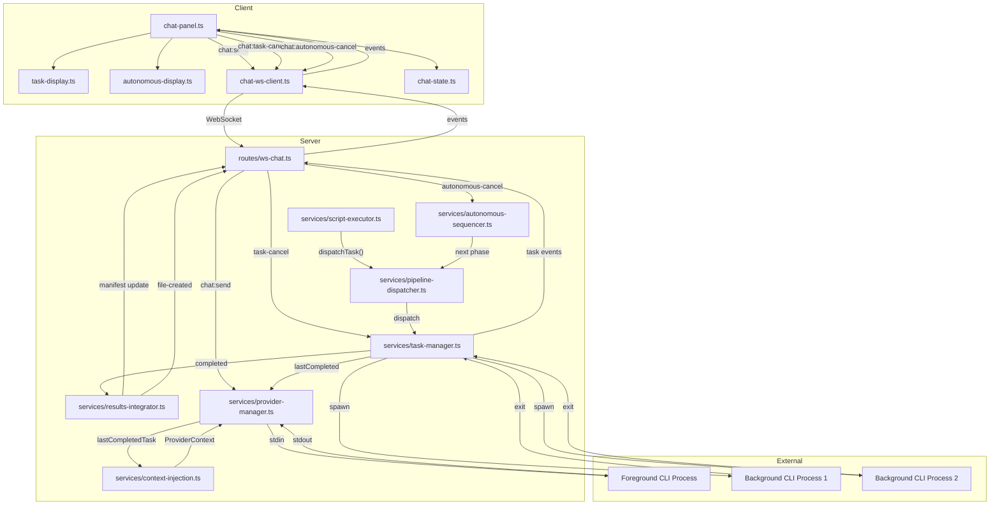

# Technical Design: Pipeline Orchestration (Epic 14)

## Purpose

This document translates the Epic 14 requirements into implementable architecture for the Spec Steward's pipeline orchestration layer — background task management, Liminal Spec pipeline dispatch, results integration with approval flow, and autonomous multi-phase execution. It serves three audiences:

| Audience | Value |
|----------|-------|
| Reviewers | Validate architecture decisions before code is written |
| Developers | Clear blueprint for implementation |
| Story Tech Sections | Source of implementation targets, interfaces, and test mappings |

**Output structure:** Config B (4 docs) — server + client domain split, consistent with Epic 10's tech design structure.

| Document | Content |
|----------|---------|
| `tech-design.md` (this file) | Index: decisions, context, system view, module architecture overview, work breakdown |
| `tech-design-server.md` | Server: TaskManager, PipelineDispatcher, AutonomousSequencer, ResultsIntegrator, WebSocket task messages |
| `tech-design-client.md` | Client: task status display, autonomous run UI, approval interaction |
| `test-plan.md` | TC→test mapping, mock strategy, fixtures, chunk breakdown with test counts |

**Prerequisite:** Epic 14 spec (`epic.md`) is complete with 26 ACs and 87 TCs, verified through 3 rounds. Epics 10 (chat plumbing), 12 (document awareness), and 13 (package and spec awareness) tech designs define the extension points this design builds on.

---

## Spec Validation

Before designing, the epic was validated as the downstream consumer. All ACs map to implementation work. The following issues were identified and resolved during validation:

| Issue | Spec Location | Resolution | Status |
|-------|---------------|------------|--------|
| Background worker process model unspecified | A2, Q1 | Epic requires process-level isolation (A2) but defers the model to tech design. Design uses one CLI process per task, reusing the per-invocation `claude -p` pattern from Epic 10's ProviderManager. Each task gets its own AbortController for cancellation. See Q1 answer. | Resolved — clarified |
| CLI invocation pattern for pipeline phases unspecified | A3, Q2 | Epic says "Liminal Spec skill invocations can be expressed as CLI provider commands" but defers specifics. Design constructs `claude -p --system-prompt <instructions> "invoke /ls-epic ..."` per phase with skill-specific system prompts and input artifact content embedded in the user message. See Q2 answer. | Resolved — clarified |
| Session management for background tasks unspecified | A6, Q3 | Epic notes background tasks "may need their own session IDs." Design gives each task an independent session (no `--resume`, no shared conversation state). Background tasks are stateless single-shot invocations. See Q3 answer. | Resolved — clarified |
| Task state persistence confirmed as in-memory only | Q4, AC-1.6d | Epic's scope boundary says "pipeline state persistence beyond conversation history is out of scope." TC-1.6d confirms tasks are lost on restart. Design uses `Map<string, TaskInfo>` in memory. See Q4 answer. | Resolved — confirmed |
| Output path convention undefined | Q5 | Epic defines `outputDir` in `TaskDispatchConfig` but defers naming conventions. Design uses `<root>/epics/<feature>/` pattern matching existing project conventions. See Q5 answer. | Resolved — clarified |
| Concurrency limit undefined | Q1 | Epic says "up to a configured limit" but doesn't specify. Design uses a constant of 3 concurrent background tasks. See Q1 answer. | Resolved — design decision |
| `dispatchTask` is a script context method but background tasks are server-managed | ScriptContext, Q1 | The Steward calls `dispatchTask()` from a `<steward-script>` block. The script executor delegates to TaskManager on the server. The script method is a thin façade. | Resolved — clarified |
| `chat:task-status` progress reporting mechanism unspecified | Q9 | Design uses a fixed 15-second `setInterval` heartbeat that emits `running` status with elapsed time. No CLI output parsing for milestones. See Q9 answer. | Resolved — clarified |
| Autonomous mode cancellation propagation unspecified | Q11 | Design uses a `cancelled` flag on the AutonomousRun object. `chat:autonomous-cancel` sets the flag and cancels the current task. The sequencer checks the flag before dispatching the next phase. See Q11 answer. | Resolved — clarified |
| `PROVIDER_AUTH_FAILED` added by Epic 10 tech design but not in epic error codes | Error Codes | Epic 14's error code table adds 5 new codes. The Epic 10 tech design added `PROVIDER_AUTH_FAILED` which applies to background workers too — background tasks that fail auth emit `TASK_DISPATCH_FAILED`. No new code needed. | Resolved — no change |
| `chat:file-created` correlation uses `taskId` not `messageId` | Data Contracts | Epic specifies: "When a background task creates output files, each `chat:file-created` message has `messageId` set to the `taskId`." The existing `ChatFileCreatedMessage` schema from Epic 12 already has a `messageId` field — we reuse it with the taskId value. No schema change needed. | Resolved — confirmed |
| C1: Cancel/shutdown lifecycle must guarantee termination | AC-1.3, NFRs | Process reference kept alive until exit event. Active count decrements on actual termination. Shutdown awaits each child exit with SIGKILL fallback. See TaskManager section in server doc. | Resolved — R1 fix |
| C2: TaskManager must be single source of truth for ALL lifecycle events | AC-4.2a, AC-4.3c | TaskManager emits `completed` through its event bus, not ad-hoc from ws-chat.ts. AutonomousSequencer subscribes to this bus. WebSocket route subscribes and relays. | Resolved — R1 fix |
| C3: PipelineDispatcher must use Epic 13's file-access contract | Epic 13 A5, Epic 14 consumed contracts | Dispatcher reads input artifacts via `getFileContent()`. ResultsIntegrator writes output via `addFile()`/`editFile()`/`updateManifest()`. | Resolved — R1 fix |
| C4: Output detection must be explicit, not directory scanning | AC-1.4c, AC-3.1a, AC-3.7b | Background CLI reports created files via structured JSON manifest in stdout. Integrator processes this explicit list. No directory scanning. | Resolved — R1 fix |
| M5: Task state must be workspace-scoped | AC-1.6c, AC-3.4 | `workspaceIdentity` added to TaskDispatchConfig and TaskInfo. `getAllTasks()` filters by workspace. `lastCompletedTask` keyed by workspace. | Resolved — R1 fix |
| M6: specStatus lifecycle requires server-side approval handler | AC-3.7e, AC-3.7f | ApprovalHandler service with `approvePhase()` and `resetForRedispatch()`. Script context methods added. | Resolved — R1 fix |
| M7: Dispatch errors must reach client as chat:error | AC-2.3, AC-5.4 | ScriptResult extended with `errorCode`. ProviderManager uses it for chat:error emission. Pre-start ordering: deferred started events flushed after foreground chat:done. | Resolved — R1 fix |
| M8: Duplicate detection by phase + target, not phase + outputDir | AC-5.4 | `target` field added to TaskDispatchConfig. Duplicate = same phase + same target. | Resolved — R1 fix |
| Design adds `target` and `workspaceIdentity` to `TaskDispatchConfig` and `TaskInfo` | AC-5.4, AC-1.6c | The epic specifies the behavior (duplicate detection, workspace-scoped snapshots). The design adds transport fields to implement it. These are design-level refinements — the epic contracts define the requirement, the tech design specifies the wire format. Not an epic deviation. | Resolved — design addition |

All assumptions validated or design decisions made. R1, R2, and R3 verification findings incorporated.

**R2 fixes applied:**
- New Critical: Staging dir created before CLI args; CLI cwd set to staging; no built-in Write instructions
- C1 residual: cancel() no longer decrements activeTaskCount; activeCountDecremented flag on exit handler
- C3 residual: All stale fs.readFile references removed; CLI writes to cwd naturally
- C4 residual: Test plan updated to mock manifest parsing, not readdir
- M5 residual: workspaceIdentity on AutonomousRun; getActiveRunSnapshot filters by workspace; duplicate detection workspace-scoped
- M7 residual: pendingTaskIds populated by dispatchTask() in script context
- M10 residual: createTaskInfo fixture includes target and workspaceIdentity
- New Major (sequenceInfo): sequenceInfo passed from AutonomousSequencer to dispatch; TaskManager includes config.sequenceInfo in all emitted events
- New Major (test plan): Full reconciliation — completion enrichment, manifest parsing, cancel-terminal behavior aligned
- New Minor: Client updateTask copies status.target

**R3 fixes applied:**
- New Critical: TaskManager buffers CLI stdout via stream-json parsing; resultText passed to ResultsIntegrator
- R2 C3 residual: readFile from staging is valid (server temp dir, not workspace); test plan mock strategy clarified
- New Major 1: Autonomous dispatches use `immediate: true`; started events emit immediately, not deferred
- New Major 2: WorkspaceFileService never null; folder mode writes files, skips manifest ops
- New Major 3: Output manifest paths normalized to staging-relative; outputDir removed from user message
- New Major 4: Workspace-switch triggers chat:task-snapshot via workspace:change handler
- Minor: Index drift fixed (stale assertion removed)

---

## Context

Epic 14 is the capstone of the Spec Steward — the point where it transitions from advisor to orchestrator. Epics 10-11 built the chat infrastructure. Epic 12 gave it document awareness and editing. Epic 13 gave it package intelligence and spec phase awareness. But the Steward still can't *do* the work. It can tell you what phase comes next, but it can't run the pipeline. Epic 14 fixes that.

The core technical challenge is background task management. The user says "draft the epic for Feature 2" and the Steward needs to dispatch a CLI process that runs the Liminal Spec `ls-epic` skill, potentially for 10-30 minutes, while the user continues chatting, editing, and browsing. This means the server must manage multiple concurrent CLI processes with independent lifecycles — separate from the foreground interactive session that handles chat. Each background process needs to be spawned, monitored for completion or failure, periodically report progress, and be cancellable at any time. Output files need to integrate into the workspace, the manifest needs updating, and the user needs notification.

The architecture builds directly on Epic 10's per-invocation CLI model. In Epic 10, each foreground `chat:send` spawns a new `claude -p --output-format stream-json "message"` process. The provider manager tracks its lifecycle through a simple state machine (`idle → starting → streaming → idle`). Epic 14 extends this pattern to background tasks: each task spawns its own `claude -p` process with phase-specific arguments and system prompt. But while the foreground provider handles one message at a time (rejecting with `PROVIDER_BUSY`), the TaskManager handles multiple concurrent tasks — each tracked independently in a `Map<string, TaskInfo>`.

The second challenge is autonomous mode. The user says "run the full spec pipeline" and the Steward sequences through `epic → tech-design → stories` without intermediate approval. This is a simple async state machine that, after each task completes, checks whether the run has been cancelled or failed, then dispatches the next phase. The autonomous sequencer is thin — ~80 lines — because the heavy lifting (spawning, monitoring, cancelling) is already handled by the TaskManager.

The third challenge is approval binding. When a task completes and the user reviews the output, their feedback needs to bind to the correct task. The design uses two mechanisms: the `lastCompletedTask` field in ProviderContext (server injects the most recently completed task's identity) and the active document context from Epic 12 (if the user opened the task's output file). When both point to the same task, the binding is unambiguous. When they don't, the Steward asks for clarification — this is intelligence, not infrastructure.

All of this is built with zero new npm dependencies. The dependency research confirmed that `child_process.spawn()` with `AbortController`, `Map` for state tracking, `crypto.randomUUID()` for IDs, and `setInterval` for progress reporting cover every requirement. The AbortController pattern is cleaner than Epic 10's SIGINT cascade for background tasks — `abort()` sends SIGTERM, and the `signal` option on `spawn()` handles cleanup automatically.

The design extends well-established extension points. The `ChatServerMessage` discriminated union gains three new types (`chat:task-status`, `chat:task-snapshot`, `chat:autonomous-run`). The `ChatClientMessage` union gains two (`chat:task-cancel`, `chat:autonomous-cancel`). The `ScriptContext` gains three methods (`dispatchTask`, `getRunningTasks`, `cancelTask`). The `ProviderContext` gains one field (`lastCompletedTask`). The `ChatErrorCode` enum gains five new codes. All pure extensions — no existing behavior changes.

---

## Tech Design Question Answers

The epic posed 11 questions. All are answered here; detailed implementation follows in the companion documents.

### Q1: Background worker process model

**Answer:** One CLI process per task, spawned via `child_process.spawn()` with `AbortController` for cancellation. Concurrency limit: 3 concurrent background tasks.

Each background task runs as an independent `claude -p --output-format stream-json` process — the same mechanism Epic 10 uses for foreground messages, but without `--resume` (background tasks are stateless single-shot invocations). The TaskManager maintains a `Map<string, ManagedTask>` where `ManagedTask` holds the `ChildProcess`, `AbortController`, and lifecycle state.

Workers are spawned on `dispatchTask()`, monitored via process `exit` and `error` events, and cleaned up via `AbortController.abort()` on cancellation or server shutdown. Cancellation keeps the process reference alive until the `exit` event confirms termination — a SIGKILL fallback fires if the process doesn't exit within 10 seconds. Active task count decrements only in the `exit` event handler via an `activeCountDecremented` flag, never in `cancel()` itself. This eliminates the race where a cancelled task's slot is freed before the process actually terminates. Shutdown awaits each active process exit with a 5-second SIGKILL fallback per process. The concurrency limit is a named constant (`MAX_CONCURRENT_TASKS = 3`). Before dispatch, the TaskManager checks `activeTaskCount < MAX_CONCURRENT_TASKS` — if at the limit, it rejects with `TASK_LIMIT_REACHED`.

Why 3? Pipeline tasks are CPU-bound on the Claude CLI side (network I/O to the API). Three concurrent processes balance throughput against resource consumption on a local development machine. The constant is adjustable without code changes.

**Detailed design:** See server companion doc, TaskManager section.

### Q2: Task-to-CLI mapping

**Answer:** Each pipeline phase is a specific `claude -p` invocation with a phase-specific system prompt and input artifact content embedded in the user message.

The CLI invocation pattern for each phase:

```bash
claude -p \
  --output-format stream-json \
  --verbose \
  --bare \
  --max-turns 50 \
  --system-prompt "<steward system prompt with phase instructions>" \
  "<user message with input artifacts and output instructions>"
```

Key differences from the foreground invocation (Epic 10):
- **No `--resume`**: Background tasks are independent — no conversation context.
- **Higher `--max-turns`**: Pipeline phases involve multi-turn tool use (reading files, writing output). 50 turns provides headroom.
- **Phase-specific system prompt**: Each phase gets instructions for the specific Liminal Spec skill to invoke and how to handle output.
- **Input artifacts embedded**: The PRD/epic/tech-design content is embedded in the user message, same as Epic 12's `<active-document>` pattern but with phase-specific XML tags.

The user message for each phase follows this structure:

```
<pipeline-task phase="epic" target="feature-2">
<input-artifact type="prd" path="prd.md">
[PRD content or feature section]
</input-artifact>

Execute the Epic Drafting phase. Write all output files to the current directory.
[Optional: additional instructions from developer feedback]
</pipeline-task>
```

The CLI's working directory is set to a staging directory (temp dir). Output files are staging-relative. After completion, the server moves files from staging to the workspace via Epic 13's `addFile()`/`editFile()`.

The system prompt instructs the CLI to:
- Write output files to the current directory (the staging dir, which is its cwd)
- Follow the Liminal Spec methodology for the specific phase
- Not interact with the user — work autonomously to completion
- Report output file paths when done

**Detailed design:** See server companion doc, PipelineDispatcher section.

### Q3: Session management for background tasks

**Answer:** No session management. Background tasks run without `--resume` — each is an independent, stateless invocation.

Background tasks don't need conversation context. They receive all necessary input via the system prompt and user message (input artifacts, instructions, output location). Running without `--resume` means:
- Each task gets a fresh CLI session
- No interference with the foreground conversation session
- No session ID tracking for background tasks
- If the CLI creates a session file, it's ignored by the server

This is simpler and safer than sharing sessions between foreground and background. The foreground session (managed by ProviderManager) continues to use `--resume` for multi-turn conversation per Epic 10's design.

### Q4: Task state tracking

**Answer:** In-memory only. `Map<string, ManagedTask>` on the TaskManager instance. Lost on server restart.

The TaskManager maintains task state in a `Map`. Entries are created on dispatch, updated on lifecycle events, and retained after completion for the server's lifetime. TC-1.6d confirms: "the `chat:task-snapshot` contains no tasks" after a server restart.

The conversation history (Epic 12's persistence) captures what happened before the restart — task dispatch messages, completion notifications, and output file references are all part of the chat conversation. This is the recovery mechanism specified by the epic's scope boundary.

Cleanup: completed/failed/cancelled tasks are retained in the Map for the snapshot mechanism. No expiry timer — the Map grows slowly (one entry per task, each a few hundred bytes) and is bounded by the concurrency limit's throughput over a single server process lifetime.

### Q5: Output path conventions

**Answer:** Convention-based paths matching existing project structure, specified in the `outputDir` field of `TaskDispatchConfig`.

| Phase | Output Directory Convention | Primary Output File |
|-------|---------------------------|-------------------|
| `epic` | `epics/<feature>/` | `epic.md` |
| `tech-design` | `epics/<feature>/` | `tech-design.md` |
| `stories` | `epics/<feature>/stories/` | `stories.md` (or multiple files) |
| `implementation` | `epics/<feature>/impl/` | Varies (code output scoped to a task directory) |

The Steward determines the `outputDir` based on the feature name and workspace structure. The convention aligns with the existing project directory layout (e.g., `docs/spec-build/v2/epics/<feature>/`). The `outputDir` is reported to the user before dispatch (AC-2.4b).

**Output detection is explicit, not directory-scoped.** The background CLI reports its created files via a structured JSON manifest in its final output (see Q8). The ResultsIntegrator processes this explicit list — it never scans directories. This means re-dispatches (TC-3.7b) are precise: only the files the CLI reports are treated as task output, regardless of what else exists in the directory.

### Q6: Context construction for pipeline phases

**Answer:** Input artifacts are embedded in the user message with XML-delimited blocks. The system prompt provides phase-specific instructions.

The context construction mirrors Epic 12's pattern for document context but extends it to multi-artifact inputs:

```
<pipeline-task phase="tech-design" target="feature-2">
<input-artifact type="epic" path="epics/feature-2/epic.md">
[Full epic content]
</input-artifact>

Execute the Technical Design phase. Write all output files to the current directory.
</pipeline-task>
```

For phases with multiple inputs (e.g., `stories` needs both epic and tech design):

```
<pipeline-task phase="stories" target="feature-2">
<input-artifact type="epic" path="epics/feature-2/epic.md">
[Epic content]
</input-artifact>
<input-artifact type="tech-design" path="epics/feature-2/tech-design.md">
[Tech design content]
</input-artifact>

Execute the Story Generation phase. Write all output files to the current directory.
</pipeline-task>
```

Input artifacts are read at dispatch time via Epic 13's `getFileContent()` service method. The token budget from Epic 12 applies — large inputs are truncated.

### Q7: Autonomous mode sequencing

**Answer:** Predefined sequence with skip logic based on existing artifacts.

The standard autonomous sequence is: `epic` → `tech-design` → `stories`.

On autonomous mode start, the sequencer:
1. Reads `spec.detectedArtifacts` from the current ProviderContext (Epic 13)
2. Builds the phase list by filtering out phases whose output artifacts already exist
3. Reports the planned sequence and skipped phases in the `chat:autonomous-run` `started` event

For example, if an epic already exists but no tech design:
- `skippedPhases: ['epic']`
- `phases: ['tech-design', 'stories']`

After each phase completes, the sequencer:
1. Checks the `cancelled` flag on the AutonomousRun
2. Checks the completed task's status (if failed, stop the run)
3. Dispatches the next phase in the sequence

The sequencer is a simple async function that loops through the phase list. It's not a state machine library — it's approximately 80 lines of `for...of` with await and condition checks.

### Q8: Manifest update mechanism

**Answer:** Server-side mechanism in the ResultsIntegrator, using Epic 13's service methods (`addFile`, `editFile`, `getPackageManifest`, `updateManifest`) to honor the file-access contract.

When a background task completes successfully:

1. TaskManager detects task completion (CLI process exits with code 0) and emits `completed` through its event bus
2. ResultsIntegrator intercepts the completion event
3. Parses the CLI's structured output manifest — a JSON block listing all created files (the CLI is instructed to emit this; see Q2)
4. Reads each output file from the task's staging directory
5. Writes each file to the workspace via Epic 13's `addFile()` / `editFile()` methods
6. For each file: emits `chat:file-created` with `messageId = taskId`
7. If package mode: reads manifest via `getPackageManifest()`, adds navigation entries for new files (skip existing — TC-3.7b), advances `specPhase` and sets `specStatus: 'draft'` (TC-3.7c), writes via `updateManifest()`
8. Emits `chat:package-changed` with `change: 'manifest-updated'` and `messageId = taskId`
9. The WebSocket route enriches the `chat:task-status completed` event with `outputPaths` and `primaryOutputPath`, then relays it (terminal message)

This ordering matches the epic's completion message ordering: `chat:file-created` → `chat:package-changed` → `chat:task-status completed`.

### Q9: Progress reporting mechanism

**Answer:** Fixed 15-second heartbeat interval with elapsed time. No CLI output parsing.

When a task starts, the TaskManager creates a `setInterval` timer that every 15 seconds emits a `chat:task-status` message with `status: 'running'` and updated `elapsedMs`. The timer is cleared when the task completes, fails, or is cancelled.

Why not parse CLI output for milestones? The CLI's streaming JSON output is consumed by the stream parser for text tokens and script blocks (Epic 10). Extracting meaningful progress milestones would require understanding the CLI's internal tool-use patterns, which vary by phase. A fixed heartbeat is simpler, reliable, and satisfies the NFR ("at least every 30 seconds" — our 15-second interval exceeds this).

The heartbeat is simple: `Date.now() - task.startedAt` for elapsed time. No estimated completion or percentage — the developer sees that a task is alive and how long it's been running.

### Q10: Concurrent chat and background tasks

**Answer:** Completely separate CLI processes. No contention at the process level.

The foreground session (Epic 10's ProviderManager) spawns CLI processes for chat messages. The TaskManager spawns separate CLI processes for background tasks. They share nothing:
- Different `ChildProcess` instances
- Different stdin/stdout streams
- Different session management (foreground uses `--resume`, background doesn't)
- Different event handling (foreground events go to the chat WebSocket route's provider callbacks, background events go to the TaskManager's lifecycle handlers)

Filesystem contention is possible if a background task writes to a file the user has open, but this is handled by Epic 12's dirty-tab conflict model. The `chat:file-created` notification from the background task triggers the same reload mechanism as a foreground Steward edit.

### Q11: Cancellation propagation to autonomous mode

**Answer:** A `cancelled` flag on the `AutonomousRun` object, checked between phases.

The AutonomousRun has a `cancelled: boolean` field. When `chat:autonomous-cancel` arrives:

1. Set `run.cancelled = true`
2. If a task is currently running for this run, cancel it via `TaskManager.cancelTask(taskId)`
3. The task cancellation sends `chat:task-status` with `cancelled` status
4. The sequencer's loop checks `run.cancelled` before dispatching the next phase
5. Since the flag is set, it skips remaining phases
6. Emit `chat:autonomous-run` with `status: 'cancelled'`, `completedPhases` listing prior successes

If a single task within a run is cancelled via `chat:task-cancel` (not the run):
1. The task is cancelled normally
2. The sequencer detects the task failed/cancelled
3. The run treats this as a failure and stops (TC-4.4e)
4. Emit `chat:autonomous-run` with `status: 'failed'`

---

## System View

### System Context Diagram

Epic 14 extends the Epic 12/13 system with background CLI processes managed by the TaskManager, separate from the foreground interactive process.

```
┌─────────────────────────────────────────────────────────────────────┐
│ Browser                                                             │
│  ┌────────────────────────────────────┬───────────────────────────┐ │
│  │ Existing Frontend                  │ Chat Panel                │ │
│  │  Sidebar │ Workspace │ Tabs        │ + Task status indicators  │ │
│  │          │           │             │ + Autonomous run display  │ │
│  │          │           │             │ + Approval interaction    │ │
│  └──────────┬─────────────────────────┴──────────┬────────────────┘ │
│             │ HTTP + WS (file watch)             │ WS (chat)        │
└─────────────┼────────────────────────────────────┼──────────────────┘
              │                                    │
┌─────────────┼────────────────────────────────────┼──────────────────┐
│ Fastify     │                                    │                  │
│  ┌──────────┴────────────────────────────────────┴───────────────┐  │
│  │ Existing REST + WS │ GET /api/features │ WS /ws/chat          │  │
│  ├───────────────────────────────────────────────────────────────┤  │
│  │ Existing Services (Epics 10, 12, 13)                          │  │
│  │  + TaskManager (dispatch, lifecycle, progress, cancel)        │  │
│  │  + PipelineDispatcher (phase config, input resolution)        │  │
│  │  + AutonomousSequencer (run lifecycle, phase progression)     │  │
│  │  + ResultsIntegrator (output files, manifest, notifications)  │  │
│  │  + Extended Script Executor (dispatchTask, getRunningTasks)   │  │
│  │  + Extended Provider Manager (lastCompletedTask context)      │  │
│  └─────────────────┬──────────┬──────────────────────────────────┘  │
│                    │          │                                      │
│      ┌─────────────┼──────────┼──────────────┐                      │
│      │             │          │              │                      │
│  Local Filesystem  │    CLI Process     CLI Process(es)             │
│  (workspace)       │    (foreground)    (background tasks)          │
│                    │    (chat - E10)    (pipeline - E14)            │
│               Session Dir                                           │
│               (conversations)                                       │
└─────────────────────────────────────────────────────────────────────┘
```

The key architectural addition is the split between the single foreground CLI process (managed by ProviderManager, for interactive chat) and multiple background CLI processes (managed by TaskManager, for pipeline tasks). They never share a process, session, or stdin/stdout stream.

### External Contracts

**Client → Server (WebSocket `/ws/chat`) — New Messages:**

| Message Type | Purpose | Key Fields |
|-------------|---------|------------|
| `chat:task-cancel` | Cancel a running background task | `taskId` |
| `chat:autonomous-cancel` | Cancel an autonomous run | `runId` |

**Server → Client (WebSocket `/ws/chat`) — New Messages:**

| Message Type | Purpose | Key Fields |
|-------------|---------|------------|
| `chat:task-status` | Background task lifecycle events | `taskId`, `status`, `phase`, `description`, `elapsedMs?`, `outputPaths?`, `primaryOutputPath?`, `error?`, `autonomousRunId?`, `sequenceInfo?`, `outputDir?` |
| `chat:task-snapshot` | All active/recent tasks on connect and workspace switch | `tasks[]`, `autonomousRun?` |
| `chat:autonomous-run` | Autonomous run lifecycle events | `runId`, `workspaceIdentity`, `status`, `phases[]`, `skippedPhases?`, `currentPhaseIndex?`, `completedPhases?`, `failedPhase?`, `error?` |

**Existing Messages Extended:**

| Message Type | Change | Details |
|-------------|--------|---------|
| `chat:file-created` | Correlation rule extended | `messageId` set to `taskId` for background task output |
| `chat:package-changed` | Correlation rule extended | `messageId` set to `taskId` for background task manifest updates |

**New Error Codes:**

| Code | Description | Related AC |
|------|-------------|-----------|
| `TASK_NOT_FOUND` | No active/recent task with given ID | AC-1.3d |
| `TASK_LIMIT_REACHED` | Concurrency limit exceeded | AC-1.5b |
| `TASK_ALREADY_RUNNING` | Duplicate phase/feature combination | AC-5.4a |
| `TASK_DISPATCH_FAILED` | CLI spawn failure | AC-5.1 |
| `PREREQUISITE_MISSING` | Required input artifacts absent | AC-2.3 |

**Completion Message Ordering (Background Task in Package Mode):**

```
1. chat:file-created     — one per output file (viewer refresh)
2. chat:package-changed  — if manifest was updated (sidebar refresh)
3. chat:task-status      — completed (terminal message for the task)
```

**Server → CLI Process (Background Task):**

| Direction | Format | Content |
|-----------|--------|---------|
| Server → CLI | `--system-prompt` flag | Phase-specific Steward instructions |
| Server → CLI | Message argument | `<pipeline-task>` block with input artifacts |
| Server → CLI | `--output-format stream-json` | Streaming JSON for output monitoring |
| Server → CLI | `AbortController.signal` | Cancellation signal |

**Runtime Prerequisites:**

| Prerequisite | Where Needed | How to Verify |
|---|---|---|
| Node.js (inherited) | Local + CI | `node --version` |
| Claude CLI (`claude`) | Local only | `which claude` |
| Epics 10, 11, 12, 13 complete | — | Chat panel functional with package/spec awareness |

No new npm dependencies. Everything uses Node.js built-ins (`child_process`, `crypto`, `AbortController`) and existing project dependencies (`zod`, `@fastify/websocket`).

---

## Module Architecture Overview

### Server-Side Modules

```
app/src/server/
├── routes/
│   ├── ws-chat.ts                       # MODIFIED — handle task-cancel, autonomous-cancel,
│   │                                    #   send task-snapshot on connect + workspace switch, relay task events
│   └── features.ts                      # UNCHANGED
├── services/
│   ├── task-manager.ts                  # NEW — background task lifecycle (spawn, monitor,
│   │                                    #   cancel, progress, state tracking)
│   ├── pipeline-dispatcher.ts           # NEW — phase configs, input resolution,
│   │                                    #   prerequisite validation, CLI invocation construction
│   ├── autonomous-sequencer.ts          # NEW — run lifecycle, phase progression,
│   │                                    #   skip logic, cancel propagation
│   ├── results-integrator.ts            # NEW — output file detection, manifest update,
│   │                                    #   notification dispatch, phase metadata advancement
│   ├── provider-manager.ts              # MODIFIED — lastCompletedTask tracking
│   ├── context-injection.ts             # MODIFIED — include lastCompletedTask in ProviderContext
│   ├── script-executor.ts              # MODIFIED — add dispatchTask, getRunningTasks, cancelTask
│   ├── conversation.ts                  # UNCHANGED
│   ├── stream-parser.ts                 # UNCHANGED
│   ├── features.ts                      # UNCHANGED
│   └── session.service.ts              # UNCHANGED
├── schemas/
│   └── index.ts                         # MODIFIED — add task/autonomous message schemas,
│   │                                    #   TaskDispatchConfig, TaskInfo, new error codes
└── app.ts                               # MODIFIED — conditional TaskManager init + shutdown hook
```

### Client-Side Modules

```
app/src/client/
├── steward/
│   ├── chat-panel.ts                    # MODIFIED — render task status indicators,
│   │                                    #   handle task/autonomous events, task actions
│   ├── task-display.ts                  # NEW — task status indicator rendering,
│   │                                    #   elapsed time formatting, output link rendering
│   ├── autonomous-display.ts            # NEW — autonomous run progress display,
│   │                                    #   phase list with checkmarks, cancel button
│   ├── chat-ws-client.ts               # MODIFIED — handle new message types
│   │                                    #   (task-status, task-snapshot, autonomous-run),
│   │                                    #   send task-cancel, autonomous-cancel
│   ├── chat-state.ts                   # MODIFIED — task state management,
│   │                                    #   autonomousRun state, snapshot replace
│   ├── chat-resizer.ts                 # UNCHANGED
│   ├── context-indicator.ts             # UNCHANGED
│   ├── file-link-processor.ts           # UNCHANGED
│   └── features.ts                      # UNCHANGED
└── styles/
    └── chat.css                         # MODIFIED — task indicator styles,
                                         #   autonomous run display styles
```

### Module Responsibility Matrix

| Module | Status | Responsibility | Dependencies | ACs Covered |
|--------|--------|----------------|--------------|-------------|
| `server/services/task-manager.ts` | NEW | Background task lifecycle: spawn CLI, track state, progress heartbeat, cancel, cleanup | `child_process`, `crypto`, `AbortController` | AC-1.1, AC-1.3, AC-1.4, AC-1.5, AC-1.6, AC-5.1, AC-5.2, AC-5.4 |
| `server/services/pipeline-dispatcher.ts` | NEW | Phase configuration, input artifact resolution, prerequisite validation, CLI invocation construction | `task-manager`, `context-injection`, `fs` | AC-2.1, AC-2.2, AC-2.3, AC-2.4 |
| `server/services/autonomous-sequencer.ts` | NEW | Autonomous run lifecycle, phase progression, skip logic, cancellation propagation | `task-manager`, `pipeline-dispatcher`, `results-integrator` | AC-4.1, AC-4.2, AC-4.3, AC-4.4, AC-4.5 |
| `server/services/results-integrator.ts` | NEW | Output file detection, manifest update, `chat:file-created`/`chat:package-changed` emission, phase metadata advancement | `getPackageManifest`, `updateManifest`, `addFile` | AC-3.1, AC-3.2, AC-3.7 |
| `server/services/provider-manager.ts` | MODIFIED | Track `lastCompletedTask` from TaskManager events | `task-manager` (event subscription) | AC-3.4 |
| `server/services/context-injection.ts` | MODIFIED | Include `lastCompletedTask` in ProviderContext | `provider-manager` | AC-3.4 |
| `server/services/script-executor.ts` | MODIFIED | `dispatchTask()`, `getRunningTasks()`, `cancelTask()` methods in script context | `task-manager`, `pipeline-dispatcher` | AC-1.3b, AC-2.1, AC-5.4 |
| `server/routes/ws-chat.ts` | MODIFIED | Handle `chat:task-cancel`, `chat:autonomous-cancel`, send `chat:task-snapshot` on connect + workspace switch, relay workspace-filtered task/autonomous events to WebSocket | `task-manager`, `autonomous-sequencer` | AC-1.3a, AC-1.4, AC-1.6, AC-4.4, AC-5.3 |
| `server/schemas/index.ts` | MODIFIED | Task/autonomous message Zod schemas, `TaskDispatchConfig`, `TaskInfo`, pipeline phase constants, new error codes | `zod` | (supports all ACs) |
| `client/steward/task-display.ts` | NEW | Render task status indicators in the chat panel, format elapsed time, render output file links | `chat-state` | AC-1.2, AC-3.3 |
| `client/steward/autonomous-display.ts` | NEW | Render autonomous run progress (phase list, current phase, completed checkmarks), cancel button | `chat-state` | AC-4.3 |
| `client/steward/chat-panel.ts` | MODIFIED | Mount task display and autonomous display, handle task events, task cancel button | `task-display`, `autonomous-display`, `chat-state` | AC-1.2, AC-3.3, AC-4.3 |
| `client/steward/chat-ws-client.ts` | MODIFIED | Dispatch new message types, send `chat:task-cancel` and `chat:autonomous-cancel` | — | AC-1.3a, AC-1.4, AC-1.6, AC-4.4 |
| `client/steward/chat-state.ts` | MODIFIED | `tasks[]` state, `autonomousRun` state, `replaceTaskSnapshot()`, `updateTask()`, `updateAutonomousRun()` | — | AC-1.2, AC-1.6, AC-4.3 |

### Component Interaction Diagram



---

## Dependency Map

No new npm packages. All dependencies are Node.js built-ins or existing project dependencies:

| Dependency | Source | Used By |
|-----------|--------|---------|
| `child_process.spawn` | Node.js built-in | `task-manager.ts` |
| `AbortController` | Node.js built-in (stable) | `task-manager.ts` |
| `crypto.randomUUID` | Node.js built-in | `task-manager.ts`, `autonomous-sequencer.ts` |
| `node:fs/promises` | Node.js built-in | `results-integrator.ts`, `pipeline-dispatcher.ts` |
| `zod` | Existing (v4.0.0) | `schemas/index.ts` |
| `@fastify/websocket` | Existing (v11.2.0) | `ws-chat.ts` |

---

## Verification Scripts

The existing verification scripts in `package.json` are sufficient. No changes needed:

| Script | Command | Purpose |
|--------|---------|---------|
| `red-verify` | `npm run format:check && npm run lint && npm run typecheck && npm run typecheck:client` | TDD Red exit gate — everything except tests |
| `verify` | `npm run red-verify && npm run test` | Standard development gate |
| `green-verify` | `npm run verify && npm run guard:no-test-changes` | TDD Green exit gate — verify + test immutability |
| `verify-all` | `npm run verify && npm run test:e2e` | Deep verification including E2E |

---

## Work Breakdown: Chunks and Phases

### Summary

| Chunk | Scope | ACs | Test Count | Running Total |
|-------|-------|-----|------------|---------------|
| 0 | Infrastructure (types, schemas, fixtures, phase constants) | — | 10 | 10 |
| 1 | Background task management (spawn, lifecycle, cancel, progress, snapshot) | AC-1.1–AC-1.6, AC-5.1–AC-5.3 | 36 | 46 |
| 2 | Pipeline phase dispatch (phase config, input resolution, prerequisites, duplicate rejection) | AC-2.1–AC-2.4, AC-5.4 | 20 | 66 |
| 3 | Results integration and approval (output files, manifest, notifications, feedback binding, follow-on, re-dispatch) | AC-3.1–AC-3.7 | 26 | 92 |
| 4 | Autonomous pipeline execution (run lifecycle, sequencing, progress, cancellation, failure) | AC-4.1–AC-4.5 | 23 | 115 |
| **Total** | | **26 ACs** | **115 tests** | |

### Chunk Dependencies

```
Chunk 0 (Infrastructure)
    ↓
Chunk 1 (Background Task Management)
    ↓
Chunk 2 (Pipeline Phase Dispatch)
    ↓
Chunk 3 (Results Integration & Approval)
    ↓
Chunk 4 (Autonomous Pipeline Execution)
```

Strictly linear — each chunk depends on the previous. Chunk 1 builds the task lifecycle foundation. Chunk 2 adds phase-specific dispatch on top of it. Chunk 3 adds result handling on top of dispatch. Chunk 4 adds autonomous sequencing on top of the full pipeline.

### Chunk 0: Infrastructure

**Scope:** `ChatTaskStatusMessage`, `ChatTaskCancelMessage`, `ChatTaskSnapshotMessage`, `ChatAutonomousRunMessage`, `ChatAutonomousCancelMessage` Zod schemas. `TaskDispatchConfig`, `TaskInfo`, `ManagedTask` type definitions. Pipeline phase constants and prerequisite map. New error codes. Extended `ScriptContext` interface. Test fixtures (mock task status messages, sample task configs, autonomous run events, multi-file output scenarios, `MockChildProcess` extension for background tasks).
**ACs:** Infrastructure supporting all ACs
**TCs:** Schema validation tests
**Relevant Tech Design Sections:** §System View — External Contracts, §Server — Chat Message Schemas, §Server — TaskManager types
**Non-TC Decided Tests:** Schema validation for all new message types (5 tests), pipeline phase constant coverage (2 tests), TaskDispatchConfig validation (3 tests)

**Test Count:** 10 tests (0 TC + 10 non-TC)

### Chunk 1: Background Task Management

**Scope:** TaskManager (spawn, monitor, cancel, progress heartbeat, state tracking, graceful shutdown). WebSocket route extensions for `chat:task-cancel` and task event relay. `chat:task-snapshot` on connect and workspace switch. Client task state management and task status display. Feature flag gating.
**ACs:** AC-1.1, AC-1.2, AC-1.3, AC-1.4, AC-1.5, AC-1.6, AC-5.1, AC-5.2, AC-5.3
**TCs:** TC-1.1a–TC-1.1c, TC-1.2a–TC-1.2d, TC-1.3a–TC-1.3d, TC-1.4a–TC-1.4d, TC-1.5a–TC-1.5c, TC-1.6a–TC-1.6e, TC-5.1a–TC-5.1c, TC-5.2a–TC-5.2b, TC-5.3a–TC-5.3b
**Relevant Tech Design Sections:** §Server — TaskManager, §Server — WebSocket Route Extensions, §Server — Task Snapshot, §Client — Task State, §Client — Task Display
**Non-TC Decided Tests:** TaskManager graceful shutdown kills all processes (1 test), heartbeat timer cleanup on task end (1 test), AbortController signal propagation (1 test), second cancel throws TASK_NOT_FOUND (1 test), trailing stdout buffer flushed on end (1 test)

**Test Count:** 36 tests (31 TC + 5 non-TC)

### Chunk 2: Pipeline Phase Dispatch

**Scope:** PipelineDispatcher (phase configuration, input artifact resolution, prerequisite validation, CLI invocation construction). Extended ScriptExecutor with `dispatchTask()`, `getRunningTasks()`, `cancelTask()`. Dispatch reporting in chat. Duplicate task rejection.
**ACs:** AC-2.1, AC-2.2, AC-2.3, AC-2.4, AC-5.4
**TCs:** TC-2.1a–TC-2.1e, TC-2.2a–TC-2.2d, TC-2.3a–TC-2.3d, TC-2.4a–TC-2.4c, TC-5.4a–TC-5.4c
**Relevant Tech Design Sections:** §Server — PipelineDispatcher, §Server — Script Context Extensions, §Server — Phase Configurations
**Non-TC Decided Tests:** Input artifact truncation for oversized files (1 test), phase config covers all defined phases (1 test)

**Test Count:** 20 tests (18 TC + 2 non-TC)

### Chunk 3: Results Integration and Approval

**Scope:** ResultsIntegrator (output file detection, manifest update, notification dispatch, phase metadata advancement, specStatus lifecycle). Approval binding via `lastCompletedTask` in ProviderContext. Follow-on phase dispatch on approval. Re-dispatch with feedback. Client completion notification display with output links.
**ACs:** AC-3.1, AC-3.2, AC-3.3, AC-3.4, AC-3.5, AC-3.6, AC-3.7
**TCs:** TC-3.1a–TC-3.1c, TC-3.2a–TC-3.2c, TC-3.3a–TC-3.3b, TC-3.4a–TC-3.4c, TC-3.5a–TC-3.5b, TC-3.6a–TC-3.6c, TC-3.7a–TC-3.7f
**Relevant Tech Design Sections:** §Server — ResultsIntegrator, §Server — Provider Manager Extensions, §Server — Context Injection Extensions, §Client — Task Display (completion)
**Non-TC Decided Tests:** Manifest parsing handles missing JSON block (1 test), manifest parsing handles malformed JSON (1 test), lastCompletedTask persists across chat:clear (1 test — verifies workspace-scoped persistence)

**Test Count:** 26 tests (22 TC + 4 non-TC)

### Chunk 4: Autonomous Pipeline Execution

**Scope:** AutonomousSequencer (run lifecycle, phase progression with skip logic, cancellation propagation, failure handling). `chat:autonomous-run` events. `chat:autonomous-cancel` handling. Client autonomous run display with phase list, progress, and cancel. Run-vs-task cancellation distinction.
**ACs:** AC-4.1, AC-4.2, AC-4.3, AC-4.4, AC-4.5
**TCs:** TC-4.1a–TC-4.1b, TC-4.2a–TC-4.2c, TC-4.3a–TC-4.3c, TC-4.4a–TC-4.4e, TC-4.5a–TC-4.5c
**Relevant Tech Design Sections:** §Server — AutonomousSequencer, §Client — Autonomous Display
**Non-TC Decided Tests:** Sequencer handles all phases skipped (1 test), concurrent autonomous runs rejected (1 test), autonomous-run events suppressed for non-matching workspace (1 test)

**Test Count:** 23 tests (20 TC + 3 non-TC)

---

## Deferred Items

| Item | Related AC | Reason Deferred | Future Work |
|------|-----------|-----------------|-------------|
| Pipeline state persistence across server restarts | AC-1.6d | Explicitly out of scope per epic. Conversation history is the recovery mechanism. | Fast follow — persist task state to disk |
| Formal approval gate UI with status badges | AC-3.4 | Approval is conversational, not a dedicated widget | Fast follow |
| Task queueing (dispatch when slot opens) | AC-1.5b | Tasks are dispatch-or-reject per epic scope | Future enhancement |
| Progress milestones from CLI output parsing | Q9 | Fixed heartbeat sufficient; milestone parsing complex | Future polish |
| Implementation phase in autonomous sequence | AC-4.2 | Standard sequence is `epic → tech-design → stories` per epic | Developer kicks off implementation explicitly |

---

## Open Questions

| # | Question | Owner | Blocks | Resolution |
|---|----------|-------|--------|------------|
| — | No open questions remain | — | — | All 11 tech design questions resolved |

---

## Related Documentation

- **Epic:** [epic.md](epic.md)
- **Server design:** [tech-design-server.md](tech-design-server.md)
- **Client design:** [tech-design-client.md](tech-design-client.md)
- **Test plan:** [test-plan.md](test-plan.md)
- **Dependency research:** [dep-research.md](dep-research.md)
- **Epic 10 tech design:** [../10--chat-plumbing/tech-design.md](../10--chat-plumbing/tech-design.md)
- **Epic 12 tech design:** [../12--document-awareness-and-editing/tech-design.md](../12--document-awareness-and-editing/tech-design.md)
- **Epic 13 epic:** [../13--package-and-spec-awareness/epic.md](../13--package-and-spec-awareness/epic.md)
- **v2 Technical Architecture:** [../../technical-architecture.md](../../technical-architecture.md)
- **PRD:** [../../prd.md](../../prd.md)
