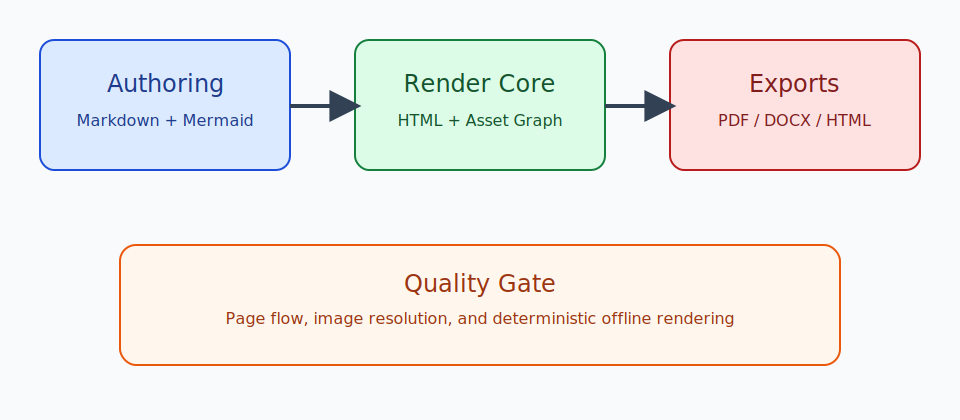
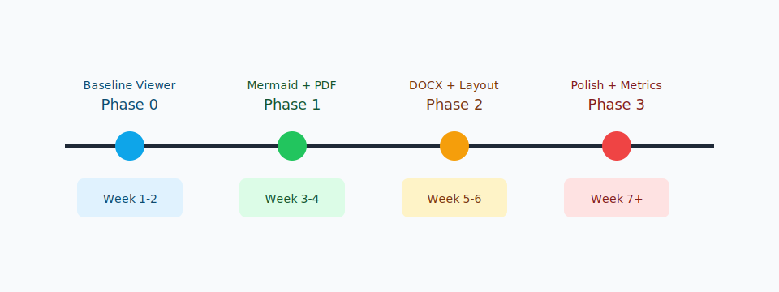
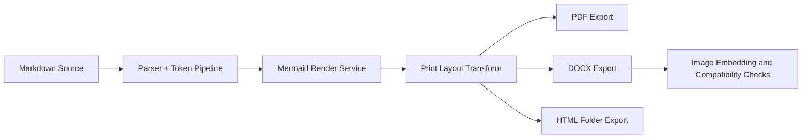
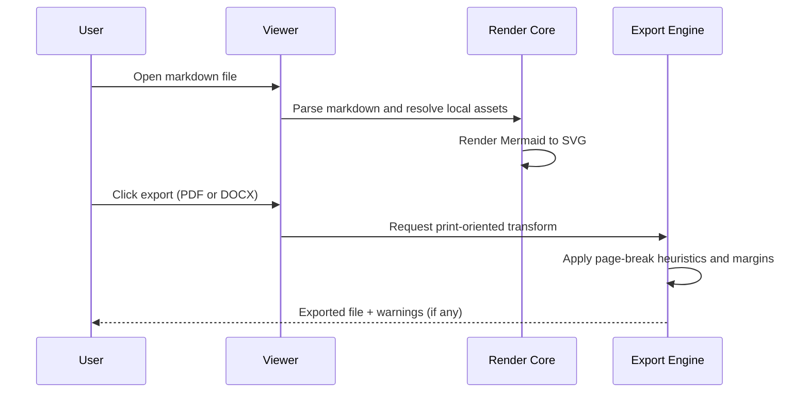
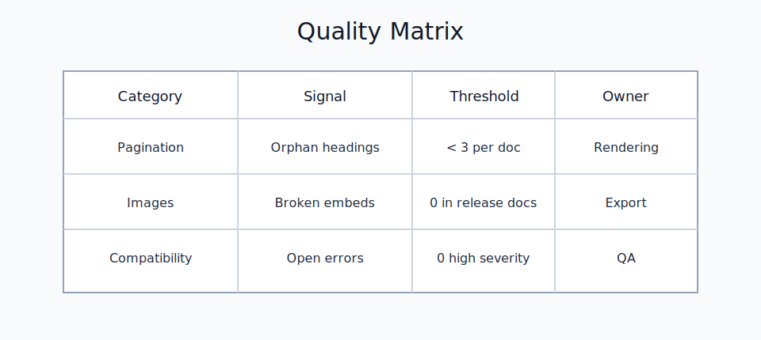

# Long-Form Export Validation Document

This file is intentionally long and structurally varied so you can stress-test preview, PDF export, DOCX export, and HTML folder export. It mixes prose, headings, bullet lists, numbered lists, tables, code blocks, SVG images, Mermaid diagrams, block quotes, and explicit page-break markers. The goal is to validate that layout behavior is readable in print-oriented formats and that image embedding remains consistent across all export targets.

## 1. Executive Context

Documentation quality often depends less on raw markdown syntax and more on whether output remains coherent when shared outside engineering teams. A document that looks acceptable in a code editor can degrade badly when converted to PDF or DOCX if line wrapping, heading flow, or image handling are inconsistent. This sample addresses those conditions directly by introducing sections with dense paragraphs, structured lists, and visual assets that should remain intact after conversion. The test should confirm that headings avoid awkward orphaning, code and table blocks resist ugly page splits, and exported image assets resolve locally without any network dependency.

A second objective is to verify deterministic behavior in constrained environments. This matters when documents must be generated on locked-down machines, in offline settings, or in repeatable build pipelines. If a rendering path requires remote resources or unstable dependencies, documentation output becomes unpredictable. This file therefore uses only local assets and deterministic diagrams while still simulating realistic team documentation that includes architecture context, release plans, technical notes, and quality gates.

- Primary success metric: rendered output remains legible and structurally faithful across preview, PDF, DOCX, and exported HTML.
- Secondary success metric: visual assets (SVG and Mermaid) survive conversion without missing image placeholders.
- Tertiary success metric: manual page-break markers provide deterministic control where automatic pagination is insufficient.



### 1.1 Immediate Review Checklist

- Verify heading hierarchy is clear in rendered output.
- Verify paragraph spacing is stable around images.
- Verify bullet/numbered lists are readable and not collapsed.
- Verify horizontal rhythm is consistent with one-inch print margins.
- Verify no remote network fetches are attempted during export.

<!-- pagebreak -->

## 2. Product Narrative and Constraints

A practical markdown viewer is most valuable when it supports a full author-to-share workflow. Authors should be able to write naturally in markdown, include visual elements, then export to formats that colleagues can consume without extra tooling. The conversion stage is where many teams lose momentum because generated files require manual cleanup. The objective here is not typographic perfection but predictable, good-enough quality that reduces post-processing work by a meaningful margin. If users can export and immediately distribute results, the product solves a real bottleneck.

In operational terms, this means the renderer must preserve semantic grouping. Headings should stay visually connected to subsequent paragraphs. Code blocks should avoid splitting unless absolutely necessary. Large tables may still split across pages, but repeated headers and sensible break logic should maintain comprehension. Diagram content must remain embedded and portable. These constraints are especially important in status updates, architecture briefs, release notes, and handoff documents where readers rely on visual continuity.

### 2.1 Non-Functional Expectations

1. Output should remain stable when regenerated from the same source.
2. Conversion should complete quickly enough for interactive use.
3. Exports should not require administrative machine setup.
4. Generated files should open in common tools without repair prompts.
5. Failures should be visible through warnings, not silent degradation.

### 2.2 Risk Register (Sample)

| Risk ID | Description | Trigger | Mitigation | Owner |
|---|---|---|---|---|
| R-01 | Heading orphaned at bottom of page | Dense content near page edge | Keep-with-next class for H1/H2/H3 | Rendering |
| R-02 | Mermaid diagram missing in DOCX | SVG conversion issue | Convert Mermaid SVG to PNG before embedding | Export |
| R-03 | Broken local image path | Invalid relative references | Emit warning and placeholder block | Authoring |
| R-04 | Code block split awkwardly | Narrow available page height | Avoid-page break rules for preformatted blocks | Layout |
| R-05 | Inconsistent page margins | Export defaults not aligned | Force one-inch margins for print outputs | Platform |

> A useful export pipeline is not one that is perfect in all cases, but one that fails transparently and predictably when it cannot satisfy every constraint.



<!-- pagebreak -->

## 3. Architecture and Flow Details

The following diagram models a representative conversion path from markdown input through export outputs. It is intentionally compact but still useful for visual validation in all formats.



### 3.1 Detailed Sequence



The flow above emphasizes that export quality is not a single step. Markdown parsing, asset resolution, diagram rendering, and print-specific layout logic are separate concerns that must cooperate. If one stage silently degrades, downstream formats inherit the defect. Testing this file should reveal whether these boundaries are stable.

### 3.2 Example Configuration Snippets

```json
{
  "export": {
    "pageSize": "Letter",
    "marginsInches": { "top": 1.0, "right": 1.0, "bottom": 1.0, "left": 1.0 },
    "offline": true,
    "diagramFormatDocx": "png"
  }
}
```

```bash
# Example local smoke checks
node dist/cli/mdv.js export --input ./fixtures/long-five-page-sample.md --format pdf --output ./out/long-sample.pdf
node dist/cli/mdv.js export --input ./fixtures/long-five-page-sample.md --format docx --output ./out/long-sample.docx
node dist/cli/mdv.js export --input ./fixtures/long-five-page-sample.md --format all --output ./out/long-sample-all
```

<!-- pagebreak -->

## 4. Implementation Notes and Team Practices

When teams adopt markdown as a source format, they tend to produce documents quickly but may postpone final formatting until distribution time. That creates a hidden cost: each handoff requires manual editing in Word or repeated PDF retries until page flow looks acceptable. A robust export path shifts that effort upstream by encoding layout heuristics once in the renderer. The practical gain is not abstract; it saves repeated cleanup cycles and shortens feedback loops.

In day-to-day operations, a good pattern is to maintain a small set of reusable content conventions: short headings, bounded code blocks, concise tables, and explicit page breaks only where narrative transitions need guaranteed separation. Automatic pagination should handle most cases; manual markers should be reserved for high-value boundaries like section starts in executive deliverables.

### 4.1 Recommended Authoring Conventions

- Keep sections focused on one purpose and one audience.
- Limit giant table rows with large paragraphs.
- Use ordered lists for process steps and bullet lists for non-sequential items.
- Place large diagrams near supporting narrative text.
- Use explicit page breaks sparingly, primarily for narrative chapter boundaries.

### 4.2 Team Action Items

- [ ] Add this document to recurring export regression checks.
- [ ] Compare PDF and DOCX output monthly after dependency updates.
- [ ] Track warnings emitted during exports in CI logs.
- [ ] Confirm Word-for-Mac compatibility for newly added image formats.
- [ ] Keep sample assets local to avoid network-related variance.

### 4.3 Additional Prose for Pagination Pressure

This paragraph exists primarily to increase vertical density and exercise widow-orphan controls in print output. In practical documents, this type of content often appears in design rationale sections where decisions are justified with historical context, alternatives considered, and risk analysis. The paragraph should wrap naturally, remain readable at normal print scale, and avoid collisions with neighboring headings. If page flow rules are tuned well, sections should break in places that still preserve narrative continuity.

A second dense paragraph follows with the same purpose. Readers should be able to continue from one page to the next without losing context due to fragmented structural elements. The renderer should prefer keeping short related blocks together while still permitting natural text flow through normal paragraphs. If a block is too large to fit, graceful splitting is acceptable, but abrupt orphaned headings or detached captions should be minimized. The format does not need publication-grade typography; it needs stable, professional output suitable for operational sharing.



<!-- pagebreak -->

## 5. Appendix: Long Mixed Content Section

### 5.1 Extended Bullet List

- Governance expectations for shared documentation artifacts.
- Versioning practices for long-form technical documents.
- Link hygiene requirements for offline and archived exports.
- Change-log conventions for high-visibility deliverables.
- Ownership and review cadence for canonical sample files.
- Source-control policies for generated documents.
- Merge strategy for concurrent documentation edits.
- Artifact retention policies for release snapshots.
- Accessibility checks for color contrast and heading levels.
- Localization planning for future multilingual distributions.

### 5.2 Extended Numbered Procedure

1. Draft markdown with complete heading structure.
2. Add local visual assets with explicit relative paths.
3. Insert Mermaid diagrams where flow understanding is improved.
4. Run preview and verify readability before exporting.
5. Export PDF and check margins, breaks, and table behavior.
6. Export DOCX and inspect image compatibility in Word.
7. Export HTML folder and validate asset packaging integrity.
8. Record warnings and fix image path issues in source markdown.
9. Re-export and compare with prior artifacts for regressions.
10. Publish outputs to the intended stakeholders.

### 5.3 Sample Data Table

| Area | Metric | Current | Target | Notes |
|---|---|---:|---:|---|
| Render Speed | First paint | 1.2s | < 2.0s | Typical laptop baseline |
| PDF Quality | Manual fixes needed | 4 | 1 | Lower is better |
| DOCX Quality | Missing images | 0 | 0 | Must stay at zero |
| Stability | Export failures/week | 1 | 0 | Drive toward deterministic output |
| Offline Compliance | Remote fetches | 0 | 0 | Strict requirement |

### 5.4 Closing Narrative

If this sample exports cleanly, you can treat it as a reusable benchmark for future layout and export regressions. Keep it updated as features evolve, especially when changing CSS print rules, image conversion logic, or markdown parser behavior. The most useful benchmark documents are realistic enough to catch failures but stable enough to compare across versions. This document should serve that role and give you a quick confidence check before sharing outputs with non-markdown readers.

Final note: this section intentionally adds extra prose to ensure total content length comfortably exceeds five printed pages when exported with one-inch margins and normal body typography.
